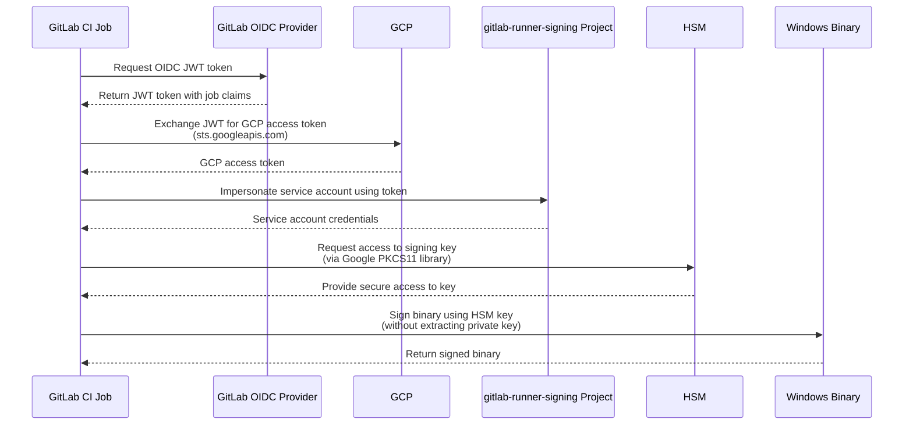

This directory contains public certificates for signing GitLab Runner binaries.

### Certificates

#### `gitlab-inc-ssl-com.crt`

This certificate is issued by SSL.com and used to sign Windows binaries.

Valid from 2025-03-18 to 2027-11-20.

### Signing process

The private key for the certificates are stored in a Google Cloud
HSM. The following diagram shows how GitLab Runner binaries are signed:

The `binaries` CI job uses `scripts/sign-binaries` to sign binaries. For Windows binaries, the
script uses [`osslsigncode`](https://github.com/mtrojnar/osslsigncode)
with the [Google PKCS11 library](https://github.com/GoogleCloudPlatform/kms-integrations). See
[the user guide](https://github.com/GoogleCloudPlatform/kms-integrations/blob/master/kmsp11/docs/user_guide.md)
for more details.
