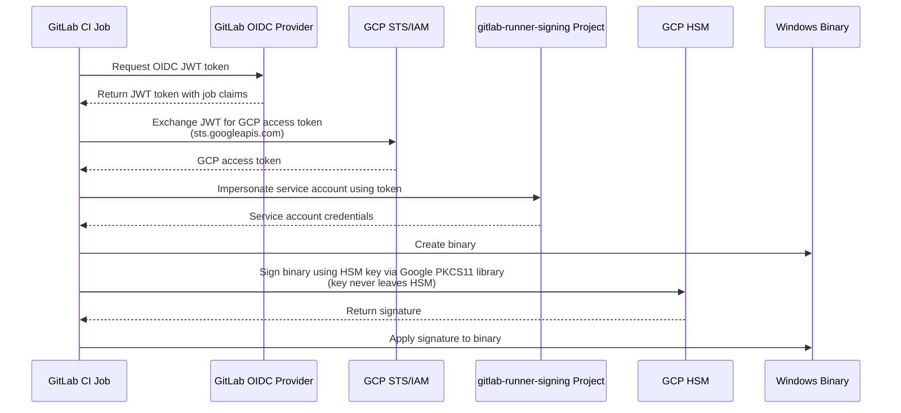

This directory contains public certificates for signing GitLab Runner binaries.

### Certificates

#### `gitlab-inc-ssl-com.crt`

This certificate is issued by SSL.com and used to sign Windows binaries.

Valid from 2025-03-18 to 2027-11-20.

### Signing process

The private key for the certificates are stored in a Google Cloud
HSM. The following diagram shows how GitLab Runner binaries are signed:

The `binaries` CI job uses `scripts/sign-binaries` to sign binaries. For Windows binaries, the
script uses [`osslsigncode`](https://github.com/mtrojnar/osslsigncode)
with the [Google PKCS11 library](https://github.com/GoogleCloudPlatform/kms-integrations). See
[the user guide](https://github.com/GoogleCloudPlatform/kms-integrations/blob/master/kmsp11/docs/user_guide.md)
for more details.

The private key is never accessed directly by the service account during
the signing process.

Note that the service account needs two [Google KMS IAM roles](https://cloud.google.com/kms/docs/reference/permissions-and-roles#cloudkms.signerVerifier)
for the Google PKCS11 library to work:

- Cloud KMS CryptoKey Signer/Verifier (`roles/cloudkms.signerVerifier`)
- Cloud KMS Viewer (`roles/cloudkms.viewer`)

The Cloud KMS Viewer role allows the account to retrieve metadata about the keys. The diagram omits the fact that
the Google PKCS11 library lists all the keys in the key ring and retrieves information about them.

Ideally, only `roles/cloudkms.signerVerifier` would be needed. There is
an [open feature request to reduce the permission](https://github.com/GoogleCloudPlatform/kms-integrations/issues/45)
when only signing is needed.
