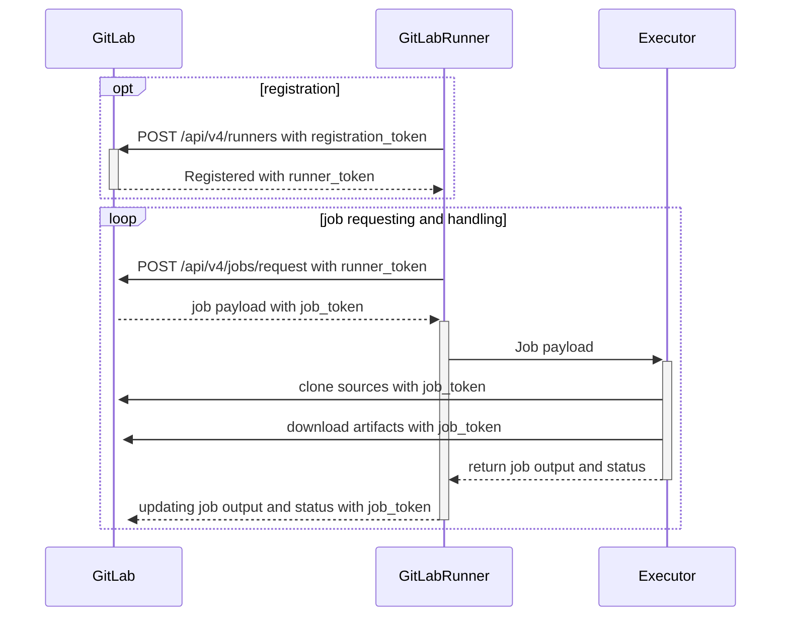



- Niveau : Free, Premium, Ultimate
- Offre : GitLab.com, GitLab Self-Managed, GitLab Dedicated



GitLab Runner est une application qui fonctionne avec GitLab CI/CD pour exécuter des jobs dans un pipeline.

Lorsque les développeurs envoient du code vers GitLab, ils peuvent définir des tâches automatisées dans un fichier `.gitlab-ci.yml`. Ces tâches peuvent inclure l'exécution de tests, la création d'applications ou le déploiement de code. GitLab Runner est l'application qui exécute ces tâches sur l'infrastructure de calcul.

En tant qu'administrateur, vous êtes responsable de la mise à disposition et de la gestion de l'infrastructure sur laquelle ces jobs CI/CD s'exécutent. Cela implique d'installer les applications GitLab Runner, de les configurer et de s'assurer qu'elles disposent d'une capacité suffisante pour gérer la charge de travail CI/CD de votre organisation.

## Fonctionnement de GitLab Runner {#what-gitlab-runner-does}

GitLab Runner se connecte à votre instance GitLab et attend les jobs CI/CD. Lorsqu'un pipeline s'exécute, GitLab envoie des jobs aux runners disponibles. Le runner exécute le job et renvoie les résultats à GitLab.

GitLab Runner dispose des fonctionnalités suivantes.

- Exécuter plusieurs jobs simultanément.
- Utiliser plusieurs jetons avec plusieurs serveurs (même par projet).
- Limiter le nombre de jobs simultanés par jeton.
- Les jobs peuvent être exécutés :
  - Localement.
  - En utilisant des conteneurs Docker.
  - En utilisant des conteneurs Docker et en exécutant le job via SSH.
  - En utilisant des conteneurs Docker avec la mise à l'échelle automatique sur différents clouds et hyperviseurs de virtualisation.
  - En se connectant à un serveur SSH distant.
- Écrit en Go et distribué en tant que binaire unique sans aucune autre exigence.
- Prend en charge Bash, PowerShell Core et Windows PowerShell.
- Fonctionne sur GNU/Linux, macOS et Windows (pratiquement partout où vous pouvez exécuter Docker).
- Permet la personnalisation de l'environnement d'exécution du job.
- Rechargement automatique de la configuration sans redémarrage.
- Configuration transparente avec prise en charge des environnements d'exécution Docker, Docker-SSH, Parallels ou SSH.
- Active la mise en cache des conteneurs Docker.
- Installation transparente en tant que service pour GNU/Linux, macOS et Windows.
- Serveur HTTP de métriques Prometheus intégré.
- Workers arbitres pour surveiller et transmettre les métriques Prometheus et d'autres données spécifiques aux jobs à GitLab.

## Flux d'exécution du runner {#runner-execution-flow}

Ce diagramme montre comment les runners sont enregistrés et comment les jobs sont demandés et gérés. Il montre également quelles actions utilisent les [jetons d'enregistrement et d'authentification](https://docs.gitlab.com/api/runners/#registration-and-authentication-tokens), et les [jetons de job](https://docs.gitlab.com/ci/jobs/ci_job_token/).

## Options de déploiement du runner {#runner-deployment-options}

### Runners hébergés par GitLab {#gitlab-hosted-runners}

Les [runners hébergés par GitLab](https://docs.gitlab.com/ci/runners/) sont gérés par GitLab et disponibles sur GitLab.com. Vous n'avez pas besoin d'installer ni de maintenir ces runners - GitLab les fournit en tant que service. Cependant, vous avez un contrôle limité sur l'environnement d'exécution et ne pouvez pas personnaliser l'infrastructure.

### Runners autogérés {#self-managed-runners}

Les runners autogérés sont des instances GitLab Runner que vous installez, configurez et gérez dans votre propre infrastructure. Vous pouvez [installer](install/_index.md) et enregistrer des runners autogérés sur toutes les installations GitLab. En tant qu'administrateur, vous travaillez généralement avec des runners autogérés.

Contrairement aux runners hébergés par GitLab, qui sont hébergés et gérés par GitLab, vous avez un contrôle total sur les runners autogérés.

## Versions de GitLab Runner {#gitlab-runner-versions}

Pour des raisons de compatibilité, la version [majeure.mineure](https://en.wikipedia.org/wiki/Software_versioning) de GitLab Runner doit rester synchronisée avec la version majeure et mineure de GitLab. Les anciens runners peuvent encore fonctionner avec les versions plus récentes de GitLab, et vice versa. Cependant, certaines fonctionnalités peuvent ne pas être disponibles ou ne pas fonctionner correctement si une différence de version existe.

La compatibilité ascendante est garantie entre les mises à jour de versions mineures. Cependant, parfois les mises à jour de versions mineures de GitLab peuvent introduire de nouvelles fonctionnalités qui nécessitent que GitLab Runner soit sur la même version mineure.

Si vous hébergez vos propres runners mais hébergez vos dépôts sur GitLab.com, maintenez GitLab Runner [à jour](install/_index.md) avec la dernière version, car GitLab.com est [mis à jour en continu](https://handbook.gitlab.com/handbook/engineering/deployments-and-releases/).

## Dépannage {#troubleshooting}

Découvrez comment [résoudre les problèmes](faq/_index.md) courants.

## Glossaire {#glossary}

- **GitLab Runner** : L'application qui exécute les jobs CI/CD des pipelines GitLab sur une plateforme de calcul cible.
- **Runner** : Une instance configurée de GitLab Runner capable d'exécuter des jobs. Selon le type d'exécuteur, cette machine peut être locale au gestionnaire de runner (`shell` ou `docker` executor) ou une machine distante créée par un autoscaler (`docker-autoscaler` ou `kubernetes`).
- **Configuration du runner** : Une entrée `[[runner]]` unique dans le `config.toml` qui s'affiche en tant que **runner** dans l'interface utilisateur.
- **Runner manager** : Le processus qui lit le fichier `config.toml` et exécute toutes les configurations de runner et les exécutions de jobs simultanément.
- **Machine** : Une machine virtuelle (VM) ou un pod dans lequel le runner opère. GitLab Runner génère automatiquement un identifiant de machine unique et persistant, de sorte que lorsque plusieurs machines reçoivent la même configuration de runner, les jobs peuvent être acheminés séparément, mais les configurations de runner sont regroupées dans l'interface utilisateur.
- **Exécuteur** : La méthode utilisée par GitLab Runner pour exécuter les jobs (Docker, Shell, Kubernetes, etc.).
- **Pipeline** : Un ensemble de jobs qui s'exécutent automatiquement lorsque du code est envoyé vers GitLab.
- **Job** : Une tâche unique dans un pipeline, telle que l'exécution de tests ou la création d'une application.
- **Runner token** : Un identifiant unique qui permet à un runner de s'authentifier auprès de GitLab.
- **Étiquettes** : Des labels assignés aux runners qui déterminent les jobs qu'ils peuvent exécuter.
- **Concurrent jobs** : Le nombre de jobs qu'un runner peut exécuter simultanément.
- **Self-managed runner** : Un runner installé et géré sur votre propre infrastructure.
- **GitLab-hosted runner** : Un runner fourni et géré par GitLab.

Pour plus d'informations, consultez la [liste de mots officielle de GitLab](https://docs.gitlab.com/development/documentation/styleguide/word_list/#gitlab-runner) et l'entrée Architecture GitLab pour [GitLab Runner](https://docs.gitlab.com/development/architecture/#gitlab-runner).

## Contribution {#contributing}

Les contributions sont les bienvenues. Consultez [`CONTRIBUTING.md`](https://gitlab.com/gitlab-org/gitlab-runner/blob/main/CONTRIBUTING.md) et la [documentation de développement](development/_index.md) pour plus de détails.

Si vous êtes un relecteur du projet GitLab Runner, prenez un moment pour lire le document [Reviewing GitLab Runner](development/reviewing-gitlab-runner.md).

Vous pouvez également consulter [le processus de release du projet GitLab Runner](https://gitlab.com/gitlab-org/gitlab-runner/blob/main/PROCESS.md).

## Journal des modifications {#changelog}

Consultez le [CHANGELOG](https://gitlab.com/gitlab-org/gitlab-runner/blob/main/CHANGELOG.md) pour voir les modifications récentes.

## Licence {#license}

Ce code est distribué sous la licence MIT. Consultez le fichier [LICENSE](https://gitlab.com/gitlab-org/gitlab-runner/blob/main/LICENSE).
