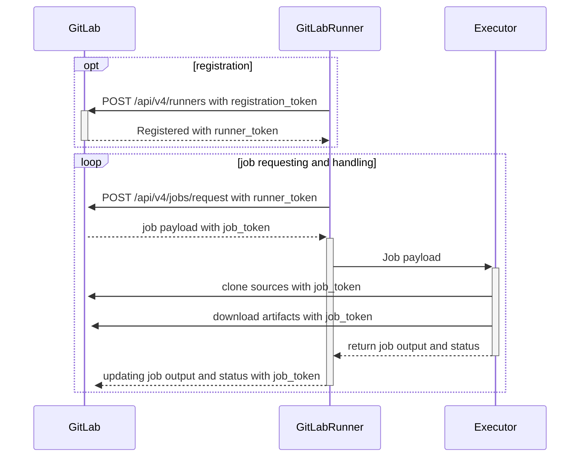



- Niveau : Free, Premium, Ultimate
- Offre : GitLab.com, GitLab Self-Managed, GitLab Dedicated



GitLab Runner est une application qui fonctionne avec GitLab CI/CD pour exécuter les jobs d'un pipeline.

Lorsque les équipes de développement poussent du code vers GitLab, elles peuvent définir des tâches automatisées dans un fichier `.gitlab-ci.yml`.
Ces tâches peuvent inclure l'exécution de tests, la création d'applications ou le déploiement de code.
GitLab Runner est l'application qui exécute ces tâches sur l'infrastructure informatique.

En tant qu'administrateur, vous êtes responsable de la mise à disposition et de la gestion de l'infrastructure sur laquelle ces jobs CI/CD s'exécutent.
Cela implique d'installer les applications GitLab Runner, de les configurer et de veiller à ce qu'elles disposent d'une capacité suffisante
pour traiter la charge de travail CI/CD de votre organisation.

## Rôle de GitLab Runner {#what-gitlab-runner-does}

GitLab Runner se connecte à votre instance GitLab et attend les jobs CI/CD. Lorsqu'un pipeline est lancé, GitLab envoie les jobs aux runners disponibles.
Le runner exécute le job et renvoie les résultats à GitLab.

GitLab Runner offre les fonctionnalités suivantes :

- Exécuter plusieurs jobs en simultané.
- Utiliser plusieurs tokens avec plusieurs serveurs (y compris par projet).
- Limiter le nombre de jobs simultanés par token.
- Les jobs peuvent être exécutés :
  - En local.
  - Avec des conteneurs Docker.
  - Avec des conteneurs Docker et l'exécution du job via SSH.
  - Avec des conteneurs Docker et la mise à l'échelle automatique sur différents clouds et hyperviseurs de virtualisation.
  - Via une connexion à un serveur SSH distant.
- Écrit en Go et distribué sous forme d'un binaire unique sans aucune autre exigence.
- Prend en charge Bash, PowerShell Core et Windows PowerShell.
- Fonctionne sur GNU/Linux, macOS et Windows (pratiquement partout où Docker peut s'exécuter).
- Permet de personnaliser l'environnement d'exécution des jobs.
- Rechargement automatique de la configuration sans redémarrage.
- Configuration fluide avec prise en charge des environnements d'exécution Docker, Docker-SSH, Parallels ou SSH.
- Permet la mise en cache des conteneurs Docker.
- Installation fluide en tant que service sur GNU/Linux, macOS et Windows.
- Serveur HTTP de métriques Prometheus intégré.
- Workers d'arbitrage pour surveiller et transmettre les métriques Prometheus ainsi que d'autres données spécifiques aux jobs vers GitLab.

## Flux d'exécution des runners {#runner-execution-flow}

Ce diagramme illustre la manière dont les runners sont enregistrés et dont les jobs sont demandés et traités. Il indique également les actions qui utilisent des [tokens d'enregistrement et d'authentification](https://docs.gitlab.com/api/runners/#registration-and-authentication-tokens), ainsi que des [tokens de job](https://docs.gitlab.com/ci/jobs/ci_job_token/).

## Options de déploiement des runners {#runner-deployment-options}

### Runners hébergés par GitLab {#gitlab-hosted-runners}

Les [runners hébergés par GitLab](https://docs.gitlab.com/ci/runners/) sont gérés par GitLab et disponibles sur GitLab.com.
Vous n'avez pas besoin de les installer ni de les maintenir : GitLab les fournit en tant que service.
En contrepartie, vous disposez d'un contrôle limité sur l'environnement d'exécution et ne pouvez pas personnaliser l'infrastructure.

### Runners auto-gérés {#self-managed-runners}

Les runners auto-gérés sont des instances de GitLab Runner que vous installez, configurez et gérez au sein de votre propre
infrastructure. Vous pouvez [installer](install/_index.md) et enregistrer des runners auto-gérés sur toutes les installations GitLab.
En tant qu'administrateur, vous travaillez généralement avec des runners auto-gérés.

Contrairement aux runners hébergés par GitLab, qui sont hébergés et gérés par GitLab, vous bénéficiez d'un contrôle total sur les runners auto-gérés.

## Versions de GitLab Runner {#gitlab-runner-versions}

Pour des raisons de compatibilité, la version [major.minor](https://en.wikipedia.org/wiki/Software_versioning) de GitLab Runner
doit rester synchronisée avec la version majeure et mineure de GitLab. Les runners plus anciens peuvent encore fonctionner
avec des versions plus récentes de GitLab, et inversement. Cependant, certaines fonctionnalités peuvent être indisponibles ou ne pas fonctionner correctement
en cas d'écart de version.

La rétrocompatibilité est garantie entre les mises à jour de versions mineures. Toutefois, certaines mises à jour de versions mineures
de GitLab peuvent introduire de nouvelles fonctionnalités qui nécessitent que GitLab Runner soit dans la même version mineure.

Si vous hébergez vos propres runners mais que vos dépôts sont hébergés sur GitLab.com,
maintenez GitLab Runner [à jour](install/_index.md) dans sa dernière version, car GitLab.com est
[mis à jour en continu](https://handbook.gitlab.com/handbook/engineering/deployments-and-releases/).

## Dépannage {#troubleshooting}

Découvrez comment [résoudre](faq/_index.md) les problèmes courants.

## Glossaire {#glossary}

- **GitLab Runner** : application qui exécute les jobs CI/CD des pipelines GitLab sur une plateforme informatique cible.
- **Runner** : instance configurée de GitLab Runner capable d'exécuter des jobs. Selon le type d'exécuteur,
  cette machine peut être locale au gestionnaire de runner (exécuteurs `shell` ou `docker`) ou une machine distante
  créée par un autoscaler (`docker-autoscaler` ou `kubernetes`).
- **Configuration du runner** : une entrée `[[runner]]` unique dans le fichier `config.toml`, qui apparaît comme un **runner** dans l'interface utilisateur.
- **Gestionnaire de runner** : processus qui lit le fichier `config.toml` et exécute simultanément l'ensemble des configurations de runners et des jobs.
- **Machine** : machine virtuelle (VM) ou pod sur lequel s'exécute le runner.
  GitLab Runner génère automatiquement un identifiant de machine unique et persistant, de sorte que lorsque plusieurs machines reçoivent la même configuration de runner,
  les jobs peuvent être routés séparément tout en regroupant les configurations de runners dans l'interface utilisateur.
- **Exécuteur** : méthode utilisée par GitLab Runner pour exécuter les jobs (Docker, Shell, Kubernetes, etc.).
- **Pipeline** : ensemble de jobs qui s'exécutent automatiquement lorsque du code est poussé vers GitLab.
- **Job** : tâche unique d'un pipeline, comme l'exécution de tests ou la création d'une application.
- **Token de runner** : identifiant unique qui permet à un runner de s'authentifier auprès de GitLab.
- **Tags** : étiquettes attribuées aux runners qui déterminent les jobs qu'ils peuvent exécuter.
- **Jobs simultanés** : nombre de jobs qu'un runner peut exécuter en parallèle.
- **Runner auto-géré** : runner installé et géré sur votre propre infrastructure.
- **Runner hébergé par GitLab** : runner fourni et géré par GitLab.

Pour en savoir plus, consultez la liste officielle des termes [GitLab Word List](https://docs.gitlab.com/development/documentation/styleguide/word_list/#gitlab-runner)
ainsi que l'entrée d'architecture GitLab consacrée à [GitLab Runner](https://docs.gitlab.com/development/architecture/#gitlab-runner).

## Contribuer {#contributing}

Les contributions sont les bienvenues. Pour plus d'informations, consultez [`CONTRIBUTING.md`](https://gitlab.com/gitlab-org/gitlab-runner/blob/main/CONTRIBUTING.md)
et la [documentation de développement](development/_index.md).

Si vous êtes relecteur ou relectrice du projet GitLab Runner, prenez un moment pour lire le document
[Reviewing GitLab Runner](development/reviewing-gitlab-runner.md).

Vous pouvez également consulter [le processus de release du projet GitLab Runner](https://gitlab.com/gitlab-org/gitlab-runner/blob/main/PROCESS.md).

## Changelog {#changelog}

Consultez le [CHANGELOG](https://gitlab.com/gitlab-org/gitlab-runner/blob/main/CHANGELOG.md) pour visualiser les modifications récentes.

## Licence {#license}

Ce code est distribué sous licence MIT. Consultez le fichier [LICENSE](https://gitlab.com/gitlab-org/gitlab-runner/blob/main/LICENSE).
