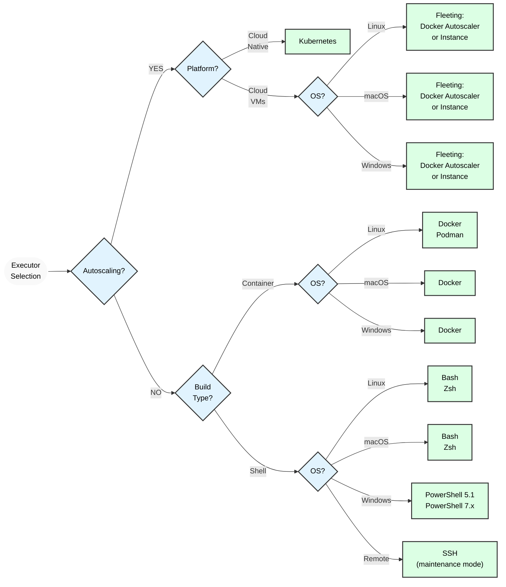



- Niveau :  Free, Premium, Ultimate
- Offre :  GitLab.com, GitLab Self-Managed, GitLab Dedicated



GitLab Runner implémente différents exécuteurs qui peuvent être utilisés pour exécuter vos builds dans différents environnements :

- [Kubernetes](kubernetes/_index.md)
- [Docker](docker.md)
- [Docker Autoscaler](docker_autoscaler.md)
- [Instance](instance.md)

[D'autres exécuteurs](#executors-in-maintenance-mode) sont disponibles mais ne font pas l'objet d'un développement actif de fonctionnalités. Ils reçoivent des mises à jour de sécurité critiques, mais aucune nouvelle fonctionnalité.

> [!note]
> Certaines fonctionnalités nécessitent un runner qui utilise [fleeting](../fleet_scaling/fleeting.md). Les exécuteurs Docker Autoscaler et Instance utilisent fleeting. Vous devriez migrer vers l'un de ces exécuteurs pour profiter de toute la gamme de fonctionnalités de GitLab Runner.

Si vous n'êtes pas sûr(e) de l'exécuteur à sélectionner, consultez [la sélection de l'exécuteur](#selecting-the-executor).

Pour plus d'informations sur les fonctionnalités prises en charge par chaque exécuteur, consultez le [tableau de compatibilité](#compatibility-chart).

Ces exécuteurs sont verrouillés et nous ne développons plus ni n'acceptons de nouveaux exécuteurs. Pour plus d'informations, consultez [la contribution de nouveaux exécuteurs](https://gitlab.com/gitlab-org/gitlab-runner/blob/main/CONTRIBUTING.md#contributing-new-executors).

## Sélectionner l'exécuteur {#selecting-the-executor}

Les exécuteurs prennent en charge différentes plateformes et méthodologies pour la création d'un projet. Le diagramme suivant indique quel exécuteur choisir en fonction de votre système d'exploitation et de votre plateforme :

> [!warning]
> L'exécuteur SSH est en mode maintenance. Il reçoit des mises à jour de sécurité critiques, mais aucune nouvelle fonctionnalité n'est prévue. De plus, il fait partie des exécuteurs les moins pris en charge. Pour les builds locaux basés sur le shell, envisagez d'utiliser l'exécuteur Shell à la place.

Le tableau ci-dessous présente les informations clés pour chaque exécuteur, afin de vous aider à décider quel exécuteur utiliser :

> [!note]
> Les exécuteurs SSH, Shell, VirtualBox, Parallels et Custom sont en mode maintenance. Ils reçoivent des mises à jour de sécurité critiques, mais aucune nouvelle fonctionnalité n'est prévue.

| Exécuteur                                         | Docker | Docker Autoscaler |                 Instance |   Kubernetes   | SSH  |     Shell      |   VirtualBox   |   Parallels    |          Custom          |
|:-------------------------------------------------|:------:|:-----------------:|-------------------------:|:--------------:|:----:|:--------------:|:--------------:|:--------------:|:------------------------:|
| Environnement de build propre pour chaque build          |   ✓    |         ✓         | conditionnel 1 |       ✓        |  ✗   |       ✗        |       ✓        |       ✓        | conditionnel 1 |
| Réutiliser le clone précédent s'il existe                |   ✓    |         ✓         | conditionnel 1 | ✓ 2 |  ✓   |       ✓        |       ✗        |       ✗        | conditionnel 1 |
| Accès au système de fichiers du runner protégé 3 |   ✓    |         ✓         |                        ✗ |       ✓        |  ✓   |       ✗        |       ✓        |       ✓        |       conditionnel        |
| Migrer la machine du runner                           |   ✓    |         ✓         |                        ✓ |       ✓        |  ✗   |       ✗        |    partiel     |    partiel     |            ✓             |
| Prise en charge sans configuration des builds simultanés |   ✓    |         ✓         |                        ✓ |       ✓        |  ✗   | ✗ 4 |       ✓        |       ✓        | conditionnel 1 |
| Environnements de build complexes                   |   ✓    |         ✓         |           ✗ 5 |       ✓        |  ✗   | ✗ 5 | ✓ 6 | ✓ 6 |            ✓             |
| Débogage des problèmes de build                         | moyen |      moyen       |                   moyen |     moyen     | facile |      facile      |      difficile      |      difficile      |          moyen          |

**Footnotes** :

1. Dépend de l'environnement que vous provisionnez. Peut être complètement isolé ou partagé entre les builds.
1. Nécessite la configuration de [volumes de build persistants par niveau de simultanéité](kubernetes/_index.md#persistent-per-concurrency-build-volumes).
1. Lorsque l'accès au système de fichiers d'un runner n'est pas protégé, les jobs peuvent accéder à l'ensemble du système, y compris le token du runner ainsi que le cache et le code des autres jobs. Les exécuteurs marqués ✓ n'autorisent pas le runner à accéder au système de fichiers par défaut. Cependant, des failles de sécurité ou certaines configurations pourraient permettre aux jobs de sortir de leur conteneur et d'accéder au système de fichiers hébergeant le runner.
1. Si les builds utilisent des services installés sur la machine de build, la sélection d'exécuteurs est possible mais problématique.
1. Nécessite une installation manuelle des dépendances.
1. Par exemple, en utilisant la [documentation Vagrant](https://developer.hashicorp.com/vagrant/docs/providers/virtualbox "pour VirtualBox").

### Exécuteur Docker {#docker-executor}

L'exécuteur Docker fournit des environnements de build propres via des conteneurs. La gestion des dépendances est simple, toutes les dépendances étant intégrées dans l'image Docker. Cet exécuteur nécessite l'installation de Docker sur l'hôte du Runner.

Cet exécuteur prend en charge des [services](https://docs.gitlab.com/ci/services/) supplémentaires tels que MySQL. Il prend également en charge Podman comme runtime de conteneur alternatif.

Cet exécuteur maintient des environnements de build cohérents et isolés.

### Exécuteur Docker Autoscaler {#docker-autoscaler-executor}

L'exécuteur Docker Autoscaler est un exécuteur Docker avec mise à l'échelle automatique qui crée des instances à la demande pour traiter les jobs que le gestionnaire de runners traite. Il encapsule l'[exécuteur Docker](docker.md) afin que toutes les options et fonctionnalités de l'exécuteur Docker soient prises en charge.

Le Docker Autoscaler utilise des [plugins fleeting](https://gitlab.com/gitlab-org/fleeting/fleeting) pour la mise à l'échelle automatique. Fleeting est une abstraction pour un groupe d'instances avec mise à l'échelle automatique, qui utilise des plugins prenant en charge des fournisseurs cloud tels que Google Cloud, AWS et Azure. Cet exécuteur convient particulièrement aux environnements avec des exigences de charge de travail dynamiques.

### Exécuteur Instance {#instance-executor}

L'exécuteur Instance est un exécuteur avec mise à l'échelle automatique qui crée des instances à la demande pour traiter le volume attendu de jobs que le gestionnaire de runners traite.

Cet exécuteur et l'exécuteur Docker Autoscale associé sont les nouveaux exécuteurs avec mise à l'échelle automatique qui fonctionnent conjointement avec les technologies GitLab Runner Fleeting et Taskscaler.

L'exécuteur Instance utilise également des [plugins fleeting](https://gitlab.com/gitlab-org/fleeting/fleeting) pour la mise à l'échelle automatique.

Vous pouvez utiliser l'exécuteur Instance lorsque les jobs nécessitent un accès complet à l'instance hôte, au système d'exploitation et aux périphériques connectés. L'exécuteur Instance peut également être configuré pour prendre en charge des jobs mono-locataire et multi-locataire.

### Exécuteur Kubernetes {#kubernetes-executor}

Vous pouvez utiliser l'exécuteur Kubernetes pour utiliser un cluster Kubernetes existant pour vos builds. L'exécuteur appelle l'API du cluster Kubernetes et crée un nouveau Pod (avec un conteneur de build et des conteneurs de services) pour chaque job GitLab CI/CD. Cet exécuteur convient particulièrement aux environnements cloud-native, offrant une évolutivité et une utilisation des ressources supérieures.

## Exécuteurs en mode maintenance {#executors-in-maintenance-mode}

Ces exécuteurs reçoivent des mises à jour de sécurité critiques, mais aucune nouvelle fonctionnalité n'est prévue :

- [SSH](ssh.md)
- [Shell](shell.md)
- [Parallels](parallels.md)
- [VirtualBox](virtualbox.md)
- [Custom](custom.md)
- [Docker Machine](docker_machine.md) (obsolète)

## Tableau de compatibilité {#compatibility-chart}

Fonctionnalités prises en charge par les différents exécuteurs.

> [!note]
> Les exécuteurs SSH, Shell, VirtualBox, Parallels et Custom sont en mode maintenance. Ils reçoivent des mises à jour de sécurité critiques, mais aucune nouvelle fonctionnalité n'est prévue.

| Exécuteur                                     | Docker | Docker Autoscaler |    Instance    | Kubernetes |      SSH       |     Shell      |    VirtualBox    |    Parallels     |                           Custom                            |
|:---------------------------------------------|:------:|:-----------------:|:--------------:|:----------:|:--------------:|:--------------:|:----------------:|:----------------:|:-----------------------------------------------------------:|
| Variables sécurisées                             |   ✓    |         ✓         |       ✓        |     ✓      |       ✓        |       ✓        |        ✓         |        ✓         |                              ✓                              |
| `.gitlab-ci.yml` : image                      |   ✓    |         ✓         |       ✗        |     ✓      |       ✗        |       ✗        | ✓ (1) | ✓ (1) | ✓ (en utilisant [`$CUSTOM_ENV_CI_JOB_IMAGE`](custom.md#stages)) |
| `.gitlab-ci.yml` : services                   |   ✓    |         ✓         |       ✗        |     ✓      |       ✗        |       ✗        |        ✗         |        ✗         |                              ✓                              |
| `.gitlab-ci.yml` : cache                      |   ✓    |         ✓         |       ✓        |     ✓      |       ✓        |       ✓        |        ✓         |        ✓         |                              ✓                              |
| `.gitlab-ci.yml` : artéfacts                  |   ✓    |         ✓         |       ✓        |     ✓      |       ✓        |       ✓        |        ✓         |        ✓         |                              ✓                              |
| Transmission des artéfacts entre les étapes             |   ✓    |         ✓         |       ✓        |     ✓      |       ✓        |       ✓        |        ✓         |        ✓         |                              ✓                              |
| Utiliser les images privées du registre de conteneurs GitLab |   ✓    |         ✓         | non applicable |     ✓      | non applicable | non applicable |  non applicable  |  non applicable  |                       non applicable                        |
| Terminal web interactif                     |   ✓    |         ✗         |       ✗        |     ✓      |       ✗        |       ✓        |        ✗         |        ✗         |                              ✗                              |

**Footnotes** :

1. Prise en charge [ajoutée](https://gitlab.com/gitlab-org/gitlab-runner/-/merge_requests/1257) dans GitLab Runner 14.2. Consultez la section [Remplacement de l'image VM de base](../configuration/advanced-configuration.md#overriding-the-base-vm-image) pour plus de détails.

Systèmes pris en charge par les différents shells :

| Shells   |      Bash      | PowerShell Desktop  | PowerShell Core   |  sh  |
| :------: | :------------: | :-----------------: | :---------------: | :--: |
| Linux    | ✓ 1 |         ✗           |        ✓          |  ✓   |
| macOS    | ✓ 1 |         ✗           |        ✓          |  ✓   |
| FreeBSD  | ✓ 1 |         ✗           |        ✗          |  ✓   |
| Windows  | ✗ 3 |   ✓ 4    | ✓ 2,5  |  ✗   |

**Footnotes:**

1. Shell par défaut
1. Shell par défaut pour l'enregistrement du runner et pour les jobs avec l'exécuteur `shell`.
1. Le shell Bash n'est pas pris en charge sur Windows.
1. Shell par défaut pour les jobs avec les exécuteurs `docker-windows` et `kubernetes`.
1. Shell par défaut pour les jobs avec l'exécuteur `shell`.

Systèmes pris en charge pour les terminaux web interactifs par les différents shells :

| Shells  | Bash | PowerShell Desktop | PowerShell Core |  sh  |
| :-----: | :--: | :----------------: | :-------------: | :--: |
| Windows |  ✗   |         ✓          |        ✓        |  ✗   |
| Linux   |  ✓   |         ✗          |        ✓        |  ✓   |
| macOS   |  ✓   |         ✗          |        ✓        |  ✓   |
| FreeBSD |  ✓   |         ✗          |        ✗        |  ✓   |

## Prérequis Git pour les exécuteurs non-Docker {#git-requirements-for-non-docker-executors}

Les exécuteurs qui ne [s'appuient pas sur une image d'aide](../configuration/advanced-configuration.md#helper-image) nécessitent une installation de Git sur la machine cible et dans le `PATH`. Utilisez toujours la [dernière version disponible de Git](https://git-scm.com/downloads/).

GitLab Runner utilise la commande `git lfs` si [Git LFS](https://git-lfs.com/) est installé sur la machine cible. Assurez-vous que Git LFS est à jour sur tous les systèmes où GitLab Runner utilise ces exécuteurs.

Veillez à initialiser Git LFS pour l'utilisateur qui exécute les commandes GitLab Runner avec `git lfs install`. Vous pouvez initialiser Git LFS sur l'ensemble d'un système avec `git lfs install --system`.

Pour authentifier les interactions Git avec l'instance GitLab, GitLab Runner utilise [`CI_JOB_TOKEN`](https://docs.gitlab.com/ci/jobs/ci_job_token/). Selon le paramètre [`FF_GIT_URLS_WITHOUT_TOKENS`](../configuration/feature-flags.md) , la dernière information d'identification utilisée peut être mise en cache dans un assistant d'informations d'identification Git préinstallé (par exemple [Git credential manager](https://github.com/git-ecosystem/git-credential-manager)) si un tel assistant est installé et configuré pour mettre en cache les informations d'identification :

- Lorsque [`FF_GIT_URLS_WITHOUT_TOKENS`](../configuration/feature-flags.md) est `false`, le dernier [`CI_JOB_TOKEN`](https://docs.gitlab.com/ci/jobs/ci_job_token/) utilisé est stocké dans les assistants d'informations d'identification Git préinstallés.
- Lorsque [`FF_GIT_URLS_WITHOUT_TOKENS`](../configuration/feature-flags.md) est `true`, le [`CI_JOB_TOKEN`](https://docs.gitlab.com/ci/jobs/ci_job_token/) n'est jamais stocké ni mis en cache dans aucun assistant d'informations d'identification Git préinstallé.
