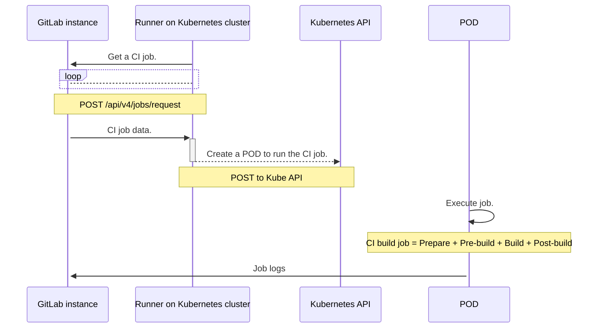
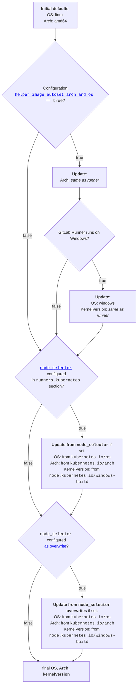



- Niveau :  Free, Premium, Ultimate
- Offre :  GitLab.com, GitLab Self-Managed, GitLab Dedicated



Utilisez l'exécuteur Kubernetes pour utiliser des clusters Kubernetes pour vos versions. L'exécuteur appelle l'API du cluster Kubernetes et crée un pod pour chaque job GitLab CI.

L'exécuteur Kubernetes divise la version en plusieurs étapes :

1. **Prepare** :  Créer le pod sur le cluster Kubernetes. Cela crée les conteneurs requis pour la version et les services à exécuter.
1. **Pre-build** :  Cloner, restaurer le cache et télécharger les artefacts des étapes précédentes. Cette étape s'exécute sur un conteneur spécial faisant partie du pod.
1. **Version** :  Version utilisateur.
1. **Post-build** :  Créer le cache, charger les artefacts vers GitLab. Cette étape utilise également le conteneur spécial faisant partie du pod.

## Comment le runner crée les pods Kubernetes {#how-the-runner-creates-kubernetes-pods}

Le diagramme suivant montre l'interaction entre une instance GitLab et un runner hébergé sur un cluster Kubernetes. Le runner appelle l'API Kubernetes pour créer des pods sur le cluster.

Le pod est composé des conteneurs suivants pour chaque `service` défini dans les fichiers `.gitlab-ci.yml` ou `config.toml` :

- Un conteneur de build défini comme `build`.
- Un conteneur helper défini comme `helper`.
- Un conteneur de services nommé selon la logique suivante :
  - Si le service possède un alias qui est un [nom de label DNS](https://kubernetes.io/docs/concepts/overview/working-with-objects/names/#dns-label-names) valide et qui n'est pas déjà utilisé par un autre conteneur de service, cet alias est utilisé comme nom du conteneur.
  - Si aucun alias valide n'est disponible, le conteneur est nommé `svc-N`, où `N` est un index séquentiel commençant à `0`.



- La dénomination basée sur les alias a été [introduite](https://gitlab.com/gitlab-org/gitlab-runner/-/merge_requests/4469) dans GitLab Runner 17.9.



Les services et les conteneurs s'exécutent dans le même pod Kubernetes et partagent la même adresse localhost. Les restrictions suivantes s'appliquent :

- Les services sont accessibles via leurs noms DNS. Si vous utilisez une version plus ancienne, vous devez utiliser `localhost`.
- Vous ne pouvez pas utiliser plusieurs services qui utilisent le même port. Par exemple, vous ne pouvez pas avoir deux services `mysql` en même temps.



L'interaction dans le diagramme est valide pour tout cluster Kubernetes. Par exemple, des solutions clé en main hébergées chez les principaux fournisseurs de cloud public, ou des installations Kubernetes auto-gérées.

## Se connecter à l'API Kubernetes {#connect-to-the-kubernetes-api}

Utilisez les options suivantes pour vous connecter à l'API Kubernetes. Le compte utilisateur fourni doit avoir la permission de créer, lister et s'attacher aux pods dans l'espace de nommage spécifié.

| Option      | Description |
|-------------|-------------|
| `host`      | URL hôte optionnelle du serveur API Kubernetes (la découverte automatique est tentée si non spécifiée). |
| `context`   | Nom de contexte Kubernetes optionnel à utiliser depuis votre configuration `kubectl`. Utilisez cette option lorsque vous ne spécifiez pas `host`. |
| `cert_file` | Certificat d'authentification utilisateur optionnel pour le serveur API Kubernetes. |
| `key_file`  | Clé privée d'authentification utilisateur optionnelle pour le serveur API Kubernetes. |
| `ca_file`   | Certificat CA optionnel pour le serveur API Kubernetes. |

Si vous exécutez GitLab Runner dans le cluster Kubernetes, omettez ces champs afin que GitLab Runner découvre automatiquement l'API Kubernetes.

Si vous exécutez GitLab Runner en dehors du cluster, ces paramètres garantissent que GitLab Runner a accès à l'API Kubernetes sur le cluster. Vous pouvez soit spécifier `host` avec les détails d'authentification, soit utiliser `context` pour référencer un contexte spécifique depuis votre configuration `kubectl`.

### Définir le jeton Bearer pour les appels à l'API Kubernetes {#set-the-bearer-token-for-kubernetes-api-calls}

Pour définir le jeton Bearer pour les appels API visant à créer des pods, utilisez la variable `KUBERNETES_BEARER_TOKEN`. Cela permet aux propriétaires de projets d'utiliser des variables secrètes de projet pour spécifier un jeton Bearer.

Lors de la spécification du jeton Bearer, vous devez définir le paramètre de configuration `Host`.

``` yaml
variables:
  KUBERNETES_BEARER_TOKEN: thebearertokenfromanothernamespace
```

### Configurer les permissions API du runner {#configure-runner-api-permissions}

Pour configurer les permissions du groupe API principal, mettez à jour le fichier `values.yml` pour les charts Helm de GitLab Runner.

Vous pouvez soit :

- Définir `rbac.create` sur `true`.
- Spécifier un compte de service `serviceAccount.name: <service_account_name>` avec les permissions suivantes dans le fichier `values.yml`.

<!-- `k8s_api_permissions_list_start` -->

| Ressource | Verbe (Fonctionnalité/Indicateurs de configuration facultatifs) |
|----------|-------------------------------|
| apps/deployments | create (`kubernetes.autoscaler`), delete (`kubernetes.autoscaler`), get (`kubernetes.autoscaler`), list (`kubernetes.autoscaler`), update (`kubernetes.autoscaler`) |
| events | list (`print_pod_warning_events=true`), watch (`FF_PRINT_POD_EVENTS=true`) |
| namespaces | create (`kubernetes.NamespacePerJob=true`), delete (`kubernetes.NamespacePerJob=true`) |
| poddisruptionbudgets | create (`pod_disruption_budget=true`), get (`pod_disruption_budget=true`) |
| pods | create, delete, get, list ([avec Informers](#informers) ), watch ([avec Informers](#informers), `FF_KUBERNETES_HONOR_ENTRYPOINT=true`, `FF_USE_LEGACY_KUBERNETES_EXECUTION_STRATEGY=false`) |
| pods/attach | create (`FF_USE_LEGACY_KUBERNETES_EXECUTION_STRATEGY=false`), delete (`FF_USE_LEGACY_KUBERNETES_EXECUTION_STRATEGY=false`), get (`FF_USE_LEGACY_KUBERNETES_EXECUTION_STRATEGY=false`), patch (`FF_USE_LEGACY_KUBERNETES_EXECUTION_STRATEGY=false`) |
| pods/exec | create, delete, get, patch |
| pods/log | get (`FF_KUBERNETES_HONOR_ENTRYPOINT=true`, `FF_USE_LEGACY_KUBERNETES_EXECUTION_STRATEGY=false`, `FF_WAIT_FOR_POD_TO_BE_REACHABLE=true`), list (`FF_KUBERNETES_HONOR_ENTRYPOINT=true`, `FF_USE_LEGACY_KUBERNETES_EXECUTION_STRATEGY=false`) |
| scheduling.k8s.io/priorityclasses | create (`kubernetes.autoscaler`), get (`kubernetes.autoscaler`) |
| secrets | create, delete, get, update |
| serviceaccounts | get |
| services | create, get |

<!-- `k8s_api_permissions_list_end` -->

Vous pouvez utiliser la définition de rôle YAML suivante pour créer un rôle avec les permissions requises.

<!-- `k8s_api_permissions_role_yaml_start` -->

```yaml
apiVersion: rbac.authorization.k8s.io/v1
kind: Role
metadata:
  name: gitlab-runner
  namespace: default
rules:
- apiGroups: ["apps"]
  resources: ["deployments"]
  verbs:
  - "create" # Required when `kubernetes.autoscaler`
  - "delete" # Required when `kubernetes.autoscaler`
  - "get" # Required when `kubernetes.autoscaler`
  - "list" # Required when `kubernetes.autoscaler`
  - "update" # Required when `kubernetes.autoscaler`
- apiGroups: [""]
  resources: ["events"]
  verbs:
  - "list" # Required when `print_pod_warning_events=true`
  - "watch" # Required when `FF_PRINT_POD_EVENTS=true`
- apiGroups: [""]
  resources: ["namespaces"]
  verbs:
  - "create" # Required when `kubernetes.NamespacePerJob=true`
  - "delete" # Required when `kubernetes.NamespacePerJob=true`
- apiGroups: ["policy"]
  resources: ["poddisruptionbudgets"]
  verbs:
  - "create" # Required when `pod_disruption_budget=true`
  - "get" # Required when `pod_disruption_budget=true`
- apiGroups: [""]
  resources: ["pods"]
  verbs:
  - "create"
  - "delete"
  - "get"
  - "list" # Required when using Informers (https://docs.gitlab.com/runner/executors/kubernetes/#informers)
  - "watch" # Required when `FF_KUBERNETES_HONOR_ENTRYPOINT=true`, `FF_USE_LEGACY_KUBERNETES_EXECUTION_STRATEGY=false`, using Informers (https://docs.gitlab.com/runner/executors/kubernetes/#informers)
- apiGroups: [""]
  resources: ["pods/attach"]
  verbs:
  - "create" # Required when `FF_USE_LEGACY_KUBERNETES_EXECUTION_STRATEGY=false`
  - "delete" # Required when `FF_USE_LEGACY_KUBERNETES_EXECUTION_STRATEGY=false`
  - "get" # Required when `FF_USE_LEGACY_KUBERNETES_EXECUTION_STRATEGY=false`
  - "patch" # Required when `FF_USE_LEGACY_KUBERNETES_EXECUTION_STRATEGY=false`
- apiGroups: [""]
  resources: ["pods/exec"]
  verbs:
  - "create"
  - "delete"
  - "get"
  - "patch"
- apiGroups: [""]
  resources: ["pods/log"]
  verbs:
  - "get" # Required when `FF_KUBERNETES_HONOR_ENTRYPOINT=true`, `FF_USE_LEGACY_KUBERNETES_EXECUTION_STRATEGY=false`, `FF_WAIT_FOR_POD_TO_BE_REACHABLE=true`
  - "list" # Required when `FF_KUBERNETES_HONOR_ENTRYPOINT=true`, `FF_USE_LEGACY_KUBERNETES_EXECUTION_STRATEGY=false`
- apiGroups: ["scheduling.k8s.io"]
  resources: ["priorityclasses"]
  verbs:
  - "create" # Required when `kubernetes.autoscaler`
  - "get" # Required when `kubernetes.autoscaler`
- apiGroups: [""]
  resources: ["secrets"]
  verbs:
  - "create"
  - "delete"
  - "get"
  - "update"
- apiGroups: [""]
  resources: ["serviceaccounts"]
  verbs:
  - "get"
- apiGroups: [""]
  resources: ["services"]
  verbs:
  - "create"
  - "get"
```

<!-- `k8s_api_permissions_role_yaml_end` -->

Informations complémentaires :

- La permission `event` n'est nécessaire que pour GitLab 16.2.1 et versions ultérieures.
- La permission `namespace` n'est nécessaire que lors de l'activation de l'isolation des espaces de nommage avec `namespace_per_job`.
- La permission `pods/log` n'est nécessaire que lorsque l'un des scénarios suivants est vrai :
  - Le [feature flag `FF_KUBERNETES_HONOR_ENTRYPOINT`](../../configuration/feature-flags.md) est activé.
  - Le [feature flag `FF_USE_LEGACY_KUBERNETES_EXECUTION_STRATEGY`](../../configuration/feature-flags.md) est désactivé lorsque la [variable `CI_DEBUG_SERVICES`](https://docs.gitlab.com/ci/services/#capturing-service-container-logs) est définie sur `true`.
  - Le [feature flag `FF_WAIT_FOR_POD_TO_BE_REACHABLE`](../../configuration/feature-flags.md) est activé.

#### Informers {#informers}

Dans GitLab Runner 17.9.0 et versions ultérieures, un informer Kubernetes suit les modifications du pod de build. Cela aide l'exécuteur à détecter les modifications plus rapidement.

L'informer requiert les permissions `list` et `watch` pour `pods`. Lorsque l'exécuteur démarre le build, il vérifie les permissions auprès de l'API Kubernetes. Si toutes les permissions sont accordées, l'exécuteur utilise un informer. Si une permission est manquante, GitLab Runner enregistre un avertissement. Le build continue et utilise le mécanisme précédent pour suivre le statut et les modifications du pod de build.

## Paramètres de configuration {#configuration-settings}

Utilisez les paramètres suivants dans le fichier `config.toml` pour configurer l'exécuteur Kubernetes.

### Requêtes et limites de CPU {#cpu-requests-and-limits}

| Paramètre                                     | Description |
|---------------------------------------------|-------------|
| `cpu_limit`                                 | L'allocation CPU accordée aux conteneurs de build. |
| `cpu_limit_overwrite_max_allowed`           | La quantité maximale que l'allocation CPU peut être écrite pour les conteneurs de build. Lorsque vide, désactive la fonctionnalité de réécriture de la limite CPU. |
| `cpu_request`                               | L'allocation CPU demandée pour les conteneurs de build. |
| `cpu_request_overwrite_max_allowed`         | La quantité maximale que la requête d'allocation CPU peut être écrite pour les conteneurs de build. Lorsque vide, désactive la fonctionnalité de réécriture de la requête CPU. |
| `helper_cpu_limit`                          | L'allocation CPU accordée aux conteneurs helper de build. |
| `helper_cpu_limit_overwrite_max_allowed`    | La quantité maximale que l'allocation CPU peut être écrite pour les conteneurs helper. Lorsque vide, désactive la fonctionnalité de réécriture de la limite CPU. |
| `helper_cpu_request`                        | L'allocation CPU demandée pour les conteneurs helper de build. |
| `helper_cpu_request_overwrite_max_allowed`  | La quantité maximale que la requête d'allocation CPU peut être écrite pour les conteneurs helper. Lorsque vide, désactive la fonctionnalité de réécriture de la requête CPU. |
| `service_cpu_limit`                         | L'allocation CPU accordée aux conteneurs de service de build. |
| `service_cpu_limit_overwrite_max_allowed`   | La quantité maximale que l'allocation CPU peut être écrite pour les conteneurs de service. Lorsque vide, désactive la fonctionnalité de réécriture de la limite CPU. |
| `service_cpu_request`                       | L'allocation CPU demandée pour les conteneurs de service de build. |
| `service_cpu_request_overwrite_max_allowed` | La quantité maximale que la requête d'allocation CPU peut être écrite pour les conteneurs de service. Lorsque vide, désactive la fonctionnalité de réécriture de la requête CPU. |
| `pod_cpu_limit`                             | L'allocation CPU accordée au pod de build. |
| `pod_cpu_limit_overwrite_max_allowed`       | La quantité maximale que l'allocation CPU peut être écrite pour le pod de build. Lorsque vide, désactive la fonctionnalité de réécriture de la limite CPU. |
| `pod_cpu_request`                           | L'allocation CPU demandée pour le pod de build. |
| `pod_cpu_request_overwrite_max_allowed`     | La quantité maximale que la requête d'allocation CPU peut être écrite pour le pod de build. Lorsque vide, désactive la fonctionnalité de réécriture de la requête CPU. |

> [!note]
> Les spécifications de ressources au niveau du pod ont été introduites en tant que fonctionnalités alpha dans [Kubernetes v1.32](https://v1-32.docs.kubernetes.io/blog/2024/12/11/kubernetes-v1-32-release/#pod-level-resource-specifications) et ont atteint le statut bêta dans [Kubernetes v1.34](https://kubernetes.io/blog/2025/09/22/kubernetes-v1-34-pod-level-resources/).

### Requêtes et limites de mémoire {#memory-requests-and-limits}

| Paramètre                                        | Description |
|------------------------------------------------|-------------|
| `memory_limit`                                 | La quantité de mémoire allouée aux conteneurs de build. |
| `memory_limit_overwrite_max_allowed`           | La quantité maximale que l'allocation de mémoire peut être écrite pour les conteneurs de build. Lorsque vide, désactive la fonctionnalité de réécriture de la limite de mémoire. |
| `memory_request`                               | La quantité de mémoire demandée depuis les conteneurs de build. |
| `memory_request_overwrite_max_allowed`         | La quantité maximale que la requête d'allocation de mémoire peut être écrite pour les conteneurs de build. Lorsque vide, désactive la fonctionnalité de réécriture de la requête de mémoire. |
| `helper_memory_limit`                          | La quantité de mémoire allouée aux conteneurs helper de build. |
| `helper_memory_limit_overwrite_max_allowed`    | La quantité maximale que l'allocation de mémoire peut être écrite pour les conteneurs helper. Lorsque vide, désactive la fonctionnalité de réécriture de la limite de mémoire. |
| `helper_memory_request`                        | La quantité de mémoire demandée pour les conteneurs helper de build. |
| `helper_memory_request_overwrite_max_allowed`  | La quantité maximale que la requête d'allocation de mémoire peut être écrite pour les conteneurs helper. Lorsque vide, désactive la fonctionnalité de réécriture de la requête de mémoire. |
| `service_memory_limit`                         | La quantité de mémoire allouée aux conteneurs de service de build. |
| `service_memory_limit_overwrite_max_allowed`   | La quantité maximale que l'allocation de mémoire peut être écrite pour les conteneurs de service. Lorsque vide, désactive la fonctionnalité de réécriture de la limite de mémoire. |
| `service_memory_request`                       | La quantité de mémoire demandée pour les conteneurs de service de build. |
| `service_memory_request_overwrite_max_allowed` | La quantité maximale que la requête d'allocation de mémoire peut être écrite pour les conteneurs de service. Lorsque vide, désactive la fonctionnalité de réécriture de la requête de mémoire. |
| `pod_memory_limit`                             | La quantité de mémoire allouée au pod de build. |
| `pod_memory_limit_overwrite_max_allowed`       | La quantité maximale que l'allocation de mémoire peut être écrite pour le pod de build. Lorsque vide, désactive la fonctionnalité de réécriture de la limite de mémoire. |
| `pod_memory_request`                           | La quantité de mémoire demandée pour le pod de build. |
| `pod_memory_request_overwrite_max_allowed`     | La quantité maximale que la requête d'allocation de mémoire peut être écrite pour le pod de build. Lorsque vide, désactive la fonctionnalité de réécriture de la requête de mémoire. |

#### Recommandations de dimensionnement de la mémoire pour le conteneur helper {#helper-container-memory-sizing-recommendations}

Pour des performances optimales, définissez les limites de mémoire du conteneur helper en fonction de vos besoins en charge de travail :

- **Charges de travail avec mise en cache et génération d’artefacts** :  Minimum 250 Mio
- **Charges de travail basiques sans mise en cache/artefacts** :  Peut fonctionner avec des limites plus basses (128-200 Mio)

**Exemple de configuration basique :**

```toml
[[runners]]
  executor = "kubernetes"
  [runners.kubernetes]
    helper_memory_limit = "250Mi"
    helper_memory_request = "250Mi"
    helper_memory_limit_overwrite_max_allowed = "1Gi"
```

**Ajustement de la mémoire pour des jobs spécifiques :**

Utilisez la variable `KUBERNETES_HELPER_MEMORY_LIMIT` pour ajuster la mémoire pour des jobs spécifiques sans nécessiter de modifications administrateur :

```yaml
job_with_higher_helper_memory_limit:
  variables:
    KUBERNETES_HELPER_MEMORY_LIMIT: "512Mi"
  script:
```

Cette approche permet aux développeurs d'optimiser l'utilisation des ressources par job tout en maintenant des limites à l'échelle du cluster via `helper_memory_limit_overwrite_max_allowed`.

### Requêtes et limites de stockage {#storage-requests-and-limits}

| Paramètre                                                   | Description |
|-----------------------------------------------------------|-------------|
| `ephemeral_storage_limit`                                 | La limite de stockage éphémère pour les conteneurs de build. |
| `ephemeral_storage_limit_overwrite_max_allowed`           | La quantité maximale que la limite de stockage éphémère pour les conteneurs de build peut être écrasée. Lorsque vide, désactive la fonctionnalité de réécriture de la limite de stockage éphémère. |
| `ephemeral_storage_request`                               | La requête de stockage éphémère accordée aux conteneurs de build. |
| `ephemeral_storage_request_overwrite_max_allowed`         | La quantité maximale de la requête de stockage éphémère qui peut être écrasée pour les conteneurs de build. Lorsque vide, désactive la fonctionnalité de réécriture de la requête de stockage éphémère. |
| `helper_ephemeral_storage_limit`                          | La limite de stockage éphémère accordée aux conteneurs helper. |
| `helper_ephemeral_storage_limit_overwrite_max_allowed`    | La quantité maximale de la limite de stockage éphémère qui peut être écrasée pour les conteneurs helper. Lorsque vide, désactive la fonctionnalité de réécriture de la requête de stockage éphémère. |
| `helper_ephemeral_storage_request`                        | La requête de stockage éphémère accordée aux conteneurs helper. |
| `helper_ephemeral_storage_request_overwrite_max_allowed`  | La quantité maximale de la requête de stockage éphémère qui peut être écrasée pour les conteneurs helper. Lorsque vide, désactive la fonctionnalité de réécriture de la requête de stockage éphémère. |
| `service_ephemeral_storage_limit`                         | La limite de stockage éphémère accordée aux conteneurs de service. |
| `service_ephemeral_storage_limit_overwrite_max_allowed`   | La quantité maximale de la limite de stockage éphémère qui peut être écrasée pour les conteneurs de service. Lorsque vide, désactive la fonctionnalité de réécriture de la requête de stockage éphémère. |
| `service_ephemeral_storage_request`                       | La requête de stockage éphémère accordée aux conteneurs de service. |
| `service_ephemeral_storage_request_overwrite_max_allowed` | La quantité maximale de la requête de stockage éphémère qui peut être écrasée pour les conteneurs de service. Lorsque vide, désactive la fonctionnalité de réécriture de la requête de stockage éphémère. |

### Autres paramètres `config.toml` {#other-configtoml-settings}

| Paramètre                                       | Description |
|-----------------------------------------------|-------------|
| `affinity`                                    | Spécifier des règles d'affinité qui déterminent quel nœud exécute le build. En savoir plus sur [l'utilisation de l'affinité](#define-a-list-of-node-affinities). |
| `allow_privilege_escalation`                  | Exécuter tous les conteneurs avec l'indicateur `allowPrivilegeEscalation` activé. Lorsque vide, ne définit pas l'indicateur `allowPrivilegeEscalation` dans le `SecurityContext` du conteneur et permet à Kubernetes d'utiliser le comportement de [réaffectation des privilèges](https://kubernetes.io/docs/tasks/configure-pod-container/security-context/) par défaut. |
| `allowed_groups`                              | Tableau d'ID de groupe pouvant être spécifiés pour les groupes de conteneurs. S'il n'est pas présent, tous les groupes sont autorisés. Pour plus d'informations, voir [configurer l'utilisateur et le groupe du conteneur](#configure-container-user-and-group). |
| `allowed_images`                              | Liste de caractères génériques d'images pouvant être spécifiées dans `.gitlab-ci.yml`. Si non présent, toutes les images sont autorisées (équivalent à `["*/*:*"]`). [Voir les détails](#restrict-docker-images-and-services). |
| `allowed_pull_policies`                       | Liste des politiques de tirage pouvant être spécifiées dans le fichier `.gitlab-ci.yml` ou le fichier `config.toml`. |
| `allowed_services`                            | Liste de caractères génériques de services pouvant être spécifiés dans `.gitlab-ci.yml`. Si non présent, toutes les images sont autorisées (équivalent à `["*/*:*"]`). [Voir les détails](#restrict-docker-images-and-services). |
| `allowed_users`                               | Tableau d'ID d'utilisateur pouvant être spécifiés pour les utilisateurs de conteneurs. S'il n'est pas présent, tous les utilisateurs sont autorisés. Pour plus d'informations, voir [configurer l'utilisateur et le groupe du conteneur](#configure-container-user-and-group). |
| `automount_service_account_token`             | Booléen pour contrôler si le jeton de compte de service est monté automatiquement dans le pod de build. |
| `bearer_token`                                | Jeton Bearer par défaut utilisé pour lancer les pods de build. |
| `bearer_token_overwrite_allowed`              | Booléen permettant aux projets de spécifier un jeton Bearer utilisé pour créer le pod de build. |
| `build_container_security_context`            | Définit un contexte de sécurité de conteneur pour le conteneur de build. [En savoir plus sur le contexte de sécurité](#set-a-security-policy-for-the-pod). |
| `cap_add`                                     | Spécifier les capacités Linux qui doivent être ajoutées aux conteneurs du pod de job. [En savoir plus sur la configuration des capacités dans l'exécuteur Kubernetes](#specify-container-capabilities). |
| `cap_drop`                                    | Spécifier les capacités Linux qui doivent être supprimées des conteneurs du pod de job. [En savoir plus sur la configuration des capacités dans l'exécuteur Kubernetes](#specify-container-capabilities). |
| `cleanup_grace_period_seconds`                | Lorsqu'un job se termine, la durée en secondes dont dispose le pod pour se terminer correctement. Après cette période, les processus sont arrêtés de force par un signal kill. Ignoré si `terminationGracePeriodSeconds` est spécifié. |
| `context`                                      | Nom de contexte Kubernetes à utiliser depuis la configuration `kubectl` (lorsque `host` n'est pas spécifié). |
| `dns_policy`                                  | Spécifier la politique DNS à utiliser lors de la construction du pod : `none`, `default`, `cluster-first`, `cluster-first-with-host-net`. La valeur par défaut de Kubernetes (`cluster-first`) est utilisée si non défini. |
| `dns_config`                                  | Spécifier la configuration DNS à utiliser lors de la construction du pod. [En savoir plus sur l'utilisation de la configuration DNS du pod](#configure-pod-dns-settings). |
| `helper_container_security_context`           | Définit un contexte de sécurité de conteneur pour le conteneur helper. [En savoir plus sur le contexte de sécurité](#set-a-security-policy-for-the-pod). |
| `helper_image`                                | (Avancé) [Remplacer l'image helper par défaut](../../configuration/advanced-configuration.md#helper-image) utilisée pour cloner les dépôts et charger les artefacts. |
| `helper_image_flavor`                         | Définit la variante de l'image helper (`alpine`, `alpine3.21` ou `ubuntu`). La valeur par défaut est `alpine`. Utiliser `alpine` est identique à `alpine3.21`. |
| `host_aliases`                                | Liste d'alias de noms d'hôte supplémentaires ajoutés à tous les conteneurs. [En savoir plus sur l'utilisation d'alias d'hôtes supplémentaires](#add-extra-host-aliases). |
| `image_pull_secrets`                          | Un tableau d'éléments contenant les noms de secrets Kubernetes `docker-registry` utilisés pour authentifier le tirage d'images Docker depuis des registres privés. |
| `init_permissions_container_security_context` | Définit un contexte de sécurité de conteneur pour le conteneur init-permissions. [En savoir plus sur le contexte de sécurité](#set-a-security-policy-for-the-pod). |
| `namespace`                                   | Espace de nommage dans lequel exécuter les pods Kubernetes. |
| `namespace_per_job`                           | Isoler les jobs dans des espaces de nommage séparés. Si activé, `namespace` et `namespace_overwrite_allowed` sont ignorés. |
| `namespace_overwrite_allowed`                 | Expression régulière pour valider le contenu de la variable d'environnement de réécriture de l'espace de nommage (documentée ci-dessous). Lorsque vide, désactive la fonctionnalité de réécriture de l'espace de nommage. |
| `node_selector`                               | Une `table` de paires `key=value` au format `string=string` (`string:string` dans le cas des variables d'environnement). Ce paramètre limite la création de pods aux nœuds Kubernetes correspondant à toutes les paires `key=value`. [En savoir plus sur l'utilisation des sélecteurs de nœuds](#specify-the-node-to-execute-builds). |
| `node_tolerations`                            | Une `table` de paires `"key=value" = "Effect"` au format `string=string:string`. Ce paramètre permet aux pods d'être planifiés sur des nœuds avec tout ou un sous-ensemble de tolérances acceptées. Une seule tolérance peut être fournie via la configuration des variables d'environnement. Les `key`, `value` et `effect` correspondent aux noms de champs correspondants dans la configuration de tolérance de pod Kubernetes. |
| `pod_annotations`                             | Une `table` de paires `key=value` au format `string=string`. La `table` contient une liste d'annotations à ajouter à chaque pod de build créé par le runner. La valeur de celles-ci peut inclure des variables d'environnement pour l'expansion. Les annotations de pod peuvent être écrasées dans chaque build. |
| `pod_annotations_overwrite_allowed`           | Expression régulière pour valider le contenu de la variable d'environnement de réécriture des annotations de pod. Lorsque vide, désactive la fonctionnalité de réécriture des annotations de pod. |
| `pod_labels`                                  | Une `table` de paires `key=value` au format `string=string`. La `table` contient une liste de labels à ajouter à chaque pod de build créé par le runner. La valeur de celles-ci peut inclure des variables d'environnement pour l'expansion. Les labels de pod peuvent être écrasés dans chaque build en utilisant `pod_labels_overwrite_allowed`. |
| `pod_labels_overwrite_allowed`                | Expression régulière pour valider le contenu de la variable d'environnement de réécriture des labels de pod. Lorsque vide, désactive la fonctionnalité de réécriture des labels de pod. Notez que les labels de pod dans l'espace de nommage de label `runner.gitlab.com` ne peuvent pas être écrasés. |
| `pod_security_context`                        | Configuré via le fichier de configuration, définit un contexte de sécurité de pod pour le pod de build. [En savoir plus sur le contexte de sécurité](#set-a-security-policy-for-the-pod). |
| `pod_termination_grace_period_seconds`        | Paramètre au niveau du pod qui détermine la durée en secondes dont dispose le pod pour se terminer correctement. Après cela, les processus sont arrêtés de force par un signal kill. Ignoré si `terminationGracePeriodSeconds` est spécifié. |
| `poll_interval`                               | La fréquence, en secondes, à laquelle le runner interroge le pod Kubernetes qu'il vient de créer pour vérifier son statut (par défaut = 3). |
| `poll_timeout`                                | Le temps, en secondes, qui doit s'écouler avant que le runner expire lors de la tentative de connexion au conteneur qu'il vient de créer. Utilisez ce paramètre pour mettre en file d'attente plus de builds que le cluster ne peut en gérer à la fois (par défaut = 180). |
| `cleanup_resources_timeout`                   | Le temps total pour que les ressources Kubernetes soient nettoyées après la fin du job. Syntaxe prise en charge : `1h30m`, `300s`, `10m`. La valeur par défaut est 5 minutes (`5m`). |
| `priority_class_name`                         | Spécifier la classe de priorité à définir pour le pod. La valeur par défaut est utilisée si non définie. |
| `privileged`                                  | Exécuter les conteneurs avec l'indicateur privileged. |
| `pull_policy`                                 | Spécifier la politique de tirage d'image : `never`, `if-not-present`, `always`. Si non défini, la [politique de tirage par défaut](https://kubernetes.io/docs/concepts/containers/images/#updating-images) de l'image du cluster est utilisée. Pour plus d'informations et les instructions sur la définition de plusieurs politiques de tirage, voir [utilisation des politiques de tirage](#set-a-pull-policy). Voir aussi [considérations de sécurité pour `if-not-present`, `never`](../../security/_index.md#usage-of-private-docker-images-with-if-not-present-pull-policy). Vous pouvez également [restreindre les politiques de tirage](#restrict-docker-pull-policies). |
| `resource_availability_check_max_attempts`    | Le nombre maximum de tentatives pour vérifier si un ensemble de ressources (compte de service et/ou secret de tirage) est disponible avant d'abandonner. Il y a un intervalle de 5 secondes entre chaque tentative. [En savoir plus sur la vérification des ressources lors de l'étape de préparation](#resources-check-during-prepare-step). |
| `runtime_class_name`                          | Une classe Runtime à utiliser pour tous les pods créés. Si la fonctionnalité n'est pas prise en charge par le cluster, les jobs se terminent ou échouent. |
| `service_container_security_context`          | Définit un contexte de sécurité de conteneur pour les conteneurs de service. [En savoir plus sur le contexte de sécurité](#set-a-security-policy-for-the-pod). |
| `scheduler_name`                              | Planificateur à utiliser pour planifier les pods de build. |
| `service_account`                             | Compte de service par défaut utilisé par les pods de job/exécuteur pour communiquer avec l'API Kubernetes. |
| `service_account_overwrite_allowed`           | Expression régulière pour valider le contenu de la variable d'environnement de réécriture du compte de service. Lorsque vide, désactive la fonctionnalité de réécriture du compte de service. |
| `services`                                    | Liste de [services](https://docs.gitlab.com/ci/services/) attachés au conteneur de build en utilisant le [modèle sidecar](https://learn.microsoft.com/en-us/azure/architecture/patterns/sidecar). En savoir plus sur [l'utilisation des services](#define-a-list-of-services). |
| `use_service_account_image_pull_secrets`      | Lorsqu'activé, le pod créé par l'exécuteur ne possède pas de `imagePullSecrets`. Cela entraîne la création du pod en utilisant les [`imagePullSecrets` du compte de service](https://kubernetes.io/docs/tasks/configure-pod-container/configure-service-account/#add-image-pull-secret-to-service-account), si défini. |
| `terminationGracePeriodSeconds`               | Durée après laquelle les processus s'exécutant dans le pod reçoivent un signal de terminaison et le moment où les processus sont arrêtés de force par un signal kill. [Déprécié en faveur de `cleanup_grace_period_seconds` et `pod_termination_grace_period_seconds`](https://gitlab.com/gitlab-org/gitlab-runner/-/issues/28165). |
| `volumes`                                     | Configuré via le fichier de configuration, la liste des volumes montés dans le conteneur de build. [En savoir plus sur l'utilisation des volumes](#configure-volume-types). |
| `pod_spec`                                    | Ce paramètre est une expérimentation. Écrase la spécification de pod générée par le gestionnaire de runner avec une liste de configurations définies sur le pod utilisé pour exécuter le job CI. Toutes les propriétés listées dans `Kubernetes Pod Specification` peuvent être définies. Pour plus d'informations, voir [Écraser les spécifications de pod générées (expérimentation)](#overwrite-generated-pod-specifications). |
| `retry_limit`                                 | Le nombre maximum de tentatives pour communiquer avec l'API Kubernetes. L'intervalle de nouvelle tentative entre chaque tentative est basé sur un algorithme de backoff commençant à 500 ms. |
| `retry_backoff_max`                           | Valeur maximale de backoff personnalisée en millisecondes pour l'intervalle de nouvelle tentative à atteindre pour chaque tentative. La valeur par défaut est 2000 ms et ne peut pas être inférieure à 500 ms. L'intervalle maximum de nouvelle tentative par défaut à atteindre pour chaque tentative est de 2 secondes et peut être personnalisé avec `retry_backoff_max`. |
| `retry_limits`                                | Le nombre de fois que chaque erreur de requête doit être réessayée. |
| `logs_base_dir`                               | Répertoire de base à ajouter au chemin généré pour stocker les journaux de build. Pour plus d'informations, voir [Modifier le répertoire de base pour les journaux et scripts de build](#change-the-base-directory-for-build-logs-and-scripts). |
| `scripts_base_dir`                            | Répertoire de base à ajouter au chemin généré pour stocker les scripts de build. Pour plus d'informations, voir [Modifier le répertoire de base pour les journaux et scripts de build](#change-the-base-directory-for-build-logs-and-scripts). |
| `print_pod_warning_events`                    | Lorsqu'activé, cette fonctionnalité récupère tous les événements d'avertissement associés au pod lorsque les jobs échouent. Cette fonctionnalité est activée par défaut et nécessite un compte de service avec au minimum [les permissions `events: list`](#configure-runner-api-permissions). |
| `pod_disruption_budget`                       | Lorsqu'activé, un [`PodDisruptionBudget`](https://kubernetes.io/docs/tasks/run-application/configure-pdb/) est créé pour chaque pod de job afin d'éviter l'éviction lors de perturbations volontaires telles que les vidanges de nœuds et les mises à niveau du cluster. Désactivé par défaut. Nécessite un compte de service avec [les permissions `poddisruptionbudgets`](#configure-runner-api-permissions). |

### Exemple de configuration {#configuration-example}

L'exemple suivant présente une configuration type du fichier `config.toml` pour l'exécuteur Kubernetes.

```toml
concurrent = 4

[[runners]]
  name = "myRunner"
  url = "https://gitlab.com/ci"
  token = "......"
  executor = "kubernetes"
  [runners.kubernetes]
    host = "https://45.67.34.123:4892"
    cert_file = "/etc/ssl/kubernetes/api.crt"
    key_file = "/etc/ssl/kubernetes/api.key"
    ca_file = "/etc/ssl/kubernetes/ca.crt"
    namespace = "gitlab"
    namespace_overwrite_allowed = "ci-.*"
    bearer_token_overwrite_allowed = true
    privileged = true
    cpu_limit = "1"
    memory_limit = "1Gi"
    service_cpu_limit = "1"
    service_memory_limit = "1Gi"
    helper_cpu_limit = "500m"
    helper_memory_limit = "100Mi"
    poll_interval = 5
    poll_timeout = 3600
    dns_policy = "cluster-first"
    priority_class_name = "priority-1"
    logs_base_dir = "/tmp"
    scripts_base_dir = "/tmp"
    [runners.kubernetes.node_selector]
      gitlab = "true"
    [runners.kubernetes.node_tolerations]
      "node-role.kubernetes.io/master" = "NoSchedule"
      "custom.toleration=value" = "NoSchedule"
      "empty.value=" = "PreferNoSchedule"
      "onlyKey" = ""
```

## Préchauffer la capacité du cluster avec des pods de pause {#pre-warm-cluster-capacity-with-pause-pods}



- Introduit dans GitLab Runner 18.10.



Vous pouvez configurer l'exécuteur Kubernetes pour maintenir des pods de pause qui préchauffent la capacité du cluster. Lorsqu'un job démarre, les pods de pause à faible priorité sont préemptés et le pod de job est planifié immédiatement sur les nœuds existants. Cette configuration réduit la latence de démarrage des jobs liée à l'attente que l'autoscaler du cluster provisionne de nouveaux nœuds.

### Fonctionnement des pods de pause {#how-pause-pods-work}

1. Le runner crée un `Deployment` de pods de pause basé sur les politiques configurées.
1. Les pods de pause utilisent une classe de priorité basse, donc Kubernetes les préempte lorsque des pods de job à priorité plus élevée ont besoin de ressources.
1. Lorsqu'un pod de pause est préempté, le pod de job prend sa place immédiatement.
1. Le `Deployment` recrée le pod de pause préempté, déclenchant potentiellement l'autoscaler du cluster pour ajouter un nouveau nœud.

### Configurer les pods de pause {#configure-pause-pods}

Pour activer les pods de pause, ajoutez une section `[runners.kubernetes.autoscaler]` à votre `config.toml` :

```toml
[[runners]]
  name = "kubernetes-runner"
  executor = "kubernetes"
  [runners.kubernetes]
    namespace = "gitlab-runner"
    cpu_request = "500m"
    memory_request = "1Gi"
    [runners.kubernetes.autoscaler]
      max_pause_pods = 10
      [[runners.kubernetes.autoscaler.policy]]
        idle_count = 5
        periods = ["* 8-17 * * mon-fri"]
        timezone = "UTC"
      [[runners.kubernetes.autoscaler.policy]]
        idle_count = 0
        periods = ["* * * * *"]
```

### Paramètres de l'autoscaler {#autoscaler-settings}

| Paramètre | Description |
|---------|-------------|
| `max_pause_pods` | Nombre maximum de pods de pause à créer. Définir sur `0` pour illimité. |
| `pause_pod_image` | Image pour les pods de pause. La valeur par défaut est `registry.k8s.io/pause:3.10`. |
| `pause_pod_priority_class_name` | Classe de priorité pour les pods de pause. Par défaut : `gitlab-runner-idle-capacity` (créé automatiquement avec la priorité `-1`). Si spécifié, la création automatique est ignorée. |

### Classes de priorité pour la préemption {#priority-classes-for-preemption}

Pour que les pods de pause soient préemptés par les pods de job, ils doivent avoir une priorité inférieure. Par défaut, le runner crée automatiquement un `PriorityClass` nommé `gitlab-runner-idle-capacity` avec la priorité `-1`. Comme les pods sans classe de priorité utilisent la priorité `0`, les pods de job préempteront les pods de pause.

Pour utiliser un `PriorityClass` personnalisé à la place, spécifiez-le dans votre configuration :

```toml
[runners.kubernetes.autoscaler]
  pause_pod_priority_class_name = "my-custom-priority-class"
```

Si vos pods de job utilisent une classe de priorité personnalisée, assurez-vous qu'elle a une valeur supérieure à celle de la classe de priorité des pods de pause.

### Paramètres de politique {#policy-settings}

Vous pouvez définir plusieurs politiques. La dernière politique correspondant à l'heure actuelle est utilisée.

| Paramètre | Description |
|---------|-------------|
| `periods` | Tableau d'expressions cron définissant quand cette politique est active. Par défaut : `* * * * *` (toujours). |
| `timezone` | Fuseau horaire pour l'évaluation des expressions cron. Par défaut : heure locale du système. |
| `idle_count` | Nombre cible de pods de pause à maintenir. La valeur par défaut est `0`. |
| `idle_time` | Délai de réduction d'échelle. Lorsque la capacité souhaitée diminue, les pods de pause sont supprimés après ce temps d'attente. Évite l'instabilité lors de l'utilisation de `scale_factor`. La valeur par défaut est `5m`. |
| `scale_factor` | Mettre à l'échelle les pods de pause en fonction des jobs actifs : `max(idle_count, active_jobs * scale_factor)`. Par défaut : `0` (désactivé). |
| `scale_factor_limit` | Nombre maximum de pods de pause lors de l'utilisation de `scale_factor`. Par défaut : `0` (sans limite). |

### Syntaxe cron {#cron-syntax}

Le paramètre `periods` utilise le format cron standard à cinq champs :

```plaintext
 ┌────────── minute (0 - 59)
 │ ┌──────── hour (0 - 23)
 │ │ ┌────── day of month (1 - 31)
 │ │ │ ┌──── month (1 - 12)
 │ │ │ │ ┌── day of week (0 - 7, where 0 and 7 are Sunday, or MON-SUN)
 * * * * *
```

Exemples :

| Période | Description |
|--------|-------------|
| `* * * * *` | Toujours actif |
| `* 8-17 * * mon-fri` | Jours de semaine 8h00-17h59 |
| `* 0-12 * * *` | Minuit à 12h59 quotidiennement |

### Créer la classe de priorité {#create-the-priority-class}

Les pods de pause nécessitent une classe de priorité avec une priorité inférieure à celle des pods de job. Créez la classe de priorité avant de configurer les pods de pause :

```yaml
apiVersion: scheduling.k8s.io/v1
kind: PriorityClass
metadata:
  name: pause-pods
value: -10
globalDefault: false
description: "Low priority class for runner pause pods"
```

### Permissions RBAC requises {#required-rbac-permissions}

Pour utiliser les pods de pause, configurez des permissions supplémentaires pour le compte de service du runner afin de gérer les `Deployments` et les `PriorityClasses` :

```yaml
- apiGroups: ["apps"]
  resources: ["deployments"]
  verbs: ["get", "list", "create", "update", "delete"]
- apiGroups: ["scheduling.k8s.io"]
  resources: ["priorityclasses"]
  verbs: ["get", "create"]
```

> [!note]
> `PriorityClass` est une ressource à portée de cluster. Un `Role` et `RoleBinding` avec espace de nommage ne peuvent pas accorder les permissions `scheduling.k8s.io/priorityclasses`. Utilisez plutôt `ClusterRole` et `ClusterRoleBinding`.

## Configurer le compte de service de l'exécuteur {#configure-the-executor-service-account}

Pour configurer le compte de service de l'exécuteur, vous pouvez définir la variable d'environnement `KUBERNETES_SERVICE_ACCOUNT` ou utiliser l'indicateur `--kubernetes-service-account`.

## Pods et conteneurs {#pods-and-containers}

Vous pouvez configurer les pods et les conteneurs pour contrôler la façon dont les jobs sont exécutés.

### Labels par défaut pour les pods de job {#default-labels-for-job-pods}

> [!warning]
> Vous ne pouvez pas remplacer ces labels via la configuration du runner ou les fichiers `.gitlab-ci.yml`. Toute tentative de définir ou de modifier des labels dans l'espace de nommage `runner.gitlab.com` est ignorée et enregistrée comme message de débogage.

| Clé                                        | Description |
|--------------------------------------------|-------------|
| `project.runner.gitlab.com/id`             | L'ID du projet, unique parmi tous les projets de l'instance GitLab. |
| `project.runner.gitlab.com/name`           | Le nom du projet. |
| `project.runner.gitlab.com/namespace-id`   | L'ID de l'espace de nommage du projet. |
| `project.runner.gitlab.com/namespace`      | Le nom de l'espace de nommage du projet. |
| `project.runner.gitlab.com/root-namespace` | L'ID de l'espace de nommage racine du projet. Par exemple, `/gitlab-org/group-a/subgroup-a/project`, où l'espace de nommage racine est `gitlab-org` |
| `manager.runner.gitlab.com/name`           | Le nom de la configuration du runner qui a lancé ce job. |
| `manager.runner.gitlab.com/id-short`       | L'ID de la configuration du runner qui a lancé le job. |
| `job.runner.gitlab.com/pod`                | Label interne utilisé par l'exécuteur Kubernetes. |

### Annotations par défaut pour les pods de job {#default-annotations-for-job-pods}

Les annotations suivantes sont ajoutées par défaut sur le pod exécutant les jobs :

| Clé                                | Description |
|------------------------------------|-------------|
| `job.runner.gitlab.com/id`         | L'ID du job, unique parmi tous les jobs de l'instance GitLab. |
| `job.runner.gitlab.com/url`        | L'URL des détails du job. |
| `job.runner.gitlab.com/sha`        | La révision de commit pour laquelle le projet est construit. |
| `job.runner.gitlab.com/before_sha` | Le dernier commit précédent présent sur une branche ou un tag. |
| `job.runner.gitlab.com/ref`        | Le nom de la branche ou du tag pour lequel le projet est construit. |
| `job.runner.gitlab.com/name`       | Le nom du job. |
| `job.runner.gitlab.com/timeout`    | Le délai d'exécution du job au format de durée. Par exemple, `2h3m0.5s`. |
| `project.runner.gitlab.com/id`     | L'ID de projet du job. |

Pour écraser les annotations par défaut, utilisez `pod_annotations` dans la configuration de GitLab Runner. Vous pouvez également écraser les annotations pour chaque job CI/CD dans le [fichier `.gitlab-ci.yml`](#overwrite-pod-annotations).

### Cycle de vie du pod {#pod-lifecycle}

Le [cycle de vie d'un pod](https://kubernetes.io/docs/reference/kubernetes-api/workload-resources/pod-v1/#lifecycle) peut être affecté par :

- La définition de la propriété `pod_termination_grace_period_seconds` dans le fichier de configuration `TOML`. Le processus s'exécutant sur le pod peut s'exécuter pendant la durée donnée après l'envoi du signal `TERM`. Un signal kill est envoyé si le pod n'est pas terminé avec succès après cette période.
- L'activation du [feature flag `FF_USE_POD_ACTIVE_DEADLINE_SECONDS`](../../configuration/feature-flags.md). Lorsqu'activé et que le job expire, le pod exécutant le job CI/CD est marqué comme échoué et tous les conteneurs associés sont arrêtés. Pour que le job expire d'abord sur GitLab, `activeDeadlineSeconds` est défini sur `configured timeout + 1 second`.

> [!note]
> Si vous activez le feature flag `FF_USE_POD_ACTIVE_DEADLINE_SECONDS` et définissez `pod_termination_grace_period_seconds` sur une valeur non nulle, le pod de job CI/CD n'est pas terminé immédiatement. Le `terminationGracePeriods` du pod garantit que le pod n'est terminé qu'à son expiration.

### Protéger les pods de job contre l'éviction {#protect-job-pods-from-eviction}



- [Introduit](https://gitlab.com/gitlab-org/gitlab-runner/-/merge_requests/6331) dans GitLab Runner 18.10.



Pour protéger les pods de job contre les [perturbations volontaires](https://kubernetes.io/docs/concepts/workloads/pods/disruptions/#voluntary-and-involuntary-disruptions) telles que les vidanges de nœuds et les mises à niveau du cluster, activez l'option `pod_disruption_budget`.

Lorsqu'activé, ce paramètre crée un [`PodDisruptionBudget`](https://kubernetes.io/docs/tasks/run-application/configure-pdb/) pour chaque pod de job avec `minAvailable: 1`. Cette action empêche l'API d'éviction Kubernetes d'évincer le pod lors de perturbations volontaires.

```toml
[runners.kubernetes]
  pod_disruption_budget = true
```

Le `PodDisruptionBudget` :

- Est automatiquement supprimé lorsque le pod de job est supprimé via les références de propriétaire Kubernetes.
- Ne protège pas contre les perturbations involontaires telles que les défaillances de nœuds ou les arrêts par manque de mémoire.
- Nécessite des permissions RBAC supplémentaires. Pour plus de détails, voir [Configurer les permissions API du runner](#configure-runner-api-permissions).

> [!warning]
> L'activation de `PodDisruptionBudget` peut entraîner le blocage des vidanges de nœuds si un job est en cours d'exécution. Assurez-vous que votre stratégie de mise à niveau du cluster tient compte des retards potentiels de vidange de nœuds, ou utilisez des délais d'expiration de job pour limiter la durée d'exécution d'un job.

### Écraser les tolérances de pod {#overwrite-pod-tolerations}

Pour écraser les tolérances de pod Kubernetes :

1. Dans le fichier `config.toml` ou le fichier Helm `values.yaml`, pour activer l'écrasement des tolérances de pod de job CI, définissez une expression régulière pour `node_tolerations_overwrite_allowed`. Cette expression régulière valide les valeurs des noms de variables CI qui commencent par `KUBERNETES_NODE_TOLERATIONS_`.

   ```toml
   runners:
    ...
    config: |
      [[runners]]
        [runners.kubernetes]
          node_tolerations_overwrite_allowed = ".*"
   ```

1. Dans le fichier `.gitlab-ci.yml`, définissez une ou plusieurs variables CI pour écraser les tolérances de pod de job CI.

   ```yaml
   variables:
     KUBERNETES_NODE_TOLERATIONS_1: 'node-role.kubernetes.io/master:NoSchedule'
     KUBERNETES_NODE_TOLERATIONS_2: 'custom.toleration=value:NoSchedule'
     KUBERNETES_NODE_TOLERATIONS_3: 'empty.value=:PreferNoSchedule'
     KUBERNETES_NODE_TOLERATIONS_4: 'onlyKey'
     KUBERNETES_NODE_TOLERATIONS_5: '' # tolerate all taints
   ```

### Écraser les labels de pod {#overwrite-pod-labels}

Pour écraser les labels de pod Kubernetes pour chaque job CI/CD :

1. Dans le fichier `.config.yaml`, définissez une expression régulière pour `pod_labels_overwrite_allowed`.
1. Dans le fichier `.gitlab-ci.yml`, définissez les variables `KUBERNETES_POD_LABELS_*` avec des valeurs de `key=value`. Les labels de pod sont écrasés vers `key=value`. Vous pouvez appliquer plusieurs valeurs :

    ```yaml
    variables:
      KUBERNETES_POD_LABELS_1: "Key1=Val1"
      KUBERNETES_POD_LABELS_2: "Key2=Val2"
      KUBERNETES_POD_LABELS_3: "Key3=Val3"
    ```

> [!warning]
> Les labels dans l'espace de nommage `runner.gitlab.com` sont en lecture seule. GitLab ignore toute tentative d'ajout, de modification ou de suppression de ces labels internes à GitLab.

### Écraser les annotations de pod {#overwrite-pod-annotations}

Pour écraser les annotations de pod Kubernetes pour chaque job CI/CD :

1. Dans le fichier `.config.yaml`, définissez une expression régulière pour `pod_annotations_overwrite_allowed`.
1. Dans le fichier `.gitlab-ci.yml`, définissez les variables `KUBERNETES_POD_ANNOTATIONS_*` et utilisez `key=value` pour la valeur. Les annotations de pod sont écrasées vers `key=value`. Vous pouvez spécifier plusieurs annotations :

   ```yaml
   variables:
     KUBERNETES_POD_ANNOTATIONS_1: "Key1=Val1"
     KUBERNETES_POD_ANNOTATIONS_2: "Key2=Val2"
     KUBERNETES_POD_ANNOTATIONS_3: "Key3=Val3"
   ```

Dans l'exemple ci-dessous, `pod_annotations` et `pod_annotations_overwrite_allowed` sont définis. Cette configuration permet d'écraser n'importe laquelle des `pod_annotations` configurées dans le `config.toml`.

```toml
[[runners]]
  # usual configuration
  executor = "kubernetes"
  [runners.kubernetes]
    image = "alpine"
    pod_annotations_overwrite_allowed = ".*"
    [runners.kubernetes.pod_annotations]
      "Key1" = "Val1"
      "Key2" = "Val2"
      "Key3" = "Val3"
      "Key4" = "Val4"
```

### Écraser les spécifications de pod générées {#overwrite-generated-pod-specifications}



- Statut :  Bêta



Cette fonctionnalité est en [bêta](https://docs.gitlab.com/policy/development_stages_support/#beta). Nous recommandons vivement d'utiliser cette fonctionnalité sur un cluster Kubernetes de test avant de l'utiliser sur un cluster de production. Pour utiliser cette fonctionnalité, vous devez activer le [feature flag](../../configuration/feature-flags.md) `FF_USE_ADVANCED_POD_SPEC_CONFIGURATION`.

Pour ajouter des commentaires avant que la fonctionnalité soit mise à disposition générale, laissez un commentaire sur le [ticket 556286](https://gitlab.com/gitlab-org/gitlab/-/issues/556286).

Pour modifier le `PodSpec` généré par le gestionnaire de runner, utilisez le paramètre `pod_spec` dans le fichier `config.toml`.

Pour la configuration spécifique à l'opérateur de runner, voir [la structure de patch](../../configuration/configuring_runner_operator.md#patch-structure).

Le paramètre `pod_spec` :

- Écrase et complète les champs de la spécification de pod générée.
- Écrase les valeurs de configuration qui ont pu être définies dans votre `config.toml` sous `[runners.kubernetes]`.

Vous pouvez configurer plusieurs paramètres `pod_spec`.

| Paramètre      | Description |
|--------------|-------------|
| `name`       | Nom donné au `pod_spec` personnalisé. |
| `patch_path` | Chemin vers le fichier qui définit les modifications à appliquer à l'objet `PodSpec` final avant sa génération. Le fichier doit être un fichier JSON ou YAML. |
| `patch`      | Une chaîne au format JSON ou YAML décrivant les modifications qui doivent être appliquées à l'objet `PodSpec` final avant sa génération. |
| `patch_type` | La stratégie utilisée par le runner pour appliquer les modifications spécifiées à l'objet `PodSpec` généré par GitLab Runner. Les valeurs acceptées sont `merge`, `json` et `strategic`. |

Vous ne pouvez pas définir `patch_path` et `patch` dans la même configuration `pod_spec`, sinon une erreur se produit.

Exemple de plusieurs configurations `pod_spec` dans le `config.toml` :

```toml
[[runners]]
  [runners.kubernetes]
    [[runners.kubernetes.pod_spec]]
      name = "hostname"
      patch = '''
        hostname: "custom-pod-hostname"
      '''
      patch_type = "merge"
    [[runners.kubernetes.pod_spec]]
      name = "subdomain"
      patch = '''
        subdomain: "subdomain"
      '''
      patch_type = "strategic"
    [[runners.kubernetes.pod_spec]]
      name = "terminationGracePeriodSeconds"
      patch = '''
        [{"op": "replace", "path": "/terminationGracePeriodSeconds", "value": 60}]
      '''
      patch_type = "json"
```

#### Stratégie de patch merge {#merge-patch-strategy}

La stratégie de patch `merge` applique [un remplacement clé-valeur](https://datatracker.ietf.org/doc/html/rfc7386) sur le `PodSpec` existant. Si vous utilisez cette stratégie, la configuration `pod_spec` dans le `config.toml` **écrase** les valeurs dans l'objet `PodSpec` final avant sa génération. Comme les valeurs sont complètement écrasées, vous devriez utiliser cette stratégie de patch avec précaution.

Exemple d'une configuration `pod_spec` avec la stratégie de patch `merge` :

```toml
concurrent = 1
check_interval = 1
log_level = "debug"
shutdown_timeout = 0

[session_server]
  session_timeout = 1800

[[runners]]
  name = ""
  url = "https://gitlab.example.com"
  id = 0
  token = "__REDACTED__"
  token_obtained_at = 0001-01-01T00:00:00Z
  token_expires_at = 0001-01-01T00:00:00Z
  executor = "kubernetes"
  shell = "bash"
  environment = ["FF_USE_ADVANCED_POD_SPEC_CONFIGURATION=true", "CUSTOM_VAR=value"]
  [runners.kubernetes]
    image = "alpine"
    ...
    [[runners.kubernetes.pod_spec]]
      name = "build envvars"
      patch = '''
        containers:
        - env:
          - name: env1
            value: "value1"
          - name: env2
            value: "value2"
          name: build
      '''
      patch_type = "merge"
```

Avec cette configuration, le `PodSpec` final n'a qu'un seul conteneur appelé `build` avec deux variables d'environnement `env1` et `env2`. L'exemple ci-dessus fait échouer le job CI associé car :

- La spécification du conteneur `helper` est supprimée.
- La spécification du conteneur `build` a perdu toute la configuration nécessaire définie par GitLab Runner.

Pour éviter l'échec du job, dans cet exemple, le `pod_spec` doit contenir les propriétés non modifiées générées par GitLab Runner.

#### Stratégie de patch JSON {#json-patch-strategy}

La stratégie de patch `json` utilise la [spécification JSON Patch](https://datatracker.ietf.org/doc/html/rfc6902) pour donner le contrôle sur les objets et tableaux `PodSpec` à mettre à jour. Vous ne pouvez pas utiliser cette stratégie sur les propriétés `array`.

Exemple d'une configuration `pod_spec` avec la stratégie de patch `json`. Dans cette configuration, une nouvelle `key: value pair` est ajoutée au `nodeSelector` existant. Les valeurs existantes ne sont pas écrasées.

```toml
concurrent = 1
check_interval = 1
log_level = "debug"
shutdown_timeout = 0

[session_server]
  session_timeout = 1800

[[runners]]
  name = ""
  url = "https://gitlab.example.com"
  id = 0
  token = "__REDACTED__"
  token_obtained_at = 0001-01-01T00:00:00Z
  token_expires_at = 0001-01-01T00:00:00Z
  executor = "kubernetes"
  shell = "bash"
  environment = ["FF_USE_ADVANCED_POD_SPEC_CONFIGURATION=true", "CUSTOM_VAR=value"]
  [runners.kubernetes]
    image = "alpine"
    ...
    [[runners.kubernetes.pod_spec]]
      name = "val1 node"
      patch = '''
        [{ "op": "add", "path": "/nodeSelector", "value": { key1: "val1" } }]
      '''
      patch_type = "json"
```

#### Stratégie de patch stratégique {#strategic-patch-strategy}

Cette stratégie de patch `strategic` utilise le `patchStrategy` existant appliqué à chaque champ de l'objet `PodSpec`.

Exemple d'une configuration `pod_spec` avec la stratégie de patch `strategic`. Dans cette configuration, un `resource request` est défini sur le conteneur de build.

```toml
concurrent = 1
check_interval = 1
log_level = "debug"
shutdown_timeout = 0

[session_server]
  session_timeout = 1800

[[runners]]
  name = ""
  url = "https://gitlab.example.com"
  id = 0
  token = "__REDACTED__"
  token_obtained_at = 0001-01-01T00:00:00Z
  token_expires_at = 0001-01-01T00:00:00Z
  executor = "kubernetes"
  shell = "bash"
  environment = ["FF_USE_ADVANCED_POD_SPEC_CONFIGURATION=true", "CUSTOM_VAR=value"]
  [runners.kubernetes]
    image = "alpine"
    ...
    [[runners.kubernetes.pod_spec]]
      name = "cpu request 500m"
      patch = '''
        containers:
        - name: build
          resources:
            requests:
              cpu: "500m"
      '''
      patch_type = "strategic"
```

Avec cette configuration, un `resource request` est défini sur le conteneur de build.

#### Bonnes pratiques {#best-practices}

- Testez le `pod_spec` ajouté dans un environnement de test avant le déploiement en production.
- Assurez-vous que la configuration `pod_spec` n'a pas d'impact négatif sur la spécification générée par GitLab Runner.
- N'utilisez pas la stratégie de patch `merge` pour des mises à jour complexes de spécification de pod.
- Dans la mesure du possible, utilisez le `config.toml` lorsque la configuration est disponible. Par exemple, la configuration suivante remplace les premières variables d'environnement définies par GitLab Runner par celles définies dans le `pod_spec` personnalisé au lieu d'ajouter l'ensemble de variables d'environnement à la liste existante.

```toml
concurrent = 1
check_interval = 1
log_level = "debug"
shutdown_timeout = 0

[session_server]
  session_timeout = 1800

[[runners]]
  name = ""
  url = "https://gitlab.example.com"
  id = 0
  token = "__REDACTED__"
  token_obtained_at = 0001-01-01T00:00:00Z
  token_expires_at = 0001-01-01T00:00:00Z
  executor = "kubernetes"
  shell = "bash"
  environment = ["FF_USE_ADVANCED_POD_SPEC_CONFIGURATION=true", "CUSTOM_VAR=value"]
  [runners.kubernetes]
    image = "alpine"
    ...
    [[runners.kubernetes.pod_spec]]
      name = "build envvars"
      patch = '''
        containers:
        - env:
          - name: env1
            value: "value1"
          name: build
      '''
      patch_type = "strategic"
```

#### Créer un `PVC` pour chaque job de build en modifiant la spécification de pod {#create-a-pvc-for-each-build-job-by-modifying-the-pod-spec}

Pour créer un [PersistentVolumeClaim](https://kubernetes.io/docs/concepts/storage/persistent-volumes/) pour chaque job de build, assurez-vous de consulter comment activer la [fonctionnalité Pod Spec](#overwrite-generated-pod-specifications).

Kubernetes vous permet de créer un [PersistentVolumeClaim](https://kubernetes.io/docs/concepts/storage/persistent-volumes/) éphémère lié au cycle de vie d'un pod. Cette approche fonctionne si le [provisionnement dynamique](https://kubernetes.io/docs/concepts/storage/dynamic-provisioning/) est activé sur votre cluster Kubernetes. Chaque `PVC` peut demander un nouveau [volume](https://kubernetes.io/docs/concepts/storage/volumes/). Le volume est également lié au cycle de vie du pod.

Une fois le [provisionnement dynamique](https://kubernetes.io/docs/concepts/storage/dynamic-provisioning/) activé, le `config.toml` peut être modifié comme suit pour créer un `PVC` éphémère :

```toml
[[runners.kubernetes.pod_spec]]
  name = "ephemeral-pvc"
  patch = '''
    containers:
    - name: build
      volumeMounts:
      - name: builds
        mountPath: /builds
    - name: helper
      volumeMounts:
      - name: builds
        mountPath: /builds
    volumes:
    - name: builds
      ephemeral:
        volumeClaimTemplate:
          spec:
            storageClassName: <The Storage Class that will dynamically provision a Volume>
            accessModes: [ ReadWriteOnce ]
            resources:
              requests:
                storage: 1Gi
  '''
```

### Définir une politique de sécurité pour le pod {#set-a-security-policy-for-the-pod}

Configurez le [contexte de sécurité](https://kubernetes.io/docs/tasks/configure-pod-container/security-context/) dans le `config.toml` pour définir une politique de sécurité pour le pod de build.

Utilisez les options suivantes :

| Option                | Type       | Obligatoire | Description |
|-----------------------|------------|----------|-------------|
| `fs_group`            | `int`      | Non       | Un groupe supplémentaire spécial qui s'applique à tous les conteneurs d'un pod. |
| `run_as_group`        | `int`      | Non       | Le GID pour exécuter le point d'entrée du processus du conteneur. |
| `run_as_non_root`     | boolean    | Non       | Indique que le conteneur doit s'exécuter en tant qu'utilisateur non root. |
| `run_as_user`         | `int`      | Non       | L'UID pour exécuter le point d'entrée du processus du conteneur. |
| `supplemental_groups` | liste `int` | Non       | Une liste de groupes appliqués au premier processus exécuté dans chaque conteneur, en plus du GID principal du conteneur. |
| `selinux_type`        | `string`   | Non       | Le label de type SELinux qui s'applique à tous les conteneurs d'un pod. |
| `seccomp_profile.type` | string | Non | Le type de profil seccomp. Valeurs valides : `RuntimeDefault`, `Localhost`, `Unconfined`. |
| `seccomp_profile.localhost_profile` | string | Non | Chemin vers un profil seccomp sur le nœud. Obligatoire lorsque le type est `Localhost`. |
| `app_armor_profile.type` | string | Non | Le type de profil AppArmor. Valeurs valides : `RuntimeDefault`, `Localhost`, `Unconfined`. Nécessite Kubernetes 1.30 ou une version ultérieure. |
| `app_armor_profile.localhost_profile` | string | Non | Le nom d'un profil AppArmor sur le nœud. Obligatoire lorsque le type est `Localhost`. |

Exemple de contexte de sécurité de pod dans le `config.toml` :

```toml
concurrent = %(concurrent)s
check_interval = 30
[[runners]]
  name = "myRunner"
  url = "gitlab.example.com"
  executor = "kubernetes"
  [runners.kubernetes]
    helper_image = "gitlab-registry.example.com/helper:latest"
    [runners.kubernetes.pod_security_context]
      run_as_non_root = true
      run_as_user = 59417
      run_as_group = 59417
      fs_group = 59417
```

### Supprimer les anciens pods de runner {#remove-old-runner-pods}

Parfois, les anciens pods de runner ne sont pas supprimés. Cela peut se produire lorsque le gestionnaire de runner est arrêté de manière incorrecte.

Pour gérer cette situation, vous pouvez utiliser l'application GitLab Runner Pod Cleanup pour planifier le nettoyage des anciens pods. Pour plus d'informations, voir :

- [README](https://gitlab.com/gitlab-org/ci-cd/gitlab-runner-pod-cleanup/-/blob/main/readme.md) du projet GitLab Runner Pod Cleanup
- [Documentation](https://gitlab.com/gitlab-org/ci-cd/gitlab-runner-pod-cleanup/-/blob/main/docs/README.md) du GitLab Runner Pod Cleanup

### Définir une politique de sécurité pour le conteneur {#set-a-security-policy-for-the-container}

Configurez le [contexte de sécurité du conteneur](https://kubernetes.io/docs/tasks/configure-pod-container/security-context/) dans l'exécuteur `config.toml` pour définir une politique de sécurité de conteneur pour les pods de build, d'aide ou de service.

Utilisez les options suivantes :

| Option              | Type        | Obligatoire | Description |
|---------------------|-------------|----------|-------------|
| `run_as_group`      | int         | Non       | Le GID pour exécuter le point d'entrée du processus du conteneur. |
| `run_as_non_root`   | boolean     | Non       | Indique que le conteneur doit s'exécuter en tant qu'utilisateur non root. |
| `run_as_user`       | int         | Non       | L'UID pour exécuter le point d'entrée du processus du conteneur. |
| `capabilities.add`  | liste de strings | Non       | Les capacités à ajouter lors de l'exécution du conteneur. |
| `capabilities.drop` | liste de strings | Non       | Les capacités à supprimer lors de l'exécution du conteneur. |
| `selinux_type`      | string      | Non       | Le label de type SELinux associé au processus du conteneur. |
| `seccomp_profile.type` | string | Non | Le type de profil seccomp. Valeurs valides : `RuntimeDefault`, `Localhost`, `Unconfined`. |
| `seccomp_profile.localhost_profile` | string | Non | Chemin vers un profil seccomp sur le nœud. Obligatoire lorsque le type est `Localhost`. |
| `app_armor_profile.type` | string | Non | Le type de profil AppArmor. Valeurs valides : `RuntimeDefault`, `Localhost`, `Unconfined`. Nécessite Kubernetes 1.30 ou une version ultérieure. |
| `app_armor_profile.localhost_profile` | string | Non | Le nom d'un profil AppArmor sur le nœud. Obligatoire lorsque le type est `Localhost`. |

Dans l'exemple suivant dans le `config.toml`, la configuration du contexte de sécurité :

- Définit un contexte de sécurité de pod.
- Remplace `run_as_user` et `run_as_group` pour les conteneurs de build et d'aide.
- Spécifie que tous les conteneurs de service héritent de `run_as_user` et `run_as_group` du contexte de sécurité du pod.

```toml
concurrent = 4
check_interval = 30
[[runners]]
  name = "myRunner"
  url = "gitlab.example.com"
  executor = "kubernetes"
  [runners.kubernetes]
    helper_image = "gitlab-registry.example.com/helper:latest"
    [runners.kubernetes.pod_security_context]
      run_as_non_root = true
      run_as_user = 59417
      run_as_group = 59417
      fs_group = 59417
    [runners.kubernetes.init_permissions_container_security_context]
      run_as_user = 1000
      run_as_group = 1000
    [runners.kubernetes.build_container_security_context]
      run_as_user = 65534
      run_as_group = 65534
      [runners.kubernetes.build_container_security_context.capabilities]
        add = ["NET_ADMIN"]
    [runners.kubernetes.helper_container_security_context]
      run_as_user = 1000
      run_as_group = 1000
    [runners.kubernetes.service_container_security_context]
      run_as_user = 1000
      run_as_group = 1000
```

### Définir les profils seccomp et AppArmor {#set-seccomp-and-apparmor-profiles}

Vous pouvez configurer des profils [seccomp](https://kubernetes.io/docs/tutorials/security/seccomp/) et [AppArmor](https://kubernetes.io/docs/tutorials/security/apparmor/) pour les pods de build en utilisant les sections de configuration imbriquées `seccomp_profile` et `app_armor_profile`.

Ces champs remplacent l'approche basée sur les annotations obsolètes (annotations `container.apparmor.security.beta.kubernetes.io` et `seccomp.security.alpha.kubernetes.io`) par des champs natifs de l'API Kubernetes.

| Champ | Version Kubernetes minimale |
|-------|---------------------------|
| `seccomp_profile` | 1.19 (GA) |
| `app_armor_profile` | 1.30 (GA) |

Dans l'exemple suivant, les profils seccomp et AppArmor sont définis sur `Unconfined` pour le conteneur de build afin d'activer la construction d'images sans privilèges root (par exemple, avec BuildKit) :

```toml
concurrent = 4
check_interval = 30
[[runners]]
  name = "myRunner"
  url = "gitlab.example.com"
  executor = "kubernetes"
  [runners.kubernetes]
    [runners.kubernetes.pod_security_context]
      run_as_non_root = true
      run_as_user = 1001
      [runners.kubernetes.pod_security_context.seccomp_profile]
        type = "RuntimeDefault"
    [runners.kubernetes.build_container_security_context]
      run_as_user = 1001
      run_as_group = 1001
      [runners.kubernetes.build_container_security_context.seccomp_profile]
        type = "Unconfined"
      [runners.kubernetes.build_container_security_context.app_armor_profile]
        type = "Unconfined"
```

Les sections `seccomp_profile` et `app_armor_profile` sont disponibles dans `pod_security_context` et dans tous les contextes de sécurité de conteneurs (`build_container_security_context`, `helper_container_security_context`, `service_container_security_context`, `init_permissions_container_security_context`).

Pour les profils de type `Localhost`, spécifiez le chemin du profil :

```toml
[runners.kubernetes.build_container_security_context.seccomp_profile]
  type = "Localhost"
  localhost_profile = "profiles/my-seccomp-profile.json"

[runners.kubernetes.build_container_security_context.app_armor_profile]
  type = "Localhost"
  localhost_profile = "my-apparmor-profile"
```

### Définir une politique de pull {#set-a-pull-policy}

Utilisez le paramètre `pull_policy` dans le fichier `config.toml` pour spécifier une ou plusieurs politiques de pull. La politique contrôle la façon dont une image est récupérée et mise à jour, et s'applique à l'image de build, à l'image d'aide et à tous les services.

Pour déterminer quelle politique utiliser, consultez [la documentation Kubernetes sur les politiques de pull](https://kubernetes.io/docs/concepts/containers/images/#image-pull-policy).

Pour une politique de pull unique :

```toml
[runners.kubernetes]
  pull_policy = "never"
```

Pour plusieurs politiques de pull :

```toml
[runners.kubernetes]
  # use multiple pull policies
  pull_policy = ["always", "if-not-present"]
```

Lorsque vous définissez plusieurs politiques, chaque politique est tentée jusqu'à ce que l'image soit obtenue avec succès. Par exemple, lorsque vous utilisez `[ always, if-not-present ]`, la politique `if-not-present` est utilisée si la politique `always` échoue en raison d'un problème temporaire de registre.

Pour réessayer un pull échoué :

```toml
[runners.kubernetes]
  pull_policy = ["always", "always"]
```

La convention de nommage GitLab est différente de celle de Kubernetes.

| Politique de pull du runner | Politique de pull Kubernetes | Description |
|--------------------|------------------------|-------------|
| none               | none                   | Utilise la politique par défaut, telle que spécifiée par Kubernetes. |
| `if-not-present`   | `IfNotPresent`         | L'image est extraite uniquement si elle n'est pas déjà présente sur le nœud qui exécute le job. Consultez les [considérations de sécurité](../../security/_index.md#usage-of-private-docker-images-with-if-not-present-pull-policy) avant d'utiliser cette politique de pull. |
| `always`           | `Always`               | L'image est extraite à chaque fois que le job est exécuté. |
| `never`            | `Never`                | L'image n'est jamais extraite et nécessite que le nœud la possède déjà. |

### Spécifier les capacités du conteneur {#specify-container-capabilities}

Vous pouvez spécifier les [capacités Kubernetes](https://kubernetes.io/docs/tasks/configure-pod-container/security-context/#set-capabilities-for-a-container) à utiliser dans le conteneur.

Pour spécifier les capacités du conteneur, utilisez les options `cap_add` et `cap_drop` dans le `config.toml`. Les runtimes de conteneurs peuvent également définir une liste par défaut de capacités, comme celles de [Docker](https://github.com/moby/moby/blob/19.03/oci/defaults.go#L14-L32) ou du [conteneur](https://github.com/containerd/containerd/blob/v1.4.0/oci/spec.go#L93-L110).

Il existe une [liste de capacités](#default-list-of-dropped-capabilities) que le runner supprime par défaut. Les capacités que vous listez dans l'option `cap_add` sont exclues de la suppression.

Exemple de configuration dans le fichier `config.toml` :

```toml
concurrent = 1
check_interval = 30
[[runners]]
  name = "myRunner"
  url = "gitlab.example.com"
  executor = "kubernetes"
  [runners.kubernetes]
    # ...
    cap_add = ["SYS_TIME", "IPC_LOCK"]
    cap_drop = ["SYS_ADMIN"]
    # ...
```

Lorsque vous spécifiez les capacités :

- La valeur `cap_drop` définie par l'utilisateur a la priorité sur la valeur `cap_add` définie par l'utilisateur. Si vous définissez la même capacité dans les deux paramètres, seule la capacité de `cap_drop` est transmise au conteneur.
- Supprimez le préfixe `CAP_` des identifiants de capacité transmis à la configuration du conteneur. Par exemple, si vous souhaitez ajouter ou supprimer la capacité `CAP_SYS_TIME`, dans le fichier de configuration, saisissez la chaîne `SYS_TIME`.
- Le propriétaire du cluster Kubernetes [peut définir une PodSecurityPolicy](https://kubernetes.io/docs/concepts/security/pod-security-policy/#capabilities), où des capacités spécifiques sont autorisées, restreintes ou ajoutées par défaut. Ces règles ont la priorité sur toute configuration définie par l'utilisateur.

### Configurer l'utilisateur et le groupe du conteneur {#configure-container-user-and-group}



- Prise en charge de la configuration utilisateur basée sur le contexte de sécurité [introduite](https://gitlab.com/gitlab-org/gitlab-runner/-/issues/38894) dans GitLab Runner 18.4.



Configurez les utilisateurs et les groupes exécutés par les conteneurs avec la configuration du contexte de sécurité Kubernetes. Les administrateurs peuvent contrôler la sécurité des conteneurs et permettre aux jobs de spécifier des utilisateurs pour des types de conteneurs spécifiques.

> [!note]
> La définition de `runAsUser`, `runAsGroup` ou `image:user` dans la définition de job pour Windows n'est pas prise en charge. Il est recommandé d'utiliser à la place [runAsUserName](https://kubernetes.io/docs/tasks/configure-pod-container/configure-runasusername/) via [FF_USE_ADVANCED_POD_SPEC_CONFIGURATION](#overwrite-generated-pod-specifications).

#### Priorité de configuration {#configuration-precedence}

Le runner applique la configuration utilisateur dans l'ordre suivant :

Pour les conteneurs de build et de service :

1. Contexte de sécurité du conteneur (`run_as_user`/`run_as_group`) :  Les administrateurs contrôlent cette configuration
1. Contexte de sécurité du pod (`run_as_user`/`run_as_group`) :  Les administrateurs contrôlent les valeurs par défaut au niveau du pod
1. Configuration du job (`.gitlab-ci.yml`) :  Les utilisateurs contrôlent cette configuration

Pour les conteneurs d'aide :

1. Contexte de sécurité du conteneur d'aide (`run_as_user`/`run_as_group`) :  Les administrateurs contrôlent cette configuration
1. Contexte de sécurité du pod (`run_as_user`/`run_as_group`) :  Les administrateurs contrôlent les valeurs par défaut au niveau du pod

La configuration du job ne s'applique pas aux conteneurs d'aide pour des raisons d'isolation de sécurité.

Les administrateurs peuvent remplacer les valeurs spécifiées par l'utilisateur pour la conformité de sécurité. Les conteneurs d'aide restent isolés des spécifications de job.

#### Conditions requises pour Kubernetes {#requirements-for-kubernetes}

Kubernetes requiert des valeurs numériques pour les identifiants d'utilisateur et de groupe :

- Les identifiants d'utilisateur et de groupe doivent être des entiers
- `SecurityContext` utilise `run_as_user` et `run_as_group` et n'accepte que des valeurs numériques
- Dans la configuration du job, utilisez "1000" pour l'utilisateur uniquement, ou "1000:1001" pour l'utilisateur et le groupe

#### Remplacer les paramètres d'utilisateur et de groupe {#override-user-and-group-settings}

Utilisez des contextes de sécurité spécifiques aux pods et aux conteneurs pour remplacer les paramètres d'utilisateur et de groupe :

```toml
[[runners]]
  name = "k8s-runner"
  url = "https://gitlab.example.com"
  executor = "kubernetes"
  [runners.kubernetes]
    allowed_users = ["1000", "1001", "65534"]
    allowed_groups = ["1001", "65534"]

    # Pod security context - provides defaults for all containers
    [runners.kubernetes.pod_security_context]
      run_as_user = 1500
      run_as_group = 1500

    # Build container security context - overrides pod context
    [runners.kubernetes.build_container_security_context]
      run_as_user = 2000
      run_as_group = 2001

    # Helper container security context - overrides pod context
    [runners.kubernetes.helper_container_security_context]
      run_as_user = 3000
      run_as_group = 3001

    # Service container security context - overrides pod context
    [runners.kubernetes.service_container_security_context]
      run_as_user = 4000
      run_as_group = 4001
```

Dans cet exemple :

- Le contexte de sécurité du pod définit les valeurs par défaut (1500:1500) pour les conteneurs sans configuration spécifique
- Les contextes de sécurité des conteneurs remplacent les valeurs par défaut du pod
- Les utilisateurs 1500, 2000, 3000 et 4000 ne figurent pas dans la liste `allowed_users`, mais le contexte de sécurité peut les utiliser car ces valeurs contournent la validation de la liste d'autorisation
- Cette capacité donne aux administrateurs un contrôle de remplacement illimité au niveau du pod et du conteneur

Vous pouvez configurer chaque type de conteneur indépendamment. La configuration du contexte de sécurité a la priorité sur toute spécification d'utilisateur dans les configurations de job.

#### Spécifier des utilisateurs dans la configuration du job {#specify-users-in-job-configuration}

Les jobs peuvent spécifier un utilisateur dans la configuration de l'image :

```yaml
# Job with custom user
job:
  image:
    name: alpine:latest
    kubernetes:
      user: "1000"
  script:
    - whoami
    - id

# Job with user and group
job_with_group:
  image:
    name: alpine:latest
    kubernetes:
      user: "1000:1001"
  script:
    - whoami
    - id

# Job using environment variable
job_dynamic:
  image:
    name: alpine:latest
    kubernetes:
      user: "${CUSTOM_USER_ID}"
  variables:
    CUSTOM_USER_ID: "1000"
  script:
    - whoami
```

#### Validation de sécurité {#security-validation}

Le runner valide les identifiants d'utilisateur et de groupe par rapport aux listes d'autorisation uniquement pour la configuration au niveau du job :

- Utilisateur/groupe root (UID/GID 0) :  Nécessite toujours une autorisation explicite dans la liste d'autorisation pour la configuration du job
- `allowed_users` vide :  Tout utilisateur de job non root est autorisé
- `allowed_users` spécifié :  Seuls les utilisateurs de job listés sont autorisés
- `allowed_groups` vide :  Tout groupe de job non root est autorisé
- `allowed_groups` spécifié :  Seuls les groupes de job listés sont autorisés
- Configuration du contexte de sécurité :  Non validé par rapport aux listes d'autorisation (remplacement par l'administrateur)

```toml
[runners.kubernetes]
  allowed_users = ["1000", "65534"]
  allowed_groups = ["1001", "65534"]
```

#### Comportement et priorité des conteneurs {#container-behavior-and-precedence}

La configuration du contexte de sécurité suit cet ordre de priorité (du plus élevé au plus bas) :

1. Contexte de sécurité du conteneur
1. Contexte de sécurité du pod
1. Configuration du job

```toml
[runners.kubernetes]
  # Pod-level defaults
  [runners.kubernetes.pod_security_context]
    run_as_user = 1500
    run_as_group = 1500

  # Container-specific overrides
  [runners.kubernetes.build_container_security_context]
    run_as_user = 1000
    run_as_group = 1001
  [runners.kubernetes.helper_container_security_context]
    run_as_user = 1000
    run_as_group = 1001
```

```yaml
job:
  image:
    name: alpine:latest
    kubernetes:
      user: "2000:2001"  # Ignored - container security context uses 1000:1001
```

Chaque type de conteneur utilise sa configuration de contexte de sécurité avec un recours au niveau du pod :

- Conteneur de build :  Utilise d'abord `build_container_security_context`, puis `pod_security_context`, puis la configuration utilisateur au niveau du job de `.gitlab-ci.yml`.
- Conteneur d'aide :  Utilise d'abord `helper_container_security_context`, puis `pod_security_context`. N'hérite pas de la configuration utilisateur au niveau du job.
- Conteneurs de service :  Utilise d'abord `service_container_security_context`, puis `pod_security_context`, puis la configuration utilisateur au niveau du job.

Cette approche vous donne un contrôle granulaire sur la configuration de sécurité de chaque type de conteneur tout en maintenant les conteneurs d'aide isolés des spécifications de job.

#### Comparaison avec l'exécuteur Docker {#comparison-with-docker-executor}

| Fonctionnalité                       | Exécuteur Docker                    | Exécuteur Kubernetes                          |
|-------------------------------|------------------------------------|----------------------------------------------|
| Format d'utilisateur                   | Nom d'utilisateur ou UID (`root` ou `1000`) | UID numérique uniquement (`1000`)                    |
| Format de groupe                  | Non pris en charge dans le champ utilisateur        | GID numérique (`1000:1001`)                    |
| Méthode de remplacement par l'administrateur | Champ `user` du runner                | Contextes de sécurité du conteneur et du pod          |
| Priorité                    | Runner > Job                       | Contexte du conteneur > Contexte du pod > Job        |
| Validation de sécurité           | Listes d'autorisation de noms d'utilisateur                | Listes d'autorisation UID/GID numériques                   |
| Remplacement par l'administrateur        | Pris en charge                          | Pris en charge (niveaux pod et conteneur)         |
| Utilisateur du conteneur d'aide         | Identique au conteneur de build            | Utilise son propre `helper_container_security_context` |
| Valeurs par défaut au niveau du pod            | Non disponible                      | `pod_security_context`                       |

#### Résoudre les problèmes de configuration d'utilisateur et de groupe {#troubleshoot-user-and-group-configuration}

##### Erreur : `failed to parse UID` ou `failed to parse GID` {#error-failed-to-parse-uid-or-failed-to-parse-gid}

- Assurez-vous que l'identifiant d'utilisateur est numérique : `"1000"` et non `"user"`
- Vérifiez le format : `"1000:1001"` pour l'utilisateur et le groupe
- Les valeurs négatives ne sont pas autorisées

##### Erreur : `user "1000" is not in the allowed list` {#error-user-1000-is-not-in-the-allowed-list}

Cette erreur se produit uniquement pour la configuration utilisateur au niveau du job (`.gitlab-ci.yml`). Ajoutez l'utilisateur à `allowed_users` dans la configuration du runner ou supprimez `allowed_users` pour autoriser tout utilisateur de job non root. Les utilisateurs du contexte de sécurité et du contexte de sécurité du pod ne sont pas validés par rapport aux listes d'autorisation.

##### Erreur : `group "1001" is not in the allowed list` {#error-group-1001-is-not-in-the-allowed-list}

Cette erreur se produit uniquement pour la configuration de groupe au niveau du job (`.gitlab-ci.yml`). Ajoutez le groupe à `allowed_groups` dans la configuration du runner ou supprimez `allowed_groups` pour autoriser tout groupe de job non root. Les groupes du contexte de sécurité et du contexte de sécurité du pod ne sont pas validés par rapport aux listes d'autorisation.

##### Erreur :  `user "0" is not in the allowed list` (Utilisateur root bloqué) {#error-user-0-is-not-in-the-allowed-list-root-user-blocked}

Cette erreur se produit uniquement lorsque root est spécifié dans la configuration du job (`.gitlab-ci.yml`). L'utilisateur root (UID 0) de la configuration du job nécessite une autorisation explicite : ajoutez `"0"` à `allowed_users`. Vous pouvez également utiliser le contexte de sécurité ou le contexte de sécurité du pod pour définir l'utilisateur root : `run_as_user = 0` (contourne la validation de la liste d'autorisation).

##### Le conteneur s'exécute avec un utilisateur différent de celui attendu {#container-runs-as-different-user-than-expected}

Vérifiez si la configuration du runner remplace la configuration du job avec le contexte de sécurité (le contexte de sécurité est toujours prioritaire). Si vous utilisez uniquement la configuration du job, vérifiez si `allowed_users` contient l'identifiant d'utilisateur souhaité. Les valeurs du contexte de sécurité ne sont pas validées par rapport aux listes d'autorisation et offrent une capacité de remplacement par l'administrateur.

### Remplacer les ressources des conteneurs {#overwrite-container-resources}

Vous pouvez remplacer les allocations de CPU et de mémoire Kubernetes pour chaque job CI/CD. Vous pouvez appliquer des paramètres pour les demandes et les limites pour les conteneurs de build, d'aide et de service.

Pour remplacer les ressources des conteneurs, utilisez les variables suivantes dans le fichier `.gitlab-ci.yml`.

Les valeurs des variables sont limitées au paramètre de [remplacement maximum](#configuration-settings) pour cette ressource. Si le remplacement maximum n'a pas été défini pour une ressource, la variable n'est pas utilisée.

``` yaml
 variables:
   KUBERNETES_CPU_REQUEST: "3"
   KUBERNETES_CPU_LIMIT: "5"
   KUBERNETES_MEMORY_REQUEST: "2Gi"
   KUBERNETES_MEMORY_LIMIT: "4Gi"
   KUBERNETES_EPHEMERAL_STORAGE_REQUEST: "512Mi"
   KUBERNETES_EPHEMERAL_STORAGE_LIMIT: "1Gi"

   KUBERNETES_HELPER_CPU_REQUEST: "3"
   KUBERNETES_HELPER_CPU_LIMIT: "5"
   KUBERNETES_HELPER_MEMORY_REQUEST: "2Gi"
   KUBERNETES_HELPER_MEMORY_LIMIT: "4Gi"
   KUBERNETES_HELPER_EPHEMERAL_STORAGE_REQUEST: "512Mi"
   KUBERNETES_HELPER_EPHEMERAL_STORAGE_LIMIT: "1Gi"

   KUBERNETES_SERVICE_CPU_REQUEST: "3"
   KUBERNETES_SERVICE_CPU_LIMIT: "5"
   KUBERNETES_SERVICE_MEMORY_REQUEST: "2Gi"
   KUBERNETES_SERVICE_MEMORY_LIMIT: "4Gi"
   KUBERNETES_SERVICE_EPHEMERAL_STORAGE_REQUEST: "512Mi"
   KUBERNETES_SERVICE_EPHEMERAL_STORAGE_LIMIT: "1Gi"
```

### Définir une liste de services {#define-a-list-of-services}



- [Prise en charge de `HEALTCHECK_TCP_SERVICES` introduite](https://gitlab.com/gitlab-org/gitlab-runner/-/issues/27215) dans GitLab Runner 16.9.



Définissez une liste de [services](https://docs.gitlab.com/ci/services/) dans le `config.toml`.

```toml
concurrent = 1
check_interval = 30
[[runners]]
  name = "myRunner"
  url = "gitlab.example.com"
  executor = "kubernetes"
  [runners.kubernetes]
    helper_image = "gitlab-registy.example.com/helper:latest"
    [[runners.kubernetes.services]]
      name = "postgres:12-alpine"
      alias = "db1"
    [[runners.kubernetes.services]]
      name = "registry.example.com/svc1"
      alias = "svc1"
      entrypoint = ["entrypoint.sh"]
      command = ["executable","param1","param2"]
      environment = ["ENV=value1", "ENV2=value2"]
```

Si l'environnement du service inclut `HEALTHCHECK_TCP_PORT`, GitLab Runner attend que le service réponde sur ce port avant de démarrer les scripts CI utilisateur. Vous pouvez également configurer la variable d'environnement `HEALTHCHECK_TCP_PORT` dans une section `services` du fichier `.gitlab-ci.yml`.

### Remplacer les ressources des conteneurs de service {#overwrite-service-containers-resources}

Si un job comporte plusieurs conteneurs de service, vous pouvez définir des demandes et des limites de ressources explicites pour chaque conteneur de service. Utilisez l'attribut variables dans chaque service pour remplacer les ressources de conteneur spécifiées dans `.gitlab-ci.yml`.

```yaml
  services:
    - name: redis:5
      alias: redis5
      variables:
        KUBERNETES_SERVICE_CPU_REQUEST: "3"
        KUBERNETES_SERVICE_CPU_LIMIT: "6"
        KUBERNETES_SERVICE_MEMORY_REQUEST: "3Gi"
        KUBERNETES_SERVICE_MEMORY_LIMIT: "6Gi"
        KUBERNETES_EPHEMERAL_STORAGE_REQUEST: "2Gi"
        KUBERNETES_EPHEMERAL_STORAGE_LIMIT: "3Gi"
    - name: postgres:12
      alias: MY_relational-database.12
      variables:
        KUBERNETES_CPU_REQUEST: "2"
        KUBERNETES_CPU_LIMIT: "4"
        KUBERNETES_MEMORY_REQUEST: "1Gi"
        KUBERNETES_MEMORY_LIMIT: "2Gi"
        KUBERNETES_EPHEMERAL_STORAGE_REQUEST: "1Gi"
        KUBERNETES_EPHEMERAL_STORAGE_LIMIT: "2Gi"
```

Ces paramètres spécifiques ont la priorité sur les paramètres généraux du job. Les valeurs sont toujours limitées au [paramètre de remplacement maximum](#configuration-settings) pour cette ressource.

### Remplacer le compte de service Kubernetes par défaut {#overwrite-the-kubernetes-default-service-account}

Pour remplacer le compte de service Kubernetes pour chaque job CI/CD dans le fichier `.gitlab-ci.yml`, définissez la variable `KUBERNETES_SERVICE_ACCOUNT_OVERWRITE`.

Vous pouvez utiliser cette variable pour spécifier un compte de service rattaché à l'espace de nommage, dont vous pourriez avoir besoin pour des configurations RBAC complexes.

``` yaml
variables:
  KUBERNETES_SERVICE_ACCOUNT_OVERWRITE: ci-service-account
```

Pour vous assurer que seuls les comptes de service désignés sont utilisés lors des exécutions CI, définissez une expression régulière pour l'un ou l'autre :

- Le paramètre `service_account_overwrite_allowed`.
- La variable d'environnement `KUBERNETES_SERVICE_ACCOUNT_OVERWRITE_ALLOWED`.

Si vous ne définissez ni l'un ni l'autre, le remplacement est désactivé.

### Définir la `RuntimeClass` {#set-the-runtimeclass}

Utilisez `runtime_class_name` pour définir la [`RuntimeClass`](https://kubernetes.io/docs/concepts/containers/runtime-class/) pour chaque conteneur de job.

Si vous spécifiez un nom de `RuntimeClass` mais qu'il n'est pas configuré dans le cluster, ou si la fonctionnalité n'est pas prise en charge, l'exécuteur ne peut pas créer de jobs.

```toml
concurrent = 1
check_interval = 30
[[runners]]
  name = "myRunner"
  url = "gitlab.example.com"
  executor = "kubernetes"
  [runners.kubernetes]
    runtime_class_name = "myclass"
```

### Modifier le répertoire de base pour les journaux et les scripts de build {#change-the-base-directory-for-build-logs-and-scripts}



- [Introduit](https://gitlab.com/gitlab-org/gitlab-runner/-/issues/37760) dans GitLab Runner 17.2.



Vous pouvez modifier le répertoire où les volumes `emptyDir` sont montés sur le pod pour les journaux et les scripts de build. Vous pouvez utiliser le répertoire pour :

- Exécuter des pods de job avec une image modifiée.
- S'exécuter en tant qu'utilisateur non privilégié.
- Personnaliser les paramètres `SecurityContext`.

Pour modifier le répertoire :

- Pour les journaux de build, définissez `logs_base_dir`.
- Pour les scripts de build, définissez `scripts_base_dir`.

La valeur attendue est une chaîne représentant un répertoire de base sans la barre oblique finale (par exemple, `/tmp` ou `/mydir/example`). **Le répertoire doit exister au préalable**.

Cette valeur est ajoutée au début du chemin généré pour les journaux et les scripts de build. Par exemple :

```toml
[[runners]]
  name = "myRunner"
  url = "gitlab.example.com"
  executor = "kubernetes"
  [runners.kubernetes]
    logs_base_dir = "/tmp"
    scripts_base_dir = "/tmp"
```

Cette configuration entraîne le montage d'un volume `emptyDir` dans :

- `/tmp/logs-${CI_PROJECT_ID}-${CI_JOB_ID}` pour les journaux de build au lieu du chemin par défaut `/logs-${CI_PROJECT_ID}-${CI_JOB_ID}`.
- `/tmp/scripts-${CI_PROJECT_ID}-${CI_JOB_ID}` pour les scripts de build.

### Espaces de nommage utilisateur {#user-namespaces}

Dans Kubernetes 1.30 et versions ultérieures, vous pouvez isoler l'utilisateur s'exécutant dans le conteneur de celui de l'hôte avec les [espaces de nommage utilisateur](https://kubernetes.io/docs/concepts/workloads/pods/user-namespaces/). Un processus s'exécutant en tant que root dans le conteneur peut s'exécuter en tant qu'utilisateur non privilégié différent sur l'hôte.

Avec les paces de nommage utilisateur, vous pouvez avoir plus de contrôle sur les images utilisées pour exécuter vos jobs CI/CD. Les opérations qui nécessitent des paramètres supplémentaires (comme l'exécution en tant que root) peuvent également fonctionner sans ouvrir de surface d'attaque supplémentaire sur l'hôte.

Pour utiliser cette fonctionnalité, assurez-vous que votre cluster a été [correctement configuré](https://kubernetes.io/docs/concepts/workloads/pods/user-namespaces/#introduction). L'exemple suivant ajoute `pod_spec` pour la clé `hostUsers` et désactive à la fois les pods privilégiés et l'élévation des privilèges :

```toml
[[runners]]
  environment = ["FF_USE_ADVANCED_POD_SPEC_CONFIGURATION=true"]
  builds_dir = "/tmp/builds"
[runners.kubernetes]
  logs_base_dir = "/tmp"
  scripts_base_dir = "/tmp"
  privileged = false
  allowPrivilegeEscalation = false
[[runners.kubernetes.pod_spec]]
  name = "hostUsers"
  patch = '''
    [{"op": "add", "path": "/hostUsers", "value": false}]
  '''
  patch_type = "json"
```

Avec les paces de nommage utilisateur, vous ne pouvez pas utiliser le chemin par défaut pour le répertoire de build (`builds_dir`), les journaux de build (`logs_base_dir`) ou les scripts de build (`scripts_base_dir`). Même l'utilisateur root du conteneur n'a pas la permission de monter des volumes. Il ne peut pas non plus créer de répertoires à la racine du système de fichiers du conteneur.

À la place, vous pouvez [modifier le répertoire de base pour les journaux et les scripts de build](#change-the-base-directory-for-build-logs-and-scripts). Vous pouvez également modifier le répertoire de build en définissant `[[runners]].builds_dir`.

## Système d'exploitation, architecture et version du noyau Windows {#operating-system-architecture-and-windows-kernel-version}

GitLab Runner avec l'exécuteur Kubernetes peut exécuter des builds sur différents systèmes d'exploitation si le cluster configuré comporte des nœuds exécutant ces systèmes d'exploitation.

Le système détermine le système d'exploitation, l'architecture et la version du noyau Windows (le cas échéant) de l'image d'aide. Il utilise ensuite ces paramètres pour d'autres aspects du build, par exemple les conteneurs ou les images à utiliser.

Le diagramme suivant explique comment le système détecte ces informations :



Les seuls paramètres qui influencent la sélection du système d'exploitation, de l'architecture et de la version du noyau Windows du build sont les suivants.

- La configuration `helper_image_autoset_arch_and_os`
- Les sélecteurs de labels `kubernetes.io/os`, `kubernetes.io/arch` et `node.kubernetes.io/windows-build` provenant de :
  - Configuration `node_selector`
  - Remplacements de `node_selector`

Les autres paramètres n'influencent pas le processus de sélection décrit ci-dessus. Cependant, vous pouvez utiliser des paramètres comme `affinity` pour limiter davantage les nœuds sur lesquels les builds sont planifiés.

## Nœuds {#nodes}

### Spécifier le nœud pour exécuter les builds {#specify-the-node-to-execute-builds}

Utilisez l'option `node_selector` pour spécifier quel nœud dans un cluster Kubernetes peut être utilisé pour exécuter les builds. Il s'agit d'une paire [`key=value`](https://toml.io/en/v1.0.0#keyvalue-pair) au format `string=string` (`string:string` dans le cas des variables d'environnement).

Le runner utilise les informations fournies pour déterminer le système d'exploitation et l'architecture du build. Cela garantit que la bonne [image d'aide](../../configuration/advanced-configuration.md#helper-image) est utilisée. Le système d'exploitation et l'architecture par défaut est `linux/amd64`.

Vous pouvez utiliser des labels spécifiques pour planifier des nœuds avec différents systèmes d'exploitation et architectures.

#### Exemple pour `linux/arm64` {#example-for-linuxarm64}

```toml
[[runners]]
  name = "myRunner"
  url = "gitlab.example.com"
  executor = "kubernetes"

  [runners.kubernetes.node_selector]
    "kubernetes.io/arch" = "arm64"
    "kubernetes.io/os" = "linux"
```

#### Exemple pour `windows/amd64` {#example-for-windowsamd64}

Kubernetes pour Windows présente certaines [limitations](https://kubernetes.io/docs/concepts/windows/intro/#windows-os-version-support). Si vous utilisez l'isolation de processus, vous devez également fournir la version de build Windows spécifique avec le label [`node.kubernetes.io/windows-build`](https://kubernetes.io/docs/reference/labels-annotations-taints/#nodekubernetesiowindows-build).

```toml
[[runners]]
  name = "myRunner"
  url = "gitlab.example.com"
  executor = "kubernetes"

  # The FF_USE_POWERSHELL_PATH_RESOLVER feature flag has to be enabled for PowerShell
  # to resolve paths for Windows correctly when Runner is operating in a Linux environment
  # but targeting Windows nodes.
  environment = ["FF_USE_POWERSHELL_PATH_RESOLVER=true"]

  [runners.kubernetes.node_selector]
    "kubernetes.io/arch" = "amd64"
    "kubernetes.io/os" = "windows"
    "node.kubernetes.io/windows-build" = "10.0.20348"
```

### Remplacer le sélecteur de nœud {#overwrite-the-node-selector}

Pour remplacer le sélecteur de nœud :

1. Dans le fichier `config.toml` ou le fichier Helm `values.yaml`, activez le remplacement du sélecteur de nœud :

   ```toml
   runners:
     ...
     config: |
       [[runners]]
         [runners.kubernetes]
           node_selector_overwrite_allowed = ".*"
   ```

1. Dans le fichier `.gitlab-ci.yml`, définissez la variable pour remplacer le sélecteur de nœud :

   ```yaml
   variables:
     KUBERNETES_NODE_SELECTOR_* = ''
   ```

Dans l'exemple suivant, pour remplacer l'architecture du nœud Kubernetes, les paramètres sont configurés dans le fichier `config.toml` et le fichier `.gitlab-ci.yml` :





```toml
concurrent = 1
check_interval = 1
log_level = "debug"
shutdown_timeout = 0

listen_address = ':9252'

[session_server]
  session_timeout = 1800

[[runners]]
  name = ""
  url = "https://gitlab.com/"
  id = 0
  token = "__REDACTED__"
  token_obtained_at = "0001-01-01T00:00:00Z"
  token_expires_at = "0001-01-01T00:00:00Z"
  executor = "kubernetes"
  shell = "bash"
  [runners.kubernetes]
    host = ""
    bearer_token_overwrite_allowed = false
    image = "alpine"
    namespace = ""
    namespace_overwrite_allowed = ""
    pod_labels_overwrite_allowed = ""
    service_account_overwrite_allowed = ""
    pod_annotations_overwrite_allowed = ""
    node_selector_overwrite_allowed = "kubernetes.io/arch=.*" # <--- allows overwrite of the architecture
```





```yaml
job:
  image: IMAGE_NAME
  variables:
    KUBERNETES_NODE_SELECTOR_ARCH: 'kubernetes.io/arch=amd64'  # <--- select the architecture
```





### Définir une liste d'affinités de nœuds {#define-a-list-of-node-affinities}

Définissez une liste d'[affinités de nœuds](https://kubernetes.io/docs/concepts/scheduling-eviction/assign-pod-node/#node-affinity) à ajouter à une spécification de pod au moment du build.

> [!note]
> `node_affinities` ne détermine pas le système d'exploitation avec lequel un build doit s'exécuter, uniquement `node_selectors`. Pour plus d'informations, consultez [Système d'exploitation, architecture et version du noyau Windows](#operating-system-architecture-and-windows-kernel-version). Exemple de configuration dans le `config.toml` :

```toml
concurrent = 1
[[runners]]
  name = "myRunner"
  url = "gitlab.example.com"
  executor = "kubernetes"
  [runners.kubernetes]
    [runners.kubernetes.affinity]
      [runners.kubernetes.affinity.node_affinity]
        [[runners.kubernetes.affinity.node_affinity.preferred_during_scheduling_ignored_during_execution]]
          weight = 100
          [runners.kubernetes.affinity.node_affinity.preferred_during_scheduling_ignored_during_execution.preference]
            [[runners.kubernetes.affinity.node_affinity.preferred_during_scheduling_ignored_during_execution.preference.match_expressions]]
              key = "cpu_speed"
              operator = "In"
              values = ["fast"]
            [[runners.kubernetes.affinity.node_affinity.preferred_during_scheduling_ignored_during_execution.preference.match_expressions]]
              key = "mem_speed"
              operator = "In"
              values = ["fast"]
        [[runners.kubernetes.affinity.node_affinity.preferred_during_scheduling_ignored_during_execution]]
          weight = 50
          [runners.kubernetes.affinity.node_affinity.preferred_during_scheduling_ignored_during_execution.preference]
            [[runners.kubernetes.affinity.node_affinity.preferred_during_scheduling_ignored_during_execution.preference.match_expressions]]
              key = "core_count"
              operator = "In"
              values = ["high", "32"]
            [[runners.kubernetes.affinity.node_affinity.preferred_during_scheduling_ignored_during_execution.preference.match_fields]]
              key = "cpu_type"
              operator = "In"
              values = ["arm64"]
      [runners.kubernetes.affinity.node_affinity.required_during_scheduling_ignored_during_execution]
        [[runners.kubernetes.affinity.node_affinity.required_during_scheduling_ignored_during_execution.node_selector_terms]]
          [[runners.kubernetes.affinity.node_affinity.required_during_scheduling_ignored_during_execution.node_selector_terms.match_expressions]]
            key = "kubernetes.io/e2e-az-name"
            operator = "In"
            values = [
              "e2e-az1",
              "e2e-az2"
            ]
```

### Définir les nœuds où les pods sont planifiés {#define-nodes-where-pods-are-scheduled}

Utilisez l'affinité et l'anti-affinité de pod pour contraindre les nœuds sur lesquels [votre pod est éligible](https://kubernetes.io/docs/concepts/scheduling-eviction/assign-pod-node/#inter-pod-affinity-and-anti-affinity) à être planifié, en fonction des labels sur d'autres pods.

Exemple de configuration dans le `config.toml` :

```toml
concurrent = 1
[[runners]]
  name = "myRunner"
  url = "gitlab.example.com"
  executor = "kubernetes"
  [runners.kubernetes]
    [runners.kubernetes.affinity]
      [runners.kubernetes.affinity.pod_affinity]
        [[runners.kubernetes.affinity.pod_affinity.required_during_scheduling_ignored_during_execution]]
          topology_key = "failure-domain.beta.kubernetes.io/zone"
          namespaces = ["namespace_1", "namespace_2"]
          [runners.kubernetes.affinity.pod_affinity.required_during_scheduling_ignored_during_execution.label_selector]
            [[runners.kubernetes.affinity.pod_affinity.required_during_scheduling_ignored_during_execution.label_selector.match_expressions]]
              key = "security"
              operator = "In"
              values = ["S1"]
        [[runners.kubernetes.affinity.pod_affinity.preferred_during_scheduling_ignored_during_execution]]
          weight = 100
          [runners.kubernetes.affinity.pod_affinity.preferred_during_scheduling_ignored_during_execution.pod_affinity_term]
            topology_key = "failure-domain.beta.kubernetes.io/zone"
            [runners.kubernetes.affinity.pod_affinity.preferred_during_scheduling_ignored_during_execution.pod_affinity_term.label_selector]
              [[runners.kubernetes.affinity.pod_affinity.preferred_during_scheduling_ignored_during_execution.pod_affinity_term.label_selector.match_expressions]]
                key = "security_2"
                operator = "In"
                values = ["S2"]
      [runners.kubernetes.affinity.pod_anti_affinity]
        [[runners.kubernetes.affinity.pod_anti_affinity.required_during_scheduling_ignored_during_execution]]
          topology_key = "failure-domain.beta.kubernetes.io/zone"
          namespaces = ["namespace_1", "namespace_2"]
          [runners.kubernetes.affinity.pod_anti_affinity.required_during_scheduling_ignored_during_execution.label_selector]
            [[runners.kubernetes.affinity.pod_anti_affinity.required_during_scheduling_ignored_during_execution.label_selector.match_expressions]]
              key = "security"
              operator = "In"
              values = ["S1"]
          [runners.kubernetes.affinity.pod_anti_affinity.required_during_scheduling_ignored_during_execution.namespace_selector]
            [[runners.kubernetes.affinity.pod_anti_affinity.required_during_scheduling_ignored_during_execution.namespace_selector.match_expressions]]
              key = "security"
              operator = "In"
              values = ["S1"]
        [[runners.kubernetes.affinity.pod_anti_affinity.preferred_during_scheduling_ignored_during_execution]]
          weight = 100
          [runners.kubernetes.affinity.pod_anti_affinity.preferred_during_scheduling_ignored_during_execution.pod_affinity_term]
            topology_key = "failure-domain.beta.kubernetes.io/zone"
            [runners.kubernetes.affinity.pod_anti_affinity.preferred_during_scheduling_ignored_during_execution.pod_affinity_term.label_selector]
              [[runners.kubernetes.affinity.pod_anti_affinity.preferred_during_scheduling_ignored_during_execution.pod_affinity_term.label_selector.match_expressions]]
                key = "security_2"
                operator = "In"
                values = ["S2"]
            [runners.kubernetes.affinity.pod_anti_affinity.preferred_during_scheduling_ignored_during_execution.pod_affinity_term.namespace_selector]
              [[runners.kubernetes.affinity.pod_anti_affinity.preferred_during_scheduling_ignored_during_execution.pod_affinity_term.namespace_selector.match_expressions]]
                key = "security_2"
                operator = "In"
                values = ["S2"]
```

## Réseau {#networking}

### Configurer un hook de cycle de vie de conteneur {#configure-a-container-lifecycle-hook}

Utilisez les [hooks de cycle de vie de conteneur](https://kubernetes.io/docs/concepts/containers/container-lifecycle-hooks/) pour exécuter du code configuré pour un gestionnaire lorsque le hook de cycle de vie correspondant est exécuté.

Vous pouvez configurer deux types de hooks : `PreStop` et `PostStart`. Chacun d'eux ne permet de définir qu'un seul type de gestionnaire.

Exemple de configuration dans le fichier `config.toml` :

```toml
[[runners]]
  name = "kubernetes"
  url = "https://gitlab.example.com/"
  executor = "kubernetes"
  token = "yrnZW46BrtBFqM7xDzE7dddd"
  [runners.kubernetes]
    image = "alpine:3.11"
    privileged = true
    namespace = "default"
    [runners.kubernetes.container_lifecycle.post_start.exec]
      command = ["touch", "/builds/postStart.txt"]
    [runners.kubernetes.container_lifecycle.pre_stop.http_get]
      port = 8080
      host = "localhost"
      path = "/test"
      [[runners.kubernetes.container_lifecycle.pre_stop.http_get.http_headers]]
        name = "header_name_1"
        value = "header_value_1"
      [[runners.kubernetes.container_lifecycle.pre_stop.http_get.http_headers]]
        name = "header_name_2"
        value = "header_value_2"
```

Utilisez les paramètres suivants pour configurer chaque hook de cycle de vie :

| Option       | Type                            | Obligatoire | Description |
|--------------|---------------------------------|----------|-------------|
| `exec`       | `KubernetesLifecycleExecAction` | Non       | `Exec` spécifie l'action à effectuer. |
| `http_get`   | `KubernetesLifecycleHTTPGet`    | Non       | `HTTPGet` spécifie la requête HTTP à effectuer. |
| `tcp_socket` | `KubernetesLifecycleTcpSocket`  | Non       | `TCPsocket` spécifie une action impliquant un port TCP. |

#### `KubernetesLifecycleExecAction` {#kuberneteslifecycleexecaction}

| Option    | Type          | Obligatoire | Description |
|-----------|---------------|----------|-------------|
| `command` | liste `string` | Oui      | La ligne de commande à exécuter dans le conteneur. |

#### `KubernetesLifecycleHTTPGet` {#kuberneteslifecyclehttpget}

| Option         | Type                                    | Obligatoire | Description |
|----------------|-----------------------------------------|----------|-------------|
| `port`         | `int`                                   | Oui      | Le numéro du port à accéder sur le conteneur. |
| `host`         | string                                  | Non       | Le nom d'hôte auquel se connecter, par défaut l'IP du pod (facultatif). |
| `path`         | string                                  | Non       | Le chemin à accéder sur le serveur HTTP (facultatif). |
| `scheme`       | string                                  | Non       | Le schéma utilisé pour la connexion à l'hôte. Par défaut HTTP (facultatif). |
| `http_headers` | liste `KubernetesLifecycleHTTPGetHeader` | Non       | En-têtes personnalisés à définir dans la requête (facultatif). |

#### `KubernetesLifecycleHTTPGetHeader` {#kuberneteslifecyclehttpgetheader}

| Option  | Type   | Obligatoire | Description |
|---------|--------|----------|-------------|
| `name`  | string | Oui      | Nom de l'en-tête HTTP. |
| `value` | string | Oui      | Valeur de l'en-tête HTTP. |

#### `KubernetesLifecycleTcpSocket` {#kuberneteslifecycletcpsocket}

| Option | Type   | Obligatoire | Description |
|--------|--------|----------|-------------|
| `port` | `int`  | Oui      | Le numéro du port auquel accéder sur le conteneur. |
| `host` | string | Non       | Le nom d'hôte auquel se connecter, par défaut l'IP du pod (facultatif). |

### Configurer les paramètres DNS du pod {#configure-pod-dns-settings}

Utilisez les options suivantes pour configurer les [paramètres DNS](https://kubernetes.io/docs/concepts/services-networking/dns-pod-service/#pod-dns-config) des pods.

| Option        | Type                        | Obligatoire | Description |
|---------------|-----------------------------|----------|-------------|
| `nameservers` | liste `string`               | Non       | Une liste d'adresses IP utilisées comme serveurs DNS pour le pod. |
| `options`     | `KubernetesDNSConfigOption` | Non       | Une liste facultative d'objets où chaque objet peut avoir une propriété name (obligatoire) et une propriété value (facultative). |
| `searches`    | listes `string`              | Non       | Une liste de domaines de recherche DNS pour la recherche de noms d'hôte dans le pod. |

Exemple de configuration dans le fichier `config.toml` :

```toml
concurrent = 1
check_interval = 30
[[runners]]
  name = "myRunner"
  url = "https://gitlab.example.com"
  token = "__REDACTED__"
  executor = "kubernetes"
  [runners.kubernetes]
    image = "alpine:latest"
    [runners.kubernetes.dns_config]
      nameservers = [
        "1.2.3.4",
      ]
      searches = [
        "ns1.svc.cluster-domain.example",
        "my.dns.search.suffix",
      ]

      [[runners.kubernetes.dns_config.options]]
        name = "ndots"
        value = "2"

      [[runners.kubernetes.dns_config.options]]
        name = "edns0"
```

#### `KubernetesDNSConfigOption` {#kubernetesdnsconfigoption}

| Option  | Type      | Obligatoire | Description |
|---------|-----------|----------|-------------|
| `name`  | string    | Oui      | Nom de l'option de configuration. |
| `value` | `*string` | Non       | Valeur de l'option de configuration. |

#### Liste par défaut des capacités supprimées {#default-list-of-dropped-capabilities}

GitLab Runner supprime les capacités suivantes par défaut.

La valeur `cap_add` définie par l'utilisateur a la priorité sur la liste par défaut des capacités supprimées. Si vous souhaitez ajouter la capacité qui est supprimée par défaut, ajoutez-la à `cap_add`.

<!-- `kubernetes_default_cap_drop_list_start` -->
- `NET_RAW`

<!-- `kubernetes_default_cap_drop_list_end` -->

### Ajouter des alias d'hôte supplémentaires {#add-extra-host-aliases}

Cette fonctionnalité est disponible dans Kubernetes 1.7 et versions supérieures.

Configurez des [alias d'hôte](https://kubernetes.io/docs/tasks/network/customize-hosts-file-for-pods/) pour indiquer à Kubernetes d'ajouter des entrées au fichier `/etc/hosts` dans le conteneur.

Utilisez les options suivantes :

| Option      | Type          | Obligatoire | Description |
|-------------|---------------|----------|-------------|
| `IP`        | string        | Oui      | L'adresse IP à laquelle vous souhaitez associer des hôtes. |
| `Hostnames` | liste `string` | Oui      | Une liste d'alias de noms d'hôte associés à l'adresse IP. |

Exemple de configuration dans le fichier `config.toml` :

```toml
concurrent = 4

[[runners]]
  # usual configuration
  executor = "kubernetes"
  [runners.kubernetes]
    [[runners.kubernetes.host_aliases]]
      ip = "127.0.0.1"
      hostnames = ["web1", "web2"]
    [[runners.kubernetes.host_aliases]]
      ip = "192.168.1.1"
      hostnames = ["web14", "web15"]
```

Vous pouvez également configurer des alias d'hôte en utilisant le paramètre de ligne de commande `--kubernetes-host_aliases` avec une entrée JSON. Par exemple :

```shell
gitlab-runner register --kubernetes-host_aliases '[{"ip":"192.168.1.100","hostnames":["myservice.local"]},{"ip":"192.168.1.101","hostnames":["otherservice.local"]}]'
```

## Volumes {#volumes}

### Utilisation du cache avec l'exécuteur Kubernetes {#using-the-cache-with-the-kubernetes-executor}

Lorsque le cache est utilisé avec l'exécuteur Kubernetes, un volume appelé `/cache` est monté sur le pod. Lors de l'exécution du job, si des données en cache sont nécessaires, le runner vérifie si des données en cache sont disponibles. Les données en cache sont disponibles si un fichier compressé est disponible sur le volume de cache.

Pour définir le volume de cache, utilisez le paramètre [`cache_dir`](../../configuration/advanced-configuration.md#the-runners-section) dans le fichier `config.toml`.

- Si disponible, le fichier compressé est extrait dans le dossier de build et peut ensuite être utilisé dans le job.
- S'il n'est pas disponible, les données en cache sont téléchargées depuis le stockage configuré et enregistrées dans le `cache dir` sous forme de fichier compressé. Le fichier compressé est ensuite extrait dans le dossier `build`.

### Configurer les types de volumes {#configure-volume-types}

Vous pouvez monter les types de volumes suivants :

- `hostPath`
- `persistentVolumeClaim`
- `configMap`
- `secret`
- `emptyDir`
- `csi`

Exemple de configuration avec plusieurs types de volumes :

```toml
concurrent = 4

[[runners]]
  # usual configuration
  executor = "kubernetes"
  [runners.kubernetes]
    [[runners.kubernetes.volumes.host_path]]
      name = "hostpath-1"
      mount_path = "/path/to/mount/point"
      read_only = true
      host_path = "/path/on/host"
    [[runners.kubernetes.volumes.host_path]]
      name = "hostpath-2"
      mount_path = "/path/to/mount/point_2"
      read_only = true
    [[runners.kubernetes.volumes.pvc]]
      name = "pvc-1"
      mount_path = "/path/to/mount/point1"
    [[runners.kubernetes.volumes.config_map]]
      name = "config-map-1"
      mount_path = "/path/to/directory"
      [runners.kubernetes.volumes.config_map.items]
        "key_1" = "relative/path/to/key_1_file"
        "key_2" = "key_2"
    [[runners.kubernetes.volumes.secret]]
      name = "secrets"
      mount_path = "/path/to/directory1"
      read_only = true
      [runners.kubernetes.volumes.secret.items]
        "secret_1" = "relative/path/to/secret_1_file"
    [[runners.kubernetes.volumes.empty_dir]]
      name = "empty-dir"
      mount_path = "/path/to/empty_dir"
      medium = "Memory"
    [[runners.kubernetes.volumes.csi]]
      name = "csi-volume"
      mount_path = "/path/to/csi/volume"
      driver = "my-csi-driver"
      [runners.kubernetes.volumes.csi.volume_attributes]
        size = "2Gi"
      [[runners.kubernetes.volumes.nfs]]
        name = "nfs"
        mount_path = "/path/to/mount/point"
        read_only = false
        server = "foo.bar.com"
        path = "/path/on/nfs-share"
```

#### Volume `hostPath` {#hostpath-volume}

Configurez le [volume `hostPath`](https://kubernetes.io/docs/concepts/storage/volumes/#hostpath) pour indiquer à Kubernetes de monter un chemin d'hôte spécifié dans le conteneur.

Utilisez les options suivantes dans le fichier `config.toml` :

| Option              | Type    | Obligatoire | Description |
|---------------------|---------|----------|-------------|
| `name`              | string  | Oui      | Le nom du volume. |
| `mount_path`        | string  | Oui      | Le chemin où le volume est monté dans le conteneur. |
| `sub_path`          | string  | Non       | Le [sous-chemin](https://kubernetes.io/docs/concepts/storage/volumes/#using-subpath) à l'intérieur du volume monté au lieu de sa racine. |
| `host_path`         | string  | Non       | Le chemin sur l'hôte monté en tant que volume. Si vous ne spécifiez pas de valeur, la valeur par défaut est le même chemin que `mount_path`. |
| `read_only`         | boolean | Non       | Définit le volume en mode lecture seule. La valeur par défaut est `false`. |
| `mount_propagation` | string  | Non       | Partager les volumes montés entre les conteneurs. Pour plus d'informations, consultez [Mount Propagation](https://kubernetes.io/docs/concepts/storage/volumes/#mount-propagation). |

#### Volume `persistentVolumeClaim` {#persistentvolumeclaim-volume}

Configurez le [volume `persistentVolumeClaim`](https://kubernetes.io/docs/concepts/storage/volumes/#persistentvolumeclaim) pour indiquer à Kubernetes d'utiliser un `persistentVolumeClaim` défini dans un cluster Kubernetes et de le monter dans le conteneur.

Utilisez les options suivantes dans le fichier `config.toml` :

| Option              | Type    | Obligatoire | Description |
|---------------------|---------|----------|-------------|
| `name`              | string  | Oui      | Le nom du volume et en même temps le nom du `PersistentVolumeClaim` à utiliser. Prend en charge les variables. Pour plus d'informations, consultez [Volumes de build persistants par concurrence](#persistent-per-concurrency-build-volumes). |
| `mount_path`        | string  | Oui      | Chemin dans le conteneur où le volume est monté. |
| `read_only`         | boolean | Non       | Définit le volume en mode lecture seule (valeur par défaut : false). |
| `sub_path`          | string  | Non       | Monte un [sous-chemin](https://kubernetes.io/docs/concepts/storage/volumes/#using-subpath) dans le volume au lieu de la racine. |
| `mount_propagation` | string  | Non       | Définit le mode de propagation du montage pour le volume. Pour plus de détails, consultez [Propagation de montage Kubernetes](https://kubernetes.io/docs/concepts/storage/volumes/#mount-propagation). |

#### Volume `configMap` {#configmap-volume}

Configurez le volume `configMap` pour demander à Kubernetes d'utiliser un [`configMap`](https://kubernetes.io/docs/tasks/configure-pod-container/configure-pod-configmap/) défini dans un cluster Kubernetes et de le monter dans le conteneur.

Utilisez les options suivantes dans le `config.toml` :

| Option       | Type                | Obligatoire | Description |
|--------------|---------------------|----------|-------------|
| `name`       | string              | Oui      | Le nom du volume et en même temps le nom du `configMap` à utiliser. |
| `mount_path` | string              | Oui      | Chemin dans le conteneur où le volume est monté. |
| `read_only`  | boolean             | Non       | Définit le volume en mode lecture seule (valeur par défaut : false). |
| `sub_path`   | string              | Non       | Monte un [sous-chemin](https://kubernetes.io/docs/concepts/storage/volumes/#using-subpath) dans le volume au lieu de la racine. |
| `items`      | `map[string]string` | non       | Mappage clé-chemin pour les clés du `configMap` à utiliser. |

Chaque clé du `configMap` est transformée en fichier et stockée dans le chemin de montage. Par défaut :

- Toutes les clés sont incluses.
- La clé `configMap` est utilisée comme nom de fichier.
- La valeur est stockée dans le contenu du fichier.

Pour modifier le stockage par défaut des clés et des valeurs, utilisez l'option `items`. Si vous utilisez l'option `items`, **seules les clés spécifiées** sont ajoutées aux volumes et toutes les autres clés sont ignorées.

> [!note]
> Si vous utilisez une clé qui n'existe pas, le job échoue à l'étape de création du pod.

#### Volume `secret` {#secret-volume}

Configurez un [volume `secret`](https://kubernetes.io/docs/concepts/storage/volumes/#secret) pour demander à Kubernetes d'utiliser un `secret` défini dans un cluster Kubernetes et de le monter dans le conteneur.

Utilisez les options suivantes dans le fichier `config.toml` :

| Option       | Type                | Obligatoire | Description |
|--------------|---------------------|----------|-------------|
| `name`       | string              | Oui      | Le nom du volume et simultanément le nom du _secret_ à utiliser. |
| `mount_path` | string              | Oui      | Chemin à l'intérieur du conteneur où le volume doit être monté. |
| `read_only`  | boolean             | Non       | Définit le volume en mode lecture seule (la valeur par défaut est false). |
| `sub_path`   | string              | Non       | Monte un [sous-chemin](https://kubernetes.io/docs/concepts/storage/volumes/#using-subpath) dans le volume au lieu de la racine. |
| `items`      | `map[string]string` | Non       | Mappage clé-chemin pour les clés du configMap à utiliser. |

Chaque clé du `secret` sélectionné est transformée en fichier stocké dans le chemin de montage sélectionné. Par défaut :

- Toutes les clés sont incluses.
- La clé `configMap` est utilisée comme nom de fichier.
- La valeur est stockée dans le contenu du fichier.

Pour modifier le stockage par défaut des clés et des valeurs, utilisez l'option `items`. Si vous utilisez l'option `items`, **seules les clés spécifiées** sont ajoutées aux volumes et toutes les autres clés sont ignorées.

> [!note]
> Si vous utilisez une clé qui n'existe pas, le job échoue à l'étape de création du pod.

#### Volume `emptyDir` {#emptydir-volume}

Configurez un [volume `emptyDir`](https://kubernetes.io/docs/concepts/storage/volumes/#emptydir) pour demander à Kubernetes de monter un répertoire vide dans le conteneur.

Utilisez les options suivantes dans le fichier `config.toml` :

| Option              | Type   | Obligatoire | Description |
|---------------------|--------|----------|-------------|
| `name`              | string | Oui      | Le nom du volume. |
| `mount_path`        | string | Oui      | Chemin à l'intérieur du conteneur où le volume doit être monté. |
| `sub_path`          | string | Non       | Monte un [sous-chemin](https://kubernetes.io/docs/concepts/storage/volumes/#using-subpath) dans le volume au lieu de la racine. |
| `medium`            | string | Non       | « Memory » fournit un `tmpfs`, sinon le stockage sur disque du nœud est utilisé par défaut (la valeur par défaut est « »). |
| `size_limit`        | string | Non       | La quantité totale de stockage local requis pour le volume `emptyDir`. |
| `mount_propagation` | string | Non       | Définit le mode de propagation du montage pour le volume. Pour plus de détails, consultez [Propagation de montage Kubernetes](https://kubernetes.io/docs/concepts/storage/volumes/#mount-propagation). |

#### Volume `csi` {#csi-volume}

Configurez un [volume Container Storage Interface (`csi`)](https://kubernetes.io/docs/concepts/storage/volumes/#csi) pour demander à Kubernetes d'utiliser un pilote `csi` personnalisé afin de monter un système de stockage arbitraire dans le conteneur.

Utilisez les options suivantes dans le `config.toml` :

| Option              | Type                | Obligatoire | Description |
|---------------------|---------------------|----------|-------------|
| `name`              | string              | Oui      | Le nom du volume. |
| `mount_path`        | string              | Oui      | Chemin à l'intérieur du conteneur où le volume doit être monté. |
| `driver`            | string              | Oui      | Valeur de type string qui spécifie le nom du pilote de volume à utiliser. |
| `fs_type`           | string              | Non       | Valeur de type string qui spécifie le nom du type de système de fichiers (par exemple, `ext4`, `xfs`, `ntfs`). |
| `volume_attributes` | `map[string]string` | Non       | Mappage par paires clé-valeur pour les attributs du volume `csi`. |
| `sub_path`          | string              | Non       | Monte un [sous-chemin](https://kubernetes.io/docs/concepts/storage/volumes/#using-subpath) dans le volume au lieu de la racine. |
| `read_only`         | boolean             | Non       | Définit le volume en mode lecture seule (la valeur par défaut est false). |

### Monter des volumes sur des conteneurs de services {#mount-volumes-on-service-containers}

Les volumes définis pour le conteneur de build sont également montés automatiquement pour tous les conteneurs de services. Vous pouvez utiliser cette fonctionnalité comme alternative à [`services_tmpfs`](../docker.md#mount-a-directory-in-ram) (disponible uniquement pour l'exécuteur Docker), pour monter le stockage de base de données en RAM afin d'accélérer les tests.

Exemple de configuration dans le fichier `config.toml` :

```toml
[[runners]]
  # usual configuration
  executor = "kubernetes"
  [runners.kubernetes]
    [[runners.kubernetes.volumes.empty_dir]]
      name = "mysql-tmpfs"
      mount_path = "/var/lib/mysql"
      medium = "Memory"
```

### Montage de volume personnalisé {#custom-volume-mount}

Pour stocker le répertoire de builds du job, définissez des montages de volumes personnalisés vers le `builds_dir` configuré (`/builds` par défaut). Si vous utilisez des [volumes `pvc`](https://kubernetes.io/docs/concepts/storage/persistent-volumes/) , selon le [mode d'accès](https://kubernetes.io/docs/concepts/storage/persistent-volumes/#access-modes), vous pourriez être limité à l'exécution des jobs sur un seul nœud.

Exemple de configuration dans le fichier `config.toml` :

```toml
concurrent = 4

[[runners]]
  # usual configuration
  executor = "kubernetes"
  builds_dir = "/builds"
  [runners.kubernetes]
    [[runners.kubernetes.volumes.empty_dir]]
      name = "repo"
      mount_path = "/builds"
      medium = "Memory"
```

### Volumes de build persistants par simultanéité {#persistent-per-concurrency-build-volumes}



- Prise en charge de l'injection de variables dans `pvc.name` [introduite](https://gitlab.com/gitlab-org/gitlab-runner/-/merge_requests/4256) dans GitLab 16.3.



Les répertoires de build dans les jobs CI Kubernetes sont éphémères par défaut. Si vous souhaitez conserver votre clone Git entre les jobs (pour que `GIT_STRATEGY=fetch` fonctionne), vous devez monter un PersistentVolumeClaim pour votre dossier de build. Étant donné que plusieurs jobs peuvent s'exécuter simultanément, vous devez soit utiliser un volume `ReadWriteMany`, soit disposer d'un volume pour chaque job simultané potentiel sur le même runner. Cette dernière option est susceptible d'être plus performante. Voici un exemple d'une telle configuration :

```toml
concurrent = 4

[[runners]]
  executor = "kubernetes"
  builds_dir = "/mnt/builds"
  [runners.kubernetes]
    [[runners.kubernetes.volumes.pvc]]
      # CI_CONCURRENT_ID identifies parallel jobs of the same runner.
      name = "build-pvc-$CI_CONCURRENT_ID"
      mount_path = "/mnt/builds"
```

Dans cet exemple, créez vous-même les PersistentVolumeClaims nommés `build-pvc-0` à `build-pvc-3`. Créez-en autant que le paramètre `concurrent` du runner l'exige.

### Utiliser une image d'aide {#use-a-helper-image}

Après avoir défini la politique de sécurité, l'[image d'aide](../../configuration/advanced-configuration.md#helper-image) doit s'y conformer. L'image ne reçoit pas les privilèges du groupe root, vous devez donc vous assurer que l'ID utilisateur fait partie du groupe root.

> [!note]
> Si vous avez uniquement besoin de l'environnement `nonroot`, vous pouvez utiliser les images de plateforme de conteneurs OpenShift [GitLab Runner UBI](https://gitlab.com/gitlab-org/ci-cd/gitlab-runner-ubi-images/container_registry/1766421) au lieu d'une image d'aide. Vous pouvez également utiliser les images de plateforme de conteneurs OpenShift [GitLab Runner Helper UBI](https://gitlab.com/gitlab-org/ci-cd/gitlab-runner-ubi-images/container_registry/1766433).

L'exemple suivant crée un utilisateur et un groupe appelés `nonroot` et configure l'image d'aide pour s'exécuter en tant que cet utilisateur.

```Dockerfile
ARG tag
FROM registry.gitlab.com/gitlab-org/ci-cd/gitlab-runner-ubi-images/gitlab-runner-helper-ocp:${tag}
USER root
RUN groupadd -g 59417 nonroot && \
    useradd -u 59417 nonroot -g nonroot
WORKDIR /home/nonroot
USER 59417:59417
```

## Utiliser Docker dans les builds {#using-docker-in-builds}

Lorsque vous utilisez Docker dans vos builds, plusieurs points importants doivent être pris en compte.

### `/var/run/docker.sock` exposé {#exposed-varrundockersock}

Il existe un risque si vous utilisez l'option `runners.kubernetes.volumes.host_path` pour exposer `/var/run/docker.sock` de votre hôte dans votre conteneur de build. Soyez vigilant lorsque vous exécutez des builds dans le même cluster que vos conteneurs de production. Les conteneurs du nœud sont accessibles depuis le conteneur de build.

### Utiliser `docker:dind` {#using-dockerdind}

Si vous exécutez `docker:dind`, également appelé image `docker-in-docker`, les conteneurs doivent s'exécuter en mode privilégié. Cela peut présenter des risques potentiels et entraîner des problèmes supplémentaires.

Le daemon Docker s'exécute en tant que conteneur distinct dans le pod car il est démarré en tant que `service`, généralement dans le fichier `.gitlab-ci.yml`. Les conteneurs dans les pods partagent uniquement les volumes qui leur sont assignés et une adresse IP, qu'ils utilisent pour communiquer entre eux via `localhost`. Le conteneur `docker:dind` ne partage pas `/var/run/docker.sock` et le binaire `docker` tente de l'utiliser par défaut.

Pour configurer le client afin qu'il utilise TCP pour contacter le daemon Docker dans l'autre conteneur, incluez les variables d'environnement du conteneur de build :

- `DOCKER_HOST=tcp://docker:2375` pour une connexion sans TLS.
- `DOCKER_HOST=tcp://docker:2376` pour une connexion TLS.

Dans Docker 19.03 et versions ultérieures, TLS est activé par défaut, mais vous devez mapper les certificats à votre client. Vous pouvez activer une connexion non-TLS pour Docker-in-Docker ou monter des certificats. Pour plus d'informations, voir [Utiliser l'exécuteur Docker avec Docker-in-Docker](https://docs.gitlab.com/ci/docker/using_docker_build/#use-the-docker-executor-with-docker-in-docker).

### Prévenir l'exposition du noyau hôte {#prevent-host-kernel-exposure}

Si vous utilisez `docker:dind` ou `/var/run/docker.sock`, le daemon Docker a accès au noyau sous-jacent de la machine hôte. Cela signifie que les `limits` définis dans le pod ne fonctionnent pas lors de la construction d'images Docker. Le daemon Docker signale la capacité totale du nœud, quelle que soit les limites imposées aux conteneurs de build Docker générés par Kubernetes.

Si vous exécutez des conteneurs de build en mode privilégié, ou si `/var/run/docker.sock` est exposé, le noyau hôte peut devenir accessible aux conteneurs de build. Pour minimiser l'exposition, spécifiez un label dans l'option `node_selector`. Cela garantit que le nœud correspond aux labels avant que des conteneurs puissent y être déployés. Par exemple, si vous spécifiez le label `role=ci`, les conteneurs de build s'exécutent uniquement sur les nœuds labellisés `role=ci`, et tous les autres services de production s'exécutent sur d'autres nœuds.

Pour mieux séparer les conteneurs de build, vous pouvez utiliser les [taints](https://kubernetes.io/docs/concepts/scheduling-eviction/taint-and-toleration/) de nœuds. Les taints empêchent d'autres pods d'être planifiés sur les mêmes nœuds que les pods de build, sans configuration supplémentaire pour les autres pods.

### Restreindre les images Docker et les services {#restrict-docker-images-and-services}

Vous pouvez restreindre les images Docker utilisées pour exécuter vos jobs. Pour ce faire, spécifiez des modèles génériques. Par exemple, pour n'autoriser que les images de votre registre Docker privé :

```toml
[[runners]]
  (...)
  executor = "kubernetes"
  [runners.kubernetes]
    (...)
    allowed_images = ["my.registry.tld:5000/*:*"]
    allowed_services = ["my.registry.tld:5000/*:*"]
```

Ou, pour restreindre à une liste spécifique d'images de ce registre :

```toml
[[runners]]
  (...)
  executor = "kubernetes"
  [runners.kubernetes]
    (...)
    allowed_images = ["my.registry.tld:5000/ruby:*", "my.registry.tld:5000/node:*"]
    allowed_services = ["postgres:9.4", "postgres:latest"]
```

### Restreindre les politiques de pull Docker {#restrict-docker-pull-policies}

Dans le fichier `.gitlab-ci.yml`, vous pouvez spécifier une politique de pull. Cette politique détermine comment un job CI/CD doit récupérer les images.

Pour restreindre les politiques de pull pouvant être utilisées parmi celles spécifiées dans le fichier `.gitlab-ci.yml`, utilisez `allowed_pull_policies`.

Par exemple, pour n'autoriser que les politiques de pull `always` et `if-not-present` :

```toml
[[runners]]
  (...)
  executor = "kubernetes"
  [runners.kubernetes]
    (...)
    allowed_pull_policies = ["always", "if-not-present"]
```

- Si vous ne spécifiez pas `allowed_pull_policies`, la valeur par défaut est celle du mot-clé `pull_policy`.
- Si vous ne spécifiez pas `pull_policy`, la [politique de pull par défaut](https://kubernetes.io/docs/concepts/containers/images/#updating-images) de l'image du cluster est utilisée.
- Le job utilise uniquement les politiques de pull répertoriées à la fois dans `pull_policy` et `allowed_pull_policies`. La politique de pull effective est déterminée en comparant les politiques dans le [mot-clé `pull_policy`](../docker.md#configure-how-runners-pull-images) et `allowed_pull_policies`. GitLab utilise l'[intersection](https://en.wikipedia.org/wiki/Intersection_(set_theory)) de ces deux listes de politiques. Par exemple, si `pull_policy` vaut `["always", "if-not-present"]` et `allowed_pull_policies` vaut `["if-not-present"]`, alors le job n'utilise que `if-not-present` car c'est la seule politique de pull définie dans les deux listes.
- Le mot-clé `pull_policy` existant doit inclure au moins une politique de pull spécifiée dans `allowed_pull_policies`. Le job échoue si aucune des valeurs de `pull_policy` ne correspond à `allowed_pull_policies`.

## Exécution des jobs {#job-execution}

GitLab Runner utilise `kube attach` au lieu de `kube exec` par défaut. Cela devrait éviter des problèmes tels que [le marquage d'un job comme réussi en cours d'exécution](https://gitlab.com/gitlab-org/gitlab-runner/-/issues/4119) dans des environnements avec un réseau instable.

Suivez [l'issue #27976](https://gitlab.com/gitlab-org/gitlab-runner/-/issues/27976) pour suivre l'avancement de la suppression de la stratégie d'exécution héritée.

### Configurer le nombre de tentatives de requêtes vers l'API Kubernetes {#configure-the-number-of-request-attempts-to-the-kubernetes-api}

Par défaut, l'exécuteur Kubernetes réessaie les requêtes spécifiques vers l'API Kubernetes après cinq tentatives échouées. Le délai est contrôlé par un algorithme de backoff avec un plancher de 500 millisecondes et un plafond personnalisable dont la valeur par défaut est de deux secondes. Pour configurer le nombre de tentatives, utilisez l'option `retry_limit` dans le fichier `config.toml`. De même, pour le plafond de backoff, utilisez l'option `retry_backoff_max`. Les échecs suivants font l'objet de nouvelles tentatives automatiques :

- `error dialing backend`
- `TLS handshake timeout`
- `read: connection timed out`
- `connect: connection timed out`
- `Timeout occurred`
- `http2: client connection lost`
- `connection refused`
- `tls: internal error`
- [`io.unexpected EOF`](https://pkg.go.dev/io#ErrUnexpectedEOF)
- [`syscall.ECONNRESET`](https://pkg.go.dev/syscall#pkg-constants)
- [`syscall.ECONNREFUSED`](https://pkg.go.dev/syscall#pkg-constants)
- [`syscall.ECONNABORTED`](https://pkg.go.dev/syscall#pkg-constants)
- [`syscall.EPIPE`](https://pkg.go.dev/syscall#pkg-constants)

Pour contrôler le nombre de tentatives pour chaque erreur, utilisez l'option `retry_limits`. `rety_limits` spécifie le nombre de tentatives pour chaque erreur séparément et est un mappage des messages d'erreur vers le nombre de tentatives. Le message d'erreur peut être une sous-chaîne du message d'erreur renvoyé par l'API Kubernetes. L'option `retry_limits` a la priorité sur l'option `retry_limit`.

Par exemple, configurez l'option `retry_limits` pour réessayer les erreurs liées à TLS dans votre environnement 10 fois au lieu des cinq fois par défaut :

```toml
[[runners]]
  name = "myRunner"
  url = "https://gitlab.example.com/"
  executor = "kubernetes"
  [runners.kubernetes]
    retry_limit = 5

    [runners.kubernetes.retry_limits]
        "TLS handshake timeout" = 10
        "tls: internal error" = 10
```

Pour réessayer une erreur entièrement différente, telle que `exceeded quota`, 20 fois :

```toml
[[runners]]
  name = "myRunner"
  url = "https://gitlab.example.com/"
  executor = "kubernetes"
  [runners.kubernetes]
    retry_limit = 5

    [runners.kubernetes.retry_limits]
        "exceeded quota" = 20
```

### Problèmes connus du point d'entrée des conteneurs {#container-entrypoint-known-issues}

> [!note]
> Dans GitLab 15.1 et versions ultérieures, le point d'entrée défini dans une image Docker est utilisé avec l'exécuteur Kubernetes lorsque `FF_KUBERNETES_HONOR_ENTRYPOINT` est défini.

Le point d'entrée du conteneur présente les problèmes connus suivants :

- Si un point d'entrée est défini dans le Dockerfile d'une image, il doit ouvrir un shell valide. Sinon, le job se bloque.

  - Pour ouvrir un shell, le système transmet la commande en tant que [`args`](https://kubernetes.io/docs/reference/kubernetes-api/workload-resources/pod-v1/#entrypoint) pour le conteneur de build.
- Les [variables CI/CD de type fichier](https://docs.gitlab.com/ci/variables/#use-file-type-cicd-variables) ne sont pas écrites sur le disque lors de l'exécution du point d'entrée. Le fichier est uniquement accessible dans le job pendant l'exécution du script.
- Les variables CI/CD suivantes ne sont pas accessibles dans le point d'entrée. Vous pouvez utiliser [`before_script`](https://docs.gitlab.com/ci/yaml/#beforescript) pour effectuer toute configuration préalable avant d'exécuter les commandes de script :
  - [Variables CI/CD définies dans les paramètres](https://docs.gitlab.com/ci/variables/#define-a-cicd-variable-in-the-ui).
  - [Variables CI/CD masquées](https://docs.gitlab.com/ci/variables/#mask-a-cicd-variable).

Avant GitLab Runner 17.4 :

- Les journaux du point d'entrée n'étaient pas transmis au journal du build.
- Avec l'exécuteur Kubernetes utilisant `kube exec`, GitLab Runner n'attendait pas que le point d'entrée ouvre un shell (voir plus haut dans cette section).

À partir de GitLab Runner 17.4, les journaux du point d'entrée sont désormais transmis. Le système attend que le point d'entrée s'exécute et génère le shell. Cela a les implications suivantes :

- Si `FF_KUBERNETES_HONOR_ENTRYPOINT` est défini et que le point d'entrée de l'image prend plus de temps que `poll_timeout` (par défaut :  180 s), le build échoue. La valeur `poll_timeout` (et éventuellement `poll_interval`) doit être adaptée si le point d'entrée est censé s'exécuter plus longtemps.
- Lorsque `FF_KUBERNETES_HONOR_ENTRYPOINT` et `FF_USE_LEGACY_KUBERNETES_EXECUTION_STRATEGY` sont définis, le système ajoute une [sonde de démarrage](https://kubernetes.io/docs/tasks/configure-pod-container/configure-liveness-readiness-startup-probes/#define-startup-probes) au conteneur de build, afin de savoir quand le point d'entrée génère le shell. Si un point d'entrée personnalisé utilise le `args` fourni pour générer le shell attendu, la sonde de démarrage est résolue automatiquement. Cependant, si l'image du conteneur génère le shell sans utiliser la commande transmise via `args`, le point d'entrée doit résoudre lui-même la sonde de démarrage en créant un fichier nommé `.gitlab-startup-marker` à la racine du répertoire de build. La sonde de démarrage vérifie toutes les `poll_interval` la présence du fichier `.gitlab-startup-marker`. Si le fichier n'est pas présent dans `poll_timeout`, le pod est considéré comme non sain et le système interrompt le build.

### Restreindre l'accès aux variables de job {#restrict-access-to-job-variables}

Lors de l'utilisation de l'exécuteur Kubernetes, les utilisateurs ayant accès au cluster Kubernetes peuvent lire les variables utilisées dans le job. Par défaut, les variables de job sont stockées dans :

- Section d'environnement du pod

Pour restreindre l'accès aux données des variables de job, vous devez utiliser le contrôle d'accès basé sur les rôles (RBAC). Lorsque vous utilisez RBAC, seuls les administrateurs GitLab ont accès à l'espace de nommage utilisé par GitLab Runner.

Si d'autres utilisateurs doivent accéder à l'espace de nommage GitLab Runner, définissez les `verbs` suivants pour restreindre leur accès dans l'espace de nommage GitLab Runner :

- Pour `pods` et `configmaps` :
  - `get`
  - `watch`
  - `list`
- Pour `pods/exec` et `pods/attach`, utilisez `create`.

Exemple de définition RBAC pour les utilisateurs autorisés :

```yaml
kind: Role
apiVersion: rbac.authorization.k8s.io/v1
metadata:
  name: gitlab-runner-authorized-users
rules:
- apiGroups: [""]
  resources: ["configmaps", "pods"]
  verbs: ["get", "watch", "list"]
- apiGroups: [""]
  resources: ["pods/exec", "pods/attach"]
  verbs: ["create"]
```

## Vérification des ressources lors de l'étape de préparation {#resources-check-during-prepare-step}

Prérequis :

- `image_pull_secrets` ou `service_account` est défini.
- `resource_availability_check_max_attempts` est défini sur un nombre supérieur à zéro.
- Le `serviceAccount` Kubernetes utilisé avec les permissions `get` et `list`.

GitLab Runner vérifie si les nouveaux comptes de service ou secrets sont disponibles avec un intervalle de 5 secondes entre chaque tentative.

- Cette fonctionnalité est désactivée par défaut. Pour activer cette fonctionnalité, définissez `resource_availability_check_max_attempts` sur n'importe quelle valeur autre que `0`. La valeur que vous définissez détermine le nombre de fois que le runner vérifie les comptes de service ou les secrets.

### Remplacer l'espace de nommage Kubernetes {#overwrite-the-kubernetes-namespace}

Prérequis :

- Dans le fichier `values.yml` pour les charts Helm de GitLab Runner, `rbac.clusterWideAccess` est défini sur `true`.
- Le runner dispose des [permissions](#configure-runner-api-permissions) configurées dans le groupe API principal.

Vous pouvez remplacer les paces de nommage Kubernetes pour désigner un espace de nommage à des fins de CI, et y déployer un ensemble personnalisé de pods. Les pods générés par le runner se trouvent dans l'espace de nommage remplacé pour permettre l'accès entre les conteneurs pendant les étapes CI.

Pour remplacer l'espace de nommage Kubernetes pour chaque job CI/CD, définissez la variable `KUBERNETES_NAMESPACE_OVERWRITE` dans le fichier `.gitlab-ci.yml`.

``` yaml
variables:
  KUBERNETES_NAMESPACE_OVERWRITE: ci-${CI_COMMIT_REF_SLUG}
```

> [!note]
> Cette variable ne crée pas d'espace de nommage dans votre cluster. Assurez-vous que l'espace de nommage existe avant d'exécuter le job.

Pour n'utiliser que les paces de nommage désignés lors des exécutions CI, dans le fichier `config.toml`, définissez une expression régulière pour `namespace_overwrite_allowed` :

```toml
[runners.kubernetes]
    ...
    namespace_overwrite_allowed = "ci-.*"
```
