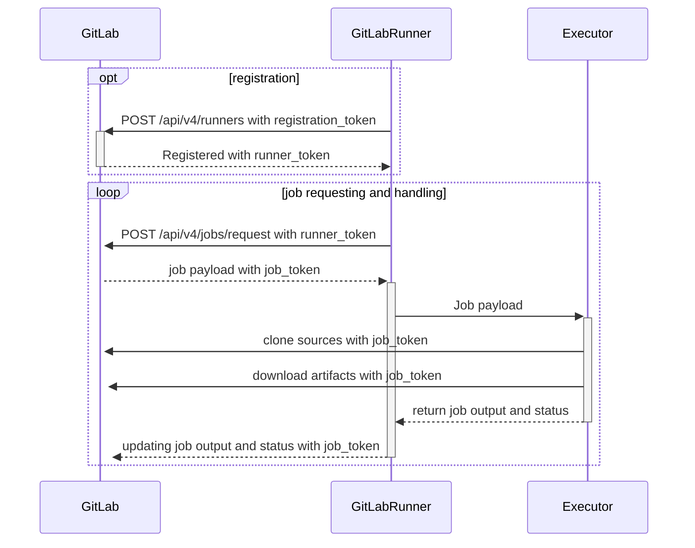



- プラン: Free、Premium、Ultimate
- 提供形態: GitLab.com、GitLab Self-Managed、GitLab Dedicated



GitLab Runnerは、GitLab CI/CDと連携してパイプラインでジョブを実行するアプリケーションです。

## Self-Managed Runnerを使用する {#use-self-managed-runners}



- プラン: Free、Premium、Ultimate
- 提供形態: GitLab.com、GitLab Self-Managed、GitLab Dedicated



Self-Managed Runnerは、各自のインフラストラクチャでインストール、設定および管理するGitLab Runnerインスタンスです。すべてのGitLabインストールでSelf-Managed Runnerを[インストール](install/_index.md)して登録できます。

GitLabがホストおよび管理する[GitLab-hosted Runner](https://docs.gitlab.com/ci/runners/)とは異なり、Self-Managed Runnerは完全に制御できます。

### Terraformを使用してRunnerフリートを作成および管理する {#use-terraform-to-create-and-manage-a-fleet-of-runners}

一般的なRunner設定の多くは、[GitLab Runner Infrastructure Toolkit（GRIT）](https://gitlab.com/gitlab-org/ci-cd/runner-tools/grit)を使用して作成および管理できます。GRITは、パブリッククラウドプロバイダーで多くの一般的なRunner設定を作成、管理するために使用されるTerraformモジュールのライブラリです。GRITは、Runnerチームによって作成、保持されます。

### Runnerフリートをスケールする {#scale-a-fleet-of-runners}

組織がRunnerフリートを運用するほどにスケールした場合は、[多数のRunnerのパフォーマンスをモニタリングおよび調整する方法を計画](fleet_scaling/_index.md)する必要があります

### GitLab Runnerのバージョン {#gitlab-runner-versions}

互換性の理由から、GitLab Runnerの[major.minor](https://en.wikipedia.org/wiki/Software_versioning)（メジャー.マイナー）バージョンは、GitLabのメジャーバージョンおよびマイナーバージョンと同期している必要があります。古いバージョンのRunnerが、新しいGitLabバージョンでも動作する可能性があります（またはその逆でも動作する可能性があります）。ただし、バージョンが異なる場合、一部の機能が利用できなかったり、正常に動作しなかったりする可能性があります。

マイナーバージョンの更新間では、下位互換性が保証されています。ただし、GitLabのマイナーバージョンアップデートで新機能が追加されると、その機能を利用するにはGitLab Runnerも同じマイナーバージョンにアップデートしなければならない場合もあります。

独自のRunnerをホストしながらGitLab.comでリポジトリをホストしている場合は、GitLab.comが[継続的に更新される](https://gitlab.com/gitlab-org/release/tasks/-/issues)ため、常にGitLab Runnerを最新バージョンに[更新](install/_index.md)してください。

### Runnerの登録 {#runner-registration}

アプリケーションをインストールした後、個々のRunnerを[**登録**](register/_index.md)します。Runnerは、GitLabからのCI/CDジョブを実行するエージェントです。

Runnerを登録するときに、GitLabインスタンスとGitLab Runnerがインストールされているマシンの間の通信をセットアップします。

通常、RunnerはGitLab Runnerをインストールしたマシンでジョブを処理します。ただし、コンテナ内、Kubernetesクラスター内、またはクラウド上のオートスケールインスタンスでジョブを処理するようにRunnerを設定することも可能です。

### executor {#executors}

Runnerを登録する際には、executorを選択する必要があります。

[**executor**](executors/_index.md)は、各ジョブが実行される環境を決定します。

次に例を示します。

- CI/CDジョブでPowerShellコマンドを実行したい場合は、WindowsサーバーにGitLab Runnerをインストールし、Shell executorを使用するRunnerを登録します。
- CI/CDジョブで、カスタムDockerコンテナにおいてコマンドを実行したい場合は、LinuxサーバーにGitLab Runnerをインストールし、Docker executorを使用するRunnerを登録します。

これらは、利用可能な設定の一部です。仮想マシンにGitLab Runnerをインストールし、別の仮想マシンをexecutorとして使用することもできます。

DockerコンテナにGitLab Runnerをインストールし、ジョブの実行に[Docker executor](https://docs.gitlab.com/ci/docker/using_docker_images/)を選択する場合、これは「Docker-in-Docker」設定と呼ばれることがあります。

### GitLab UIでRunnerにアクセスできるユーザー {#who-has-access-to-runners-in-the-gitlab-ui}

Runnerを登録する前に、GitLabのすべてのユーザーがRunnerにアクセスできるようにするか、特定のGitLabグループまたはプロジェクトに制限するかを決定する必要があります。

Runnerは、アクセス権限の範囲によって次の3種類に分けられます。

- [インスタンスRunner](https://docs.gitlab.com/ci/runners/runners_scope/#instance-runners)は、すべてのプロジェクトから利用可能
- [グループRunner](https://docs.gitlab.com/ci/runners/runners_scope/#group-runners)は、特定のグループとそのサブグループ内のプロジェクトのみで共有
- [プロジェクトRunner](https://docs.gitlab.com/ci/runners/runners_scope/#project-runners)は、単一の特定プロジェクトだけで使用

Runnerのスコープは、登録時に定義されます。これにより、Runnerがどのプロジェクトで利用可能かを認識することができます。

### タグ {#tags}

Runnerを登録するときに、[タグ](https://docs.gitlab.com/ci/yaml/#tags)をRunnerに追加できます。

CI/CDジョブは、割り当てられたタグを確認して、どのRunnerを使用するかを判断します。タグは、ジョブで利用可能なRunnerのリストをフィルタリングする唯一の方法です。

たとえば、Runnerに`ruby`タグが付いている場合は、次のコードをプロジェクトの`.gitlab-ci.yml`ファイルに追加します。

```yaml
job:
  tags:
    - ruby
```

ジョブは実行時に、`ruby`タグが付いているRunnerを使用します。

### Runnerの設定 {#configuring-runners}

Runnerを[**設定**](configuration/advanced-configuration.md)するには、`config.toml`ファイルを編集します。このファイルは、Runnerのインストールプロセスで作成されます。

このファイルでは、特定のRunnerの設定、またはすべてのRunnerの設定を編集できます。

ログ生成やキャッシュなどの設定を指定できます。また、並行処理、メモリ、CPU制限など、さまざまな項目を設定することが可能です。

### Runnerのモニタリング {#monitoring-runners}

Prometheusを使用してRunnerを[**モニタリング**](monitoring/_index.md)できます。現在実行中のジョブの数や、Runnerが使用しているCPUリソースなど、さまざまな情報を確認できます。

### Runnerを使用してジョブを実行する {#use-a-runner-to-run-jobs}

Runnerが設定され、プロジェクトで利用可能になると、[CI/CDジョブ](https://docs.gitlab.com/ci/jobs/)でそのRunnerを使用できるようになります。

## 機能 {#features}

GitLab Runnerには次の機能があります。

- 複数のジョブを同時に実行する。
- 複数のサーバーで複数のトークンを使用する（プロジェクトごとにも可能）。
- トークンあたりの同時実行ジョブの数を制限する。
- ジョブを次のいずれかの方法で実行する。
  - ローカル環境での実行
  - Dockerコンテナを使用する
  - Dockerコンテナを使用し、SSH経由でジョブを実行する
  - 各種クラウドや仮想マシンハイパーバイザーでオートスケールとDockerコンテナを使用する
  - リモートSSHサーバーに接続する
- Go言語で記述され、他の要件のない単一バイナリとして配布される。
- Bash、PowerShell Core、およびWindows PowerShellをサポートする。
- GNU/Linux、macOS、およびWindows（Dockerを実行できる環境）で動作する。
- ジョブ実行環境のカスタマイズが可能。
- 再起動なしで設定を自動的に再読み込みする。
- Docker、Docker-SSH、Parallels、SSHなどの実行環境に対応した使いやすいセットアップ。
- Dockerコンテナのキャッシュを有効にする。
- GNU/Linux、macOS、およびWindowsでサービスとして簡単にインストール可能。
- PrometheusメトリクスHTTPサーバーを搭載。
- Prometheusメトリクスやその他のジョブ固有のデータをモニタリングし、GitLabに送信するレフェリーワーカー機能。

## Runnerの実行フロー {#runner-execution-flow}

次の図は、Runnerが登録される仕組みと、ジョブがリクエストおよび処理される仕組みを示しています。また、どのアクションが[登録トークン、認証トークン](https://docs.gitlab.com/api/runners/#registration-and-authentication-tokens)、[ジョブトークン](https://docs.gitlab.com/ci/jobs/ci_job_token/)を使用するかも示しています。



## 用語集 {#glossary}

この用語集には、GitLab Runnerに関連する用語の定義が記載されています。

- **GitLab Runner**: ターゲットコンピューティングプラットフォームでGitLab CIジョブを実行するためにインストールするアプリケーション。
- **Runnerの設定**: UIに**Runner**として表示される`config.toml`の単一`[[runner]]`エントリ。
- **Runnerマネージャー**: `config.toml`を読み取り、すべてのRunner設定を同時に実行するプロセス。
- **Runner**: 選択されたマシンでジョブを実行するプロセス。executorのタイプに応じて、このマシンはRunnerマネージャーのローカル（`shell` executorまたは`docker` executor）であるか、またはオートスケーラーによって作成されたリモートマシン（`docker-autoscaler`または`kubernetes`）になります。
- **マシン**: Runnerが動作する仮想マシン（VM）またはポッド。GitLab Runnerは、一意の永続的なマシンIDを自動的に生成します。このため、複数のマシンに同じRunner設定が指定されている場合でも、ジョブは個別にルーティングされますが、Runner設定はUIでグループ化されます。

公式の[GitLab用語リスト](https://docs.gitlab.com/development/documentation/styleguide/word_list/#gitlab-runner)と、[GitLab Runner](https://docs.gitlab.com/development/architecture/#gitlab-runner)のGitLabアーキテクチャの項目も参照してください。

## トラブルシューティング {#troubleshooting}

一般的な問題を[解決する](faq/_index.md)方法について説明します。

## コントリビュート {#contributing}

コントリビュートを歓迎します。詳細については、[`CONTRIBUTING.md`](https://gitlab.com/gitlab-org/gitlab-runner/blob/main/CONTRIBUTING.md)と[開発ドキュメント](development/_index.md)を参照してください。

GitLab Runnerプロジェクトのレビュアーの方は、[GitLab Runnerのレビュー](development/reviewing-gitlab-runner.md)に関するドキュメントをお読みください。

[GitLab Runnerプロジェクトのリリースプロセス](https://gitlab.com/gitlab-org/gitlab-runner/blob/main/PROCESS.md)を確認することもできます。

## 変更履歴 {#changelog}

最近の変更を確認するには、[CHANGELOG](https://gitlab.com/gitlab-org/gitlab-runner/blob/main/CHANGELOG.md)（変更履歴）を参照してください。

## ライセンス {#license}

このコードは、MITライセンスに従って配布されます。[LICENSE](https://gitlab.com/gitlab-org/gitlab-runner/blob/main/LICENSE)（ライセンス）ファイルをご確認ください。
