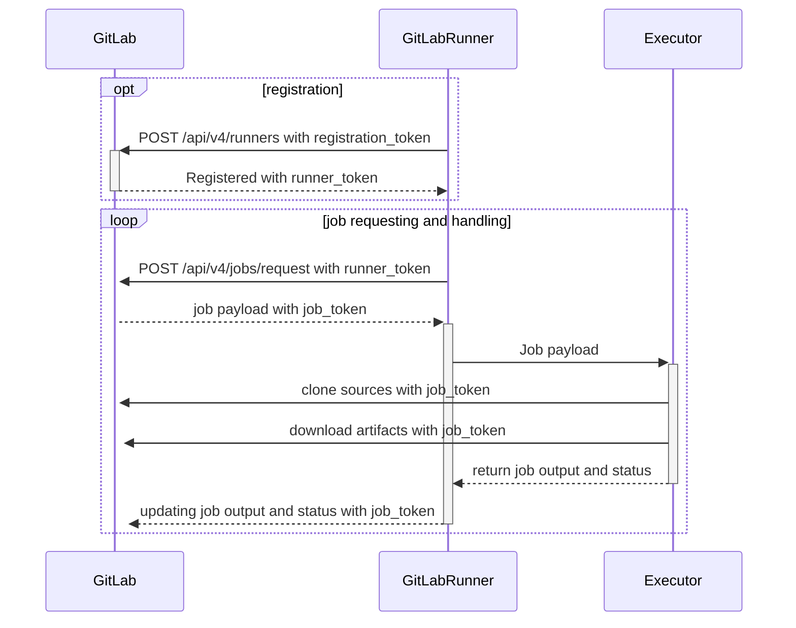



- プラン: Free、Premium、Ultimate
- 提供形態: GitLab.com、GitLab Self-Managed、GitLab Dedicated



GitLab Runnerは、GitLab CI/CDと連携してパイプラインでジョブを実行するアプリケーションです。

開発者はGitLabにコードをプッシュするときに、自動化されたタスクを`.gitlab-ci.yml`ファイルで定義できます。これらのタスクには、テストの実行、アプリケーションのビルド、コードのデプロイなどが含まれる場合があります。GitLab Runnerは、これらのタスクをコンピューティングインフラストラクチャ上で実行するアプリケーションです。

管理者として、これらのCI/CDジョブが実行されるインフラストラクチャの提供と管理を行う責任があります。これには、GitLab Runnerアプリケーションのインストール、それらの設定、組織のCI/CDワークロードを処理するための十分な容量の確保が含まれます。

## GitLab Runnerの機能 {#what-gitlab-runner-does}

GitLab Runnerは、GitLabインスタンスに接続し、CI/CDジョブを待機します。パイプラインが実行されると、GitLabは利用可能なrunnerにジョブを送信します。runnerはジョブを実行し、その結果をGitLabに報告します。

GitLab Runnerには次の機能があります。

- 複数のジョブを同時に実行する。
- 複数のサーバーで複数のトークンを使用する（プロジェクトごとにも可能）。
- トークンあたりの同時実行ジョブの数を制限する。
- ジョブを次のいずれかの方法で実行する:
  - ローカル環境での実行
  - Dockerコンテナを使用する
  - Dockerコンテナを使用し、SSH経由でジョブを実行する
  - 各種クラウドや仮想マシンハイパーバイザーでオートスケールとDockerコンテナを使用する
  - リモートSSHサーバーに接続する
- Go言語で記述され、他の要件のない単一バイナリとして配布される。
- Bash、PowerShell Core、およびWindows PowerShellをサポートする。
- GNU/Linux、macOS、およびWindows（Dockerを実行できる環境）で動作する。
- ジョブ実行環境のカスタマイズが可能。
- 再起動なしで設定を自動的に再読み込みする。
- Docker、Docker-SSH、Parallels、SSHなどの実行環境に対応したシームレスなセットアップ。
- Dockerコンテナのキャッシュを有効にする。
- GNU/Linux、macOS、およびWindowsで、サービスとしてシームレスにインストールできます。
- PrometheusメトリクスHTTPサーバーを搭載。
- Prometheusメトリクスやその他のジョブ固有のデータをモニタリングし、GitLabに送信するレフェリーワーカー機能。

## Runnerの実行フロー {#runner-execution-flow}

次の図は、Runnerが登録される仕組みと、ジョブがリクエストおよび処理される仕組みを示しています。また、どのアクションが[登録トークンと認証トークン](https://docs.gitlab.com/api/runners/#registration-and-authentication-tokens) 、および[ジョブトークン](https://docs.gitlab.com/ci/jobs/ci_job_token/)を使用するかについても説明します。

## Runnerのデプロイオプション {#runner-deployment-options}

### GitLabでホストされるRunner {#gitlab-hosted-runners}

[GitLabがホストするrunner](https://docs.gitlab.com/ci/runners/)はGitLabによって管理され、GitLab.comで利用可能です。これらのrunnerをインストールまたはメンテナンスする必要はありません。GitLabがサービスとして提供します。ただし、実行環境に対する制御は制限されており、インフラストラクチャをカスタマイズすることはできません。

### Self-Managed Runner {#self-managed-runners}

Self-Managed Runnerは、各自のインフラストラクチャでインストール、設定および管理するGitLab Runnerインスタンスです。すべてのGitLabインストールでSelf-Managed Runnerを[インストール](install/_index.md)して登録できます。管理者は通常、自己管理runnerを使用します。

GitLabがホストおよび管理するGitLab-hosted Runnerとは異なり、セルフマネージドRunnerは完全に制御できます。

## GitLab Runnerのバージョン {#gitlab-runner-versions}

互換性の理由から、GitLab Runnerの[major.minor](https://en.wikipedia.org/wiki/Software_versioning)バージョンは、GitLabのメジャーバージョンおよびマイナーバージョンと同期している必要があります。古いバージョンのRunnerが、新しいGitLabバージョンでも動作する可能性があります（またはその逆でも動作する可能性があります）。ただし、バージョンが異なる場合、一部の機能が利用できなかったり、正常に動作しなかったりする可能性があります。

マイナーバージョンの更新間では、下位互換性が保証されています。ただし、GitLabのマイナーバージョンアップデートで新機能が追加されると、その機能を利用するにはGitLab Runnerも同じマイナーバージョンにアップデートしなければならない場合もあります。

独自のRunnerをホストしながらGitLab.comでリポジトリをホストしている場合は、GitLab.comが[継続的に更新される](https://gitlab.com/gitlab-org/release/tasks/-/issues)ため、常にGitLab Runnerを最新バージョンに[更新](install/_index.md)してください。

## トラブルシューティング {#troubleshooting}

一般的な問題を[解決する](faq/_index.md)方法について説明します。

## 用語集 {#glossary}

- **GitLab Runner**: ターゲットコンピューティングプラットフォームで、GitLabパイプラインからCI/CDジョブを実行するアプリケーション。
- **Runner**: ジョブを実行できる、GitLab Runnerの設定済みインスタンス。executorのタイプに応じて、このマシンはRunnerマネージャーのローカル（`shell` executorまたは`docker` executor）であるか、またはオートスケーラーによって作成されたリモートマシン（`docker-autoscaler`または`kubernetes`）になります。
- **Runner設定**: UIに**Runner**として表示される`config.toml`の単一`[[runner]]`エントリ。
- **Runner manager**（Runnerマネージャー）: `config.toml`ファイルを読み取り、すべてのrunner設定とジョブ実行を同時に実行するプロセス。
- **Machine**（マシン）: Runnerが動作する仮想マシン（VM）またはポッド。GitLab Runnerは、一意の永続的なマシンIDを自動的に生成します。このため、複数のマシンに同じRunner設定が指定されている場合でも、ジョブは個別にルーティングされますが、Runner設定はUIでグループ化されます。
- **Executor**: GitLab Runnerがジョブを実行するために使用する方法（Docker、シェル、Kubernetesなど）。
- **パイプライン**: がGitLabにプッシュされると自動的に実行されるジョブのコレクション。
- **ジョブ**: パイプライン内の単一のタスク。テストの実行やアプリケーションのビルドなど。
- **Runner token**（Runnerトークン）: runnerがGitLabで認証できるようにする一意の識別子。
- **タグ**: 実行できるジョブを決定するrunnerに割り当てられたラベル。
- **Concurrent jobs**（同時ジョブ）: runnerが同時に実行できるジョブの数。
- **Self-managed runner**（セルフマネージドRunner）: 独自のインフラストラクチャにインストールおよび管理されるrunner。
- **GitLab-hosted runner**（GitLabホスト型Runner）: GitLabによって提供および管理されるrunner。

詳細については、公式の[GitLab用語リスト](https://docs.gitlab.com/development/documentation/styleguide/word_list/#gitlab-runner)と、[GitLab Runner](https://docs.gitlab.com/development/architecture/#gitlab-runner)のGitLabアーキテクチャのエントリも参照してください。

## コントリビュート {#contributing}

コントリビュートを歓迎します。詳細については、[`CONTRIBUTING.md`](https://gitlab.com/gitlab-org/gitlab-runner/blob/main/CONTRIBUTING.md)と[開発ドキュメント](development/_index.md)を参照してください。

GitLab Runnerプロジェクトのレビュアーの方は、[GitLab Runnerのレビュー](development/reviewing-gitlab-runner.md)に関するドキュメントをお読みください。

[GitLab Runnerプロジェクトのリリースプロセス](https://gitlab.com/gitlab-org/gitlab-runner/blob/main/PROCESS.md)を確認することもできます。

## 変更履歴 {#changelog}

最近の変更を確認するには、[CHANGELOG](https://gitlab.com/gitlab-org/gitlab-runner/blob/main/CHANGELOG.md)を参照してください。

## ライセンス {#license}

このコードは、MITライセンスに従って配布されます。[LICENSE](https://gitlab.com/gitlab-org/gitlab-runner/blob/main/LICENSE)ファイルをご確認ください。
