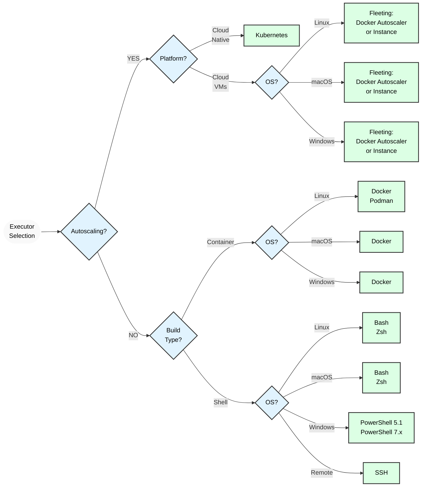



- プラン: Free、Premium、Ultimate
- 提供形態: GitLab.com、GitLab Self-Managed、GitLab Dedicated



GitLab Runnerはさまざまなexecutorを実装しています。これらのexecutorは、さまざまな環境でビルドを実行するために使用できます。

どのexecutorを選択すればよいかわからない場合は、[executorを選択する](#selecting-the-executor)を参照してください。

各executorでサポートされている機能の詳細については、[互換性チャート](#compatibility-chart)を参照してください。

GitLab Runnerは次のexecutorを提供します。

- [SSH](ssh.md)
- [Shell](shell.md)
- [Parallels](parallels.md)
- [VirtualBox](virtualbox.md)
- [Docker](docker.md)
- [Docker Autoscaler](docker_autoscaler.md)
- [Docker Machine（オートスケーリング）](docker_machine.md)
- [Kubernetes](kubernetes/_index.md)
- [インスタンス](instance.md)
- [カスタム](custom.md)

これらのexecutorはロックされており、新規のexecutorの開発や受け入れは行っていません。詳細については、[新しいexecutorのコントリビュート](https://gitlab.com/gitlab-org/gitlab-runner/blob/main/CONTRIBUTING.md#contributing-new-executors)を参照してください。

## Docker以外のexecutorの前提条件 {#prerequisites-for-non-docker-executors}

[ヘルパーイメージに依存しない](../configuration/advanced-configuration.md#helper-image)executorでは、ターゲットマシンと`PATH`にGitがインストールされている必要があります。常に[利用可能な最新バージョンのGit](https://git-scm.com/downloads/)を使用してください。

ターゲットマシンに[Git LFS](https://git-lfs.com/)がインストールされている場合、GitLab Runnerは`git lfs`コマンドを使用します。GitLab Runnerがこれらのexecutorを使用するすべてのシステムで、Git LFSが最新であることを確認してください。

`git lfs install`を使用して、GitLab Runnerコマンドを実行するユーザーに対してGit LFSを初期化してください。システム全体でGit LFSを初期化するには、`git lfs install --system`を使用します。

GitLabインスタンスとのGitインタラクションを認証するため、GitLab Runnerでは[`CI_JOB_TOKEN`](https://docs.gitlab.com/ci/jobs/ci_job_token/)を使用します。[FF_GIT_URLS_WITHOUT_TOKENS](../configuration/feature-flags.md)の設定によっては、Git認証情報のヘルパー（[Git認証情報マネージャー](https://github.com/git-ecosystem/git-credential-manager)など）がインストールされていて、認証情報をキャッシュに入れるように設定されている場合、最後に使用された認証情報がそのヘルパーのキャッシュに入れられることがあります。

- [FF_GIT_URLS_WITHOUT_TOKENS](../configuration/feature-flags.md)が`false`なら、最後に使用された[`CI_JOB_TOKEN`](https://docs.gitlab.com/ci/jobs/ci_job_token/)が、インストール済みのGit認証情報ヘルパーに保存されます。
- [FF_GIT_URLS_WITHOUT_TOKENS](../configuration/feature-flags.md)が`true`なら、[`CI_JOB_TOKEN`](https://docs.gitlab.com/ci/jobs/ci_job_token/)は、インストール済みのGit認証情報ヘルパーに保存されず、そのキャッシュに入れられることもありません。

## executorを選択する {#selecting-the-executor}

executorは、プロジェクトをビルドするためのさまざまなプラットフォームと開発手法をサポートしています。次の表に、使用するexecutorを決定する際に役立つ各executorの重要な情報を示します。

| executor                                         | SSH  |     Shell      |   VirtualBox   |   Parallels    | Docker | Docker Autoscaler |                 インスタンス |   Kubernetes   |          カスタム          |
|:-------------------------------------------------|:----:|:--------------:|:--------------:|:--------------:|:------:|:-----------------:|-------------------------:|:--------------:|:------------------------:|
| すべてのビルドのためのクリーンなビルド環境          |  ✗   |       ✗        |       ✓        |       ✓        |   ✓    |         ✓         | 条件付き4 |       ✓        | 条件付き4 |
| 存在する場合は、以前のクローンを再利用する                |  ✓   |       ✓        |       ✗        |       ✗        |   ✓    |         ✓         | 条件付き4 | ✓ 6 | 条件付き4 |
| Runnerファイルシステムへのアクセスが保護されている5 |  ✓   |       ✗        |       ✓        |       ✓        |   ✓    |         ✓         |                        ✗ |       ✓        |       条件付き        |
| Runnerマシンを移行する                           |  ✗   |       ✗        |    部分的     |    部分的     |   ✓    |         ✓         |                        ✓ |       ✓        |            ✓             |
| 同時ビルドのゼロ設定サポート |  ✗   | ✗ 1 |       ✓        |       ✓        |   ✓    |         ✓         |                        ✓ |       ✓        | 条件付き4 |
| 複雑なビルド環境                   |  ✗   | ✗ 2 | ✓ 3 | ✓ 3 |   ✓    |         ✓         |           ✗ 2 |       ✓        |            ✓             |
| ビルドの問題のデバッグ                         | 簡単 |      簡単      |      難しい      |      難しい      | 普通 |      普通       |                   普通 |     普通     |          普通          |

**補足説明**:

1. ビルドマシンにインストールされているサービスをビルドで使用する場合、executorを選択できますが、問題があります。
1. 依存関係を手動でインストールする必要があります。
1. たとえば、[Vagrant](https://developer.hashicorp.com/vagrant/docs/providers/virtualbox "VirtualBoxのVagrantドキュメント")を使用します。
1. プロビジョニングする環境によって異なります。完全に分離することも、ビルド間で共有することもできます。
1. Runnerのファイルシステムアクセスが保護されていない場合、ジョブはRunnerのトークンや他のジョブのキャッシュとコードなど、システム全体にアクセスできます。✓が付いているexecutorは、デフォルトではRunnerがファイルシステムにアクセスすることを許可していません。ただし、セキュリティ上の欠陥または特定の設定により、ジョブがコンテナからブレイクアウトし、Runnerをホスティングしているファイルシステムにアクセスする可能性があります。
1. [並行処理ごとの永続ビルドボリューム](kubernetes/_index.md#persistent-per-concurrency-build-volumes)設定が必要です。

### Shell executor {#shell-executor}

Shell executorは、GitLab Runnerの最もシンプルな設定オプションです。GitLab Runnerがインストールされているシステムでジョブをローカルに実行し、すべての依存関係を同じマシンに手動でインストールする必要があります。

このexecutorは、Linux、macOS、およびFreeBSDオペレーティングシステムではBashをサポートし、Windows環境ではPowerShellをサポートしています。

最小限の依存関係を持つビルドにとって理想的ですが、ジョブ間の分離は限定的です。

### Docker executor {#docker-executor}

Docker executorは、コンテナを介してクリーンなビルド環境を提供します。すべての依存関係がDockerイメージにパッケージ化されているため、依存関係を容易に管理できます。このexecutorを使用するには、RunnerホストにDockerがインストールされている必要があります。

このexecutorは、MySQLなどの追加の[サービス](https://docs.gitlab.com/ci/services/)をサポートしています。また、Podmanを代替コンテナランタイムとして受け入れます。

このexecutorは、一貫性のある分離されたビルド環境を保持します。

### Docker Machine Executor（非推奨） {#docker-machine-executor-deprecated}



この機能はGitLab 17.5で[非推奨](https://gitlab.com/gitlab-org/gitlab/-/issues/498268)になりました。20.0で削除される予定です。代わりに[GitLab Runner Autoscaler](../runner_autoscale/_index.md)を使用してください。



Docker Machine Executorは、オートスケーリングに対応しているDocker executorの特別なバージョンです。標準的なDocker executorと同様に動作しますが、Docker Machineによってオンデマンドで作成されたビルドホストを使用します。この機能により、このexecutorはAWS EC2などのクラウド環境で特に効果的であり、さまざまなワークロードに対して優れた分離性とスケーラビリティを提供します。

### Docker Autoscaler executor {#docker-autoscaler-executor}

Docker Autoscaler executorは、Runnerマネージャーが処理するジョブに対処するために、オンデマンドでインスタンスを作成するオートスケール対応のDocker executorです。[Docker executor](docker.md)をラップしているため、すべてのDocker executorのオプションと機能がサポートされています。

Docker Autoscalerは、[フリートプラグイン](https://gitlab.com/gitlab-org/fleeting/fleeting)を使用してオートスケールします。フリートとは、オートスケールされたインスタンスのグループの抽象化であり、Google Cloud、AWS、Azureなどのクラウドプロバイダーをサポートするプラグインを使用します。このexecutorは、動的なワークロードの要件がある環境に特に適しています。

### インスタンスexecutor {#instance-executor}

インスタンスexecutorは、Runnerマネージャーが処理するジョブの予期されるボリュームに対処するために、オンデマンドでインスタンスを作成するオートスケール対応のexecutorです。

このexecutorと、関連するDocker Autoscale executorは、GitLab RunnerフリートおよびTaskscalerテクノロジーと連携する新しいオートスケールexecutorです。

インスタンスexecutorも[フリートプラグイン](https://gitlab.com/gitlab-org/fleeting/fleeting)を使用してオートスケールします。

ジョブがホストインスタンス、オペレーティングシステム、および接続デバイスへのフルアクセスを必要とする場合は、インスタンスexecutorを使用できます。インスタンスexecutorは、シングルテナントジョブとマルチテナントジョブに対応するように設定することもできます。

### Kubernetes executor {#kubernetes-executor}

ビルドに既存のKubernetesクラスターを使用する場合にKubernetes executorを使用できます。このexecutorはKubernetesクラスターAPIを呼び出して、各GitLab CI/CDジョブの新しいポッド（ビルドコンテナとサービスコンテナを含む）を作成します。このexecutorは、クラウドネイティブ環境に特に適しており、優れたスケーラビリティとリソース利用率を実現します。

### SSH executor {#ssh-executor}

SSH executorは完全性を期すために追加されましたが、サポートが最も少ないexecutorの1つです。SSH executorを使用すると、GitLab Runnerは外部サーバーに接続し、そこでビルドを実行します。このexecutorを使用している組織からの成功事例がいくつかありますが、通常は他のタイプのexecutorを使用してください。

### カスタムexecutor {#custom-executor}

カスタムexecutorを使用すると、独自の実行環境を指定できます。GitLab Runnerがexecutor（Linuxコンテナなど）を提供しない場合、カスタムの実行可能ファイルを使用して環境をプロビジョニングおよびクリーンアップできます。

## 互換性チャート {#compatibility-chart}

各種executorでサポートされている機能を以下に示します。

| executor                                     | SSH            | Shell          | VirtualBox     | Parallels      | Docker  | Docker Autoscaler | インスタンス       | Kubernetes | カスタム                                                       |
|:---------------------------------------------|:--------------:|:--------------:|:--------------:|:--------------:|:-------:|:-----------------:|:--------------:| :---------:| :-----------------------------------------------------------:|
| セキュア変数                             | ✓              | ✓              | ✓              | ✓              | ✓       | ✓                 | ✓              | ✓          | ✓                                                           |
| `.gitlab-ci.yml`: イメージ                      | ✗              | ✗              | ✓（1）          | ✓（1）          | ✓       | ✓                 | ✗              | ✓          | ✓（[`$CUSTOM_ENV_CI_JOB_IMAGE`](custom.md#stages)を使用） |
| `.gitlab-ci.yml`: サービス                   | ✗              | ✗              | ✗              | ✗              | ✓       | ✓                 | ✗              | ✓          | ✓      |
| `.gitlab-ci.yml`: キャッシュ                      | ✓              | ✓              | ✓              | ✓              | ✓       | ✓                 | ✓              | ✓          | ✓      |
| `.gitlab-ci.yml`: アーティファクト                  | ✓              | ✓              | ✓              | ✓              | ✓       | ✓                 | ✓              | ✓          | ✓      |
| ステージ間のアーティファクトの受け渡し             | ✓              | ✓              | ✓              | ✓              | ✓       | ✓                 | ✓              | ✓          | ✓      |
| GitLabコンテナレジストリのプライベートイメージを使用する | 該当なし | 該当なし | 該当なし | 該当なし | ✓       | ✓                 | 該当なし | ✓          | 該当なし |
| インタラクティブWebターミナル                     | ✗              | ✓（UNIX）       | ✗              | ✗              | ✓       | ✗                 | ✗              | ✓          | ✗              |

1. GitLab Runner 14.2でサポートが[追加](https://gitlab.com/gitlab-org/gitlab-runner/-/merge_requests/1257)されました。詳細については、[ベースVMイメージの上書き](../configuration/advanced-configuration.md#overriding-the-base-vm-image)セクションを参照してください。

各種Shellでサポートされているシステムを以下に示します。

| Shell  | Bash        | PowerShell Desktop | PowerShell Core | Windows Batch（非推奨） |
|:-------:|:-----------:|:------------------:|:---------------:|:--------------------------:|
| Windows | ✗（4）       | ✓（3）              | ✓               | ✓（2）                      |
| Linux   | ✓（1）       | ✗                  | ✓               | ✗                          |
| macOS   | ✓（1）       | ✗                  | ✓               | ✗                          |
| FreeBSD | ✓（1）       | ✗                  | ✗               | ✗                          |

1. デフォルトのShell。
1. 非推奨。[`shell`](../configuration/advanced-configuration.md#the-runners-section)が指定されていない場合のデフォルトのShell。
1. 新しいRunnerの登録時のデフォルトのShell。
1. WindowsのBash Shellはサポートされていません。

各種ShellによりサポートされているインタラクティブWebターミナルのシステムを以下に示します。

| Shell  | Bash        | PowerShell Desktop    | PowerShell Core    | Windows Batch（非推奨） |
|:-------:|:-----------:|:---------------------:|:------------------:|:--------------------------:|
| Windows | ✗           | ✗                     | ✗                  | ✗                          |
| Linux   | ✓           | ✗                     | ✗                  | ✗                          |
| macOS   | ✓           | ✗                     | ✗                  | ✗                          |
| FreeBSD | ✓           | ✗                     | ✗                  | ✗                          |

