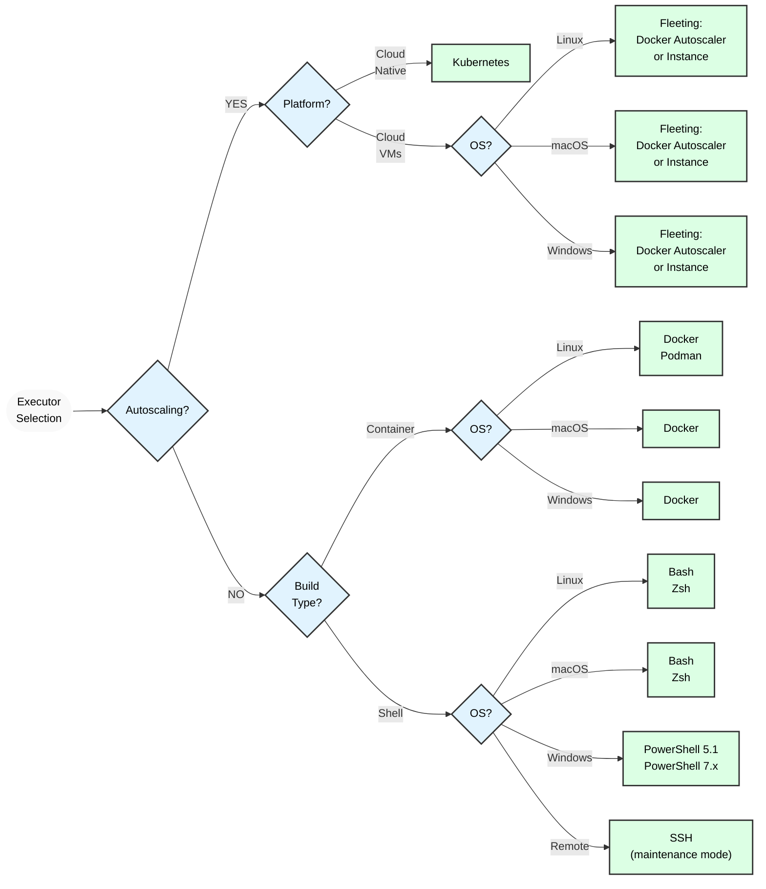



- プラン: Free、Premium、Ultimate
- 提供形態: GitLab.com、GitLab Self-Managed、GitLab Dedicated



GitLab Runnerは、さまざまな環境でビルドを実行するために使用できる異なるexecutorを実装しています:

- [Kubernetes](kubernetes/_index.md)
- [Docker](docker.md)
- [Docker Autoscaler](docker_autoscaler.md)
- [インスタンス](instance.md)

アクティブな機能開発の下にない[他のexecutor](#executors-in-maintenance-mode)が利用可能です。これらは重要なセキュリティアップデートは受け取りますが、新機能は受け取りません。

> [!note]
> 一部の機能では、[fleeting](../fleet_scaling/fleeting.md)を使用するRunnerが必要です。Docker Autoscalerとインスタンスのexecutorは、fleetingを使用します。GitLab Runnerの全機能を活用するには、これらのexecutorのいずれかに移行する必要があります。

どのexecutorを選択すべきか不明な場合は、[selecting the executor](#selecting-the-executor)を参照してください。

各executorでサポートされている機能の詳細については、[互換性チャート](#compatibility-chart)を参照してください。

これらのexecutorはロックされており、新規のexecutorの開発や受け入れは行っていません。詳細については、[contributing new executors](https://gitlab.com/gitlab-org/gitlab-runner/blob/main/CONTRIBUTING.md#contributing-new-executors)を参照してください。

## executorを選択する {#selecting-the-executor}

executorは、プロジェクトをビルドするためのさまざまなプラットフォームと開発手法をサポートしています。次の図は、オペレーティングシステムとプラットフォームに基づいてどのexecutorを選択すべきかを示しています。

```mermaid
flowchart LR
    Start([Executor<br/>Selection]) --> Auto{Autoscaling?}

    Auto -->|YES| Platform{Platform?}
    Auto -->|NO| BuildType{Build<br/>Type?}

    Platform -->|Cloud<br/>Native| K8s[Kubernetes]
    Platform -->|Cloud<br/>VMs| OS1{OS?}

    OS1 -->|Linux| L1[Fleeting:<br/>Docker Autoscaler<br/>or Instance]
    OS1 -->|macOS| M1[Fleeting:<br/>Docker Autoscaler<br/>or Instance]
    OS1 -->|Windows| W1[Fleeting:<br/>Docker Autoscaler<br/>or Instance]

    BuildType -->|Container| OS2{OS?}
    BuildType -->|Shell| OS3{OS?}

    OS2 -->|Linux| L2[Docker<br/>Podman]
    OS2 -->|macOS| M2[Docker]
    OS2 -->|Windows| W2[Docker]

    OS3 -->|Linux| L3[Bash<br/>Zsh]
    OS3 -->|macOS| M3[Bash<br/>Zsh]
    OS3 -->|Windows| W3[PowerShell 5.1<br/>PowerShell 7.x]
    OS3 -->|Remote| R3[SSH<br/>#40;maintenance mode#41;]

    classDef question fill:#e1f3fe,stroke:#333,stroke-width:2px,color:#000
    classDef result fill:#dcffe4,stroke:#333,stroke-width:2px,color:#000
    classDef start fill:#f9f9f9,stroke:#fff,stroke-width:2px,color:#000

    class Start start;
    class Auto,Platform,BuildType,OS1,OS2,OS3 question;
    class K8s,L1,M1,W1,L2,M2,W2,L3,M3,W3,R3 result;
```

> [!warning]
> SSH executorはメンテナンスモードです。重要なセキュリティアップデートは受け取りますが、新しい機能は計画されていません。また、サポートが最も少ないexecutorの1つです。ローカルのShellベースのビルドには、代わりにShell executorの使用を検討してください。

下の表は、各executorのキーとなる事実を示しており、どのexecutorを使用するかを決定するのに役立ちます:

> [!note]
> SSH、Shell、VirtualBox、Parallels、およびCustom executorはメンテナンスモードです。重要なセキュリティアップデートは受け取りますが、新しい機能は計画されていません。

| executor                                         | Docker | Docker Autoscaler |                 インスタンス |   Kubernetes   | SSH  |     Shell      |   VirtualBox   |   Parallels    |          カスタム          |
|:-------------------------------------------------|:------:|:-----------------:|-------------------------:|:--------------:|:----:|:--------------:|:--------------:|:--------------:|:------------------------:|
| すべてのビルドのためのクリーンなビルド環境          |   ✓    |         ✓         | 条件付き1 |       ✓        |  ✗   |       ✗        |       ✓        |       ✓        | 条件付き1 |
| 存在する場合は、以前のクローンを再利用する                |   ✓    |         ✓         | 条件付き1 | ✓ 2 |  ✓   |       ✓        |       ✗        |       ✗        | 条件付き1 |
| Runnerファイルシステムアクセス保護済み3 |   ✓    |         ✓         |                        ✗ |       ✓        |  ✓   |       ✗        |       ✓        |       ✓        |       条件付き        |
| Runnerマシンを移行する                           |   ✓    |         ✓         |                        ✓ |       ✓        |  ✗   |       ✗        |    部分的     |    部分的     |            ✓             |
| 同時ビルドのゼロ設定サポート |   ✓    |         ✓         |                        ✓ |       ✓        |  ✗   | ✗ 4 |       ✓        |       ✓        | 条件付き1 |
| 複雑なビルド環境                   |   ✓    |         ✓         |           ✗ 5 |       ✓        |  ✗   | ✗ 5 | ✓ 6 | ✓ 6 |            ✓             |
| ビルドの問題のデバッグ                         | 普通 |      普通       |                   普通 |     普通     | 簡単 |      簡単      |      難しい      |      難しい      |          普通          |

**補足説明**:

1. プロビジョニングする環境によって異なります。完全に分離することも、ビルド間で共有することもできます。
1. [並行処理ごとの永続ビルドボリューム](kubernetes/_index.md#persistent-per-concurrency-build-volumes)設定が必要です。
1. Runnerのファイルシステムアクセスが保護されていない場合、ジョブはRunnerのトークンや他のジョブのキャッシュとコードなど、システム全体にアクセスできます。✓が付いているexecutorは、デフォルトではRunnerがファイルシステムにアクセスすることを許可していません。ただし、セキュリティ上の欠陥または特定の設定により、ジョブがコンテナからブレイクアウトし、Runnerをホスティングしているファイルシステムにアクセスする可能性があります。
1. ビルドマシンにインストールされているサービスをビルドで使用する場合、executorを選択できますが、問題があります。
1. 依存関係を手動でインストールする必要があります。
1. たとえば、[Vagrant](https://developer.hashicorp.com/vagrant/docs/providers/virtualbox "VirtualBoxのVagrantドキュメント")を使用します。

### Docker executor {#docker-executor}

Docker executorは、コンテナを介してクリーンなビルド環境を提供します。すべての依存関係がDockerイメージにパッケージ化されているため、依存関係を容易に管理できます。このexecutorを使用するには、RunnerホストにDockerがインストールされている必要があります。

このexecutorは、MySQLなどの追加の[サービス](https://docs.gitlab.com/ci/services/)をサポートしています。また、Podmanを代替コンテナランタイムとして受け入れます。

このexecutorは、一貫性のある分離されたビルド環境を保持します。

### Docker Autoscaler executor {#docker-autoscaler-executor}

Docker Autoscaler executorは、Runnerマネージャーが処理するジョブに対処するために、オンデマンドでインスタンスを作成するオートスケール対応のDocker executorです。[Docker executor](docker.md)をラップしているため、すべてのDocker executorのオプションと機能がサポートされています。

Docker Autoscalerは、[フリートプラグイン](https://gitlab.com/gitlab-org/fleeting/fleeting)を使用してオートスケールします。フリートとは、オートスケールされたインスタンスのグループの抽象化であり、Google Cloud、AWS、Azureなどのクラウドプロバイダーをサポートするプラグインを使用します。このexecutorは、動的なワークロードの要件がある環境に特に適しています。

### インスタンスexecutor {#instance-executor}

インスタンスexecutorは、Runnerマネージャーが処理するジョブの予期されるボリュームに対処するために、オンデマンドでインスタンスを作成するオートスケール対応のexecutorです。

このexecutorと、関連するDocker Autoscale executorは、GitLab RunnerフリートおよびTaskscalerテクノロジーと連携する新しいオートスケールexecutorです。

インスタンスexecutorも[フリートプラグイン](https://gitlab.com/gitlab-org/fleeting/fleeting)を使用してオートスケールします。

ジョブがホストインスタンス、オペレーティングシステム、および接続デバイスへのフルアクセスを必要とする場合は、インスタンスexecutorを使用できます。インスタンスexecutorは、シングルテナントジョブとマルチテナントジョブに対応するように設定することもできます。

### Kubernetes executor {#kubernetes-executor}

ビルドに既存のKubernetesクラスターを使用する場合にKubernetes executorを使用できます。このexecutorはKubernetesクラスターAPIを呼び出して、各GitLab CI/CDジョブの新しいポッド（ビルドコンテナとサービスコンテナを含む）を作成します。このexecutorは、クラウドネイティブ環境に特に適しており、優れたスケーラビリティとリソース利用率を実現します。

## メンテナンスモードのexecutor {#executors-in-maintenance-mode}

これらのexecutorは重要なセキュリティアップデートを受け取りますが、新しい機能は計画されていません:

- [SSH](ssh.md)
- [Shell](shell.md)
- [Parallels](parallels.md)
- [VirtualBox](virtualbox.md)
- [カスタム](custom.md)
- [Docker Machine](docker_machine.md)（非推奨）

## 互換性チャート {#compatibility-chart}

異なるexecutorでサポートされる機能。

> [!note]
> SSH、Shell、VirtualBox、Parallels、およびCustom executorはメンテナンスモードです。重要なセキュリティアップデートは受け取りますが、新しい機能は計画されていません。

| executor                                     | Docker | Docker Autoscaler |    インスタンス    | Kubernetes |      SSH       |     Shell      |    VirtualBox    |    Parallels     |                           カスタム                            |
|:---------------------------------------------|:------:|:-----------------:|:--------------:|:----------:|:--------------:|:--------------:|:----------------:|:----------------:|:-----------------------------------------------------------:|
| セキュアな変数                             |   ✓    |         ✓         |       ✓        |     ✓      |       ✓        |       ✓        |        ✓         |        ✓         |                              ✓                              |
| `.gitlab-ci.yml`: イメージ                      |   ✓    |         ✓         |       ✗        |     ✓      |       ✗        |       ✗        | ✓ (1) | ✓ (1) | ✓（[`$CUSTOM_ENV_CI_JOB_IMAGE`](custom.md#stages)を使用） |
| `.gitlab-ci.yml`: サービス                   |   ✓    |         ✓         |       ✗        |     ✓      |       ✗        |       ✗        |        ✗         |        ✗         |                              ✓                              |
| `.gitlab-ci.yml`: キャッシュ                      |   ✓    |         ✓         |       ✓        |     ✓      |       ✓        |       ✓        |        ✓         |        ✓         |                              ✓                              |
| `.gitlab-ci.yml`: アーティファクト                  |   ✓    |         ✓         |       ✓        |     ✓      |       ✓        |       ✓        |        ✓         |        ✓         |                              ✓                              |
| ステージ間のアーティファクトの受け渡し             |   ✓    |         ✓         |       ✓        |     ✓      |       ✓        |       ✓        |        ✓         |        ✓         |                              ✓                              |
| GitLabコンテナレジストリのプライベートイメージを使用する |   ✓    |         ✓         | 該当なし |     ✓      | 該当なし | 該当なし |  該当なし  |  該当なし  |                       該当なし                        |
| インタラクティブWeb端末                     |   ✓    |         ✗         |       ✗        |     ✓      |       ✗        |       ✓        |        ✗         |        ✗         |                              ✗                              |

**補足説明**:

1. GitLab Runner 14.2でサポートが[追加](https://gitlab.com/gitlab-org/gitlab-runner/-/merge_requests/1257)されました。詳細については、[ベースVMイメージの上書き](../configuration/advanced-configuration.md#overriding-the-base-vm-image)セクションを参照してください。

各種Shellでサポートされているシステムを以下に示します:

| Shell   |      Bash      | PowerShell Desktop  | PowerShell Core   |  sh  |
| :------: | :------------: | :-----------------: | :---------------: | :--: |
| Linux    | ✓ 1 |         ✗           |        ✓          |  ✓   |
| macOS    | ✓ 1 |         ✗           |        ✓          |  ✓   |
| FreeBSD  | ✓ 1 |         ✗           |        ✗          |  ✓   |
| Windows  | ✗ 3 |   ✓ 4    | ✓ 2,5  |  ✗   |

**補足説明:**

1. デフォルトShell
1. Runner登録用および`shell` executorを使用するジョブのデフォルトShellです。
1. Bash ShellはWindowsではサポートされていません。
1. `docker-windows`および`kubernetes` executorを使用するジョブのデフォルトShellです。
1. `shell` executorを使用するジョブのデフォルトShellです。

各種ShellによりサポートされているインタラクティブWeb端末のシステムを以下に示します:

| Shell  | Bash | PowerShell Desktop | PowerShell Core |  sh  |
| :-----: | :--: | :----------------: | :-------------: | :--: |
| Windows |  ✗   |         ✓          |        ✓        |  ✗   |
| Linux   |  ✓   |         ✗          |        ✓        |  ✓   |
| macOS   |  ✓   |         ✗          |        ✓        |  ✓   |
| FreeBSD |  ✓   |         ✗          |        ✗        |  ✓   |

## 非Docker executorのGit要件 {#git-requirements-for-non-docker-executors}

[ヘルパーイメージに依存しない](../configuration/advanced-configuration.md#helper-image)executorでは、ターゲットマシンと`PATH`にGitがインストールされている必要があります。常に[利用可能な最新バージョンのGit](https://git-scm.com/downloads/)を使用してください。

ターゲットマシンに[Git LFS](https://git-lfs.com/)がインストールされている場合、GitLab Runnerは`git lfs`コマンドを使用します。GitLab Runnerがこれらのexecutorを使用するすべてのシステムで、Git LFSが最新であることを確認してください。

`git lfs install`を使用して、GitLab Runnerコマンドを実行するユーザーに対してGit LFSを初期化してください。システム全体でGit LFSを初期化するには、`git lfs install --system`を使用します。

GitLabインスタンスとのGitインタラクションを認証するため、GitLab Runnerでは[`CI_JOB_TOKEN`](https://docs.gitlab.com/ci/jobs/ci_job_token/)を使用します。[`FF_GIT_URLS_WITHOUT_TOKENS`](../configuration/feature-flags.md)の設定によっては、事前にインストールされたGit認証情報ヘルパー（たとえば、[Git credential manager](https://github.com/git-ecosystem/git-credential-manager)など）に、最後に使用された認証情報がキャッシュされている場合があります。これは、そのようなヘルパーがインストールされ、認証情報をキャッシュするように設定されている場合に限ります:

- [`FF_GIT_URLS_WITHOUT_TOKENS`](../configuration/feature-flags.md)が`false`の場合、最後に使用された[`CI_JOB_TOKEN`](https://docs.gitlab.com/ci/jobs/ci_job_token/)は、事前にインストールされたGit認証情報ヘルパーに保存されます。
- [`FF_GIT_URLS_WITHOUT_TOKENS`](../configuration/feature-flags.md)が`true`の場合、[`CI_JOB_TOKEN`](https://docs.gitlab.com/ci/jobs/ci_job_token/)は、事前にインストールされたGit認証情報ヘルパーに保存またはキャッシュされることはありません。
