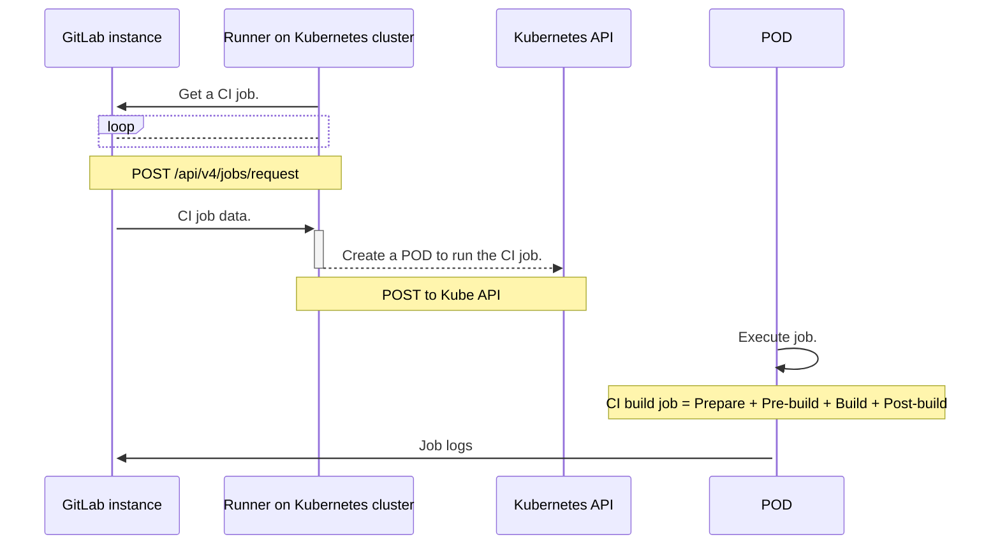
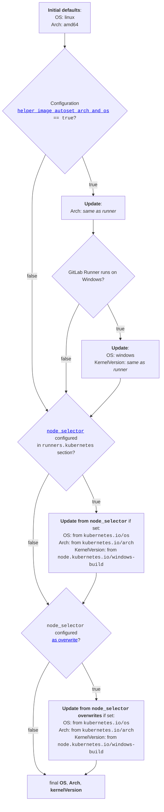



- プラン: Free、Premium、Ultimate
- 提供形態: GitLab.com、GitLab Self-Managed、GitLab Dedicated



ビルドにKubernetesクラスターを使用する場合、Kubernetes executorを使用します。executorはKubernetesクラスターAPIを呼び出し、GitLab CIジョブごとにポッドを作成します。

Kubernetes executorは、ビルドを複数のステップに分割します。

1. **準備**: Kubernetesクラスターに対してポッドを作成します。これにより、ビルドに必要なコンテナと、実行するサービスが作成されます。
1. **ビルド前**: クローン、キャッシュの復元、および前のステージからアーティファクトのダウンロードを実行します。このステップは、ポッドの一部である特別なコンテナで実行されます。
1. **ビルド**: ユーザービルド。
1. **ビルド**後: キャッシュの作成、GitLabへのアーティファクトのアップロードを実行します。このステップでも、ポッドの一部である特別なコンテナを使用します。

## RunnerがKubernetesポッドを作成する仕組み {#how-the-runner-creates-kubernetes-pods}

次の図は、GitLabインスタンスとKubernetesクラスターでホストされているRunner間の相互作用を示しています。RunnerはKubernetes APIを呼び出して、クラスター上にポッドを作成します。

ポッドは、`.gitlab-ci.yml`ファイルまたは`config.toml`ファイルで定義されている`service`ごとに次のコンテナで構成されます。

- `build`として定義されているビルドコンテナ。
- `helper`として定義されているヘルパーコンテナ。
- `svc-X`として定義されているサービスコンテナ。`X`は`[0-9]+`です。

サービスとコンテナは同じKubernetesポッドで実行され、同じlocalhostアドレスを共有します。次の制限が適用されます。

- これらのサービスには、そのDNS名を介してアクセスできます。これよりも古いバージョンを使用する場合は、`localhost`を使用する必要があります。
- 同じポートを使用する複数のサービスを使用することはできません。たとえば、2つの`mysql`サービスを同時に使用することはできません。



この図に示されている相互作用は、すべてのKubernetesクラスターで有効です。たとえば、主要パブリッククラウドプロバイダーでホストされているターンキーソリューションや、Self-Managed Kubernetesインストールなどです。

## Kubernetes APIに接続する {#connect-to-the-kubernetes-api}

Kubernetes APIに接続するには次のオプションを使用します。提供されるユーザーアカウントには、指定されたネームスペースでポッドを作成、リストし、ポッドにアタッチするための権限が必要です。

| オプション      | 説明 |
|-------------|-------------|
| `host`      | オプションのKubernetes APIサーバーホストのURL（指定されていない場合は自動検出が試行されます）。 |
| `cert_file` | オプションのKubernetes APIサーバーユーザー認証証明書。 |
| `key_file`  | オプションのKubernetes APIサーバーユーザー認証秘密鍵。 |
| `ca_file`   | オプションのKubernetes APIサーバーCA証明書。 |

Kubernetesクラスターで GitLab Runnerを実行している場合に、GitLab RunnerがKubernetes APIを自動的に検出できるようにするには、これらのフィールドを省略します。

クラスターの外部でGitLab Runnerを実行している場合、これらの設定により、GitLab Runnerがクラスター上のKubernetes APIにアクセスできるようになります。

### Kubernetes APIコールのベアラートークンを設定する {#set-the-bearer-token-for-kubernetes-api-calls}

ポッドを作成するためにAPIコールのベアラートークンを設定するには、`KUBERNETES_BEARER_TOKEN`変数を使用します。これにより、プロジェクトのオーナーがプロジェクトのシークレット変数を使用してベアラートークンを指定できます。

ベアラートークンを指定する場合は、`Host`設定を指定する必要があります。

``` yaml
variables:
  KUBERNETES_BEARER_TOKEN: thebearertokenfromanothernamespace
```

### Runner APIの権限を設定する {#configure-runner-api-permissions}

コアAPIグループの権限を設定するには、GitLab Runner Helmチャートの`values.yml`ファイルを更新します。

次のいずれかの方法があります。

- `rbac.create`を`true`に設定します。
- `values.yml`ファイルで、次の権限が付与されているサービスアカウント`serviceAccount.name: <service_account_name>`を指定します。

 <!-- k8s_api_permissions_list_start -->

| リソース | 動詞（オプションの機能/設定フラグ） |
|----------|-------------------------------|
| events | list（`print_pod_warning_events=true`）、watch（`FF_PRINT_POD_EVENTS=true`） |
| namespaces | create（`kubernetes.NamespacePerJob=true`）、delete（`kubernetes.NamespacePerJob=true`） |
| pods | create、delete、get、list（[Informerを使用](#informers)）、watch（[Informerを使用](#informers)、`FF_KUBERNETES_HONOR_ENTRYPOINT=true`、`FF_USE_LEGACY_KUBERNETES_EXECUTION_STRATEGY=false`） |
| pods/attach | create（`FF_USE_LEGACY_KUBERNETES_EXECUTION_STRATEGY=false`）、delete（`FF_USE_LEGACY_KUBERNETES_EXECUTION_STRATEGY=false`）、get（`FF_USE_LEGACY_KUBERNETES_EXECUTION_STRATEGY=false`）、patch（`FF_USE_LEGACY_KUBERNETES_EXECUTION_STRATEGY=false`） |
| pods/exec | create、delete、get、patch |
| pods/log | get（`FF_KUBERNETES_HONOR_ENTRYPOINT=true`、`FF_USE_LEGACY_KUBERNETES_EXECUTION_STRATEGY=false`、`FF_WAIT_FOR_POD_TO_BE_REACHABLE=true`）、list（`FF_KUBERNETES_HONOR_ENTRYPOINT=true`、`FF_USE_LEGACY_KUBERNETES_EXECUTION_STRATEGY=false`） |
| secrets | create、delete、get、update |
| serviceaccounts | get |
| services | create、get |

<!-- k8s_api_permissions_list_end -->

必要な権限を持つロールを作成するには、次のYAMLロール定義を使用できます。

<!-- k8s_api_permissions_role_yaml_start -->
```yaml
apiVersion: rbac.authorization.k8s.io/v1
kind: Role
metadata:
  name: gitlab-runner
  namespace: default
rules:
- apiGroups: [""]
  resources: ["events"]
  verbs:
  - "list" # Required when `print_pod_warning_events=true`
  - "watch" # Required when `FF_PRINT_POD_EVENTS=true`
- apiGroups: [""]
  resources: ["namespaces"]
  verbs:
  - "create" # Required when `kubernetes.NamespacePerJob=true`
  - "delete" # Required when `kubernetes.NamespacePerJob=true`
- apiGroups: [""]
  resources: ["pods"]
  verbs:
  - "create"
  - "delete"
  - "get"
  - "list" # Required when using Informers (https://docs.gitlab.com/runner/executors/kubernetes/#informers)
  - "watch" # Required when `FF_KUBERNETES_HONOR_ENTRYPOINT=true`, `FF_USE_LEGACY_KUBERNETES_EXECUTION_STRATEGY=false`, using Informers (https://docs.gitlab.com/runner/executors/kubernetes/#informers)
- apiGroups: [""]
  resources: ["pods/attach"]
  verbs:
  - "create" # Required when `FF_USE_LEGACY_KUBERNETES_EXECUTION_STRATEGY=false`
  - "delete" # Required when `FF_USE_LEGACY_KUBERNETES_EXECUTION_STRATEGY=false`
  - "get" # Required when `FF_USE_LEGACY_KUBERNETES_EXECUTION_STRATEGY=false`
  - "patch" # Required when `FF_USE_LEGACY_KUBERNETES_EXECUTION_STRATEGY=false`
- apiGroups: [""]
  resources: ["pods/exec"]
  verbs:
  - "create"
  - "delete"
  - "get"
  - "patch"
- apiGroups: [""]
  resources: ["pods/log"]
  verbs:
  - "get" # Required when `FF_KUBERNETES_HONOR_ENTRYPOINT=true`, `FF_USE_LEGACY_KUBERNETES_EXECUTION_STRATEGY=false`, `FF_WAIT_FOR_POD_TO_BE_REACHABLE=true`
  - "list" # Required when `FF_KUBERNETES_HONOR_ENTRYPOINT=true`, `FF_USE_LEGACY_KUBERNETES_EXECUTION_STRATEGY=false`
- apiGroups: [""]
  resources: ["secrets"]
  verbs:
  - "create"
  - "delete"
  - "get"
  - "update"
- apiGroups: [""]
  resources: ["serviceaccounts"]
  verbs:
  - "get"
- apiGroups: [""]
  resources: ["services"]
  verbs:
  - "create"
  - "get"
```
<!-- k8s_api_permissions_role_yaml_end -->

- _GitLab 15.0および15.1。_
- _GitLab 15.0.1、15.1.1、および 15.2で`resource_availability_check_max_attempts`が0より大きい値に設定されている場合。_

- _GitLab Runner 15.8の時点で`configmaps`権限は不要になりました。_

- _`event`権限が必要となるのは、次の場合のみです。_

  - _GitLab 16.2.1以降。_

- _`namespace`権限が必要となるのは、次の場合のみです。_

  - _`namespace_per_job`を使用してネームスペースの分離を有効にする場合。_

- _`pods/log`権限は、次のいずれかのシナリオに該当する場合にのみ必要です。_

  - _[`FF_KUBERNETES_HONOR_ENTRYPOINT`機能フラグ](../../configuration/feature-flags.md)が有効になっている。_

  - _[`CI_DEBUG_SERVICES`変数](https://docs.gitlab.com/ci/services/#capturing-service-container-logs)が`true`に設定されている場合に[`FF_USE_LEGACY_KUBERNETES_EXECUTION_STRATEGY`機能フラグ](../../configuration/feature-flags.md)が無効になっている。_

  - _[`FF_WAIT_FOR_POD_TO_BE_REACHABLE`機能フラグ](../../configuration/feature-flags.md)が有効になっている。_

#### informer {#informers}

GitLab Runner 17.9.0以降では、Kubernetes informerがビルドポッドの変更を追跡します。これにより、executorが変更をより迅速に検出できるようになります。

informerには、`pods`に対する`list`権限と`watch`権限が必要です。executorがビルドを開始すると、Kubernetes APIで権限が確認されます。すべての権限が付与されている場合、executorはinformerを使用します。いずれかの権限がない場合には、GitLab Runnerは警告をログに記録します。ビルドは続行され、以前のメカニズムを使用してビルドポッドの状態と変更を追跡します。

## 設定 {#configuration-settings}

Kubernetes executorを設定するには、`config.toml`ファイルで次の設定を使用します。

### CPUリクエストとCPUの制限 {#cpu-requests-and-limits}

| 設定                                     | 説明 |
|---------------------------------------------|-------------|
| `cpu_limit`                                 | ビルドコンテナに対して指定されるCPU割り当て。 |
| `cpu_limit_overwrite_max_allowed`           | ビルドコンテナのCPU割り当てを上書きできる最大量。空の場合、CPU制限上書き機能が無効になります。 |
| `cpu_request`                               | ビルドコンテナに対してリクエストされるCPU割り当て。 |
| `cpu_request_overwrite_max_allowed`         | ビルドコンテナのCPU割り当てリクエストを上書きできる最大量。空の場合、CPUリクエスト上書き機能が無効になります。 |
| `helper_cpu_limit`                          | ビルドヘルパーコンテナに対して指定されるCPU割り当て。 |
| `helper_cpu_limit_overwrite_max_allowed`    | ヘルパーコンテナのCPU割り当てを上書きできる最大量。空の場合、CPU制限上書き機能が無効になります。 |
| `helper_cpu_request`                        | ビルドヘルパーコンテナに対してリクエストされるCPU割り当て。 |
| `helper_cpu_request_overwrite_max_allowed`  | ヘルパーコンテナのCPU割り当てリクエストを上書きできる最大量。空の場合、CPUリクエスト上書き機能が無効になります。 |
| `service_cpu_limit`                         | ビルドサービスコンテナに対して指定されるCPU割り当て。 |
| `service_cpu_limit_overwrite_max_allowed`   | サービスコンテナのCPU割り当てを上書きできる最大量。空の場合、CPU制限上書き機能が無効になります。 |
| `service_cpu_request`                       | ビルドサービスコンテナに対してリクエストされるCPU割り当て。 |
| `service_cpu_request_overwrite_max_allowed` | サービスコンテナのCPU割り当てリクエストを上書きできる最大量。空の場合、CPUリクエスト上書き機能が無効になります。 |

### メモリのリクエストと制限 {#memory-requests-and-limits}

| 設定                                        | 説明 |
|------------------------------------------------|-------------|
| `memory_limit`                                 | ビルドコンテナに割り当てられるメモリの量。 |
| `memory_limit_overwrite_max_allowed`           | ビルドコンテナのメモリ割り当てを上書きできる最大量。空の場合、メモリ制限上書き機能が無効になります。 |
| `memory_request`                               | ビルドコンテナからリクエストされるメモリの量。 |
| `memory_request_overwrite_max_allowed`         | ビルドコンテナのメモリ割り当てリクエストを上書きできる最大量。空の場合、メモリリクエスト上書き機能が無効になります。 |
| `helper_memory_limit`                          | ビルドヘルパーコンテナに割り当てられるメモリの量。 |
| `helper_memory_limit_overwrite_max_allowed`    | ヘルパーコンテナのメモリ割り当てを上書きできる最大量。空の場合、メモリ制限上書き機能が無効になります。 |
| `helper_memory_request`                        | ビルドヘルパーコンテナに対してリクエストされるメモリの量。 |
| `helper_memory_request_overwrite_max_allowed`  | ヘルパーコンテナのメモリ割り当てリクエストを上書きできる最大量。空の場合、メモリリクエスト上書き機能が無効になります。 |
| `service_memory_limit`                         | ビルドサービスコンテナに割り当てられるメモリの量。 |
| `service_memory_limit_overwrite_max_allowed`   | サービスコンテナのメモリ割り当てを上書きできる最大量。空の場合、メモリ制限上書き機能が無効になります。 |
| `service_memory_request`                       | ビルドサービスコンテナにリクエストされるメモリの量。 |
| `service_memory_request_overwrite_max_allowed` | サービスコンテナのメモリ割り当てリクエストを上書きできる最大量。空の場合、メモリリクエスト上書き機能が無効になります。 |

### ストレージのリクエストと制限 {#storage-requests-and-limits}

| 設定                                                   | 説明 |
|-----------------------------------------------------------|-------------|
| `ephemeral_storage_limit`                                 | ビルドコンテナのエフェメラルストレージ制限。 |
| `ephemeral_storage_limit_overwrite_max_allowed`           | ビルドコンテナのエフェメラルストレージ制限を上書きできる最大量。空の場合、エフェメラルストレージ制限上書き機能が無効になります。 |
| `ephemeral_storage_request`                               | ビルドコンテナに対して指定されるエフェメラルストレージリクエスト。 |
| `ephemeral_storage_request_overwrite_max_allowed`         | ビルドコンテナのエフェメラルストレージリクエストを上書きできる最大量。空の場合、エフェメラルストレージリクエスト上書き機能が無効になります。 |
| `helper_ephemeral_storage_limit`                          | ヘルパーコンテナに対して指定されるエフェメラルストレージ制限。 |
| `helper_ephemeral_storage_limit_overwrite_max_allowed`    | ヘルパーコンテナのエフェメラルストレージ制限を上書きできる最大量。空の場合、エフェメラルストレージリクエスト上書き機能が無効になります。 |
| `helper_ephemeral_storage_request`                        | ヘルパーコンテナに対して指定されるエフェメラルストレージリクエスト。 |
| `helper_ephemeral_storage_request_overwrite_max_allowed`  | ヘルパーコンテナのエフェメラルストレージリクエストを上書きできる最大量。空の場合、エフェメラルストレージリクエスト上書き機能が無効になります。 |
| `service_ephemeral_storage_limit`                         | サービスコンテナに対して指定されるエフェメラルストレージ制限。 |
| `service_ephemeral_storage_limit_overwrite_max_allowed`   | サービスコンテナのエフェメラルストレージ制限を上書きできる最大量。空の場合、エフェメラルストレージリクエスト上書き機能が無効になります。 |
| `service_ephemeral_storage_request`                       | サービスコンテナに対して指定されるエフェメラルストレージリクエスト。 |
| `service_ephemeral_storage_request_overwrite_max_allowed` | サービスコンテナのエフェメラルストレージリクエストを上書きできる最大量。空の場合、エフェメラルストレージリクエスト上書き機能が無効になります。 |

### `config.toml`のその他の設定 {#other-configtoml-settings}

| 設定                                       | 説明 |
|-----------------------------------------------|-------------|
| `affinity`                                    | ビルドを実行するノードを決定するアフィニティルールを指定します。[アフィニティの使用](#define-a-list-of-node-affinities)についての詳細を参照してください。 |
| `allow_privilege_escalation`                  | `allowPrivilegeEscalation`フラグを有効にしてすべてのコンテナを実行します。空の場合、コンテナ`SecurityContext`の`allowPrivilegeEscalation`フラグは定義されず、Kubernetesはデフォルトの[特権エスカレーション](https://kubernetes.io/docs/tasks/configure-pod-container/security-context/)動作を使用できます。 |
| `allowed_images`                              | `.gitlab-ci.yml`で指定できるイメージのワイルドカードリスト。この設定が存在しない場合は、すべてのイメージが許可されます（`["*/*:*"]`と同等）。[詳細](#restrict-docker-images-and-services)を参照してください。 |
| `allowed_pull_policies`                       | `.gitlab-ci.yml`ファイルまたは`config.toml`ファイルで指定できるプルポリシーのリスト。 |
| `allowed_services`                            | `.gitlab-ci.yml`で指定できるサービスのワイルドカードリスト。この設定が存在しない場合は、すべてのイメージが許可されます（`["*/*:*"]`と同等）。[詳細](#restrict-docker-images-and-services)を参照してください。 |
| `automount_service_account_token`             | サービスアカウントトークンをビルドポッドに自動的にマウントするかどうかを制御するブール値。 |
| `bearer_token`                                | ビルドポッドの起動に使用されるデフォルトのベアラートークン。 |
| `bearer_token_overwrite_allowed`              | ビルドポッドの作成に使用されるベアラートークンをプロジェクトが指定できるようにするブール値。 |
| `build_container_security_context`            | ビルドコンテナのコンテナセキュリティコンテキストを設定します。[セキュリティコンテキストの詳細](#set-a-security-policy-for-the-pod)を参照してください。 |
| `cap_add`                                     | ジョブポッドコンテナに追加するLinux機能を指定します。[Kubernetes executorでの機能設定の詳細](#specify-container-capabilities)を参照してください。 |
| `cap_drop`                                    | ジョブポッドコンテナから削除するLinux機能を指定します。[Kubernetes executorでの機能設定の詳細](#specify-container-capabilities)を参照してください。 |
| `cleanup_grace_period_seconds`                | ジョブの完了後、ポッドが正常に終了するまでの秒数。この期間を過ぎると、プロセスはkill（強制終了）シグナルによって強制的に停止します。`terminationGracePeriodSeconds`が指定されている場合は無視されます。 |
| `dns_policy`                                  | ポッドの作成時に使用するDNSポリシー（`none`、`default`、`cluster-first`、`cluster-first-with-host-net`）を指定します。設定されていない場合は、Kubernetesのデフォルト（`cluster-first`）が使用されます。 |
| `dns_config`                                  | ポッドの作成時に使用するDNS設定を指定します。[ポッドのDNS設定の使用についての詳細](#configure-pod-dns-settings)を参照してください。 |
| `helper_container_security_context`           | ヘルパーコンテナのコンテナセキュリティコンテキストを設定します。[セキュリティコンテキストの詳細](#set-a-security-policy-for-the-pod)を参照してください。 |
| `helper_image`                                | （上級者向け）リポジトリのクローンとアーティファクトのアップロードに使用される[デフォルトのヘルパーイメージを上書きします](../../configuration/advanced-configuration.md#helper-image)。 |
| `helper_image_flavor`                         | ヘルパーイメージのフレーバー（`alpine`、`alpine3.18`、`alpine3.19`、`alpine3.21`、または`ubuntu`）を設定します。デフォルトは`alpine`です。`alpine`を使用する場合、これは`alpine3.19`と同じです。 |
| `host_aliases`                                | すべてのコンテナに追加される追加のホスト名エイリアスのリスト。[追加のホストエイリアスの使用についての詳細](#add-extra-host-aliases)を参照してください。 |
| `image_pull_secrets`                          | プライベートレジストリからのDockerイメージのプルを認証するために使用されるKubernetes `docker-registry`シークレット名を含むアイテムの配列。 |
| `init_permissions_container_security_context` | init-permissionsコンテナのコンテナセキュリティコンテキストを設定します。[セキュリティコンテキストの詳細](#set-a-security-policy-for-the-pod)を参照してください。 |
| `namespace`                                   | Kubernetesポッドを実行するネームスペース。 |
| `namespace_per_job`                           | ジョブを個別のネームスペースに隔離します。有効にすると、`namespace`と`namespace_overwrite_allowed`は無視されます。 |
| `namespace_overwrite_allowed`                 | ネームスペース上書き環境変数の内容を検証する正規表現（下記を参照）。空の場合、ネームスペース上書き機能が無効になります。 |
| `node_selector`                               | `string=string`（環境変数の場合は`string:string`）形式の`key=value`ペアの`table`。これを設定すると、ポッドの作成は、すべての`key=value`ペアに一致するKubernetesノードに制限されます。[ノードセレクターの使用についての詳細](#specify-the-node-to-execute-builds)を参照してください。 |
| `node_tolerations`                            | `string=string:string`形式の`"key=value" = "Effect"`ペアの`table`。これを設定すると、ポッドは、許容されるすべてのtaintまたはその一部を持つノードでスケジュールできます。環境変数設定では、1つのtolerationのみを指定できます。`key`、`value`、および`effect`は、Kubernetesポッドのtoleration設定の対応するフィールド名と一致します。 |
| `pod_annotations`                             | `string=string`形式の`key=value`ペアの`table`。この`table`には、Runnerによって作成された各ビルドポッドに追加されるアノテーションのリストが含まれています。これらの値には、拡張用の環境変数を含めることができます。ポッドのアノテーションは、各ビルドで上書きできます。 |
| `pod_annotations_overwrite_allowed`           | ポッドアノテーション上書き環境変数の内容を検証する正規表現。空の場合、ポッドアノテーション上書き機能が無効になります。 |
| `pod_labels`                                  | `string=string`形式の`key=value`ペアの`table`。この`table`には、Runnerによって作成された各ビルドポッドに追加されるラベルのリストが含まれています。これらの値には、拡張用の環境変数を含めることができます。各ビルドでポッドラベルを上書きするには、`pod_labels_overwrite_allowed`を使用します。 |
| `pod_labels_overwrite_allowed`                | ポッドラベル上書き環境変数の内容を検証する正規表現。空の場合、ポッドラベルの上書き機能が無効になります。`runner.gitlab.com`ラベルネームスペースのポッドラベルは上書きできないことに注意してください。 |
| `pod_security_context`                        | 設定ファイルで設定されている場合、これによりビルドポッドのポッドセキュリティコンテキストが設定されます。[セキュリティコンテキストの詳細](#set-a-security-policy-for-the-pod)を参照してください。 |
| `pod_termination_grace_period_seconds`        | ポッドが正常に終了するまでの秒数を決定するポッドレベルの設定です。この期間を過ぎると、プロセスはkill（強制終了）シグナルによって強制的に停止します。`terminationGracePeriodSeconds`が指定されている場合は無視されます。 |
| `poll_interval`                               | RunnerがKubernetesポッドを作成した直後に、その状態を確認するためにポッドをポーリングする頻度（秒単位）（デフォルト= 3）。 |
| `poll_timeout`                                | Runnerが作成したコンテナへの接続を試行する際に、タイムアウトになるまでの経過時間（秒単位）。クラスターが一度に処理できるビルドの数を上回るビルドをキューに入れる場合に、この設定を使用します（デフォルト= 180）。 |
| `cleanup_resources_timeout`                   | ジョブの完了後にKubernetesリソースをクリーンアップするための合計時間。サポートされている構文は`1h30m`、`300s`、`10m`です。デフォルトは5分（`5m`）です。 |
| `priority_class_name`                         | ポッドに設定する優先度クラスを指定します。設定されていない場合は、デフォルトの優先度クラスが使用されます。 |
| `privileged`                                  | 特権フラグを指定してコンテナを実行します。 |
| `pull_policy`                                 | イメージプルポリシー（`never`、`if-not-present`、`always`）を指定します。設定されていない場合は、クラスターのイメージの[デフォルトプルポリシー](https://kubernetes.io/docs/concepts/containers/images/#updating-images)が使用されます。複数のプルポリシーの設定方法と詳細については、[プルポリシーの使用](#set-a-pull-policy)を参照してください。[`if-not-present`および`never`のセキュリティに関する考慮事項](../../security/_index.md#usage-of-private-docker-images-with-if-not-present-pull-policy)も参照してください。[プルポリシーを制限する](#restrict-docker-pull-policies)こともできます。 |
| `resource_availability_check_max_attempts`    | 設定されたリソース（サービスアカウントとプルシークレット）が使用可能であるかどうかを確認する操作の最大試行回数。この回数を超えると試行されなくなります。各試行の間隔は5秒です。GitLab 15.0で[導入](https://gitlab.com/gitlab-org/gitlab-runner/-/issues/27664)されました。[準備ステップでのリソースチェックについての詳細](#resources-check-during-prepare-step)を参照してください。 |
| `runtime_class_name`                          | 作成されたすべてのポッドに使用するランタイムクラス。クラスターでこの機能がサポートされていない場合、ジョブは終了または失敗します。 |
| `service_container_security_context`          | サービスコンテナのコンテナセキュリティコンテキストを設定します。[セキュリティコンテキストの詳細](#set-a-security-policy-for-the-pod)を参照してください。 |
| `scheduler_name`                              | ビルドポッドのスケジュールに使用するスケジューラ。 |
| `service_account`                             | ジョブ/executorポッドがKubernetes APIと通信するために使用するデフォルトのサービスアカウント。 |
| `service_account_overwrite_allowed`           | サービスアカウント上書き環境変数の内容を検証する正規表現。空の場合、サービスアカウント上書き機能が無効になります。 |
| `services`                                    | [サイドカーパターン](https://learn.microsoft.com/en-us/azure/architecture/patterns/sidecar)を使用してビルドコンテナにアタッチされている[サービス](https://docs.gitlab.com/ci/services/)のリスト。[サービスの使用](#define-a-list-of-services)についての詳細を参照してください。 |
| `use_service_account_image_pull_secrets`      | 有効にすると、executorによって作成されるポッドに`imagePullSecrets`が含まれなくなります。これにより、ポッドは[サービスアカウントの`imagePullSecrets`](https://kubernetes.io/docs/tasks/configure-pod-container/configure-service-account/#add-image-pull-secret-to-service-account)（設定されている場合）を使用して作成されます。 |
| `terminationGracePeriodSeconds`               | ポッドで実行されているプロセスに自動終了シグナルが送信された時点から、プロセスがkill（強制終了）シグナルで強制的に停止されるまでの期間。[`cleanup_grace_period_seconds`と`pod_termination_grace_period_seconds`が優先され、これは非推奨になりました](https://gitlab.com/gitlab-org/gitlab-runner/-/issues/28165)。 |
| `volumes`                                     | 設定ファイルで設定され、ビルドコンテナにマウントされるボリュームのリスト。[ボリュームの使用](#configure-volume-types)についての詳細を参照してください。 |
| `pod_spec`                                    | これは実験的な設定です。Runnerマネージャーによって生成されるポッド仕様を、CIジョブの実行に使用されるポッドで設定された設定のリストで上書きします。`Kubernetes Pod Specification`にリストされているすべてのプロパティを設定できます。詳細については、[生成されたポッド仕様を上書きする（実験的機）](#overwrite-generated-pod-specifications)を参照してください。 |
| `retry_limit`                                 | Kubernetes APIとの通信を試行する操作の最大回数。各試行の間の再試行間隔は、バックオフアルゴリズムに基づき、500ミリ秒から始まります。 |
| `retry_backoff_max`                           | 各試行で到達する再試行間隔のカスタム最大バックオフ値（ミリ秒単位）。デフォルト値は2000ミリ秒で、500ミリ秒未満の値にすることはできません。各試行で到達するデフォルトの最大試行間隔は2秒です。これは`retry_backoff_max`を使用してカスタマイズできます。 |
| `retry_limits`                                | 各リクエストエラーの再試行回数。 |
| `logs_base_dir`                               | ビルドログを保存するために生成されたパスの前に付加されるベースディレクトリ。詳細については、[ビルドログとスクリプトのベースディレクトリを変更する](#change-the-base-directory-for-build-logs-and-scripts)を参照してください。 |
| `scripts_base_dir`                            | ビルドスクリプトを保存するために生成されたパスの前に付加されるベースディレクトリ。詳細については、[ビルドログとスクリプトのベースディレクトリを変更する](#change-the-base-directory-for-build-logs-and-scripts)を参照してください。 |
| `print_pod_warning_events`                    | 有効にすると、ジョブ失敗時に、ポッドに関連付けられているすべての警告イベントがこの機能により取得されます。この機能はデフォルトで有効になっており、少なくとも[`events: list`の権限](#configure-runner-api-permissions)を付与されたサービスアカウントが必要です。 |

### 設定例 {#configuration-example}

次のサンプルは、Kubernetes executorの`config.toml`ファイルの設定例を示しています。

```toml
concurrent = 4

[[runners]]
  name = "myRunner"
  url = "https://gitlab.com/ci"
  token = "......"
  executor = "kubernetes"
  [runners.kubernetes]
    host = "https://45.67.34.123:4892"
    cert_file = "/etc/ssl/kubernetes/api.crt"
    key_file = "/etc/ssl/kubernetes/api.key"
    ca_file = "/etc/ssl/kubernetes/ca.crt"
    namespace = "gitlab"
    namespace_overwrite_allowed = "ci-.*"
    bearer_token_overwrite_allowed = true
    privileged = true
    cpu_limit = "1"
    memory_limit = "1Gi"
    service_cpu_limit = "1"
    service_memory_limit = "1Gi"
    helper_cpu_limit = "500m"
    helper_memory_limit = "100Mi"
    poll_interval = 5
    poll_timeout = 3600
    dns_policy = "cluster-first"
    priority_class_name = "priority-1"
    logs_base_dir = "/tmp"
    scripts_base_dir = "/tmp"
    [runners.kubernetes.node_selector]
      gitlab = "true"
    [runners.kubernetes.node_tolerations]
      "node-role.kubernetes.io/master" = "NoSchedule"
      "custom.toleration=value" = "NoSchedule"
      "empty.value=" = "PreferNoSchedule"
      "onlyKey" = ""
```

## executorサービスアカウントを設定する {#configure-the-executor-service-account}

executorサービスアカウントを設定するには、`KUBERNETES_SERVICE_ACCOUNT`環境変数を設定するか、`--kubernetes-service-account`フラグを使用します。

## ポッドとコンテナ {#pods-and-containers}

ジョブの実行方法を制御するようにポッドとコンテナを設定できます。

### ジョブポッドのデフォルトのラベル {#default-labels-for-job-pods}



Runner設定または`.gitlab-ci.yml`ファイルを使用してこれらのラベルを上書きすることはできません。`runner.gitlab.com`ネームスペースでラベルを設定または変更する操作は無視され、デバッグメッセージとして記録されます。



| キー                                        | 説明 |
|--------------------------------------------|-------------|
| `project.runner.gitlab.com/id`             | プロジェクトのID。GitLabインスタンスのすべてのプロジェクトで一意のIDです。 |
| `project.runner.gitlab.com/name`           | プロジェクトの名前。 |
| `project.runner.gitlab.com/namespace-id`   | プロジェクトのネームスペースのID。 |
| `project.runner.gitlab.com/namespace`      | プロジェクトのネームスペースの名前。 |
| `project.runner.gitlab.com/root-namespace` | プロジェクトのルートネームスペースのID。たとえば`/gitlab-org/group-a/subgroup-a/project`の場合、ルートネームスペースは`gitlab-org`です。 |
| `manager.runner.gitlab.com/name`           | このジョブを起動したRunner設定の名前。 |
| `manager.runner.gitlab.com/id-short`       | ジョブを起動したRunner設定のID。 |
| `job.runner.gitlab.com/pod`                | Kubernetes executorによって使用される内部ラベル。 |

### ジョブポッドのデフォルトのアノテーション {#default-annotations-for-job-pods}



- GitLab Runner 15.9で[導入](https://gitlab.com/gitlab-org/gitlab-runner/-/merge_requests/3845)されました。



ジョブを実行しているポッドには、デフォルトで次のアノテーションが追加されます。

| キー                                | 説明 |
|------------------------------------|-------------|
| `job.runner.gitlab.com/id`         | ジョブのID。GitLabインスタンスのすべてのジョブにおいて一意のIDです。 |
| `job.runner.gitlab.com/url`        | ジョブの詳細のURL。 |
| `job.runner.gitlab.com/sha`        | プロジェクトがビルドされるコミットリビジョン。 |
| `job.runner.gitlab.com/before_sha` | ブランチまたはタグに存在する、以前の最新コミット。 |
| `job.runner.gitlab.com/ref`        | プロジェクトのビルド対象のブランチまたはタグの名前。 |
| `job.runner.gitlab.com/name`       | ジョブの名前。 |
| `job.runner.gitlab.com/timeout`    | 時間の長さで指定する形式のジョブ実行タイムアウト。たとえば、`2h3m0.5s`などです。 |
| `project.runner.gitlab.com/id`     | ジョブのプロジェクトID。 |

デフォルトのアノテーションを上書きするには、GitLab Runner設定で`pod_annotations`を使用します。各CI/CDジョブのアノテーションは、[`.gitlab-ci.yml`ファイル](#overwrite-pod-annotations)で上書きすることもできます。

### ポッドのライフサイクル {#pod-lifecycle}

[ポッドのライフサイクル](https://kubernetes.io/docs/reference/kubernetes-api/workload-resources/pod-v1/#lifecycle)は、次の影響を受ける可能性があります。

- `TOML`設定ファイルでの`pod_termination_grace_period_seconds`プロパティの設定。ポッドで実行されているプロセスは、`TERM`シグナルの送信後に指定された期間にわたって実行できます。この期間が経過してもポッドが正常に終了しない場合は、kill（強制終了）シグナルが送信されます。
- [`FF_USE_POD_ACTIVE_DEADLINE_SECONDS`機能フラグ](../../configuration/feature-flags.md)の有効化。有効にすると、ジョブがタイムアウトしたときに、CI/CDジョブを実行しているポッドは失敗としてマークされ、関連付けられているすべてのコンテナが強制終了されます。最初にGitLabでジョブをタイムアウトさせるには、`activeDeadlineSeconds`を`configured timeout + 1 second`に設定します。



`FF_USE_POD_ACTIVE_DEADLINE_SECONDS`機能フラグを有効にして`pod_termination_grace_period_seconds`をゼロ以外の値に設定すると、CI/CDジョブポッドは即時に終了しません。ポッドの`terminationGracePeriods`により、有効期限が切れた場合にのみポッドが終了するようになります。



### ポッドのtolerationを上書きする {#overwrite-pod-tolerations}

Kubernetesポッドのtolerationを上書きするには、次のようにします。

1. `config.toml`ファイルまたはHelm `values.yaml`ファイルでCIジョブポッドのtolerationの上書きを有効にするには、`node_tolerations_overwrite_allowed`の正規表現を定義します。この正規表現は、名前が`KUBERNETES_NODE_TOLERATIONS_`で始まるCI変数の値を検証します。

   ```toml
   runners:
    ...
    config: |
      [[runners]]
        [runners.kubernetes]
          node_tolerations_overwrite_allowed = ".*"
   ```

1. CIジョブポッドtolerationを上書きするため、`.gitlab-ci.yml`ファイルで1つ以上のCI変数を定義します。

   ```yaml
   variables:
     KUBERNETES_NODE_TOLERATIONS_1: 'node-role.kubernetes.io/master:NoSchedule'
     KUBERNETES_NODE_TOLERATIONS_2: 'custom.toleration=value:NoSchedule'
     KUBERNETES_NODE_TOLERATIONS_3: 'empty.value=:PreferNoSchedule'
     KUBERNETES_NODE_TOLERATIONS_4: 'onlyKey'
     KUBERNETES_NODE_TOLERATIONS_5: '' # tolerate all taints
   ```

### ポッドラベルを上書きする {#overwrite-pod-labels}

各CI/CDジョブのKubernetesポッドラベルを上書きするには、次の手順に従います。

1. `.config.yaml`ファイルで`pod_labels_overwrite_allowed`の正規表現を定義します。
1. `.gitlab-ci.yml`ファイルで、値`key=value`を持つ`KUBERNETES_POD_LABELS_*`変数を設定します。ポッドラベルは`key=value`で上書きされます。複数の値を適用できます。

    ```yaml
    variables:
      KUBERNETES_POD_LABELS_1: "Key1=Val1"
      KUBERNETES_POD_LABELS_2: "Key2=Val2"
      KUBERNETES_POD_LABELS_3: "Key3=Val3"
    ```



`runner.gitlab.com`ネームスペースのラベルは読み取り専用です。GitLabは、これらのGitLab内部ラベルの追加、変更、または削除の試行操作をすべて無視します。



### ポッドアノテーションを上書きする {#overwrite-pod-annotations}

各CI/CDジョブのKubernetesポッドアノテーションを上書きするには、次の手順に従います。

1. `.config.yaml`ファイルで`pod_annotations_overwrite_allowed`の正規表現を定義します。
1. `.gitlab-ci.yml`ファイルで`KUBERNETES_POD_ANNOTATIONS_*`変数を設定し、値として`key=value`を使用します。ポッドアノテーションは`key=value`で上書きされます。複数のアノテーションを指定できます。

   ```yaml
   variables:
     KUBERNETES_POD_ANNOTATIONS_1: "Key1=Val1"
     KUBERNETES_POD_ANNOTATIONS_2: "Key2=Val2"
     KUBERNETES_POD_ANNOTATIONS_3: "Key3=Val3"
   ```

以下の例では、`pod_annotations`と`pod_annotations_overwrite_allowed`が設定されています。この設定により、`config.toml`で設定されている`pod_annotations`の上書きが許可されます。

```toml
[[runners]]
  # usual configuration
  executor = "kubernetes"
  [runners.kubernetes]
    image = "alpine"
    pod_annotations_overwrite_allowed = ".*"
    [runners.kubernetes.pod_annotations]
      "Key1" = "Val1"
      "Key2" = "Val2"
      "Key3" = "Val3"
      "Key4" = "Val4"
```

### 生成されたポッド仕様を上書きする {#overwrite-generated-pod-specifications}



- ステータス: ベータ





- GitLab Runner 15.10で[導入](https://gitlab.com/gitlab-org/gitlab-runner/-/merge_requests/3114)されました。



この機能は[ベータ版](https://docs.gitlab.com/policy/development_stages_support/#beta)です。本番環境のクラスターで使用する前に、テストKubernetesクラスターでこの機能を使用することを強くお勧めします。この機能を使用するには、`FF_USE_ADVANCED_POD_SPEC_CONFIGURATION`[機能フラグ](../../configuration/feature-flags.md)を有効にする必要があります。

機能が一般提供になる前に改善のためのフィードバックを追加するには、[このイシュー](https://gitlab.com/gitlab-org/gitlab-runner/-/issues/29659)を使用してください。

Runnerマネージャーによって生成された`PodSpec`を変更するには、`config.toml`ファイルで`pod_spec`設定を使用します。

`pod_spec`設定により次のようになります。

- 生成されたポッド仕様のフィールドを上書きして補完します。
- `config.toml`の`[runners.kubernetes]`で設定された可能性のある設定値を上書きします。

複数の`pod_spec`設定を指定できます。

| 設定      | 説明 |
|--------------|-------------|
| `name`       | カスタム`pod_spec`に付けられた名前。 |
| `patch_path` | 最終的な`PodSpec`オブジェクトの生成前に、このオブジェクトに適用する変更を定義するファイルのパス。このファイルはJSONまたはYAMLファイルである必要があります。 |
| `patch`      | 最終的な`PodSpec`オブジェクトの生成前にこのオブジェクトに適用する必要がある変更を記述するJSONまたはYAML形式の文字列。 |
| `patch_type` | GitLab Runnerによって生成された`PodSpec`オブジェクトに対して指定された変更を適用するためにRunnerが使用する戦略。指定できる値は、`merge`、`json`、`strategic`です。 |

同じ`pod_spec`設定で`patch_path`と`patch`を設定することはできません。このように設定するとエラーが発生します。

`config.toml`での複数の`pod_spec`設定の例を以下に示します。

```toml
[[runners]]
  [runners.kubernetes]
    [[runners.kubernetes.pod_spec]]
      name = "hostname"
      patch = '''
        hostname: "custom-pod-hostname"
      '''
      patch_type = "merge"
    [[runners.kubernetes.pod_spec]]
      name = "subdomain"
      patch = '''
        subdomain: "subdomain"
      '''
      patch_type = "strategic"
    [[runners.kubernetes.pod_spec]]
      name = "terminationGracePeriodSeconds"
      patch = '''
        [{"op": "replace", "path": "/terminationGracePeriodSeconds", "value": 60}]
      '''
      patch_type = "json"
```

#### マージパッチ戦略 {#merge-patch-strategy}

`merge`パッチ戦略は、既存の`PodSpec`に[キー/値置換](https://datatracker.ietf.org/doc/html/rfc7386)を適用します。この戦略を使用する場合、`config.toml`の`pod_spec`設定により、最終的な`PodSpec`オブジェクトの生成前に、このオブジェクトの値が**上書き**されます。値が完全に上書きされるので、このパッチ戦略を使用する際には十分に注意してください。

`merge`パッチ戦略を使用する`pod_spec`設定の例を以下に示します。

```toml
concurrent = 1
check_interval = 1
log_level = "debug"
shutdown_timeout = 0

[session_server]
  session_timeout = 1800

[[runners]]
  name = ""
  url = "https://gitlab.example.com"
  id = 0
  token = "__REDACTED__"
  token_obtained_at = 0001-01-01T00:00:00Z
  token_expires_at = 0001-01-01T00:00:00Z
  executor = "kubernetes"
  shell = "bash"
  environment = ["FF_USE_ADVANCED_POD_SPEC_CONFIGURATION=true", "CUSTOM_VAR=value"]
  [runners.kubernetes]
    image = "alpine"
    ...
    [[runners.kubernetes.pod_spec]]
      name = "build envvars"
      patch = '''
        containers:
        - env:
          - name: env1
            value: "value1"
          - name: env2
            value: "value2"
          name: build
      '''
      patch_type = "merge"
```

この設定では、最終的な`PodSpec`には、2つの環境変数（`env1`と`env2`）を持つ1つのコンテナ（`build`）のみが含まれています。上記の例では、次のようになるために関連するCIジョブが失敗します。

- `helper`コンテナ仕様が削除されます。
- `build`コンテナ仕様は、GitLab Runnerによって設定された必要なすべての設定を失います。

ジョブの失敗を防ぐために、この例では、GitLab Runnerによって生成された未変更のプロパティが`pod_spec`に含まれている必要があります。

#### JSONパッチ戦略 {#json-patch-strategy}

`json`パッチ戦略は、[JSONパッチ仕様](https://datatracker.ietf.org/doc/html/rfc6902)を使用して`PodSpec`のオブジェクトと配列の更新を制御します。`array`プロパティではこの戦略を使用できません。

`json`パッチ戦略を使用する`pod_spec`設定の例を以下に示します。この設定では、新しい`key: value pair`が既存の`nodeSelector`に追加されます。既存の値は上書きされません。

```toml
concurrent = 1
check_interval = 1
log_level = "debug"
shutdown_timeout = 0

[session_server]
  session_timeout = 1800

[[runners]]
  name = ""
  url = "https://gitlab.example.com"
  id = 0
  token = "__REDACTED__"
  token_obtained_at = 0001-01-01T00:00:00Z
  token_expires_at = 0001-01-01T00:00:00Z
  executor = "kubernetes"
  shell = "bash"
  environment = ["FF_USE_ADVANCED_POD_SPEC_CONFIGURATION=true", "CUSTOM_VAR=value"]
  [runners.kubernetes]
    image = "alpine"
    ...
    [[runners.kubernetes.pod_spec]]
      name = "val1 node"
      patch = '''
        { "op": "add", "path": "/nodeSelector", "value": { key1: "val1" } }
      '''
      patch_type = "json"
```

#### strategicパッチ戦略 {#strategic-patch-strategy}

この`strategic`パッチ戦略は、`PodSpec`オブジェクトの各フィールドに適用されている既存の`patchStrategy`を使用します。

`strategic`パッチ戦略を使用する`pod_spec`設定の例を以下に示します。この設定では、ビルドコンテナに`resource request`が設定されています。

```toml
concurrent = 1
check_interval = 1
log_level = "debug"
shutdown_timeout = 0

[session_server]
  session_timeout = 1800

[[runners]]
  name = ""
  url = "https://gitlab.example.com"
  id = 0
  token = "__REDACTED__"
  token_obtained_at = 0001-01-01T00:00:00Z
  token_expires_at = 0001-01-01T00:00:00Z
  executor = "kubernetes"
  shell = "bash"
  environment = ["FF_USE_ADVANCED_POD_SPEC_CONFIGURATION=true", "CUSTOM_VAR=value"]
  [runners.kubernetes]
    image = "alpine"
    ...
    [[runners.kubernetes.pod_spec]]
      name = "cpu request 500m"
      patch = '''
        containers:
        - name: build
          resources:
            requests:
              cpu: "500m"
      '''
      patch_type = "strategic"
```

この設定では、ビルドコンテナに`resource request`が設定されています。

#### ベストプラクティス {#best-practices}

- 本番環境にデプロイする前に、テスト環境で追加された`pod_spec`をテストします。
- GitLab Runnerによって生成された仕様に対し、`pod_spec`設定が悪影響を与えないことを確認します。
- 複雑なポッド仕様の更新には、`merge`パッチ戦略を使用しないでください。
- `config.toml`が利用可能な場合は、可能な限りこの設定を使用してください。たとえば次の設定では、設定された環境変数を既存のリストに追加するのではなく、GitLab Runnerによって設定された最初の環境変数を、カスタム`pod_spec`で設定された環境変数に置き換えます。

```toml
concurrent = 1
check_interval = 1
log_level = "debug"
shutdown_timeout = 0

[session_server]
  session_timeout = 1800

[[runners]]
  name = ""
  url = "https://gitlab.example.com"
  id = 0
  token = "__REDACTED__"
  token_obtained_at = 0001-01-01T00:00:00Z
  token_expires_at = 0001-01-01T00:00:00Z
  executor = "kubernetes"
  shell = "bash"
  environment = ["FF_USE_ADVANCED_POD_SPEC_CONFIGURATION=true", "CUSTOM_VAR=value"]
  [runners.kubernetes]
    image = "alpine"
    ...
    [[runners.kubernetes.pod_spec]]
      name = "build envvars"
      patch = '''
        containers:
        - env:
          - name: env1
            value: "value1"
          name: build
      '''
      patch_type = "strategic"
```

#### ポッド仕様を変更して各ビルドジョブの`PVC`を作成する {#create-a-pvc-for-each-build-job-by-modifying-the-pod-spec}

各ビルドジョブの[PersistentVolumeClaim](https://kubernetes.io/docs/concepts/storage/persistent-volumes/)を作成するには、[ポッド仕様機能](#overwrite-generated-pod-specifications)を有効にする方法を確認してください。

Kubernetesでは、ポッドのライフサイクルにアタッチされた一時的な[PersistentVolumeClaim](https://kubernetes.io/docs/concepts/storage/persistent-volumes/)を作成できます。このアプローチは、Kubernetesクラスターで[動的プロビジョニング](https://kubernetes.io/docs/concepts/storage/dynamic-provisioning/)が有効になっている場合に機能します。各`PVC`は、新しい[ボリューム](https://kubernetes.io/docs/concepts/storage/volumes/)をリクエストできます。ボリュームはポッドのライフサイクルにも関連付けられています。

[動的プロビジョニング](https://kubernetes.io/docs/concepts/storage/dynamic-provisioning/)を有効にした後で、一時的な`PVC`を作成するために`config.toml`を次のように変更できます。

```toml
[[runners.kubernetes.pod_spec]]
  name = "ephemeral-pvc"
  patch = '''
    containers:
    - name: build
      volumeMounts:
      - name: builds
        mountPath: /builds
    - name: helper
      volumeMounts:
      - name: builds
        mountPath: /builds
    volumes:
    - name: builds
      ephemeral:
        volumeClaimTemplate:
          spec:
            storageClassName: <The Storage Class that will dynamically provision a Volume>
            accessModes: [ ReadWriteOnce ]
            resources:
              requests:
                storage: 1Gi
  '''
```

### ポッドのセキュリティポリシーを設定する {#set-a-security-policy-for-the-pod}

ビルドポッドのセキュリティポリシーを設定するには、`config.toml`で[セキュリティコンテキスト](https://kubernetes.io/docs/tasks/configure-pod-container/security-context/)を設定します。

次のオプションを使用します。

| オプション                | 型       | 必須 | 説明 |
|-----------------------|------------|----------|-------------|
| `fs_group`            | `int`      | いいえ       | ポッド内のすべてのコンテナに適用される特別な追加グループ。 |
| `run_as_group`        | `int`      | いいえ       | コンテナプロセスのエントリポイントを実行するGID。 |
| `run_as_non_root`     | ブール値    | いいえ       | コンテナを非rootユーザーとして実行する必要があることを示します。 |
| `run_as_user`         | `int`      | いいえ       | コンテナプロセスのエントリポイントを実行するUID。 |
| `supplemental_groups` | `int`リスト | いいえ       | コンテナのプライマリGIDに加えて、各コンテナで最初に実行されるプロセスに適用されるグループのリスト。 |
| `selinux_type`        | `string`   | いいえ       | ポッド内のすべてのコンテナに適用されるSELinuxタイプラベル。 |

`config.toml`のポッドセキュリティコンテキストの例を以下に示します。

```toml
concurrent = %(concurrent)s
check_interval = 30
  [[runners]]
    name = "myRunner"
    url = "gitlab.example.com"
    executor = "kubernetes"
    [runners.kubernetes]
      helper_image = "gitlab-registry.example.com/helper:latest"
      [runners.kubernetes.pod_security_context]
        run_as_non_root = true
        run_as_user = 59417
        run_as_group = 59417
        fs_group = 59417
```

### 古いRunnerポッドを削除する {#remove-old-runner-pods}

古いRunnerポッドがクリアされないことがあります。これは、Runnerマネージャーが誤ってシャットダウンされた場合に発生する可能性があります。

この状況に対処するには、GitLab Runner Pod Cleanupアプリケーションを使用して、古いポッドのクリーンアップをスケジュールできます。詳細については、以下を参照してください。

- GitLab Runner Pod Cleanupプロジェクトの[README](https://gitlab.com/gitlab-org/ci-cd/gitlab-runner-pod-cleanup/-/blob/main/readme.md)。
- GitLab Runner Pod Cleanupの[ドキュメント](https://gitlab.com/gitlab-org/ci-cd/gitlab-runner-pod-cleanup/-/blob/main/docs/README.md)。

### コンテナのセキュリティポリシーを設定する {#set-a-security-policy-for-the-container}

ビルドポッド、ヘルパーポッド、またはサービスポッドのコンテナセキュリティポリシーを設定するため、`config.toml` executorで[コンテナセキュリティコンテキスト](https://kubernetes.io/docs/tasks/configure-pod-container/security-context/)を設定します。

次のオプションを使用します。

| オプション              | 型        | 必須 | 説明 |
|---------------------|-------------|----------|-------------|
| `run_as_group`      | int         | いいえ       | コンテナプロセスのエントリポイントを実行するGID。 |
| `run_as_non_root`   | ブール値     | いいえ       | コンテナを非rootユーザーとして実行する必要があることを示します。 |
| `run_as_user`       | int         | いいえ       | コンテナプロセスのエントリポイントを実行するUID。 |
| `capabilities.add`  | 文字列リスト | いいえ       | コンテナの実行時に追加する機能。 |
| `capabilities.drop` | 文字列リスト | いいえ       | コンテナの実行時に削除する機能。 |
| `selinux_type`      | 文字列      | いいえ       | コンテナプロセスに関連付けられているSELinuxタイプラベル。 |

次の`config.toml`の例では、セキュリティコンテキスト設定により、次のようになります。

- ポッドセキュリティコンテキストが設定されます。
- ビルドコンテナとヘルパーコンテナの`run_as_user`と`run_as_group`が上書きされます。
- すべてのサービスコンテナがポッドセキュリティコンテキストから`run_as_user`と`run_as_group`を継承することが指定されます。

```toml
concurrent = 4
check_interval = 30
  [[runners]]
    name = "myRunner"
    url = "gitlab.example.com"
    executor = "kubernetes"
    [runners.kubernetes]
      helper_image = "gitlab-registry.example.com/helper:latest"
      [runners.kubernetes.pod_security_context]
        run_as_non_root = true
        run_as_user = 59417
        run_as_group = 59417
        fs_group = 59417
      [runners.kubernetes.init_permissions_container_security_context]
        run_as_user = 1000
        run_as_group = 1000
      [runners.kubernetes.build_container_security_context]
        run_as_user = 65534
        run_as_group = 65534
        [runners.kubernetes.build_container_security_context.capabilities]
          add = ["NET_ADMIN"]
      [runners.kubernetes.helper_container_security_context]
        run_as_user = 1000
        run_as_group = 1000
      [runners.kubernetes.service_container_security_context]
        run_as_user = 1000
        run_as_group = 1000
```

### プルポリシーを設定する {#set-a-pull-policy}

`config.toml`ファイルで`pull_policy`パラメータを使用して、1つまたは複数のプルポリシーを指定します。このポリシーは、イメージのフェッチと更新の方法を制御します。ビルドイメージ、ヘルパーイメージ、およびすべてのサービスに適用されます。

使用するポリシーを決定するには、[プルポリシーに関するKubernetesのドキュメント](https://kubernetes.io/docs/concepts/containers/images/#image-pull-policy)を参照してください。

1つのプルポリシーの場合は次のようになります。

```toml
[runners.kubernetes]
  pull_policy = "never"
```

複数のプルポリシーの場合は次のようになります。

```toml
[runners.kubernetes]
  # use multiple pull policies
  pull_policy = ["always", "if-not-present"]
```

複数のポリシーを定義すると、イメージが正常に取得されるまで各ポリシーが試行されます。たとえば`[ always, if-not-present ]`を使用する場合、一時的なレジストリの問題が原因で`always`ポリシーが失敗すると、ポリシー`if-not-present`が使用されます。

失敗したプルを再試行するには、次のようにします。

```toml
[runners.kubernetes]
  pull_policy = ["always", "always"]
```

GitLabの命名規則はKubernetesの命名規則とは異なります。

| Runnerのプルポリシー | Kubernetesのプルポリシー | 説明 |
|--------------------|------------------------|-------------|
| _空白_            | _空白_                | Kubernetesによって指定されたデフォルトポリシーを使用します。 |
| `if-not-present`   | `IfNotPresent`         | ジョブを実行するノードにイメージがまだ存在しない場合にのみ、イメージがプルされます。このプルポリシーを使用する前に、[セキュリティに関する考慮事項](../../security/_index.md#usage-of-private-docker-images-with-if-not-present-pull-policy)を確認してください。 |
| `always`           | `Always`               | ジョブが実行されるたびにイメージがプルされます。 |
| `never`            | `Never`                | イメージはプルされません。イメージがノードにすでに存在している必要があります。 |

### コンテナ機能を指定する {#specify-container-capabilities}

コンテナで使用する[Kubernetes機能](https://kubernetes.io/docs/tasks/configure-pod-container/security-context/#set-capabilities-for-a-container)を指定できます。

コンテナ機能を指定するには、`config.toml`で`cap_add`オプションと`cap_drop`オプションを使用します。コンテナランタイムは、[Docker](https://github.com/moby/moby/blob/19.03/oci/defaults.go#L14-L32)または[このコンテナ](https://github.com/containerd/containerd/blob/v1.4.0/oci/spec.go#L93-L110)のように、機能のデフォルトリストを定義することもできます。

Runnerがデフォルトで削除する[機能のリスト](#default-list-of-dropped-capabilities)があります。`cap_add`オプションに指定した機能は、削除対象から除外されます。

`config.toml`ファイルの設定例を次に示します。

```toml
concurrent = 1
check_interval = 30
[[runners]]
  name = "myRunner"
  url = "gitlab.example.com"
  executor = "kubernetes"
  [runners.kubernetes]
    # ...
    cap_add = ["SYS_TIME", "IPC_LOCK"]
    cap_drop = ["SYS_ADMIN"]
    # ...
```

機能を指定するときには、次のようになります。

- ユーザー定義の`cap_drop`は、ユーザー定義の`cap_add`よりも優先されます。両方の設定で同じ機能を定義した場合、`cap_drop`の機能のみがコンテナに渡されます。
- コンテナ設定に渡される機能識別子から`CAP_`プレフィックスを削除します。たとえば、`CAP_SYS_TIME`機能を追加または削除する場合は、設定ファイルに文字列`SYS_TIME`を入力します。
- Kubernetesクラスターのオーナーが[PodSecurityPolicyを定義できます](https://kubernetes.io/docs/concepts/security/pod-security-policy/#capabilities)。このポリシーでは、特定の機能をデフォルトで許可、制限、または追加できます。これらのルールは、すべてのユーザー定義設定よりも優先されます。

### コンテナリソースを上書きする {#overwrite-container-resources}

各CI/CDジョブのKubernetes CPU割り当てとメモリ割り当てを上書きできます。ビルドコンテナ、ヘルパーコンテナ、サービスコンテナのリクエストと制限の設定を適用できます。

コンテナリソースを上書きするには、`.gitlab-ci.yml`ファイルで次の変数を使用します。

変数の値は、そのリソースの[最大上書き](#configuration-settings)設定に制限されます。リソースに対して最大上書き設定が指定されていない場合、変数は使用されません。

``` yaml
 variables:
   KUBERNETES_CPU_REQUEST: "3"
   KUBERNETES_CPU_LIMIT: "5"
   KUBERNETES_MEMORY_REQUEST: "2Gi"
   KUBERNETES_MEMORY_LIMIT: "4Gi"
   KUBERNETES_EPHEMERAL_STORAGE_REQUEST: "512Mi"
   KUBERNETES_EPHEMERAL_STORAGE_LIMIT: "1Gi"

   KUBERNETES_HELPER_CPU_REQUEST: "3"
   KUBERNETES_HELPER_CPU_LIMIT: "5"
   KUBERNETES_HELPER_MEMORY_REQUEST: "2Gi"
   KUBERNETES_HELPER_MEMORY_LIMIT: "4Gi"
   KUBERNETES_HELPER_EPHEMERAL_STORAGE_REQUEST: "512Mi"
   KUBERNETES_HELPER_EPHEMERAL_STORAGE_LIMIT: "1Gi"

   KUBERNETES_SERVICE_CPU_REQUEST: "3"
   KUBERNETES_SERVICE_CPU_LIMIT: "5"
   KUBERNETES_SERVICE_MEMORY_REQUEST: "2Gi"
   KUBERNETES_SERVICE_MEMORY_LIMIT: "4Gi"
   KUBERNETES_SERVICE_EPHEMERAL_STORAGE_REQUEST: "512Mi"
   KUBERNETES_SERVICE_EPHEMERAL_STORAGE_LIMIT: "1Gi"
```

### サービスのリストの定義 {#define-a-list-of-services}



- GitLab Runner 16.9で[`HEALTCHECK_TCP_SERVICES`のサポートが導入されました](https://gitlab.com/gitlab-org/gitlab-runner/-/issues/27215)。



`config.toml`で[サービス](https://docs.gitlab.com/ci/services/) のリストを定義します。

```toml
concurrent = 1
check_interval = 30
  [[runners]]
    name = "myRunner"
    url = "gitlab.example.com"
    executor = "kubernetes"
    [runners.kubernetes]
      helper_image = "gitlab-registy.example.com/helper:latest"
      [[runners.kubernetes.services]]
        name = "postgres:12-alpine"
        alias = "db1"
      [[runners.kubernetes.services]]
        name = "registry.example.com/svc1"
        alias = "svc1"
        entrypoint = ["entrypoint.sh"]
        command = ["executable","param1","param2"]
        environment = ["ENV=value1", "ENV2=value2"]
```

サービス環境に`HEALTHCHECK_TCP_PORT`が含まれている場合、GitLab Runnerは、ユーザーCIスクリプトを開始する前に、サービスがそのポートで応答するまで待ちます。`.gitlab-ci.yml`の`services`セクションで`HEALTHCHECK_TCP_PORT`環境変数を設定することもできます。

### サービスコンテナのリソースを上書きする {#overwrite-service-containers-resources}

ジョブに複数のサービスコンテナがある場合、各サービスコンテナに明示的なリソースリクエストと制限を設定できます。`.gitlab-ci.yml`で指定されているコンテナリソースを上書きするには、各サービスでvariables属性を使用します。

```yaml
  services:
    - name: redis:5
      alias: redis5
      variables:
        KUBERNETES_SERVICE_CPU_REQUEST: "3"
        KUBERNETES_SERVICE_CPU_LIMIT: "6"
        KUBERNETES_SERVICE_MEMORY_REQUEST: "3Gi"
        KUBERNETES_SERVICE_MEMORY_LIMIT: "6Gi"
        KUBERNETES_EPHEMERAL_STORAGE_REQUEST: "2Gi"
        KUBERNETES_EPHEMERAL_STORAGE_LIMIT: "3Gi"
    - name: postgres:12
      alias: MY_relational-database.12
      variables:
        KUBERNETES_CPU_REQUEST: "2"
        KUBERNETES_CPU_LIMIT: "4"
        KUBERNETES_MEMORY_REQUEST: "1Gi"
        KUBERNETES_MEMORY_LIMIT: "2Gi"
        KUBERNETES_EPHEMERAL_STORAGE_REQUEST: "1Gi"
        KUBERNETES_EPHEMERAL_STORAGE_LIMIT: "2Gi"
```

これらの特定の設定は、ジョブの一般設定よりも優先されます。これらの値は引き続き、そのリソースの[最大上書き設定](#configuration-settings)に制限されます。

### Kubernetesのデフォルトのサービスアカウントを上書きする {#overwrite-the-kubernetes-default-service-account}

`.gitlab-ci.yml`ファイル内の各CI/CDジョブのKubernetesサービスアカウントを上書きするには、変数`KUBERNETES_SERVICE_ACCOUNT_OVERWRITE`を設定します。

この変数を使用して、ネームスペースにアタッチされたサービスアカウントを指定できます。これは、複雑なRBAC設定で必要になることがあります。

``` yaml
variables:
  KUBERNETES_SERVICE_ACCOUNT_OVERWRITE: ci-service-account
```

CIの実行中に指定されたサービスアカウントのみが使用されるようにするには、次のいずれかの正規表現を定義します。

- `service_account_overwrite_allowed`設定。
- `KUBERNETES_SERVICE_ACCOUNT_OVERWRITE_ALLOWED`環境変数。

どちらも設定しない場合、上書きは無効になります。

### RuntimeClassを設定する {#set-the-runtimeclass}

ジョブコンテナごとに[RuntimeClass](https://kubernetes.io/docs/concepts/containers/runtime-class/)を設定するには、`runtime_class_name`を使用します。

RuntimeClass名を指定してもクラスターでこれを設定しない場合、または機能がサポートされていない場合は、executorはジョブを作成できません。

```toml
concurrent = 1
check_interval = 30
  [[runners]]
    name = "myRunner"
    url = "gitlab.example.com"
    executor = "kubernetes"
    [runners.kubernetes]
      runtime_class_name = "myclass"
```

### ビルドログとスクリプトのベースディレクトリを変更する {#change-the-base-directory-for-build-logs-and-scripts}



- GitLab Runner 17.2で[導入](https://gitlab.com/gitlab-org/gitlab-runner/-/issues/37760)されました。



ビルドログとスクリプトのために`emptyDir`ボリュームがポッドにマウントされるディレクトリを変更できます。このディレクトリは次の操作に使用できます。

- 変更されたイメージでジョブポッドを実行する。
- 特権のないユーザーとして実行する。
- `SecurityContext`設定をカスタマイズする。

ディレクトリを変更するには、次のようにします。

- ビルドログの場合は`logs_base_dir`を設定します。
- ビルドスクリプトの場合は`scripts_base_dir`を設定します。

期待される値は、末尾のスラッシュがないベースディレクトリを表す文字列です（`/tmp`、`/mydir/example`など）。**ディレクトリはすでに存在している必要があります**。

この値は、ビルドログおよびスクリプトのために生成されたパスの先頭に追加されます。次に例を示します。

```toml
  [[runners]]
    name = "myRunner"
    url = "gitlab.example.com"
    executor = "kubernetes"
    [runners.kubernetes]
      logs_base_dir = "/tmp"
      scripts_base_dir = "/tmp"
```

この設定では、次の場所に`emptyDir`ボリュームがマウントされます。

- ビルドログの場合はデフォルトの`/logs-${CI_PROJECT_ID}-${CI_JOB_ID}`ではなく`/tmp/logs-${CI_PROJECT_ID}-${CI_JOB_ID}`。
- ビルドスクリプトの場合は`/tmp/scripts-${CI_PROJECT_ID}-${CI_JOB_ID}`。

### ユーザーネームスペース {#user-namespaces}

Kubernetes 1.30以降では、[ユーザーネームスペース](https://kubernetes.io/docs/concepts/workloads/pods/user-namespaces/)を使用して、コンテナ内で実行しているユーザーをホスト上のユーザーから隔離できます。コンテナ内でrootとして実行しているプロセスは、ホスト上の別の特権のないユーザーとして実行できます。

ユーザーネームスペースを使用すると、CI/CD ジョブの実行に使用されるイメージをより細かく制御できます。追加の設定が必要な操作（rootとしての実行など）も、ホスト上で追加のアタックサーフェスを生じることなく機能できます。

この機能を使用するには、クラスターが[適切に設定されている](https://kubernetes.io/docs/concepts/workloads/pods/user-namespaces/#introduction)ことを確認してください。次の例では、`hostUsers`キーの`pod_spec`を追加し、特権ポッドと特権エスカレーションの両方を無効にします。

```toml
  [[runners]]
    environment = ["FF_USE_ADVANCED_POD_SPEC_CONFIGURATION=true"]
    builds_dir = "/tmp/builds"
  [runners.kubernetes]
    logs_base_dir = "/tmp"
    scripts_base_dir = "/tmp"
    privileged = false
    allowPrivilegeEscalation = false
  [[runners.kubernetes.pod_spec]]
    name = "hostUsers"
    patch = '''
      [{"op": "add", "path": "/hostUsers", "value": false}]
    '''
    patch_type = "json"
```

ユーザーネームスペースでは、ビルドディレクトリのデフォルトパス（`builds_dir`）、ビルドログのデフォルトパス（`logs_base_dir`）、またはビルドスクリプトのデフォルトパス（`scripts_base_dir`）を使用できません。コンテナのrootユーザーであっても、ボリュームをマウントする権限がありません。また、コンテナのファイルシステムのルートにディレクトリを作成することもできません。

代わりに[ビルドログとスクリプトのベースディレクトリを変更](#change-the-base-directory-for-build-logs-and-scripts)できます。`[[runners]].builds_dir`を設定して、ビルドディレクトリを変更することもできます。

## オペレーティングシステム、アーキテクチャ、およびWindowsカーネルバージョン {#operating-system-architecture-and-windows-kernel-version}

設定済みのクラスターで異なるオペレーティングシステムを実行しているノードがある場合、Kubernetes executorを使用するGitLab Runnerは、それらのオペレーティングシステムでビルドを実行できます。

システムはヘルパーイメージのオペレーティングシステム、アーキテクチャ、およびWindowsカーネルバージョン（該当する場合）を判別します。次にこれらのパラメータを、ビルドの他の側面（使用するコンテナやイメージなど）に利用します。

次の図は、システムがこれらの詳細を検出する仕組みを示しています。



以下に、ビルドのオペレーティングシステム、アーキテクチャ、およびWindowsカーネルバージョンの選択に影響を与える唯一のパラメータを示します。

- `helper_image_autoset_arch_and_os`設定
- 次の`kubernetes.io/os`、`kubernetes.io/arch`、および`node.kubernetes.io/windows-build`ラベルセレクター:
  - `node_selector`設定
  - `node_selector`上書き

他のパラメータは、上記で説明した選択プロセスに影響を与えません。ただし、`affinity`などのパラメータを使用して、ビルドがスケジュールされるノードを細かく制限できます。

## ノード {#nodes}

### ビルドを実行するノードを指定する {#specify-the-node-to-execute-builds}

Kubernetesクラスター内のどのノードをビルドの実行に使用できるかを指定するには、`node_selector`オプションを使用します。これは、`string=string`形式（環境変数の場合は`string:string`）の[`key=value`](https://toml.io/en/v1.0.0#keyvalue-pair)ペアです。

Runnerは提供された情報を使用して、ビルドのオペレーティングシステムとアーキテクチャを判別します。これにより、正しい[ヘルパーイメージ](../../configuration/advanced-configuration.md#helper-image)が使用されるようになります。デフォルトのオペレーティングシステムとアーキテクチャは`linux/amd64`です。

特定のラベルを使用して、異なるオペレーティングシステムとアーキテクチャを持つノードをスケジュールできます。

#### `linux/arm64`の例 {#example-for-linuxarm64}

```toml
  [[runners]]
    name = "myRunner"
    url = "gitlab.example.com"
    executor = "kubernetes"

    [runners.kubernetes.node_selector]
      "kubernetes.io/arch" = "arm64"
      "kubernetes.io/os" = "linux"
```

#### `windows/amd64`の例 {#example-for-windowsamd64}

Kubernetes for Windowsには特定の[制限](https://kubernetes.io/docs/concepts/windows/intro/#windows-os-version-support)があります。プロセス分離を使用している場合は、[`node.kubernetes.io/windows-build`](https://kubernetes.io/docs/reference/labels-annotations-taints/#nodekubernetesiowindows-build)ラベルを使用して特定のWindowsビルドバージョンも指定する必要があります。

```toml
  [[runners]]
    name = "myRunner"
    url = "gitlab.example.com"
    executor = "kubernetes"

    # The FF_USE_POWERSHELL_PATH_RESOLVER feature flag has to be enabled for PowerShell
    # to resolve paths for Windows correctly when Runner is operating in a Linux environment
    # but targeting Windows nodes.
    environment = ["FF_USE_POWERSHELL_PATH_RESOLVER=true"]

    [runners.kubernetes.node_selector]
      "kubernetes.io/arch" = "amd64"
      "kubernetes.io/os" = "windows"
      "node.kubernetes.io/windows-build" = "10.0.20348"
```

### ノードセレクターの上書き {#overwrite-the-node-selector}

ノードセレクターを上書きするには、次の手順に従います。

1. `config.toml`ファイルまたはHelm `values.yaml`ファイルで、ノードセレクターの上書きを有効にします。

   ```toml
   runners:
    ...
    config: |
      [[runners]]
        [runners.kubernetes]
          node_selector_overwrite_allowed = ".*"
   ```

1. `.gitlab-ci.yml`ファイルで、ノードセレクターを上書きするための変数を定義します。

   ```yaml
   variables:
     KUBERNETES_NODE_SELECTOR_* = ''
   ```

次の例では、Kubernetesノードアーキテクチャを上書きするために、設定が`config.toml`ファイルと`.gitlab-ci.yml`ファイルで指定されています。





```toml
concurrent = 1
check_interval = 1
log_level = "debug"
shutdown_timeout = 0

listen_address = ':9252'

[session_server]
  session_timeout = 1800

[[runners]]
  name = ""
  url = "https://gitlab.com/"
  id = 0
  token = "__REDACTED__"
  token_obtained_at = "0001-01-01T00:00:00Z"
  token_expires_at = "0001-01-01T00:00:00Z"
  executor = "kubernetes"
  shell = "bash"
  [runners.kubernetes]
    host = ""
    bearer_token_overwrite_allowed = false
    image = "alpine"
    namespace = ""
    namespace_overwrite_allowed = ""
    pod_labels_overwrite_allowed = ""
    service_account_overwrite_allowed = ""
    pod_annotations_overwrite_allowed = ""
    node_selector_overwrite_allowed = "kubernetes.io/arch=.*" # <--- allows overwrite of the architecture
```





```yaml
job:
  image: IMAGE_NAME
  variables:
    KUBERNETES_NODE_SELECTOR_ARCH: 'kubernetes.io/arch=amd64'  # <--- select the architecture
```





### ノードの関連性のリストを定義する {#define-a-list-of-node-affinities}

ビルド時にポッド仕様に追加する[ノードアフィニティ](https://kubernetes.io/docs/concepts/scheduling-eviction/assign-pod-node/#node-affinity)のリストを定義します。



`node_affinities`は、ビルドを実行するオペレーティングシステムを決定しません。このオペレーションシステムを決定するのは`node_selectors`のみです。詳細については、[オペレーティングシステム、アーキテクチャ、およびWindowsカーネルバージョン](#operating-system-architecture-and-windows-kernel-version)を参照してください。`config.toml`の設定例を次に示します。



```toml
concurrent = 1
[[runners]]
  name = "myRunner"
  url = "gitlab.example.com"
  executor = "kubernetes"
  [runners.kubernetes]
    [runners.kubernetes.affinity]
      [runners.kubernetes.affinity.node_affinity]
        [[runners.kubernetes.affinity.node_affinity.preferred_during_scheduling_ignored_during_execution]]
          weight = 100
          [runners.kubernetes.affinity.node_affinity.preferred_during_scheduling_ignored_during_execution.preference]
            [[runners.kubernetes.affinity.node_affinity.preferred_during_scheduling_ignored_during_execution.preference.match_expressions]]
              key = "cpu_speed"
              operator = "In"
              values = ["fast"]
            [[runners.kubernetes.affinity.node_affinity.preferred_during_scheduling_ignored_during_execution.preference.match_expressions]]
              key = "mem_speed"
              operator = "In"
              values = ["fast"]
        [[runners.kubernetes.affinity.node_affinity.preferred_during_scheduling_ignored_during_execution]]
          weight = 50
          [runners.kubernetes.affinity.node_affinity.preferred_during_scheduling_ignored_during_execution.preference]
            [[runners.kubernetes.affinity.node_affinity.preferred_during_scheduling_ignored_during_execution.preference.match_expressions]]
              key = "core_count"
              operator = "In"
              values = ["high", "32"]
            [[runners.kubernetes.affinity.node_affinity.preferred_during_scheduling_ignored_during_execution.preference.match_fields]]
              key = "cpu_type"
              operator = "In"
              values = ["arm64"]
      [runners.kubernetes.affinity.node_affinity.required_during_scheduling_ignored_during_execution]
        [[runners.kubernetes.affinity.node_affinity.required_during_scheduling_ignored_during_execution.node_selector_terms]]
          [[runners.kubernetes.affinity.node_affinity.required_during_scheduling_ignored_during_execution.node_selector_terms.match_expressions]]
            key = "kubernetes.io/e2e-az-name"
            operator = "In"
            values = [
              "e2e-az1",
              "e2e-az2"
            ]
```

### ポッドがスケジュールされるノードを定義する {#define-nodes-where-pods-are-scheduled}

他のポッドのラベルに基づいて[ポッドをスケジュールできる](https://kubernetes.io/docs/concepts/scheduling-eviction/assign-pod-node/#inter-pod-affinity-and-anti-affinity)ノードを制約するには、ポッドアフィニティとアンチアフィニティを使用します。

`config.toml`の設定例を次に示します。

```toml
concurrent = 1
[[runners]]
  name = "myRunner"
  url = "gitlab.example.com"
  executor = "kubernetes"
  [runners.kubernetes]
    [runners.kubernetes.affinity]
      [runners.kubernetes.affinity.pod_affinity]
        [[runners.kubernetes.affinity.pod_affinity.required_during_scheduling_ignored_during_execution]]
          topology_key = "failure-domain.beta.kubernetes.io/zone"
          namespaces = ["namespace_1", "namespace_2"]
          [runners.kubernetes.affinity.pod_affinity.required_during_scheduling_ignored_during_execution.label_selector]
            [[runners.kubernetes.affinity.pod_affinity.required_during_scheduling_ignored_during_execution.label_selector.match_expressions]]
              key = "security"
              operator = "In"
              values = ["S1"]
        [[runners.kubernetes.affinity.pod_affinity.preferred_during_scheduling_ignored_during_execution]]
        weight = 100
        [runners.kubernetes.affinity.pod_affinity.preferred_during_scheduling_ignored_during_execution.pod_affinity_term]
          topology_key = "failure-domain.beta.kubernetes.io/zone"
          [runners.kubernetes.affinity.pod_affinity.preferred_during_scheduling_ignored_during_execution.pod_affinity_term.label_selector]
            [[runners.kubernetes.affinity.pod_affinity.preferred_during_scheduling_ignored_during_execution.pod_affinity_term.label_selector.match_expressions]]
              key = "security_2"
              operator = "In"
              values = ["S2"]
      [runners.kubernetes.affinity.pod_anti_affinity]
        [[runners.kubernetes.affinity.pod_anti_affinity.required_during_scheduling_ignored_during_execution]]
          topology_key = "failure-domain.beta.kubernetes.io/zone"
          namespaces = ["namespace_1", "namespace_2"]
          [runners.kubernetes.affinity.pod_anti_affinity.required_during_scheduling_ignored_during_execution.label_selector]
            [[runners.kubernetes.affinity.pod_anti_affinity.required_during_scheduling_ignored_during_execution.label_selector.match_expressions]]
              key = "security"
              operator = "In"
              values = ["S1"]
          [runners.kubernetes.affinity.pod_anti_affinity.required_during_scheduling_ignored_during_execution.namespace_selector]
            [[runners.kubernetes.affinity.pod_anti_affinity.required_during_scheduling_ignored_during_execution.namespace_selector.match_expressions]]
              key = "security"
              operator = "In"
              values = ["S1"]
        [[runners.kubernetes.affinity.pod_anti_affinity.preferred_during_scheduling_ignored_during_execution]]
        weight = 100
        [runners.kubernetes.affinity.pod_anti_affinity.preferred_during_scheduling_ignored_during_execution.pod_affinity_term]
          topology_key = "failure-domain.beta.kubernetes.io/zone"
          [runners.kubernetes.affinity.pod_anti_affinity.preferred_during_scheduling_ignored_during_execution.pod_affinity_term.label_selector]
            [[runners.kubernetes.affinity.pod_anti_affinity.preferred_during_scheduling_ignored_during_execution.pod_affinity_term.label_selector.match_expressions]]
              key = "security_2"
              operator = "In"
              values = ["S2"]
          [runners.kubernetes.affinity.pod_anti_affinity.preferred_during_scheduling_ignored_during_execution.pod_affinity_term.namespace_selector]
            [[runners.kubernetes.affinity.pod_anti_affinity.preferred_during_scheduling_ignored_during_execution.pod_affinity_term.namespace_selector.match_expressions]]
              key = "security_2"
              operator = "In"
              values = ["S2"]
```

## ネットワーキング {#networking}

### コンテナライフサイクルフックを設定する {#configure-a-container-lifecycle-hook}

[コンテナライフサイクルフック](https://kubernetes.io/docs/concepts/containers/container-lifecycle-hooks/)を使用して、対応するライフサイクルフックの実行時にハンドラーに設定されているコードを実行します。

`PreStop`と`PostStart`の2種類のフックを設定できます。それぞれのフックでは1つのハンドラータイプのみを設定できます。

`config.toml`ファイルの設定例を次に示します。

```toml
[[runners]]
  name = "kubernetes"
  url = "https://gitlab.example.com/"
  executor = "kubernetes"
  token = "yrnZW46BrtBFqM7xDzE7dddd"
  [runners.kubernetes]
    image = "alpine:3.11"
    privileged = true
    namespace = "default"
    [runners.kubernetes.container_lifecycle.post_start.exec]
      command = ["touch", "/builds/postStart.txt"]
    [runners.kubernetes.container_lifecycle.pre_stop.http_get]
      port = 8080
      host = "localhost"
      path = "/test"
      [[runners.kubernetes.container_lifecycle.pre_stop.http_get.http_headers]]
        name = "header_name_1"
        value = "header_value_1"
      [[runners.kubernetes.container_lifecycle.pre_stop.http_get.http_headers]]
        name = "header_name_2"
        value = "header_value_2"
```

次の設定を使用して、各ライフサイクルフックを設定します。

| オプション       | 型                            | 必須 | 説明 |
|--------------|---------------------------------|----------|-------------|
| `exec`       | `KubernetesLifecycleExecAction` | いいえ       | `Exec`は、実行するアクションを指定します。 |
| `http_get`   | `KubernetesLifecycleHTTPGet`    | いいえ       | `HTTPGet`は、実行するHTTPリクエストを指定します。 |
| `tcp_socket` | `KubernetesLifecycleTcpSocket`  | いいえ       | `TCPsocket`は、TCPポートが関与するアクションを指定します。 |

#### KubernetesLifecycleExecAction {#kuberneteslifecycleexecaction}

| オプション    | 型          | 必須 | 説明 |
|-----------|---------------|----------|-------------|
| `command` | `string`リスト | はい      | コンテナ内で実行するコマンドライン。 |

#### KubernetesLifecycleHTTPGet {#kuberneteslifecyclehttpget}

| オプション         | 型                                    | 必須 | 説明 |
|----------------|-----------------------------------------|----------|-------------|
| `port`         | `int`                                   | はい      | コンテナでアクセスするポートの番号。 |
| `host`         | 文字列                                  | いいえ       | 接続先のホスト名。デフォルトはポッドIPです（オプション）。 |
| `path`         | 文字列                                  | いいえ       | HTTPサーバーでアクセスするパス（オプション）。 |
| `scheme`       | 文字列                                  | いいえ       | ホストへの接続に使用されるスキーム。デフォルトはHTTPです（オプション）。 |
| `http_headers` | `KubernetesLifecycleHTTPGetHeader`リスト | いいえ       | リクエストで設定するカスタムヘッダー（オプション）。 |

#### KubernetesLifecycleHTTPGetHeader {#kuberneteslifecyclehttpgetheader}

| オプション  | 型   | 必須 | 説明 |
|---------|--------|----------|-------------|
| `name`  | 文字列 | はい      | HTTPヘッダー名。 |
| `value` | 文字列 | はい      | HTTPヘッダー値。 |

#### KubernetesLifecycleTcpSocket {#kuberneteslifecycletcpsocket}

| オプション | 型   | 必須 | 説明 |
|--------|--------|----------|-------------|
| `port` | `int`  | はい      | コンテナでアクセスするポートの番号。 |
| `host` | 文字列 | いいえ       | 接続先のホスト名。デフォルトはポッドIPです（オプション）。 |

### ポッドのDNS設定をする {#configure-pod-dns-settings}

ポッドの[DNS設定](https://kubernetes.io/docs/concepts/services-networking/dns-pod-service/#pod-dns-config)をするには、次のオプションを使用します。

| オプション        | 型                        | 必須 | 説明 |
|---------------|-----------------------------|----------|-------------|
| `nameservers` | `string`リスト               | いいえ       | ポッドのDNSサーバーとして使用されるIPアドレスのリスト。 |
| `options`     | `KubernetesDNSConfigOption` | いいえ       | nameプロパティ（必須）とvalueプロパティ（オプション）を含めることができるオブジェクトのリスト（オプション）。 |
| `searches`    | `string`リスト              | いいえ       | ポッドでのホスト名検索に使用するDNS検索ドメインのリスト。 |

`config.toml`ファイルの設定例を次に示します。

```toml
concurrent = 1
check_interval = 30
[[runners]]
  name = "myRunner"
  url = "https://gitlab.example.com"
  token = "__REDACTED__"
  executor = "kubernetes"
  [runners.kubernetes]
    image = "alpine:latest"
    [runners.kubernetes.dns_config]
      nameservers = [
        "1.2.3.4",
      ]
      searches = [
        "ns1.svc.cluster-domain.example",
        "my.dns.search.suffix",
      ]

      [[runners.kubernetes.dns_config.options]]
        name = "ndots"
        value = "2"

      [[runners.kubernetes.dns_config.options]]
        name = "edns0"
```

#### KubernetesDNSConfigOption {#kubernetesdnsconfigoption}

| オプション  | 型      | 必須 | 説明 |
|---------|-----------|----------|-------------|
| `name`  | 文字列    | はい      | 設定オプションの名前。 |
| `value` | `*string` | いいえ       | 設定オプションの値。 |

#### 削除される機能のデフォルトリスト {#default-list-of-dropped-capabilities}

GitLab Runnerは、デフォルトで次の機能を削除します。

ユーザー定義の`cap_add`は、削除される機能のデフォルトリストよりも優先されます。デフォルトで削除される機能を追加する場合は、`cap_add`に追加します。

<!-- kubernetes_default_cap_drop_list_start -->
- `NET_RAW`

<!-- kubernetes_default_cap_drop_list_end -->

### ホストエイリアスを追加する {#add-extra-host-aliases}

この機能は、Kubernetes 1.7以降で使用できます。

[ホストエイリアス](https://kubernetes.io/docs/tasks/network/customize-hosts-file-for-pods/)を設定して、コンテナ内の`/etc/hosts`ファイルにエントリを追加するようにKubernetesに指示します。

次のオプションを使用します。

| オプション      | 型          | 必須 | 説明 |
|-------------|---------------|----------|-------------|
| `IP`        | 文字列        | はい      | ホストをアタッチするIPアドレス。 |
| `Hostnames` | `string`リスト | はい      | IPにアタッチされているホスト名エイリアスのリスト。 |

`config.toml`ファイルの設定例を次に示します。

```toml
concurrent = 4

[[runners]]
  # usual configuration
  executor = "kubernetes"
  [runners.kubernetes]
    [[runners.kubernetes.host_aliases]]
      ip = "127.0.0.1"
      hostnames = ["web1", "web2"]
    [[runners.kubernetes.host_aliases]]
      ip = "192.168.1.1"
      hostnames = ["web14", "web15"]
```

コマンドラインパラメータ`--kubernetes-host_aliases`とJSONインプットを使用して、ホストエイリアスを設定することもできます。次に例を示します。

```shell
gitlab-runner register --kubernetes-host_aliases '[{"ip":"192.168.1.100","hostnames":["myservice.local"]},{"ip":"192.168.1.101","hostnames":["otherservice.local"]}]'
```

## ボリューム {#volumes}

### Kubernetes executorでキャッシュを使用する {#using-the-cache-with-the-kubernetes-executor}

キャッシュがKubernetes executorで使用されている場合、`/cache`という名前のボリュームがポッドにマウントされます。ジョブの実行中にキャッシュされたデータが必要になると、Runnerはキャッシュされたデータが利用可能かどうかを確認します。キャッシュボリュームで圧縮ファイルが利用可能な場合、キャッシュされたデータが利用可能です。

キャッシュボリュームを設定するには、`config.toml`ファイルで[`cache_dir`](../../configuration/advanced-configuration.md#the-runners-section)設定を使用します。

- 圧縮ファイルが利用可能な場合、圧縮ファイルはビルドフォルダーに展開され、ジョブで使用できるようになります。
- 利用できない場合、キャッシュされたデータは設定されているストレージからダウンロードされ、圧縮ファイルとして`cache dir`に保存されます。次に、圧縮ファイルが`build`フォルダーに解凍されます。

### ボリュームタイプを設定する {#configure-volume-types}

次のボリュームタイプをマウントできます。

- `hostPath`
- `persistentVolumeClaim`
- `configMap`
- `secret`
- `emptyDir`
- `csi`

複数のボリュームタイプを使用した設定の例を以下に示します。

```toml
concurrent = 4

[[runners]]
  # usual configuration
  executor = "kubernetes"
  [runners.kubernetes]
    [[runners.kubernetes.volumes.host_path]]
      name = "hostpath-1"
      mount_path = "/path/to/mount/point"
      read_only = true
      host_path = "/path/on/host"
    [[runners.kubernetes.volumes.host_path]]
      name = "hostpath-2"
      mount_path = "/path/to/mount/point_2"
      read_only = true
    [[runners.kubernetes.volumes.pvc]]
      name = "pvc-1"
      mount_path = "/path/to/mount/point1"
    [[runners.kubernetes.volumes.config_map]]
      name = "config-map-1"
      mount_path = "/path/to/directory"
      [runners.kubernetes.volumes.config_map.items]
        "key_1" = "relative/path/to/key_1_file"
        "key_2" = "key_2"
    [[runners.kubernetes.volumes.secret]]
      name = "secrets"
      mount_path = "/path/to/directory1"
      read_only = true
      [runners.kubernetes.volumes.secret.items]
        "secret_1" = "relative/path/to/secret_1_file"
    [[runners.kubernetes.volumes.empty_dir]]
      name = "empty-dir"
      mount_path = "/path/to/empty_dir"
      medium = "Memory"
    [[runners.kubernetes.volumes.csi]]
      name = "csi-volume"
      mount_path = "/path/to/csi/volume"
      driver = "my-csi-driver"
      [runners.kubernetes.volumes.csi.volume_attributes]
        size = "2Gi"
```

#### `hostPath`ボリューム {#hostpath-volume}

コンテナ内の指定されたホストパスをマウントするようにKubernetesに指示するには、[`hostPath`ボリューム](https://kubernetes.io/docs/concepts/storage/volumes/#hostpath)を設定します。

`config.toml`ファイルで次のオプションを使用します。

| オプション              | 型    | 必須 | 説明 |
|---------------------|---------|----------|-------------|
| `name`              | 文字列  | はい      | ボリュームの名前。 |
| `mount_path`        | 文字列  | はい      | コンテナ内でボリュームがマウントされるパス。 |
| `sub_path`          | 文字列  | いいえ       | マウントされるボリューム内の[サブパス](https://kubernetes.io/docs/concepts/storage/volumes/#using-subpath)（ルートではありません）。 |
| `host_path`         | 文字列  | いいえ       | ボリュームとしてマウントされるホスト上のパス。値を指定しない場合、デフォルトでは`mount_path`と同じパスになります。 |
| `read_only`         | ブール値 | いいえ       | ボリュームを読み取り専用モードに設定します。デフォルトは`false`です。 |
| `mount_propagation` | 文字列  | いいえ       | コンテナ間でマウントされたボリュームを共有します。詳細については、[マウントの伝搬](https://kubernetes.io/docs/concepts/storage/volumes/#mount-propagation)を参照してください。 |

#### `persistentVolumeClaim`ボリューム {#persistentvolumeclaim-volume}

Kubernetesクラスターで定義されている`persistentVolumeClaim`を使用してコンテナにマウントすることをKubernetesに指示するには、[`persistentVolumeClaim`ボリューム](https://kubernetes.io/docs/concepts/storage/volumes/#persistentvolumeclaim)を設定します。

`config.toml`ファイルで次のオプションを使用します。

| オプション              | 型    | 必須 | 説明 |
|---------------------|---------|----------|-------------|
| `name`              | 文字列  | はい      | ボリュームの名前であり、使用する`PersistentVolumeClaim`の名前。変数をサポートしています。詳細については、[並行処理ごとの永続的ビルドボリューム](#persistent-per-concurrency-build-volumes)を参照してください。 |
| `mount_path`        | 文字列  | はい      | ボリュームがマウントされるコンテナ内のパス。 |
| `read_only`         | ブール値 | いいえ       | ボリュームを読み取り専用モードに設定します（デフォルトではfalseに設定されます）。 |
| `sub_path`          | 文字列  | いいえ       | ルートの代わりにボリューム内の[サブパス](https://kubernetes.io/docs/concepts/storage/volumes/#using-subpath)をマウントします。 |
| `mount_propagation` | 文字列  | いいえ       | ボリュームのマウント伝播モードを設定します。詳細については、[Kubernetesのマウント伝播](https://kubernetes.io/docs/concepts/storage/volumes/#mount-propagation)を参照してください。 |

#### `configMap`ボリューム {#configmap-volume}

Kubernetesクラスターで定義されている[`configMap`](https://kubernetes.io/docs/tasks/configure-pod-container/configure-pod-configmap/)を使用してコンテナにマウントすることをKubernetesに指示するには、`configMap`ボリュームを設定します。

`config.toml`で次のオプションを使用します。

| オプション       | 型                | 必須 | 説明 |
|--------------|---------------------|----------|-------------|
| `name`       | 文字列              | はい      | ボリュームの名前であり、使用する`configMap`の名前。 |
| `mount_path` | 文字列              | はい      | ボリュームがマウントされるコンテナ内のパス。 |
| `read_only`  | ブール値             | いいえ       | ボリュームを読み取り専用モードに設定します（デフォルトではfalseに設定されます）。 |
| `sub_path`   | 文字列              | いいえ       | ルートの代わりにボリューム内の[サブパス](https://kubernetes.io/docs/concepts/storage/volumes/#using-subpath)をマウントします。 |
| `items`      | `map[string]string` | いいえ       | 使用する`configMap`のキーのキーからパスへのマッピング。 |

`configMap`の各キーはファイルに変更され、マウントパスに保存されます。デフォルトでは次のようになります。

- すべてのキーが含まれます。
- `configMap`キーはファイル名として使用されます。
- 値はファイルコンテンツに保存されます。

デフォルトのキーと値のストレージを変更するには、`items`オプションを使用します。`items`オプションを使用すると、**指定されたキーのみ**がボリュームに追加され、他のキーはすべてスキップされます。



存在しないキーを使用すると、ジョブはポッド作成ステージで失敗します。



#### `secret`ボリューム {#secret-volume}

Kubernetesクラスターで定義されている`secret`を使用してコンテナにマウントすることをKubernetesに指示するには、[`secret`ボリューム](https://kubernetes.io/docs/concepts/storage/volumes/#secret)を設定します。

`config.toml`ファイルで次のオプションを使用します。

| オプション       | 型                | 必須 | 説明 |
|--------------|---------------------|----------|-------------|
| `name`       | 文字列              | はい      | ボリュームの名前であり、使用する_シークレット_の名前。 |
| `mount_path` | 文字列              | はい      | ボリュームをマウントするコンテナ内のパス。 |
| `read_only`  | ブール値             | いいえ       | ボリュームを読み取り専用モードに設定します（デフォルトはfalseです）。 |
| `sub_path`   | 文字列              | いいえ       | ルートの代わりにボリューム内の[サブパス](https://kubernetes.io/docs/concepts/storage/volumes/#using-subpath)をマウントします。 |
| `items`      | `map[string]string` | いいえ       | 使用するconfigMapからのキーのキーからパスへのマッピング。 |

選択した`secret`の各キーは、選択されているマウントパスに保存されているファイルに変更されます。デフォルトでは次のようになります。

- すべてのキーが含まれます。
- `configMap`キーはファイル名として使用されます。
- 値はファイルコンテンツに保存されます。

デフォルトのキーと値のストレージを変更するには、`items`オプションを使用します。`items`オプションを使用すると、**指定されたキーのみ**がボリュームに追加され、他のキーはすべてスキップされます。



存在しないキーを使用すると、ジョブはポッド作成ステージで失敗します。



#### `emptyDir`ボリューム {#emptydir-volume}

コンテナに空のディレクトリをマウントするようにKubernetesに指示するには、[`emptyDir`ボリューム](https://kubernetes.io/docs/concepts/storage/volumes/#emptydir)を設定します。

`config.toml`ファイルで次のオプションを使用します。

| オプション       | 型   | 必須 | 説明 |
|--------------|--------|----------|-------------|
| `name`       | 文字列 | はい      | ボリュームの名前。 |
| `mount_path` | 文字列 | はい      | ボリュームをマウントするコンテナ内のパス。 |
| `sub_path`   | 文字列 | いいえ       | ルートの代わりにボリューム内の[サブパス](https://kubernetes.io/docs/concepts/storage/volumes/#using-subpath)をマウントします。 |
| `medium`     | 文字列 | いいえ       | "Memory"を指定すると`tmpfs`が提供されます。それ以外の場合は、デフォルトでノードディスクストレージにデフォルト設定されます（デフォルトは""）。 |
| `size_limit` | 文字列 | いいえ       | `emptyDir`ボリュームに必要なローカルストレージの合計量。 |

#### `csi`ボリューム {#csi-volume}

コンテナに任意のストレージシステムをマウントするために、カスタム`csi`ドライバーを使用するようにKubernetesに指示するには、[Container Storage Interface（`csi`）ボリューム](https://kubernetes.io/docs/concepts/storage/volumes/#csi)を設定します。

`config.toml`で次のオプションを使用します。

| オプション              | 型                | 必須 | 説明 |
|---------------------|---------------------|----------|-------------|
| `name`              | 文字列              | はい      | ボリュームの名前。 |
| `mount_path`        | 文字列              | はい      | ボリュームをマウントするコンテナ内のパス。 |
| `driver`            | 文字列              | はい      | 使用するボリュームドライバーの名前を指定する文字列値。 |
| `fs_type`           | 文字列              | いいえ       | ファイルシステムのタイプの名前を指定する文字列値（`ext4`、`xfs`、`ntfs`など）。 |
| `volume_attributes` | `map[string]string` | いいえ       | `csi`ボリュームの属性のキー値ペアマッピング。 |
| `sub_path`          | 文字列              | いいえ       | ルートの代わりにボリューム内の[サブパス](https://kubernetes.io/docs/concepts/storage/volumes/#using-subpath)をマウントします。 |
| `read_only`         | ブール値             | いいえ       | ボリュームを読み取り専用モードに設定します（デフォルトはfalseです）。 |

### サービスコンテナにボリュームをマウントする {#mount-volumes-on-service-containers}

ビルドコンテナに対して定義されたボリュームは、すべてのサービスコンテナにも自動的にマウントされます。この機能は、テストにかかる時間を短縮する目的でデータベースストレージをRAMにマウントするために、[`services_tmpfs`](../../executors/docker.md#mount-a-directory-in-ram)（Docker executorでのみ使用可能）の代替として使用できます。

`config.toml`ファイルの設定例を次に示します。

```toml
[[runners]]
  # usual configuration
  executor = "kubernetes"
  [runners.kubernetes]
    [[runners.kubernetes.volumes.empty_dir]]
      name = "mysql-tmpfs"
      mount_path = "/var/lib/mysql"
      medium = "Memory"
```

### カスタムボリュームマウント {#custom-volume-mount}

ジョブのビルドディレクトリを保存するには、設定されている`builds_dir`（デフォルトでは`/builds`）へのカスタムボリュームマウントを定義します。[`pvc`ボリューム](https://kubernetes.io/docs/concepts/storage/persistent-volumes/)を使用する場合、[アクセスモード](https://kubernetes.io/docs/concepts/storage/persistent-volumes/#access-modes)に基づいて、ジョブを1つのノードで実行するように制限されることがあります。

`config.toml`ファイルの設定例を次に示します。

```toml
concurrent = 4

[[runners]]
  # usual configuration
  executor = "kubernetes"
  builds_dir = "/builds"
  [runners.kubernetes]
    [[runners.kubernetes.volumes.empty_dir]]
      name = "repo"
      mount_path = "/builds"
      medium = "Memory"
```

### 並行処理ごとの永続ビルドボリューム {#persistent-per-concurrency-build-volumes}



- `pvc.name`への変数挿入のサポートがGitLab 16.3で[導入](https://gitlab.com/gitlab-org/gitlab-runner/-/merge_requests/4256)されました。



Kubernetes CIジョブのビルドディレクトリは、デフォルトでは一時的です。（`GIT_STRATEGY=fetch`を機能させるために）ジョブ間でGitクローンを永続化する場合は、ビルドフォルダーに対する永続ボリュームクレームをマウントする必要があります。複数のジョブを同時実行できるため、`ReadWriteMany`ボリュームを使用するか、同じRunner上で発生する可能性がある同時実行ジョブごとに1つのボリュームを用意する必要があります。後者の方がパフォーマンの向上を見込めます。このような設定の例を以下に示します。

```toml
concurrent = 4

[[runners]]
  executor = "kubernetes"
  builds_dir = "/mnt/builds"
  [runners.kubernetes]
    [[runners.kubernetes.volumes.pvc]]
      # CI_CONCURRENT_ID identifies parallel jobs of the same runner.
      name = "build-pvc-$CI_CONCURRENT_ID"
      mount_path = "/mnt/builds"
```

この例では、`build-pvc-3`に対する`build-pvc-0`という名前の永続ボリュームクレームを自分自身で作成します。Runnerの`concurrent`設定で指定されている数だけ作成します。

### ヘルパーイメージを使用する {#use-a-helper-image}

セキュリティポリシーを設定したら、[ヘルパーイメージ](../../configuration/advanced-configuration.md#helper-image)がポリシーに準拠している必要があります。イメージはルートグループから特権を受け取らないため、ユーザーIDがルートグループの一部であることを確認する必要があります。



`nonroot`環境のみが必要な場合は、ヘルパーイメージの代わりに[GitLab Runner UBI](https://gitlab.com/gitlab-org/ci-cd/gitlab-runner-ubi-images/container_registry/1766421) OpenShift Container Platformイメージを使用できます。あるいは[GitLab Runner Helper UBI](https://gitlab.com/gitlab-org/ci-cd/gitlab-runner-ubi-images/container_registry/1766433) OpenShift Container Platformイメージを使用することもできます。



次の例では、`nonroot`というユーザーとグループを作成し、そのユーザーとして実行するようにヘルパーイメージを設定します。

```Dockerfile
ARG tag
FROM registry.gitlab.com/gitlab-org/ci-cd/gitlab-runner-ubi-images/gitlab-runner-helper-ocp:${tag}
USER root
RUN groupadd -g 59417 nonroot && \
    useradd -u 59417 nonroot -g nonroot
WORKDIR /home/nonroot
USER 59417:59417
```

## ビルドでDockerを使用する {#using-docker-in-builds}

ビルドでDockerを使用する場合は、注意すべき点がいくつかあります。

### `/var/run/docker.sock`の公開 {#exposed-varrundockersock}

`runners.kubernetes.volumes.host_path`オプションを使用してホストの`/var/run/docker.sock`をビルドコンテナに公開する場合には、リスクが伴います。本番環境のコンテナと同じクラスターでビルドを実行する場合は注意してください。ノードのコンテナは、ビルドコンテナからアクセスできます。

### `docker:dind`を使用する {#using-dockerdind}

`docker:dind`（`docker-in-docker`イメージとも呼ばれる）を実行する場合、コンテナを特権モードで実行する必要があります。これには潜在的なリスクが伴い、さらに問題が発生する可能性があります。

Dockerデーモンは、通常は`.gitlab-ci.yml`で`service`として起動されるため、ポッド内で個別のコンテナとして実行されます。ポッド内のコンテナは、割り当てられたボリュームとIPアドレスのみを共有します。このIPアドレスは、`localhost`と相互に通信するときに使用されます。`docker:dind`コンテナは`/var/run/docker.sock`を共有せず、`docker`バイナリはデフォルトでそれを使用しようとします。

クライアントがTCPを使用してDockerデーモンと通信するように設定するには、もう一方のコンテナで、ビルドコンテナの環境変数を含めます。

- 非TLS接続の場合は`DOCKER_HOST=tcp://docker:2375`。
- TLS接続の場合は`DOCKER_HOST=tcp://docker:2376`。

Docker 19.03以降では、TLSはデフォルトで有効になっていますが、クライアントに証明書をマップする必要があります。Docker-in-Dockerの非TLS接続を有効にするか、証明書をマウントできます。詳細については、[**Docker executorでDocker In Dockerワークフローを使用する**](https://docs.gitlab.com/ci/docker/using_docker_build/#use-the-docker-executor-with-docker-in-docker)を参照してください。

### ホストカーネルの公開を防ぐ {#prevent-host-kernel-exposure}

`docker:dind`または`/var/run/docker.sock`を使用する場合、Dockerデーモンはホストマシンの基盤となるカーネルにアクセスできます。つまり、ポッドで設定された`limits`は、Dockerイメージがビルドされるときには機能しません。Dockerデーモンは、Kubernetesによって起動されたDockerビルドコンテナに課せられた制限に関係なく、ノードの全容量をレポートします。

ビルドコンテナを特権モードで実行する場合、または`/var/run/docker.sock`が公開されている場合、ホストカーネルがビルドコンテナに公開される可能性があります。公開を最小限に抑えるには、`node_selector`オプションでラベルを指定します。これにより、ノードにコンテナをデプロイする前に、ノードがラベルと一致することが保証されます。たとえばラベル`role=ci`を指定すると、ビルドコンテナはラベル`role=ci`が付けられたノードでのみ実行され、他のすべての本番サービスは他のノードで実行されます。

ビルドコンテナをさらに分離するには、ノード[taint](https://kubernetes.io/docs/concepts/scheduling-eviction/taint-and-toleration/)を使用します。taintは、他のポッドに追加の設定を行うことなく、他のポッドがビルドポッドと同じノードでスケジュールされることを防ぎます。

### Dockerイメージとサービスを制限する {#restrict-docker-images-and-services}

ジョブの実行に使用されるDockerイメージを制限できます。これを行うには、ワイルドカードパターンを指定します。たとえば、プライベートDockerレジストリのイメージのみを許可するには、次のようにします。

```toml
[[runners]]
  (...)
  executor = "kubernetes"
  [runners.kubernetes]
    (...)
    allowed_images = ["my.registry.tld:5000/*:*"]
    allowed_services = ["my.registry.tld:5000/*:*"]
```

あるいはこのレジストリからのイメージの特定のリストに制限するには、次のようにします。

```toml
[[runners]]
  (...)
  executor = "kubernetes"
  [runners.kubernetes]
    (...)
    allowed_images = ["my.registry.tld:5000/ruby:*", "my.registry.tld:5000/node:*"]
    allowed_services = ["postgres:9.4", "postgres:latest"]
```

### Dockerプルポリシーを制限する {#restrict-docker-pull-policies}



- GitLab 15.1で[導入](https://gitlab.com/gitlab-org/gitlab-runner/-/issues/26753)されました。



`.gitlab-ci.yml`ファイルでプルポリシーを指定できます。このポリシーは、CI/CDジョブがイメージをフェッチする方法を決定します。

`.gitlab-ci.yml`ファイルで指定されているものの中から使用できるプルポリシーを制限するには、`allowed_pull_policies`を使用します。

たとえば、`always`プルポリシーと`if-not-present`プルポリシーのみを許可するには、次のようにします。

```toml
[[runners]]
  (...)
  executor = "kubernetes"
  [runners.kubernetes]
    (...)
    allowed_pull_policies = ["always", "if-not-present"]
```

- `allowed_pull_policies`を指定しない場合、デフォルトは`pull_policy`キーワードの値になります。
- `pull_policy`を指定しない場合、クラスターのイメージの[デフォルトのプルポリシー](https://kubernetes.io/docs/concepts/containers/images/#updating-images)が使用されます。
- `pull_policy`と`allowed_pull_policies`の両方に含まれているプルポリシーだけがジョブによって使用されます。有効なプルポリシーは、[`pull_policy`キーワード](../docker.md#configure-how-runners-pull-images)に含まれるポリシーを`allowed_pull_policies`と比較することによって決定されます。GitLabでは、これら2つのポリシーリストの[共通部分](https://en.wikipedia.org/wiki/Intersection_(set_theory))が使用されます。たとえば、`pull_policy`が`["always", "if-not-present"]`、`allowed_pull_policies`が`["if-not-present"]`の場合、ジョブでは、両方のリストで定義されている唯一のプルポリシーである`if-not-present`だけが使用されます。
- 既存の`pull_policy`キーワードには、`allowed_pull_policies`で指定されているプルポリシーが少なくとも1つ含まれている必要があります。`pull_policy`の値の中に`allowed_pull_policies`と一致するものがない場合、ジョブは失敗します。

## ジョブの実行 {#job-execution}

GitLab Runnerは、デフォルトで`kube exec`の代わりに`kube attach`を使用します。これにより、不安定なネットワーク環境で[ジョブが途中で成功とマークされる](https://gitlab.com/gitlab-org/gitlab-runner/-/issues/4119)などの問題を回避できます。

レガシー実行戦略の削除の進捗については、[イシュー#27976](https://gitlab.com/gitlab-org/gitlab-runner/-/issues/27976)を参照してください。

### Kubernetes APIへのリクエスト試行回数を設定する {#configure-the-number-of-request-attempts-to-the-kubernetes-api}

デフォルトでは、Kubernetes executorは、試行が5回失敗すると、Kubernetes APIへの特定のリクエストを再試行します。遅延は、500ミリ秒のフロアと、デフォルト値が2秒のカスタマイズ可能な上限が設定されたバックオフアルゴリズムによって制御されます。再試行回数を設定するには、`config.toml`ファイルで`retry_limit`オプションを使用します。同様に、バックオフ上限には`retry_backoff_max`オプションを使用します。次のエラーは自動的に再試行されます。

- `error dialing backend`
- `TLS handshake timeout`
- `read: connection timed out`
- `connect: connection timed out`
- `Timeout occurred`
- `http2: client connection lost`
- `connection refused`
- `tls: internal error`
- [`io.unexpected EOF`](https://pkg.go.dev/io#ErrUnexpectedEOF)
- [`syscall.ECONNRESET`](https://pkg.go.dev/syscall#pkg-constants)
- [`syscall.ECONNREFUSED`](https://pkg.go.dev/syscall#pkg-constants)
- [`syscall.ECONNABORTED`](https://pkg.go.dev/syscall#pkg-constants)
- [`syscall.EPIPE`](https://pkg.go.dev/syscall#pkg-constants)

各エラーの再試行回数を制御するには、`retry_limits`オプションを使用します。`rety_limits`は、各エラーの再試行回数を個別に指定するものであり、エラーメッセージと再試行回数のマップです。エラーメッセージは、Kubernetes APIから返されるエラーメッセージのサブ文字列であることがあります。`retry_limits`オプションは`retry_limit`オプションよりも優先されます。

たとえば、環境内のTLS関連のエラーの再試行回数を、デフォルトの5回ではなく10回にするには、`retry_limits`オプションを設定します。

```toml
[[runners]]
  name = "myRunner"
  url = "https://gitlab.example.com/"
  executor = "kubernetes"
  [runners.kubernetes]
    retry_limit = 5

    [runners.kubernetes.retry_limits]
        "TLS handshake timeout" = 10
        "tls: internal error" = 10
```

`exceeded quota`などのまったく異なるエラーを20回再試行するには、次のようにします。

```toml
[[runners]]
  name = "myRunner"
  url = "https://gitlab.example.com/"
  executor = "kubernetes"
  [runners.kubernetes]
    retry_limit = 5

    [runners.kubernetes.retry_limits]
        "exceeded quota" = 20
```

### コンテナのエントリポイントに関する既知の問題 {#container-entrypoint-known-issues}



- GitLab Runner 14.5で[導入](https://gitlab.com/gitlab-org/gitlab-runner/-/merge_requests/3095)されました。
- GitLab Runner 15.1で[更新](https://gitlab.com/gitlab-org/gitlab-runner/-/merge_requests/3212)されました。





15.0では、GitLab Runnerは、`kube attach`でKubernetes executorで使用される場合、Dockerイメージで定義されているエントリポイントを使用します。GitLab 15.1以降では、`FF_KUBERNETES_HONOR_ENTRYPOINT`が設定されている場合、Dockerイメージで定義されているエントリポイントがKubernetes executorで使用されます。



コンテナのエントリポイントには、次の既知の問題があります。

- <a id="open-valid-shell"></a> イメージのDockerfileでエントリポイントが定義されている場合は、有効なShellを開く必要があります。このようにしないとジョブがハングします。

  - Shellを開くために、システムはコマンドをビルドコンテナの[`args`](https://kubernetes.io/docs/reference/kubernetes-api/workload-resources/pod-v1/#entrypoint)として渡します。
- [ファイルタイプのCI/CD変数](https://docs.gitlab.com/ci/variables/#use-file-type-cicd-variables)は、エントリポイントの実行時にディスクに書き込まれません。ファイルは、スクリプト実行中にジョブでのみアクセス可能です。
- 次のCI/CD変数は、エントリポイントではアクセスできません。[`before_script`](https://docs.gitlab.com/ci/yaml/#beforescript)を使用して、スクリプトコマンドを実行する前にセットアップに変更を加えることができます。
  - [設定で定義されているCI/CD変数](https://docs.gitlab.com/ci/variables/#define-a-cicd-variable-in-the-ui)。
  - [マスクされたCI/CD変数](https://docs.gitlab.com/ci/variables/#mask-a-cicd-variable)。

GitLab Runner 17.4より前では次のような状況でした。

- エントリポイントログは、ビルドのログに転送されませんでした。
- `kube exec`でのKubernetes executorでは、GitLab RunnerはエントリポイントがShellを開くまで待機しませんでした（[上記の説明](#open-valid-shell)を参照）。

GitLab Runner 17.4以降では、エントリポイントログが転送されるようになりました。システムは、エントリポイントが実行され、Shellが起動するまで待ちます。これにより次のような影響があります。

- `FF_KUBERNETES_HONOR_ENTRYPOINT`が設定されていて、イメージのエントリポイントが`poll_timeout`（デフォルトは180秒）より長くかかる場合、ビルドは失敗します。エントリポイントの実行時間が長いことが予想される場合は、`poll_timeout`の値（および場合によっては`poll_interval`の値）を調整する必要があります。
- `FF_KUBERNETES_HONOR_ENTRYPOINT`*と*`FF_USE_LEGACY_KUBERNETES_EXECUTION_STRATEGY`が設定されている場合、システムはビルドコンテナに[スタートアッププローブ](https://kubernetes.io/docs/tasks/configure-pod-container/configure-liveness-readiness-startup-probes/#define-startup-probes)を追加して、エントリポイントがShellを起動したことを認識できるようにします。カスタムエントリポイントが、指定された`args`を使用して想定されるShellを起動する場合、スタートアッププローブは自動的に解決されます。ただし`args`で渡されたコマンドを使用せずにコンテナイメージがShellを起動する場合、エントリポイントは、ビルドディレクトリのルート内に`.gitlab-startup-marker`という名前のファイルを作成して、スタートアッププローブ自体を解決する必要があります。スタートアッププローブは、`poll_interval`ごとに`.gitlab-startup-marker`ファイルを確認します。`poll_timeout`の間にファイルが存在しない場合、ポッドは異常とみなされ、システムはビルドを中断します。

### ジョブ変数へのアクセスを制限する {#restrict-access-to-job-variables}

Kubernetes executorを使用する場合、Kubernetesクラスターへのアクセス権を持つユーザーは、ジョブで使用される変数を読み取ることができます。デフォルトでは、ジョブ変数は以下に保存されます。

- ポッドの環境セクション

ジョブ変数データへのアクセスを制限するには、ロールベースのアクセス制御（RBAC）を使用する必要があります。RBACを使用する場合、GitLab Runnerによって使用されるネームスペースにアクセスできるのはGitLab管理者のみです。

他のユーザーがGitLab Runnerネームスペースにアクセスする必要がある場合は、以下の`verbs`を設定して、GitLab Runnerネームスペースのユーザーアクセスを制限します。

- `pods`と`configmaps`の場合
  - `get`
  - `watch`
  - `list`
- `pods/exec`と`pods/attach`の場合は`create`を使用してください。

認可されたユーザーのRBAC定義の例:

```yaml
kind: Role
apiVersion: rbac.authorization.k8s.io/v1
metadata:
  name: gitlab-runner-authorized-users
rules:
- apiGroups: [""]
  resources: ["configmaps", "pods"]
  verbs: ["get", "watch", "list"]
- apiGroups: [""]
  resources: ["pods/exec", "pods/attach"]
  verbs: ["create"]
```

## 準備ステップでのリソースチェック {#resources-check-during-prepare-step}



- GitLab 15.0で[導入](https://gitlab.com/gitlab-org/gitlab-runner/-/issues/27664)されました。
- GitLab 15.2で[更新](https://gitlab.com/gitlab-org/gitlab-runner/-/issues/29101)されました。



前提要件:

- `image_pull_secrets`または`service_account`が設定されていること。
- `resource_availability_check_max_attempts`がゼロより大きい数値に設定されていること。
- `get`および`list`権限が付与されているKubernetes `serviceAccount`が使用されていること。

GitLab Runnerは、新しいサービスアカウントまたはシークレットが使用可能かどうかを確認します。この確認操作は5秒間隔で試行されます。

- GitLab 15.0および15.1ではこの機能を無効にできず、負の値が設定されている場合はデフォルトで`5`になります。
- GitLab 15.0.1、15.1.1、および15.2以降では、この機能はデフォルトで無効になっています。この機能を有効にするには、`resource_availability_check_max_attempts`を`0`以外の任意の値に設定します。設定した値によって、Runnerがサービスアカウントまたはシークレットを確認する回数が定義されます。

### Kubernetesネームスペースを上書きする {#overwrite-the-kubernetes-namespace}

前提要件:

- GitLab Runner Helmチャートの`values.yml`ファイルで、`rbac.clusterWideAccess`が`true`に設定されていること。
- Runnerに、コアAPIグループで設定された[権限](#configure-runner-api-permissions)が付与されていること。

Kubernetesネームスペースを上書きして、CIの目的でネームスペースを指定し、ポッドのカスタムセットをこのネームスペースにデプロイできます。CIのステージでコンテナ間のアクセスを有効にするために、Runnerによって起動されたポッドは、上書きされたネームスペース内にあります。

各CI/CDジョブのKubernetesネームスペースを上書きするには、`.gitlab-ci.yml`ファイルで`KUBERNETES_NAMESPACE_OVERWRITE`変数を設定します。

``` yaml
variables:
  KUBERNETES_NAMESPACE_OVERWRITE: ci-${CI_COMMIT_REF_SLUG}
```



この変数では、クラスター上にネームスペースが作成されません。ジョブを実行する前に、ネームスペースが存在することを確認してください。



CI実行中に指定されたネームスペースのみを使用するには、`config.toml`ファイルで`namespace_overwrite_allowed`の正規表現を定義します。

```toml
[runners.kubernetes]
    ...
    namespace_overwrite_allowed = "ci-.*"
```
