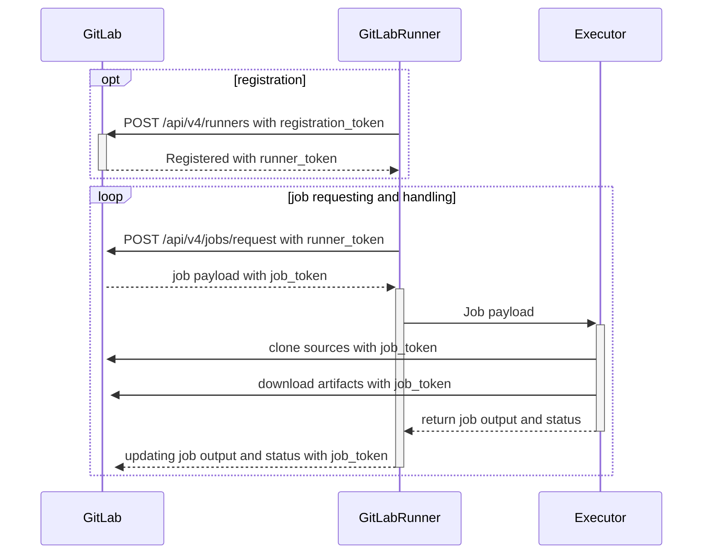



- 계층:  Free, Premium, Ultimate
- 제공:  GitLab.com, GitLab Self-Managed, GitLab Dedicated



러너는 GitLab CI/CD와 함께 작동하여 파이프라인에서 작업을 실행하는 애플리케이션입니다.

개발자가 GitLab에 코드를 푸시하면 `.gitlab-ci.yml` 파일에서 자동화된 작업을 정의할 수 있습니다. 이러한 작업에는 테스트 실행, 애플리케이션 빌드 또는 코드 배포가 포함될 수 있습니다. 러너는 컴퓨팅 인프라에서 이러한 작업을 실행하는 애플리케이션입니다.

관리자는 이러한 CI/CD 작업이 실행되는 인프라를 제공하고 관리할 책임이 있습니다. 이는 러너 애플리케이션 설치, 구성 및 조직의 CI/CD 워크로드를 처리할 수 있는 적절한 용량 확보를 포함합니다.

## 러너가 하는 작업 {#what-gitlab-runner-does}

러너는 GitLab 인스턴스에 연결되고 CI/CD 작업을 기다립니다. 파이프라인이 실행되면 GitLab은 사용 가능한 러너에 작업을 보냅니다. 러너는 작업을 실행하고 결과를 GitLab에 다시 보고합니다.

러너에는 다음 기능이 있습니다.

- 여러 작업을 동시에 실행합니다.
- 여러 서버에서 여러 토큰을 사용합니다(프로젝트별 포함).
- 토큰당 동시 작업 수를 제한합니다.
- 작업을 실행할 수 있습니다:
  - 로컬로.
  - Docker 컨테이너 사용.
  - Docker 컨테이너를 사용하고 SSH를 통해 작업을 실행합니다.
  - 다양한 클라우드 및 가상화 하이퍼바이저에서 자동 크기 조정이 있는 Docker 컨테이너를 사용합니다.
  - 원격 SSH 서버에 연결합니다.
- Go로 작성되고 다른 요구 사항 없이 단일 바이너리로 배포됩니다.
- Bash, PowerShell Core 및 Windows PowerShell을 지원합니다.
- GNU/Linux, macOS 및 Windows에서 작동합니다(Docker를 실행할 수 있는 거의 모든 곳).
- 작업 실행 환경을 사용자 지정할 수 있습니다.
- 재시작 없이 자동 구성 다시 로드.
- Docker, Docker-SSH, Parallels 또는 SSH 실행 환경 지원으로 원활한 설정.
- Docker 컨테이너 캐싱을 활성화합니다.
- GNU/Linux, macOS 및 Windows를 위한 서비스로 원활한 설치.
- 내장된 Prometheus 메트릭 HTTP 서버.
- Prometheus 메트릭 및 기타 작업 관련 데이터를 모니터링하고 GitLab에 전달하는 심판 워커입니다.

## 러너 실행 흐름 {#runner-execution-flow}

이 다이어그램은 러너가 어떻게 등록되고 작업이 어떻게 요청되고 처리되는지 보여줍니다. 또한 [등록 및 인증 토큰](https://docs.gitlab.com/api/runners/#registration-and-authentication-tokens) 및 [작업 토큰](https://docs.gitlab.com/ci/jobs/ci_job_token/)을 사용하는 작업을 보여줍니다.

## 러너 배포 옵션 {#runner-deployment-options}

### GitLab 호스팅 러너 {#gitlab-hosted-runners}

[GitLab 호스팅 러너](https://docs.gitlab.com/ci/runners/)는 GitLab에서 관리되며 GitLab.com에서 사용 가능합니다. 이러한 러너를 설치하거나 유지 관리할 필요가 없습니다. GitLab은 이를 서비스로 제공합니다. 그러나 실행 환경을 제한적으로 제어할 수 있으며 인프라를 사용자 지정할 수 없습니다.

### 자체 관리형 러너 {#self-managed-runners}

자체 관리형 러너는 사용자 자신의 인프라에 설치, 구성 및 관리하는 러너 인스턴스입니다. 모든 GitLab 설치에서 자체 관리형 러너를 [설치](install/_index.md)하고 등록할 수 있습니다. 관리자는 일반적으로 자체 관리형 러너와 함께 작동합니다.

GitLab에서 호스팅하고 관리하는 GitLab 호스팅 러너와 달리 자체 관리형 러너에 대해 완전한 제어 권한이 있습니다.

## 러너 버전 {#gitlab-runner-versions}

호환성상의 이유로 러너 [주.부](https://en.wikipedia.org/wiki/Software_versioning) 버전은 GitLab 주.부 버전과 동기화 상태로 유지되어야 합니다. 이전 러너는 여전히 최신 GitLab 버전과 함께 작동할 수 있으며 그 반대도 마찬가지입니다. 그러나 버전 차이가 있으면 일부 기능을 사용할 수 없거나 제대로 작동하지 않을 수 있습니다.

부 버전 업데이트 간에 이전 버전과의 호환성이 보장됩니다. 그러나 GitLab의 부 버전 업데이트는 러너가 동일한 부 버전에 있어야 하는 새 기능을 도입할 수 있습니다.

자신의 러너를 호스팅하지만 리포지토리를 GitLab.com에서 호스팅하는 경우 러너를 [최신 버전으로 업데이트](install/_index.md) 하십시오. GitLab.com은 [지속적으로 업데이트됩니다](https://handbook.gitlab.com/handbook/engineering/deployments-and-releases/).

## 문제 해결 {#troubleshooting}

일반적인 문제를 [해결하는 방법](faq/_index.md)을 알아보세요.

## 용어집 {#glossary}

- **GitLab Runner**:  대상 컴퓨팅 플랫폼에서 GitLab 파이프라인의 CI/CD 작업을 실행하는 애플리케이션입니다.
- **러너**:  작업을 실행할 수 있는 구성된 러너 인스턴스입니다. 실행기 유형에 따라 이 머신은 러너 관리자에 로컬이거나 (`shell` 또는 `docker` 실행기) 자동 스케일러에 의해 생성된 원격 머신(`docker-autoscaler` 또는 `kubernetes`)일 수 있습니다.
- **러너 구성**:  `[[runner]]` 항목 중 하나이며, `config.toml`에서 UI에 **runner**로 표시됩니다.
- **Runner manager**:  `config.toml` 파일을 읽고 모든 러너 구성 및 작업 실행을 동시에 실행하는 프로세스입니다.
- **Machine**:  러너가 작동하는 가상 머신(VM) 또는 포드입니다. 러너는 자동으로 고유한 영구 머신 ID를 생성하므로 여러 머신이 동일한 러너 구성을 받을 때 작업을 별도로 라우팅할 수 있지만 러너 구성은 UI에서 그룹화됩니다.
- **실행자**:  러너가 작업을 실행하는 데 사용하는 방법(Docker, Shell, Kubernetes 등)입니다.
- **파이프라인**:  코드가 GitLab으로 푸시될 때 자동으로 실행되는 작업 모음입니다.
- **작업**:  파이프라인의 단일 작업입니다(예: 테스트 실행 또는 애플리케이션 빌드).
- **Runner token**:  러너가 GitLab에 인증할 수 있게 해주는 고유 식별자입니다.
- **태그**:  러너에 할당되어 실행할 수 있는 작업을 결정하는 레이블입니다.
- **Concurrent jobs**:  러너가 동시에 실행할 수 있는 작업 수입니다.
- **Self-managed runner**:  자신의 인프라에 설치하고 관리하는 러너입니다.
- **GitLab-hosted runner**:  GitLab에서 제공 및 관리하는 러너입니다.

자세한 내용은 공식 [GitLab 단어 목록](https://docs.gitlab.com/development/documentation/styleguide/word_list/#gitlab-runner) 및 [러너](https://docs.gitlab.com/development/architecture/#gitlab-runner)의 GitLab 아키텍처 항목을 참조하십시오.

## 기여 {#contributing}

기여를 환영합니다. [`CONTRIBUTING.md`](https://gitlab.com/gitlab-org/gitlab-runner/blob/main/CONTRIBUTING.md) 및 [개발 문서](development/_index.md)를 참조하십시오.

GitLab 러너 프로젝트의 검토자인 경우 [GitLab 러너 검토](development/reviewing-gitlab-runner.md) 문서를 읽어보세요.

[GitLab 러너 프로젝트의 릴리스 프로세스](https://gitlab.com/gitlab-org/gitlab-runner/blob/main/PROCESS.md)도 검토할 수 있습니다.

## 변경 로그 {#changelog}

[변경 로그](https://gitlab.com/gitlab-org/gitlab-runner/blob/main/CHANGELOG.md)를 확인하여 최근 변경 사항을 보십시오.

## 라이선스 {#license}

이 코드는 MIT 라이선스에 따라 배포됩니다. [라이선스](https://gitlab.com/gitlab-org/gitlab-runner/blob/main/LICENSE) 파일을 보십시오.
