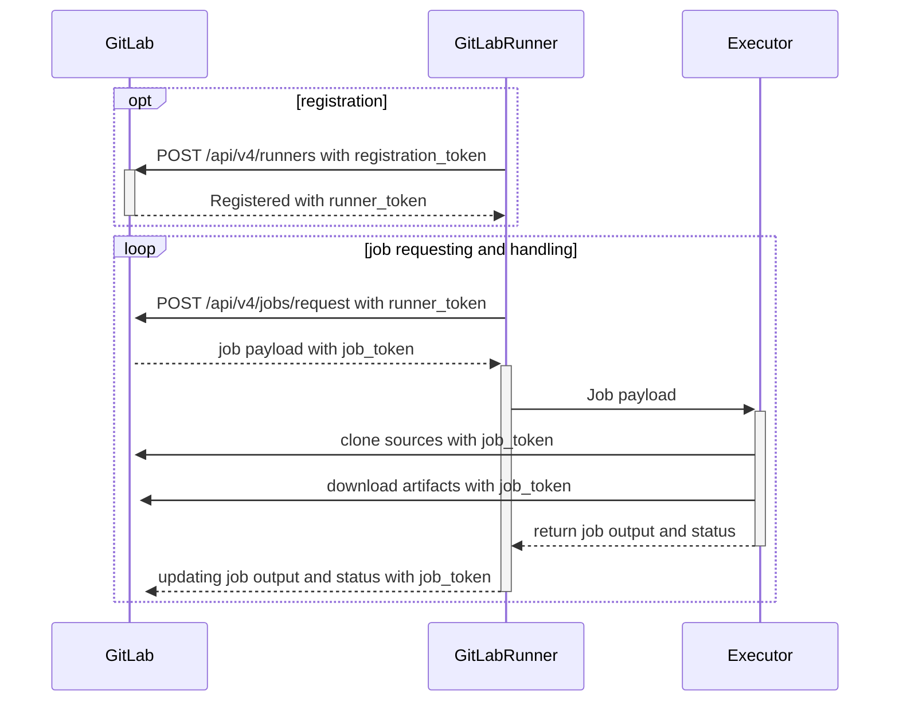



- Tier: Free, Premium, Ultimate
- Offering: GitLab.com, GitLab Self-Managed, GitLab Dedicated



GitLab Runner은 GitLab CI/CD와 함께 작동하여 파이프라인의 작업을 실행하는 애플리케이션입니다.

개발자가 GitLab에 코드를 푸시할 때, `.gitlab-ci.yml` 파일에 자동화된 작업을 정의할 수 있습니다.
이러한 작업에는 테스트 실행, 애플리케이션 빌드 또는 코드 배포 등이 포함될 수 있습니다.
GitLab Runner는 이러한 작업을 컴퓨팅 인프라에서 실행하는 애플리케이션입니다.

운영자는 CI/CD 작업이 실행되는 인프라를 제공하고 관리할 책임이 있습니다.
이 작업에는 GitLab Runner 애플리케이션 설치, 구성, 그리고 조직의 CI/CD 워크로드를 처리할 수 있는
충분한 용량을 확보하는 작업이 포함됩니다.

## GitLab Runner의 역할 {#what-gitlab-runner-does}

GitLab Runner는 GitLab 인스턴스에 연결되어 CI/CD 작업을 대기합니다. 파이프라인이 실행되면 GitLab은 사용 가능한 러너에게 작업을 전송합니다.
러너는 작업을 실행하고 그 결과를 GitLab에 다시 보고합니다.

GitLab Runner는 다음과 같은 기능을 제공합니다.

- 여러 작업을 동시에 실행합니다.
- 여러 서버에서 여러 토큰을 사용합니다(프로젝트별 사용도 가능).
- 토큰별로 동시 작업 수를 제한합니다.
- 작업은 다음과 같은 방식으로 실행할 수 있습니다.
  - 로컬 실행.
  - 도커 컨테이너 사용.
  - 도커 컨테이너를 사용하고 SSH를 통해 작업 실행.
  - 도커 컨테이너와 자동 스케일링을 사용하여 다양한 클라우드 및 가상화 하이퍼바이저에서 실행.
  - 원격 SSH 서버에 연결하여 실행.
- Go로 작성되었으며 추가 요구 사항 없이 단일 바이너리로 배포됩니다.
- Bash, PowerShell Core 및 Windows PowerShell을 지원합니다.
- GNU/Linux, macOS 및 Windows에서 작동합니다(도커가 실행되는 거의 모든 환경).
- 작업 실행 환경을 커스터마이징할 수 있습니다.
- 재시작 없이 구성을 자동으로 다시 로드합니다.
- Docker, Docker-SSH, Parallels 또는 SSH 실행 환경을 지원하여 원활한 설정을 제공합니다.
- 도커 컨테이너 캐싱을 지원합니다.
- GNU/Linux, macOS 및 Windows에서 서비스 형태로 원활하게 설치됩니다.
- Prometheus 메트릭 HTTP 서버가 내장되어 있습니다.
- Referee 워커는 Prometheus 측정항목과 기타 작업별 데이터를 모니터링하고 GitLab으로 전달합니다.

## 러너 실행 흐름 {#runner-execution-flow}

이 다이어그램은 러너가 어떻게 등록되고 작업이 어떻게 요청 및 처리되는지를 보여줍니다. 또한 어떤 작업이 [등록 및 인증 토큰](https://docs.gitlab.com/api/runners/#registration-and-authentication-tokens)과 [작업 토큰](https://docs.gitlab.com/ci/jobs/ci_job_token/)을 사용하는지도 표시됩니다.

## 러너 배포 옵션 {#runner-deployment-options}

### GitLab 호스틀 러너 {#gitlab-hosted-runners}

[GitLab 호스틀 러너](https://docs.gitlab.com/ci/runners/)는 GitLab에서 관리하며 GitLab.com에서 사용할 수 있습니다.
이러한 러너는 설치하거나 유지 관리할 필요 없으며 GitLab이 서비스로 제공합니다.
다만 실행 환경에 대한 제어권은 제한적이며 인프라를 커스터마이징할 수 없습니다.

### 자체 관리 러너 {#self-managed-runners}

자체 관리 러너는 자체 인프라에 설치, 구성 및 관리하는 GitLab Runner 인스턴스입니다.
모든 GitLab 설치 환경에서 자체 관리 러너를 [설치](install/_index.md)하고 등록할 수 있습니다.
운영자는 일반적으로 자체 관리 러너를 사용합니다.

GitLab이 호스팅하고 관리하는 GitLab 호스틀 러너와 달리, 자체 관리 러너는 완전한 제어권을 가질 수 있습니다.

## GitLab Runner 버전 {#gitlab-runner-versions}

호환성을 위해 GitLab Runner의 [major.minor](https://en.wikipedia.org/wiki/Software_versioning) 버전은
GitLab의 메이저 및 마이너 버전과 동기화되어 있어야 합니다. 이전 버전의 러너도 최신 GitLab 버전과
함께 작동할 수 있으며 그 반대도 가능합니다. 다만 버전 차이가 있는 경우 일부 기능을 사용할 수
없거나 올바르게 작동하지 않을 수 있습니다.

마이너 버전 업데이트 간에는 하위 호환성이 보장됩니다. 하지만 때때로 GitLab의 마이너 버전 업데이트에서
새로운 기능이 도입될 수 있으며, 이 경우 GitLab Runner도 동일한 마이너 버전으로 업데이트해야 합니다.

러너를 직접 호스팅하지만 리포지토리는 GitLab.com에서 호스팅하는 경우, GitLab.com은
[지속적으로 업데이트](https://handbook.gitlab.com/handbook/engineering/deployments-and-releases/)되므로 GitLab Runner를 최신 버전으로 [업데이트](install/_index.md)하세요.

## 문제 해결 {#troubleshooting}

일반적인 문제를 [해결하는 방법](faq/_index.md)을 알아보세요.

## 용어집 {#glossary}

- **GitLab Runner**: 대상 컴퓨팅 플랫폼에서 GitLab 파이프라인의 CI/CD 작업을 실행하는 애플리케이션입니다.
- **러너**: 작업을 실행할 수 있는 구성된 GitLab Runner 인스턴스입니다. 이그젝션자 유형에 따라
  러너 매니저와 동일한 로컬 머신(`shell` 또는 `docker` 이그젝션자)이거나 오토스케일러(`docker-autoscaler` 또는 `kubernetes`)가
  생성한 원격 머신일 수 있습니다.
- **러너 구성**: `config.toml`의 단일 `[[runner]]` 항목으로, UI에는 **러너**로 표시됩니다.
- **러너 매니저**: `config.toml` 파일을 읽고 모든 러너 구성과 작업 실행을 동시에 수행하는 프로세스입니다.
- **머신**: 러너가 동작하는 가상 머신(VM) 또는 pod입니다.
  GitLab Runner는 고유하고 지속적인 머신 ID를 자동으로 생성하므로, 여러 머신이 동일한 러너 구성을 부여받은 경우에도
  작업은 개별적으로 라우팅하면서 러너 구성은 UI에서 그룹으로 묶여 표시됩니다.
- **이그젝션자**: GitLab Runner가 작업을 실행하는 방식(Docker, Shell, Kubernetes 등)입니다.
- **파이프라인**: GitLab에 코드가 푸시되면 자동으로 실행되는 작업 집합입니다.
- **작업**: 테스트 실행이나 애플리케이션 빌드와 같은 파이프라인 내의 단일 작업입니다.
- **러너 토큰**: 러너가 GitLab에 인증할 수 있도록 하는 고유한 식별자입니다.
- **태그**: 러너에 할당된 레이블로, 실행할 수 있는 작업을 결정합니다.
- **동시 작업**: 하나의 러너가 동시에 실행할 수 있는 작업 수입니다.
- **자체 관리 러너**: 자체 인프라에 설치하고 관리하는 러너입니다.
- **GitLab 호스틀 러너**: GitLab이 제공하고 관리하는 러너입니다.

자세한 내용은 공식 [GitLab Word List](https://docs.gitlab.com/development/documentation/styleguide/word_list/#gitlab-runner)와
[GitLab Runner](https://docs.gitlab.com/development/architecture/#gitlab-runner)에 대한 GitLab 아키텍처 항목을 참조하세요.

## 기여하기 {#contributing}

기여를 환영합니다. 자세한 내용은 [`CONTRIBUTING.md`](https://gitlab.com/gitlab-org/gitlab-runner/blob/main/CONTRIBUTING.md)와
[개발 문서](development/_index.md)를 참조하세요.

GitLab Runner 프로젝트의 검토자라면, [Reviewing GitLab Runner](development/reviewing-gitlab-runner.md) 문서를
읽어보시기 바랍니다.

[GitLab Runner 프로젝트의 릴리즈 프로세스](https://gitlab.com/gitlab-org/gitlab-runner/blob/main/PROCESS.md)도 함께 검토해 보세요.

## 변경 이력 {#changelog}

최근 변경 사항은 [CHANGELOG](https://gitlab.com/gitlab-org/gitlab-runner/blob/main/CHANGELOG.md)에서 확인하세요.

## 라이선스 {#license}

이 코드는 MIT 라이선스하에 배포됩니다. [LICENSE](https://gitlab.com/gitlab-org/gitlab-runner/blob/main/LICENSE) 파일을 확인하세요.
