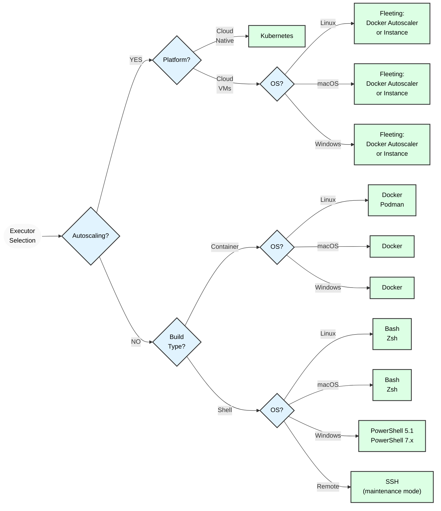



- 계층:  Free, Premium, Ultimate
- 제공:  GitLab.com, GitLab Self-Managed, GitLab Dedicated



GitLab Runner는 다양한 환경에서 빌드를 실행하는 데 사용할 수 있는 여러 실행기를 제공합니다:

- [Kubernetes](kubernetes/_index.md)
- [Docker](docker.md)
- [Docker Autoscaler](docker_autoscaler.md)
- [Instance](instance.md)

[기타 실행기](#executors-in-maintenance-mode)는 활발한 기능 개발 대상이 아닙니다. 중요한 보안 업데이트는 제공되지만 새로운 기능은 제공되지 않습니다.

> [!note]
> 일부 기능을 사용하려면 [fleeting](../fleet_scaling/fleeting.md)을 사용하는 러너가 필요합니다. Docker Autoscaler 및 Instance 실행기는 fleeting을 사용합니다. GitLab Runner의 전체 기능을 활용하려면 이러한 실행기 중 하나로 마이그레이션해야 합니다.

어느 실행기를 선택할지 확실하지 않은 경우 [실행기 선택](#selecting-the-executor)을 참조하세요.

각 실행기가 지원하는 기능에 대한 자세한 내용은 [호환성 표](#compatibility-chart)를 참조하세요.

이러한 실행기는 잠겨 있으며 더 이상 개발하거나 새로운 실행기를 받지 않습니다. 자세한 내용은 [새로운 실행기 기여](https://gitlab.com/gitlab-org/gitlab-runner/blob/main/CONTRIBUTING.md#contributing-new-executors)를 참조하세요.

## 실행기 선택 {#selecting-the-executor}

실행기는 프로젝트를 빌드하기 위한 다양한 플랫폼과 방법론을 지원합니다. 다음 다이어그램은 운영 체제 및 플랫폼을 기반으로 선택할 실행기를 보여줍니다:

> [!warning]
> SSH 실행기는 유지 보수 모드입니다. 중요한 보안 업데이트는 제공되지만 새로운 기능은 계획되지 않습니다. 또한 지원이 가장 적은 실행기 중 하나입니다. 로컬 셸 기반 빌드의 경우 대신 Shell 실행기를 사용하는 것을 고려하세요.

아래 표는 각 실행기를 선택하는 데 도움이 되는 주요 사항을 보여줍니다:

> [!note]
> SSH, Shell, VirtualBox, Parallels 및 Custom 실행기는 유지 보수 모드입니다. 중요한 보안 업데이트는 제공되지만 새로운 기능은 계획되지 않습니다.

| 실행기                                         | Docker | Docker Autoscaler |                 Instance |   Kubernetes   | SSH  |     셸      |   VirtualBox   |   Parallels    |          Custom          |
|:-------------------------------------------------|:------:|:-----------------:|-------------------------:|:--------------:|:----:|:--------------:|:--------------:|:--------------:|:------------------------:|
| 매 빌드마다 깨끗한 빌드 환경          |   ✓    |         ✓         | 조건부 1 |       ✓        |  ✗   |       ✗        |       ✓        |       ✓        | 조건부 1 |
| 이전 복제본이 있으면 재사용                |   ✓    |         ✓         | 조건부 1 | ✓ 2 |  ✓   |       ✓        |       ✗        |       ✗        | 조건부 1 |
| 러너 파일 시스템 접근 보호 3 |   ✓    |         ✓         |                        ✗ |       ✓        |  ✓   |       ✗        |       ✓        |       ✓        |       조건부        |
| 러너 머신 마이그레이션                           |   ✓    |         ✓         |                        ✓ |       ✓        |  ✗   |       ✗        |    부분적     |    부분적     |            ✓             |
| 동시 빌드에 대한 구성 필요 없음 |   ✓    |         ✓         |                        ✓ |       ✓        |  ✗   | ✗ 4 |       ✓        |       ✓        | 조건부 1 |
| 복잡한 빌드 환경                   |   ✓    |         ✓         |           ✗ 5 |       ✓        |  ✗   | ✗ 5 | ✓ 6 | ✓ 6 |            ✓             |
| 빌드 문제 디버깅                         | 중간 |      중간       |                   중간 |     중간     | 쉬움 |      쉬움      |      어려움      |      어려움      |          중간          |

**각주**:

1. 프로비저닝하는 환경에 따라 달라집니다. 완전히 격리되거나 빌드 간에 공유될 수 있습니다.
1. [지속성 있는 동시성별 빌드 볼륨](kubernetes/_index.md#persistent-per-concurrency-build-volumes) 구성이 필요합니다.
1. 러너의 파일 시스템 접근이 보호되지 않으면 작업은 러너 토큰 및 다른 작업의 캐시와 코드를 포함한 전체 시스템에 접근할 수 있습니다. ✓로 표시된 실행기는 기본적으로 러너가 파일 시스템에 접근할 수 없습니다. 그러나 보안 결함이나 특정 구성으로 인해 작업이 해당 컨테이너 밖으로 나가 러너를 호스팅하는 파일 시스템에 접근할 수 있습니다.
1. 빌드가 빌드 머신에 설치된 서비스를 사용하는 경우 실행기 선택이 가능하지만 문제가 될 수 있습니다.
1. 수동 종속성 설치가 필요합니다.
1. 예를 들어 [Vagrant](https://developer.hashicorp.com/vagrant/docs/providers/virtualbox "Vagrant documentation for VirtualBox")를 사용합니다.

### Docker 실행기 {#docker-executor}

Docker 실행기는 컨테이너를 통해 깨끗한 빌드 환경을 제공합니다. 종속성 관리는 간단하며 모든 종속성이 Docker 이미지에 패키징됩니다. 이 실행기는 Runner 호스트에 Docker 설치가 필요합니다.

이 실행기는 MySQL 같은 추가 [서비스](https://docs.gitlab.com/ci/services/)를 지원합니다. 또한 Podman을 대체 컨테이너 런타임으로 지원합니다.

이 실행기는 일관되고 격리된 빌드 환경을 유지합니다.

### Docker Autoscaler 실행기 {#docker-autoscaler-executor}

Docker Autoscaler 실행기는 러너 관리자가 처리하는 작업을 수용하기 위해 필요에 따라 인스턴스를 생성하는 자동 크기 조정이 활성화된 Docker 실행기입니다. [Docker 실행기](docker.md)를 래핑하므로 모든 Docker 실행기 옵션과 기능을 지원합니다.

Docker Autoscaler는 [fleeting 플러그인](https://gitlab.com/gitlab-org/fleeting/fleeting)을 사용하여 자동 크기 조정합니다. Fleeting은 자동 크기 조정된 인스턴스 그룹에 대한 추상화이며, Google Cloud, AWS, Azure 같은 클라우드 제공자를 지원하는 플러그인을 사용합니다. 이 실행기는 동적 워크로드 요구 사항이 있는 환경에 특히 적합합니다.

### Instance 실행기 {#instance-executor}

Instance 실행기는 러너 관리자가 처리하는 예상 작업 볼륨을 수용하기 위해 필요에 따라 인스턴스를 생성하는 자동 크기 조정이 활성화된 실행기입니다.

이 실행기 및 관련 Docker Autoscale 실행기는 GitLab Runner Fleeting 및 Taskscaler 기술과 함께 작동하는 새로운 자동 크기 조정 실행기입니다.

Instance 실행기도 [fleeting 플러그인](https://gitlab.com/gitlab-org/fleeting/fleeting)을 사용하여 자동 크기 조정합니다.

작업이 호스트 인스턴스, 운영 체제 및 연결된 장치에 완전히 접근해야 하는 경우 Instance 실행기를 사용할 수 있습니다. Instance 실행기는 단일 테넌트 및 다중 테넌트 작업을 수용하도록 구성할 수도 있습니다.

### Kubernetes 실행기 {#kubernetes-executor}

Kubernetes 실행기를 사용하여 빌드에 기존 Kubernetes 클러스터를 사용할 수 있습니다. 실행기는 Kubernetes 클러스터 API를 호출하고 각 GitLab CI/CD 작업에 대해 새 Pod(빌드 컨테이너 및 서비스 컨테이너 포함)를 생성합니다. 이 실행기는 클라우드 네이티브 환경에 특히 적합하며 뛰어난 확장성과 리소스 활용을 제공합니다.

## 유지 보수 모드의 실행기 {#executors-in-maintenance-mode}

이러한 실행기는 중요한 보안 업데이트를 받지만 새로운 기능은 계획되지 않습니다:

- [SSH](ssh.md)
- [셸](shell.md)
- [Parallels](parallels.md)
- [VirtualBox](virtualbox.md)
- [Custom](custom.md)
- [Docker Machine](docker_machine.md) (deprecated)

## 호환성 표 {#compatibility-chart}

다양한 실행기가 지원하는 기능입니다.

> [!note]
> SSH, Shell, VirtualBox, Parallels 및 Custom 실행기는 유지 보수 모드입니다. 중요한 보안 업데이트는 제공되지만 새로운 기능은 계획되지 않습니다.

| 실행기                                     | Docker | Docker Autoscaler |    Instance    | Kubernetes |      SSH       |     셸      |    VirtualBox    |    Parallels     |                           Custom                            |
|:---------------------------------------------|:------:|:-----------------:|:--------------:|:----------:|:--------------:|:--------------:|:----------------:|:----------------:|:-----------------------------------------------------------:|
| 보안 변수                             |   ✓    |         ✓         |       ✓        |     ✓      |       ✓        |       ✓        |        ✓         |        ✓         |                              ✓                              |
| `.gitlab-ci.yml`: image                      |   ✓    |         ✓         |       ✗        |     ✓      |       ✗        |       ✗        | ✓ (1) | ✓ (1) | ✓ (by using [`$CUSTOM_ENV_CI_JOB_IMAGE`](custom.md#stages)) |
| `.gitlab-ci.yml`: services                   |   ✓    |         ✓         |       ✗        |     ✓      |       ✗        |       ✗        |        ✗         |        ✗         |                              ✓                              |
| `.gitlab-ci.yml`: cache                      |   ✓    |         ✓         |       ✓        |     ✓      |       ✓        |       ✓        |        ✓         |        ✓         |                              ✓                              |
| `.gitlab-ci.yml`: artifacts                  |   ✓    |         ✓         |       ✓        |     ✓      |       ✓        |       ✓        |        ✓         |        ✓         |                              ✓                              |
| 스테이지 간 아티팩트 전달             |   ✓    |         ✓         |       ✓        |     ✓      |       ✓        |       ✓        |        ✓         |        ✓         |                              ✓                              |
| GitLab 컨테이너 레지스트리 비공개 이미지 사용 |   ✓    |         ✓         | 적용할 수 없음 |     ✓      | 적용할 수 없음 | 적용할 수 없음 |  적용할 수 없음  |  적용할 수 없음  |                       적용할 수 없음                        |
| 대화형 웹 터미널                     |   ✓    |         ✗         |       ✗        |     ✓      |       ✗        |       ✓        |        ✗         |        ✗         |                              ✗                              |

**각주**:

1. GitLab Runner 14.2에서 [추가](https://gitlab.com/gitlab-org/gitlab-runner/-/merge_requests/1257)된 지원입니다. [기본 VM 이미지 재정의](../configuration/advanced-configuration.md#overriding-the-base-vm-image) 섹션을 참조하여 자세한 내용을 확인하세요.

다양한 셸에서 지원되는 시스템:

| 셸   |      Bash      | PowerShell Desktop  | PowerShell Core   |  sh  |
| :------: | :------------: | :-----------------: | :---------------: | :--: |
| Linux    | ✓ 1 |         ✗           |        ✓          |  ✓   |
| macOS    | ✓ 1 |         ✗           |        ✓          |  ✓   |
| FreeBSD  | ✓ 1 |         ✗           |        ✗          |  ✓   |
| Windows  | ✗ 3 |   ✓ 4    | ✓ 2,5  |  ✗   |

**Footnotes:**

1. 기본 셸
1. 러너 등록 및 `shell` 실행기를 사용하는 작업에 대한 기본 셸입니다.
1. Windows에서는 Bash 셸이 지원되지 않습니다.
1. `docker-windows` 및 `kubernetes` 실행기를 사용하는 작업에 대한 기본 셸입니다.
1. `shell` 실행기를 사용하는 작업에 대한 기본 셸입니다.

다양한 셸에서 대화형 웹 터미널이 지원되는 시스템:

| 셸  | Bash | PowerShell Desktop | PowerShell Core |  sh  |
| :-----: | :--: | :----------------: | :-------------: | :--: |
| Windows |  ✗   |         ✓          |        ✓        |  ✗   |
| Linux   |  ✓   |         ✗          |        ✓        |  ✓   |
| macOS   |  ✓   |         ✗          |        ✓        |  ✓   |
| FreeBSD |  ✓   |         ✗          |        ✗        |  ✓   |

## 비 Docker 실행기에 대한 Git 요구 사항 {#git-requirements-for-non-docker-executors}

[도우미 이미지에 의존하지 않는](../configuration/advanced-configuration.md#helper-image) 실행기는 대상 머신에 Git 설치가 필요하며 `PATH`에 있어야 합니다. 항상 [최신 이용 가능 버전의 Git](https://git-scm.com/downloads/)을 사용하세요.

GitLab Runner는 `git lfs` 명령을 사용합니다([Git LFS](https://git-lfs.com/)가 대상 머신에 설치된 경우). GitLab Runner가 이러한 실행기를 사용하는 모든 시스템에서 Git LFS가 최신 상태인지 확인하세요.

GitLab Runner 명령을 실행하는 사용자에 대해 `git lfs install`로 Git LFS를 초기화해야 합니다. `git lfs install --system`로 전체 시스템에서 Git LFS를 초기화할 수 있습니다.

GitLab 인스턴스와의 Git 상호 작용을 인증하기 위해 GitLab Runner는 [`CI_JOB_TOKEN`](https://docs.gitlab.com/ci/jobs/ci_job_token/)를 사용합니다. [`FF_GIT_URLS_WITHOUT_TOKENS`](../configuration/feature-flags.md) 설정에 따라, 마지막으로 사용된 자격 증명이 사전 설치된 Git 자격 증명 도우미(예: [Git credential manager](https://github.com/git-ecosystem/git-credential-manager))에서 캐시될 수 있습니다. 이러한 도우미가 설치되고 자격 증명을 캐시하도록 구성된 경우:

- [`FF_GIT_URLS_WITHOUT_TOKENS`](../configuration/feature-flags.md)이(가) `false`일 때, 마지막으로 사용된 [`CI_JOB_TOKEN`](https://docs.gitlab.com/ci/jobs/ci_job_token/)이(가) 사전 설치된 Git 자격 증명 도우미에 저장됩니다.
- [`FF_GIT_URLS_WITHOUT_TOKENS`](../configuration/feature-flags.md)이(가) `true`일 때, [`CI_JOB_TOKEN`](https://docs.gitlab.com/ci/jobs/ci_job_token/)은(는) 사전 설치된 Git 자격 증명 도우미에서 저장되거나 캐시되지 않습니다.
