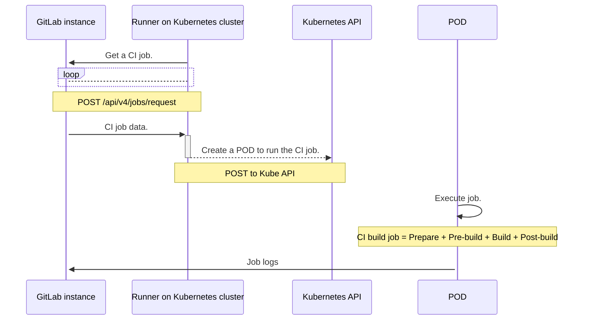
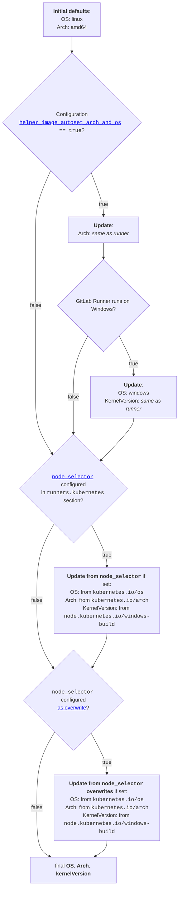



- 계층:  Free, Premium, Ultimate
- 제공:  GitLab.com, GitLab Self-Managed, GitLab Dedicated



Kubernetes 실행기를 사용하여 빌드를 위해 Kubernetes 클러스터를 사용합니다. 실행기는 Kubernetes 클러스터 API를 호출하고 각 GitLab CI 작업에 대한 포드를 생성합니다.

Kubernetes 실행기는 빌드를 여러 단계로 나눕니다:

1. **Prepare**:  Kubernetes 클러스터에 대한 Pod을 생성합니다. 이렇게 하면 빌드와 서비스를 실행하는 데 필요한 컨테이너가 생성됩니다.
1. **Pre-build**:  이전 단계에서 클론, 캐시 복원 및 아티팩트 다운로드를 수행합니다. 이 단계는 포드의 일부로 특수 컨테이너에서 실행됩니다.
1. **빌드**:  사용자 빌드.
1. **Post-build**:  캐시 생성, GitLab에 아티팩트 업로드. 이 단계는 포드의 일부로 특수 컨테이너도 사용합니다.

## 러너가 Kubernetes 포드를 생성하는 방법 {#how-the-runner-creates-kubernetes-pods}

다음 다이어그램은 GitLab 인스턴스와 Kubernetes 클러스터에 호스팅된 러너 간의 상호 작용을 보여줍니다. 러너는 Kubernetes API를 호출하여 클러스터에서 포드를 생성합니다.

포드는 `service` 또는 `.gitlab-ci.yml` 파일에 정의된 각 `config.toml`에 대해 다음 컨테이너로 구성됩니다:

- `build`로 정의된 빌드 컨테이너입니다.
- `helper`로 정의된 도우미 컨테이너입니다.
- 다음 로직을 사용하여 명명된 서비스 컨테이너입니다:
  - 서비스에 유효한 [DNS 레이블 이름](https://kubernetes.io/docs/concepts/overview/working-with-objects/names/#dns-label-names)인 별칭이 있고 다른 서비스 컨테이너에서 아직 사용되지 않은 경우 해당 별칭이 컨테이너 이름으로 사용됩니다.
  - 유효한 별칭이 없으면 컨테이너의 이름은 `svc-N`이며, 여기서 `N`는 `0`부터 시작하는 순차 인덱스입니다.



- 별칭 기반 명명이 GitLab 러너 17.9에서 [도입](https://gitlab.com/gitlab-org/gitlab-runner/-/merge_requests/4469)되었습니다.



서비스와 컨테이너는 동일한 Kubernetes 포드에서 실행되며 동일한 localhost 주소를 공유합니다. 다음 제한 사항이 적용됩니다:

- 서비스는 DNS 이름을 통해 액세스할 수 있습니다. 이전 버전을 사용하는 경우 `localhost`를 사용해야 합니다.
- 동일한 포트를 사용하는 여러 서비스를 사용할 수 없습니다. 예를 들어 동시에 두 개의 `mysql` 서비스를 가질 수 없습니다.



다이어그램의 상호 작용은 모든 Kubernetes 클러스터에 유효합니다. 예를 들어 주요 퍼블릭 클라우드 제공 업체에서 호스팅되는 턴키 솔루션 또는 자체 관리 Kubernetes 설치입니다.

## Kubernetes API에 연결 {#connect-to-the-kubernetes-api}

Kubernetes API에 연결하려면 다음 옵션을 사용하세요. 제공된 사용자 계정은 지정된 네임스페이스에서 Pods를 생성, 나열 및 연결할 수 있는 권한이 있어야 합니다.

| 옵션      | 설명 |
|-------------|-------------|
| `host`      | 선택 사항 Kubernetes API 서버 호스트 URL(지정하지 않은 경우 자동 검색 시도). |
| `context`   | `kubectl` 구성에서 사용할 선택 사항 Kubernetes 컨텍스트 이름입니다. `host`를 지정하지 않을 때 이 옵션을 사용하세요. |
| `cert_file` | 선택 사항 Kubernetes API 서버 사용자 인증 인증서입니다. |
| `key_file`  | 선택 사항 Kubernetes API 서버 사용자 인증 개인 키입니다. |
| `ca_file`   | 선택 사항 Kubernetes API 서버 ca 인증서입니다. |

Kubernetes 클러스터에서 GitLab 러너를 실행 중인 경우 이 필드를 생략하여 GitLab 러너가 Kubernetes API를 자동 검색하도록 합니다.

Kubernetes 클러스터 외부에서 GitLab 러너를 실행 중인 경우 이 설정을 통해 GitLab 러너가 클러스터의 Kubernetes API에 액세스할 수 있습니다. `host`를 인증 세부 정보와 함께 지정하거나 `context`를 사용하여 `kubectl` 구성에서 특정 컨텍스트를 참조할 수 있습니다.

### Kubernetes API 호출을 위해 베어러 토큰 설정 {#set-the-bearer-token-for-kubernetes-api-calls}

포드를 생성하기 위해 API 호출의 베어러 토큰을 설정하려면 `KUBERNETES_BEARER_TOKEN` 변수를 사용하세요. 이를 통해 프로젝트 소유자는 프로젝트 서비스 계정 변수를 사용하여 베어러 토큰을 지정할 수 있습니다.

베어러 토큰을 지정할 때 `Host` 구성 설정을 설정해야 합니다.

``` yaml
variables:
  KUBERNETES_BEARER_TOKEN: thebearertokenfromanothernamespace
```

### 러너 API 권한 구성 {#configure-runner-api-permissions}

핵심 API 그룹에 대한 권한을 구성하려면 GitLab 러너 Helm 차트의 `values.yml` 파일을 업데이트하세요.

다음 중 하나를 수행할 수 있습니다:

- `rbac.create`를 `true`로 설정합니다.
- `serviceAccount.name: <service_account_name>`이(가) 있는 서비스 계정을 지정하고 `values.yml` 파일에서 다음 권한을 사용합니다.

<!-- `k8s_api_permissions_list_start` -->

| 리소스 | 동사 (선택 사항 기능/구성 플래그) |
|----------|-------------------------------|
| apps/deployments | 생성 (`kubernetes.autoscaler`), 삭제 (`kubernetes.autoscaler`), 가져오기 (`kubernetes.autoscaler`), 나열 (`kubernetes.autoscaler`), 업데이트 (`kubernetes.autoscaler`) |
| 이벤트 | 나열 (`print_pod_warning_events=true`), 감시 (`FF_PRINT_POD_EVENTS=true`) |
| 네임스페이스 | 생성 (`kubernetes.NamespacePerJob=true`), 삭제 (`kubernetes.NamespacePerJob=true`) |
| poddisruptionbudgets | 생성 (`pod_disruption_budget=true`), 가져오기 (`pod_disruption_budget=true`) |
| 포드 | 생성, 삭제, 가져오기, 나열 ([Informers 사용](#informers) ), 감시 ([Informers 사용](#informers), `FF_KUBERNETES_HONOR_ENTRYPOINT=true`, `FF_USE_LEGACY_KUBERNETES_EXECUTION_STRATEGY=false`) |
| 포드/연결 | 생성 (`FF_USE_LEGACY_KUBERNETES_EXECUTION_STRATEGY=false`), 삭제 (`FF_USE_LEGACY_KUBERNETES_EXECUTION_STRATEGY=false`), 가져오기 (`FF_USE_LEGACY_KUBERNETES_EXECUTION_STRATEGY=false`), 패치 (`FF_USE_LEGACY_KUBERNETES_EXECUTION_STRATEGY=false`) |
| 포드/실행 | 생성, 삭제, 가져오기, 패치 |
| 포드/로그 | 가져오기 (`FF_KUBERNETES_HONOR_ENTRYPOINT=true`, `FF_USE_LEGACY_KUBERNETES_EXECUTION_STRATEGY=false`, `FF_WAIT_FOR_POD_TO_BE_REACHABLE=true`), 나열 (`FF_KUBERNETES_HONOR_ENTRYPOINT=true`, `FF_USE_LEGACY_KUBERNETES_EXECUTION_STRATEGY=false`) |
| scheduling.k8s.io/priorityclasses | 생성 (`kubernetes.autoscaler`), 가져오기 (`kubernetes.autoscaler`) |
| 비밀 | 생성, 삭제, 가져오기, 업데이트 |
| 서비스계정 | 가져오기 |
| 서비스 | 생성, 가져오기 |

<!-- `k8s_api_permissions_list_end` -->

다음 YAML 역할 정의를 사용하여 필요한 권한이 있는 역할을 생성할 수 있습니다.

<!-- `k8s_api_permissions_role_yaml_start` -->

```yaml
apiVersion: rbac.authorization.k8s.io/v1
kind: Role
metadata:
  name: gitlab-runner
  namespace: default
rules:
- apiGroups: ["apps"]
  resources: ["deployments"]
  verbs:
  - "create" # Required when `kubernetes.autoscaler`
  - "delete" # Required when `kubernetes.autoscaler`
  - "get" # Required when `kubernetes.autoscaler`
  - "list" # Required when `kubernetes.autoscaler`
  - "update" # Required when `kubernetes.autoscaler`
- apiGroups: [""]
  resources: ["events"]
  verbs:
  - "list" # Required when `print_pod_warning_events=true`
  - "watch" # Required when `FF_PRINT_POD_EVENTS=true`
- apiGroups: [""]
  resources: ["namespaces"]
  verbs:
  - "create" # Required when `kubernetes.NamespacePerJob=true`
  - "delete" # Required when `kubernetes.NamespacePerJob=true`
- apiGroups: ["policy"]
  resources: ["poddisruptionbudgets"]
  verbs:
  - "create" # Required when `pod_disruption_budget=true`
  - "get" # Required when `pod_disruption_budget=true`
- apiGroups: [""]
  resources: ["pods"]
  verbs:
  - "create"
  - "delete"
  - "get"
  - "list" # Required when using Informers (https://docs.gitlab.com/runner/executors/kubernetes/#informers)
  - "watch" # Required when `FF_KUBERNETES_HONOR_ENTRYPOINT=true`, `FF_USE_LEGACY_KUBERNETES_EXECUTION_STRATEGY=false`, using Informers (https://docs.gitlab.com/runner/executors/kubernetes/#informers)
- apiGroups: [""]
  resources: ["pods/attach"]
  verbs:
  - "create" # Required when `FF_USE_LEGACY_KUBERNETES_EXECUTION_STRATEGY=false`
  - "delete" # Required when `FF_USE_LEGACY_KUBERNETES_EXECUTION_STRATEGY=false`
  - "get" # Required when `FF_USE_LEGACY_KUBERNETES_EXECUTION_STRATEGY=false`
  - "patch" # Required when `FF_USE_LEGACY_KUBERNETES_EXECUTION_STRATEGY=false`
- apiGroups: [""]
  resources: ["pods/exec"]
  verbs:
  - "create"
  - "delete"
  - "get"
  - "patch"
- apiGroups: [""]
  resources: ["pods/log"]
  verbs:
  - "get" # Required when `FF_KUBERNETES_HONOR_ENTRYPOINT=true`, `FF_USE_LEGACY_KUBERNETES_EXECUTION_STRATEGY=false`, `FF_WAIT_FOR_POD_TO_BE_REACHABLE=true`
  - "list" # Required when `FF_KUBERNETES_HONOR_ENTRYPOINT=true`, `FF_USE_LEGACY_KUBERNETES_EXECUTION_STRATEGY=false`
- apiGroups: ["scheduling.k8s.io"]
  resources: ["priorityclasses"]
  verbs:
  - "create" # Required when `kubernetes.autoscaler`
  - "get" # Required when `kubernetes.autoscaler`
- apiGroups: [""]
  resources: ["secrets"]
  verbs:
  - "create"
  - "delete"
  - "get"
  - "update"
- apiGroups: [""]
  resources: ["serviceaccounts"]
  verbs:
  - "get"
- apiGroups: [""]
  resources: ["services"]
  verbs:
  - "create"
  - "get"
```

<!-- `k8s_api_permissions_role_yaml_end` -->

추가 세부 정보:

- `event` 권한은 GitLab 16.2.1 이상에서만 필요합니다.
- `namespace` 권한은 `namespace_per_job`를 사용하여 네임스페이스 격리를 활성화할 때만 필요합니다.
- `pods/log` 권한은 다음 시나리오 중 하나가 참인 경우에만 필요합니다:
  - [`FF_KUBERNETES_HONOR_ENTRYPOINT` 기능 플래그](../../configuration/feature-flags.md)이(가) 활성화됩니다.
  - [`FF_USE_LEGACY_KUBERNETES_EXECUTION_STRATEGY` 기능 플래그](../../configuration/feature-flags.md) 는 [`CI_DEBUG_SERVICES` 변수](https://docs.gitlab.com/ci/services/#capturing-service-container-logs)가 `true`로 설정될 때 비활성화됩니다.
  - [`FF_WAIT_FOR_POD_TO_BE_REACHABLE` 기능 플래그](../../configuration/feature-flags.md)이(가) 활성화됩니다.

#### Informers {#informers}

GitLab 러너 17.9.0 이상에서 Kubernetes informer는 빌드 포드 변경 사항을 추적합니다. 이렇게 하면 실행기가 변경 사항을 더 빠르게 감지할 수 있습니다.

informer는 `list` 및 `watch` 권한이 `pods`에 필요합니다. 실행기가 빌드를 시작할 때 Kubernetes API에서 권한을 확인합니다. 모든 권한이 부여되면 실행기는 informer를 사용합니다. 권한이 없으면 GitLab 러너가 경고를 기록합니다. 빌드가 계속되고 이전 메커니즘을 사용하여 빌드 포드의 상태와 변경 사항을 추적합니다.

## 구성 설정 {#configuration-settings}

`config.toml` 파일에서 다음 설정을 사용하여 Kubernetes 실행기를 구성합니다.

### CPU 요청 및 제한 {#cpu-requests-and-limits}

| 설정                                     | 설명 |
|---------------------------------------------|-------------|
| `cpu_limit`                                 | 빌드 컨테이너에 주어진 CPU 할당입니다. |
| `cpu_limit_overwrite_max_allowed`           | 빌드 컨테이너에 대해 CPU 할당을 쓸 수 있는 최대 양입니다. 비어 있으면 CPU 제한 덮어쓰기 기능을 비활성화합니다. |
| `cpu_request`                               | 빌드 컨테이너에 요청된 CPU 할당입니다. |
| `cpu_request_overwrite_max_allowed`         | 빌드 컨테이너에 대해 CPU 할당 요청을 쓸 수 있는 최대 양입니다. 비어 있으면 CPU 요청 덮어쓰기 기능을 비활성화합니다. |
| `helper_cpu_limit`                          | 빌드 도우미 컨테이너에 주어진 CPU 할당입니다. |
| `helper_cpu_limit_overwrite_max_allowed`    | 도우미 컨테이너에 대해 CPU 할당을 쓸 수 있는 최대 양입니다. 비어 있으면 CPU 제한 덮어쓰기 기능을 비활성화합니다. |
| `helper_cpu_request`                        | 빌드 도우미 컨테이너에 요청된 CPU 할당입니다. |
| `helper_cpu_request_overwrite_max_allowed`  | 도우미 컨테이너에 대해 CPU 할당 요청을 쓸 수 있는 최대 양입니다. 비어 있으면 CPU 요청 덮어쓰기 기능을 비활성화합니다. |
| `service_cpu_limit`                         | 빌드 서비스 컨테이너에 주어진 CPU 할당입니다. |
| `service_cpu_limit_overwrite_max_allowed`   | 서비스 컨테이너에 대해 CPU 할당을 쓸 수 있는 최대 양입니다. 비어 있으면 CPU 제한 덮어쓰기 기능을 비활성화합니다. |
| `service_cpu_request`                       | 빌드 서비스 컨테이너에 요청된 CPU 할당입니다. |
| `service_cpu_request_overwrite_max_allowed` | 서비스 컨테이너에 대해 CPU 할당 요청을 쓸 수 있는 최대 양입니다. 비어 있으면 CPU 요청 덮어쓰기 기능을 비활성화합니다. |
| `pod_cpu_limit`                             | 빌드 포드에 주어진 CPU 할당입니다. |
| `pod_cpu_limit_overwrite_max_allowed`       | 빌드 포드에 대해 CPU 할당을 쓸 수 있는 최대 양입니다. 비어 있으면 CPU 제한 덮어쓰기 기능을 비활성화합니다. |
| `pod_cpu_request`                           | 빌드 포드에 요청된 CPU 할당입니다. |
| `pod_cpu_request_overwrite_max_allowed`     | 빌드 포드에 대해 CPU 할당 요청을 쓸 수 있는 최대 양입니다. 비어 있으면 CPU 요청 덮어쓰기 기능을 비활성화합니다. |

> [!note]
> Pod 수준의 리소스 사양이 [Kubernetes v1.32](https://v1-32.docs.kubernetes.io/blog/2024/12/11/kubernetes-v1-32-release/#pod-level-resource-specifications) 에서 알파 기능으로 도입되었으며 [Kubernetes v1.34](https://kubernetes.io/blog/2025/09/22/kubernetes-v1-34-pod-level-resources/)에서 베타로 졸업했습니다.

### 메모리 요청 및 제한 {#memory-requests-and-limits}

| 설정                                        | 설명 |
|------------------------------------------------|-------------|
| `memory_limit`                                 | 빌드 컨테이너에 할당된 메모리 양입니다. |
| `memory_limit_overwrite_max_allowed`           | 빌드 컨테이너에 대해 메모리 할당을 쓸 수 있는 최대 양입니다. 비어 있으면 메모리 제한 덮어쓰기 기능을 비활성화합니다. |
| `memory_request`                               | 빌드 컨테이너에서 요청된 메모리 양입니다. |
| `memory_request_overwrite_max_allowed`         | 빌드 컨테이너에 대해 메모리 할당 요청을 쓸 수 있는 최대 양입니다. 비어 있으면 메모리 요청 덮어쓰기 기능을 비활성화합니다. |
| `helper_memory_limit`                          | 빌드 도우미 컨테이너에 할당된 메모리 양입니다. |
| `helper_memory_limit_overwrite_max_allowed`    | 도우미 컨테이너에 대해 메모리 할당을 쓸 수 있는 최대 양입니다. 비어 있으면 메모리 제한 덮어쓰기 기능을 비활성화합니다. |
| `helper_memory_request`                        | 빌드 도우미 컨테이너에 요청된 메모리 양입니다. |
| `helper_memory_request_overwrite_max_allowed`  | 도우미 컨테이너에 대해 메모리 할당 요청을 쓸 수 있는 최대 양입니다. 비어 있으면 메모리 요청 덮어쓰기 기능을 비활성화합니다. |
| `service_memory_limit`                         | 빌드 서비스 컨테이너에 할당된 메모리 양입니다. |
| `service_memory_limit_overwrite_max_allowed`   | 서비스 컨테이너에 대해 메모리 할당을 쓸 수 있는 최대 양입니다. 비어 있으면 메모리 제한 덮어쓰기 기능을 비활성화합니다. |
| `service_memory_request`                       | 빌드 서비스 컨테이너에 요청된 메모리 양입니다. |
| `service_memory_request_overwrite_max_allowed` | 서비스 컨테이너에 대해 메모리 할당 요청을 쓸 수 있는 최대 양입니다. 비어 있으면 메모리 요청 덮어쓰기 기능을 비활성화합니다. |
| `pod_memory_limit`                             | 빌드 포드에 할당된 메모리 양입니다. |
| `pod_memory_limit_overwrite_max_allowed`       | 빌드 포드에 대해 메모리 할당을 쓸 수 있는 최대 양입니다. 비어 있으면 메모리 제한 덮어쓰기 기능을 비활성화합니다. |
| `pod_memory_request`                           | 빌드 포드에 요청된 메모리 양입니다. |
| `pod_memory_request_overwrite_max_allowed`     | 빌드 포드에 대해 메모리 할당 요청을 쓸 수 있는 최대 양입니다. 비어 있으면 메모리 요청 덮어쓰기 기능을 비활성화합니다. |

#### 도우미 컨테이너 메모리 크기 조정 권장 사항 {#helper-container-memory-sizing-recommendations}

최적의 성능을 위해 워크로드 요구 사항에 따라 도우미 컨테이너 메모리 제한을 설정하세요:

- **Workloads with caching and artifact generation**:  최소 250MiB
- **Basic workloads without cache/artifacts**:  더 낮은 제한(128-200MiB)으로 작동할 수 있습니다.

**Basic configuration example:**

```toml
[[runners]]
  executor = "kubernetes"
  [runners.kubernetes]
    helper_memory_limit = "250Mi"
    helper_memory_request = "250Mi"
    helper_memory_limit_overwrite_max_allowed = "1Gi"
```

**Job-specific memory overrides:**

`KUBERNETES_HELPER_MEMORY_LIMIT` 변수를 사용하여 관리자 변경이 필요하지 않은 특정 작업에 대한 메모리를 조정하세요:

```yaml
job_with_higher_helper_memory_limit:
  variables:
    KUBERNETES_HELPER_MEMORY_LIMIT: "512Mi"
  script:
```

이 방법을 통해 개발자는 `helper_memory_limit_overwrite_max_allowed`를 통해 클러스터 전체 제한을 유지하면서 작업당 리소스 사용을 최적화할 수 있습니다.

### 스토리지 요청 및 제한 {#storage-requests-and-limits}

| 설정                                                   | 설명 |
|-----------------------------------------------------------|-------------|
| `ephemeral_storage_limit`                                 | 빌드 컨테이너의 임시 스토리지 제한입니다. |
| `ephemeral_storage_limit_overwrite_max_allowed`           | 빌드 컨테이너의 임시 스토리지 제한을 덮어쓸 수 있는 최대 양입니다. 비어 있으면 임시 스토리지 제한 덮어쓰기 기능을 비활성화합니다. |
| `ephemeral_storage_request`                               | 빌드 컨테이너에 주어진 임시 스토리지 요청입니다. |
| `ephemeral_storage_request_overwrite_max_allowed`         | 빌드 컨테이너에 대해 임시 스토리지 요청을 덮어쓸 수 있는 최대 양입니다. 비어 있으면 임시 스토리지 요청 덮어쓰기 기능을 비활성화합니다. |
| `helper_ephemeral_storage_limit`                          | 도우미 컨테이너에 주어진 임시 스토리지 제한입니다. |
| `helper_ephemeral_storage_limit_overwrite_max_allowed`    | 도우미 컨테이너에 대해 임시 스토리지 제한을 덮어쓸 수 있는 최대 양입니다. 비어 있으면 임시 스토리지 요청 덮어쓰기 기능을 비활성화합니다. |
| `helper_ephemeral_storage_request`                        | 도우미 컨테이너에 주어진 임시 스토리지 요청입니다. |
| `helper_ephemeral_storage_request_overwrite_max_allowed`  | 도우미 컨테이너에 대해 임시 스토리지 요청을 덮어쓸 수 있는 최대 양입니다. 비어 있으면 임시 스토리지 요청 덮어쓰기 기능을 비활성화합니다. |
| `service_ephemeral_storage_limit`                         | 서비스 컨테이너에 주어진 임시 스토리지 제한입니다. |
| `service_ephemeral_storage_limit_overwrite_max_allowed`   | 서비스 컨테이너에 대해 임시 스토리지 제한을 덮어쓸 수 있는 최대 양입니다. 비어 있으면 임시 스토리지 요청 덮어쓰기 기능을 비활성화합니다. |
| `service_ephemeral_storage_request`                       | 서비스 컨테이너에 주어진 임시 스토리지 요청입니다. |
| `service_ephemeral_storage_request_overwrite_max_allowed` | 서비스 컨테이너에 대해 임시 스토리지 요청을 덮어쓸 수 있는 최대 양입니다. 비어 있으면 임시 스토리지 요청 덮어쓰기 기능을 비활성화합니다. |

### 기타 `config.toml` 설정 {#other-configtoml-settings}

| 설정                                       | 설명 |
|-----------------------------------------------|-------------|
| `affinity`                                    | 빌드를 실행할 노드를 결정하는 친화성 규칙을 지정합니다. [친화성 사용에 대해 자세히 알아보기](#define-a-list-of-node-affinities). |
| `allow_privilege_escalation`                  | `allowPrivilegeEscalation` 플래그를 활성화하여 모든 컨테이너를 실행합니다. 비어 있으면 `allowPrivilegeEscalation` 플래그를 컨테이너 `SecurityContext`에 정의하지 않으며 Kubernetes가 기본 [권한 에스컬레이션](https://kubernetes.io/docs/tasks/configure-pod-container/security-context/) 동작을 사용하도록 합니다. |
| `allowed_groups`                              | 컨테이너 그룹에 대해 지정할 수 있는 그룹 ID의 배열입니다. 없으면 모든 그룹이 허용됩니다. 자세한 내용은 [컨테이너 사용자 및 그룹 구성](#configure-container-user-and-group)을 참조하세요. |
| `allowed_images`                              | `.gitlab-ci.yml`에서 지정할 수 있는 이미지의 와일드카드 목록입니다. 없으면 모든 이미지가 허용됩니다(`["*/*:*"]`와 동등). [세부 정보 보기](#restrict-docker-images-and-services). |
| `allowed_pull_policies`                       | `.gitlab-ci.yml` 파일 또는 `config.toml` 파일에서 지정할 수 있는 풀 정책 목록입니다. |
| `allowed_services`                            | `.gitlab-ci.yml`에서 지정할 수 있는 서비스의 와일드카드 목록입니다. 없으면 모든 이미지가 허용됩니다(`["*/*:*"]`와 동등). [세부 정보 보기](#restrict-docker-images-and-services). |
| `allowed_users`                               | 컨테이너 사용자에 대해 지정할 수 있는 사용자 ID의 배열입니다. 없으면 모든 사용자가 허용됩니다. 자세한 내용은 [컨테이너 사용자 및 그룹 구성](#configure-container-user-and-group)을 참조하세요. |
| `automount_service_account_token`             | 빌드 포드에서 비스 계정 토큰이 자동으로 마운트되는지 제어하는 부울입니다. |
| `bearer_token`                                | 빌드 포드를 시작하는 데 사용되는 기본 베어러 토큰입니다. |
| `bearer_token_overwrite_allowed`              | 빌드 포드를 생성하는 데 사용되는 베어러 토큰을 지정하도록 프로젝트를 허용하는 부울입니다. |
| `build_container_security_context`            | 빌드 컨테이너에 대한 컨테이너 보안 컨텍스트를 설정합니다. [보안 컨텍스트에 대해 자세히 알아보기](#set-a-security-policy-for-the-pod). |
| `cap_add`                                     | 작업 포드 컨테이너에 추가해야 하는 Linux 기능을 지정합니다. [Kubernetes 실행기의 기능 구성에 대해 자세히 알아보기](#specify-container-capabilities). |
| `cap_drop`                                    | 작업 포드 컨테이너에서 제거해야 하는 Linux 기능을 지정합니다. [Kubernetes 실행기의 기능 구성에 대해 자세히 알아보기](#specify-container-capabilities). |
| `cleanup_grace_period_seconds`                | 작업이 완료되면 포드가 우아하게 종료되어야 하는 시간(초)입니다. 이 기간이 지나면 프로세스가 강제로 중단되고 kill 신호가 전송됩니다. `terminationGracePeriodSeconds`이(가) 지정된 경우 무시됩니다. |
| `context`                                      | `kubectl` 구성에서 사용할 Kubernetes 컨텍스트 이름(`host`이(가) 지정되지 않은 경우). |
| `dns_policy`                                  | 포드를 구성할 때 사용해야 하는 DNS 정책을 지정합니다: `none`, `default`, `cluster-first`, `cluster-first-with-host-net`. Kubernetes 기본값 (`cluster-first`)을 설정하지 않으면 사용합니다. |
| `dns_config`                                  | 포드를 구성할 때 사용해야 하는 DNS 구성을 지정합니다. [포드의 DNS 구성 사용에 대해 자세히 알아보기](#configure-pod-dns-settings). |
| `helper_container_security_context`           | 도우미 컨테이너에 대한 컨테이너 보안 컨텍스트를 설정합니다. [보안 컨텍스트에 대해 자세히 알아보기](#set-a-security-policy-for-the-pod). |
| `helper_image`                                | (고급) [기본 도우미 이미지 덮어쓰기](../../configuration/advanced-configuration.md#helper-image) 리포지토리를 복제하고 아티팩트를 업로드하는 데 사용됩니다. |
| `helper_image_flavor`                         | 도우미 이미지 강조 (`alpine`, `alpine3.21` 또는 `ubuntu`)를 설정합니다. `alpine`로 기본값 설정합니다. `alpine` 사용은 `alpine3.21`과(와) 동일합니다. |
| `host_aliases`                                | 모든 컨테이너에 추가되는 추가 호스트 이름 별칭 목록입니다. [추가 호스트 별칭 사용에 대해 자세히 알아보기](#add-extra-host-aliases). |
| `image_pull_secrets`                          | 프라이빗 레지스트리에서 Docker 이미지를 끌어오는 인증에 사용되는 Kubernetes `docker-registry` 서비스 계정 이름을 포함하는 항목 배열입니다. |
| `init_permissions_container_security_context` | init-permissions 컨테이너에 대한 컨테이너 보안 컨텍스트를 설정합니다. [보안 컨텍스트에 대해 자세히 알아보기](#set-a-security-policy-for-the-pod). |
| `namespace`                                   | Kubernetes Pods를 실행할 네임스페이스입니다. |
| `namespace_per_job`                           | 별도의 네임스페이스에서 작업을 격리합니다. 활성화하면 `namespace` 및 `namespace_overwrite_allowed`는 무시됩니다. |
| `namespace_overwrite_allowed`                 | 네임스페이스 덮어쓰기 환경 변수의 내용을 검증하는 정규 표현식(아래 설명). 비어 있으면 네임스페이스 덮어쓰기 기능을 비활성화합니다. |
| `node_selector`                               | `table` of `key=value` pairs in the format of `string=string` (`string:string` 환경 변수의 경우). 이를 설정하면 모든 `key=value` pairs와 일치하는 Kubernetes 노드로의 포드 생성이 제한됩니다. [노드 선택기 사용에 대해 자세히 알아보기](#specify-the-node-to-execute-builds). |
| `node_tolerations`                            | `table` of `"key=value" = "Effect"` pairs in the format of `string=string:string`. 이를 설정하면 포드가 허용된 모든 또는 일부의 taint를 가진 노드로 스케줄될 수 있습니다. 환경 변수 구성을 통해 하나의 toleration만 공급할 수 있습니다. `key`, `value`, and `effect` match with the corresponding field names in Kubernetes pod toleration configuration. |
| `pod_annotations`                             | `table` of `key=value` pairs in the format of `string=string`. `table`에는 러너에서 생성된 각 빌드 포드에 추가할 annotation 목록이 포함되어 있습니다. 이들의 값은 확장을 위해 환경 변수를 포함할 수 있습니다. 포드 annotation은 각 빌드에서 덮어쓸 수 있습니다. |
| `pod_annotations_overwrite_allowed`           | 포드 annotation 덮어쓰기 환경 변수의 내용을 검증하는 정규 표현식입니다. 비어 있으면 포드 annotation 덮어쓰기 기능을 비활성화합니다. |
| `pod_labels`                                  | `table` of `key=value` pairs in the format of `string=string`. `table`에는 러너에서 생성된 각 빌드 포드에 추가할 레이블 목록이 포함되어 있습니다. 이들의 값은 확장을 위해 환경 변수를 포함할 수 있습니다. 포드 레이블은 `pod_labels_overwrite_allowed`를 사용하여 각 빌드에서 덮어쓸 수 있습니다. |
| `pod_labels_overwrite_allowed`                | 포드 레이블 덮어쓰기 환경 변수의 내용을 검증하는 정규 표현식입니다. 비어 있으면 포드 레이블 덮어쓰기 기능을 비활성화합니다. `runner.gitlab.com` 레이블 네임스페이스의 포드 레이블은 덮어쓸 수 없습니다. |
| `pod_security_context`                        | 구성 파일을 통해 구성되며, 이는 빌드 포드에 대한 포드 보안 컨텍스트를 설정합니다. [보안 컨텍스트에 대해 자세히 알아보기](#set-a-security-policy-for-the-pod). |
| `pod_termination_grace_period_seconds`        | 포드가 우아하게 종료되어야 하는 시간(초)을 결정하는 포드 수준의 설정입니다. 그 후 프로세스가 강제로 중단되고 kill 신호가 전송됩니다. `terminationGracePeriodSeconds`이(가) 지정된 경우 무시됩니다. |
| `poll_interval`                               | Kubernetes 포드의 상태를 확인하기 위해 러너가 생성한 포드를 폴링하는 빈도(초)(기본값 = 3). |
| `poll_timeout`                                | 생성한 컨테이너에 연결을 시도하기 전에 경과해야 하는 시간(초)입니다. 클러스터가 동시에 처리할 수 있는 것보다 더 많은 빌드를 큐에 대기하는 이 설정을 사용합니다(기본값 = 180). |
| `cleanup_resources_timeout`                   | 작업이 완료된 후 Kubernetes 리소스를 정리하는 데 소요되는 총 시간입니다. 지원되는 구문: `1h30m`, `300s`, `10m`. 기본값은 5분(`5m`)입니다. |
| `priority_class_name`                         | 포드에 설정할 Priority Class를 지정합니다. 설정하지 않으면 기본값이 사용됩니다. |
| `privileged`                                  | privileged 플래그를 사용하여 컨테이너를 실행합니다. |
| `pull_policy`                                 | 이미지 풀 정책을 지정합니다: `never`, `if-not-present`, `always`. 설정하지 않으면 클러스터의 이미지 [기본 풀 정책](https://kubernetes.io/docs/concepts/containers/images/#updating-images)이 사용됩니다. 여러 풀 정책을 설정하는 방법에 대한 자세한 내용과 지침은 [풀 정책 사용](#set-a-pull-policy)을 참조하세요. [`if-not-present`, `never` 보안 고려 사항](../../security/_index.md#usage-of-private-docker-images-with-if-not-present-pull-policy)도 참조하세요. 또한 [풀 정책을 제한](#restrict-docker-pull-policies)할 수 있습니다. |
| `resource_availability_check_max_attempts`    | 서비스 계정 및/또는 풀 서비스 계정 세트를 사용할 수 있는지 확인하기 위한 최대 시도 횟수입니다. 각 시도 사이에 5초 간격이 있습니다. [준비 단계 중 리소스 확인에 대해 자세히 알아보기](#resources-check-during-prepare-step). |
| `runtime_class_name`                          | 생성된 모든 포드에 사용할 런타임 클래스입니다. 클러스터에서 기능이 지원되지 않으면 작업이 종료되거나 실패합니다. |
| `service_container_security_context`          | 서비스 컨테이너에 대한 컨테이너 보안 컨텍스트를 설정합니다. [보안 컨텍스트에 대해 자세히 알아보기](#set-a-security-policy-for-the-pod). |
| `scheduler_name`                              | 빌드 포드를 스케줄하는 데 사용할 스케줄러입니다. |
| `service_account`                             | 기본 서비스 계정 작업/실행기 포드가 Kubernetes API와 통신하는 데 사용합니다. |
| `service_account_overwrite_allowed`           | 서비스 계정 덮어쓰기 환경 변수의 내용을 검증하는 정규 표현식입니다. 비어 있으면 서비스 계정 덮어쓰기 기능을 비활성화합니다. |
| `services`                                    | [서비스](https://docs.gitlab.com/ci/services/) 의 목록이 [사이드카 패턴](https://learn.microsoft.com/en-us/azure/architecture/patterns/sidecar)을 사용하여 빌드 컨테이너에 연결되어 있습니다. [서비스 사용에 대해 자세히 알아보기](#define-a-list-of-services). |
| `use_service_account_image_pull_secrets`      | 활성화되면 실행기에서 생성한 포드에 `imagePullSecrets`가 부족합니다. 이로 인해 포드가 [서비스 계정에서 `imagePullSecrets`](https://kubernetes.io/docs/tasks/configure-pod-container/configure-service-account/#add-image-pull-secret-to-service-account)를 사용하여 생성되며 설정된 경우입니다. |
| `terminationGracePeriodSeconds`               | 포드에서 실행 중인 프로세스에 종료 신호가 전송된 후 프로세스가 kill 신호로 강제 중단되는 시간입니다. [`cleanup_grace_period_seconds` 및 `pod_termination_grace_period_seconds`를 대신하여 더 이상 사용되지 않음](https://gitlab.com/gitlab-org/gitlab-runner/-/issues/28165). |
| `volumes`                                     | 구성 파일을 통해 구성되며, 이는 빌드 컨테이너에 마운트되는 볼륨 목록입니다. [볼륨 사용에 대해 자세히 알아보기](#configure-volume-types). |
| `pod_spec`                                    | 이 설정은 실험입니다. CI 작업을 실행하는 데 사용되는 포드에 설정된 구성 목록을 사용하여 러너 관리자에서 생성된 포드 사양을 덮어씁니다. `Kubernetes Pod Specification` 나열된 모든 속성을 설정할 수 있습니다. 자세한 내용은 [생성된 포드 사양 덮어쓰기(실험)](#overwrite-generated-pod-specifications)를 참조하세요. |
| `retry_limit`                                 | Kubernetes API와 통신하기 위한 최대 시도 횟수입니다. 각 시도 사이의 재시도 간격은 500ms에서 시작하는 백오프 알고리즘을 기반으로 합니다. |
| `retry_backoff_max`                           | 각 시도에 도달할 재시도 간격의 사용자 지정 최대 백오프 값(밀리초)입니다. 기본값은 2000ms이며 500ms 이상이어야 합니다. 각 시도에 도달할 기본 최대 재시도 간격은 2초이며 `retry_backoff_max`으로 사용자 지정할 수 있습니다. |
| `retry_limits`                                | 각 요청 오류를 재시도할 횟수입니다. |
| `logs_base_dir`                               | 빌드 로그를 저장하기 위해 생성된 경로에 앞에 붙일 기본 디렉터리입니다. 자세한 내용은 [빌드 로그 및 스크립트의 기본 디렉터리 변경](#change-the-base-directory-for-build-logs-and-scripts)을 참조하세요. |
| `scripts_base_dir`                            | 빌드 스크립트를 저장하기 위해 생성된 경로에 앞에 붙일 기본 디렉터리입니다. 자세한 내용은 [빌드 로그 및 스크립트의 기본 디렉터리 변경](#change-the-base-directory-for-build-logs-and-scripts)을 참조하세요. |
| `print_pod_warning_events`                    | 활성화되면 이 기능은 작업이 실패할 때 포드와 연결된 모든 경고 이벤트를 검색합니다. 이 기능은 기본적으로 활성화되어 있으며 [최소 `events: list` 권한](#configure-runner-api-permissions)이 있는 서비스 계정이 필요합니다. |
| `pod_disruption_budget`                       | 활성화되면 [`PodDisruptionBudget`](https://kubernetes.io/docs/tasks/run-application/configure-pdb/)이(가) 각 작업 포드에 대해 생성되어 노드 드레인 및 클러스터 업그레이드와 같은 자발적 중단 중 제거를 방지합니다. 기본적으로 비활성화됨. [`poddisruptionbudgets` 권한](#configure-runner-api-permissions)이 있는 서비스 계정이 필요합니다. |

### 구성 예 {#configuration-example}

다음 샘플은 Kubernetes 실행기에 대한 `config.toml` 파일의 구성 예입니다.

```toml
concurrent = 4

[[runners]]
  name = "myRunner"
  url = "https://gitlab.com/ci"
  token = "......"
  executor = "kubernetes"
  [runners.kubernetes]
    host = "https://45.67.34.123:4892"
    cert_file = "/etc/ssl/kubernetes/api.crt"
    key_file = "/etc/ssl/kubernetes/api.key"
    ca_file = "/etc/ssl/kubernetes/ca.crt"
    namespace = "gitlab"
    namespace_overwrite_allowed = "ci-.*"
    bearer_token_overwrite_allowed = true
    privileged = true
    cpu_limit = "1"
    memory_limit = "1Gi"
    service_cpu_limit = "1"
    service_memory_limit = "1Gi"
    helper_cpu_limit = "500m"
    helper_memory_limit = "100Mi"
    poll_interval = 5
    poll_timeout = 3600
    dns_policy = "cluster-first"
    priority_class_name = "priority-1"
    logs_base_dir = "/tmp"
    scripts_base_dir = "/tmp"
    [runners.kubernetes.node_selector]
      gitlab = "true"
    [runners.kubernetes.node_tolerations]
      "node-role.kubernetes.io/master" = "NoSchedule"
      "custom.toleration=value" = "NoSchedule"
      "empty.value=" = "PreferNoSchedule"
      "onlyKey" = ""
```

## 일시 중지 포드를 사용하여 클러스터 용량 사전 준비 {#pre-warm-cluster-capacity-with-pause-pods}



- GitLab 러너 18.10에 도입되었습니다.



Kubernetes 실행기를 구성하여 클러스터 용량을 사전 준비하는 일시 중지 포드를 유지할 수 있습니다. 작업이 시작되면 우선 순위가 낮은 일시 중지 포드가 선점되고 작업 포드가 기존 노드에 즉시 스케줄됩니다. 이 구성은 클러스터 자동 스케일러가 새로운 노드를 프로비저닝하기를 기다리는 작업 시작 대기 시간을 줄입니다.

### 일시 중지 포드가 작동하는 방식 {#how-pause-pods-work}

1. 러너는 구성된 정책에 따라 일시 중지 포드의 `Deployment`을 생성합니다.
1. 일시 중지 포드는 우선 순위가 낮으므로 우선 순위가 높은 작업 포드가 리소스를 필요로 할 때 Kubernetes가 이를 선점합니다.
1. 일시 중지 포드가 선점되면 작업 포드가 즉시 그 자리를 차지합니다.
1. `Deployment`은 선점된 일시 중지 포드를 다시 생성하여 클러스터 자동 스케일러를 새로운 노드 추가로 트리거할 수 있습니다.

### 일시 중지 포드 구성 {#configure-pause-pods}

일시 중지 포드를 활성화하려면 `[runners.kubernetes.autoscaler]` 섹션을 `config.toml`에 추가하세요:

```toml
[[runners]]
  name = "kubernetes-runner"
  executor = "kubernetes"
  [runners.kubernetes]
    namespace = "gitlab-runner"
    cpu_request = "500m"
    memory_request = "1Gi"
    [runners.kubernetes.autoscaler]
      max_pause_pods = 10
      [[runners.kubernetes.autoscaler.policy]]
        idle_count = 5
        periods = ["* 8-17 * * mon-fri"]
        timezone = "UTC"
      [[runners.kubernetes.autoscaler.policy]]
        idle_count = 0
        periods = ["* * * * *"]
```

### 자동 스케일러 설정 {#autoscaler-settings}

| 설정 | 설명 |
|---------|-------------|
| `max_pause_pods` | 생성할 최대 일시 중지 포드 수입니다. 무제한으로 `0`로 설정합니다. |
| `pause_pod_image` | 일시 중지 포드의 이미지입니다. `registry.k8s.io/pause:3.10`로 기본값 설정합니다. |
| `pause_pod_priority_class_name` | 일시 중지 포드의 Priority Class입니다. `gitlab-runner-idle-capacity` (우선순위 `-1`로 자동 생성)로 기본값 설정합니다. 지정된 경우 자동 생성을 건너뜁니다. |

### 선점을 위한 Priority 클래스 {#priority-classes-for-preemption}

일시 중지 포드가 작업 포드에 의해 선점되려면 우선 순위가 낮아야 합니다. 기본적으로 러너는 우선순위 `-1`을(를) 가진 `PriorityClass` `gitlab-runner-idle-capacity`을 자동으로 생성합니다. Priority Class가 없는 포드는 `0` 우선순위를 사용하므로 작업 포드가 일시 중지 포드를 선점합니다.

사용자 지정 `PriorityClass`을 대신 사용하려면 구성에서 이를 지정하세요:

```toml
[runners.kubernetes.autoscaler]
  pause_pod_priority_class_name = "my-custom-priority-class"
```

작업 포드가 사용자 지정 Priority Class를 사용하는 경우 일시 중지 포드 Priority Class보다 값이 높은지 확인하세요.

### 정책 설정 {#policy-settings}

여러 정책을 정의할 수 있습니다. 현재 시간을 기반으로 마지막 일치하는 정책이 사용됩니다.

| 설정 | 설명 |
|---------|-------------|
| `periods` | 이 정책이 활성화되는 시점을 정의하는 cron 표현식의 배열입니다. `* * * * *` (항상)로 기본값 설정합니다. |
| `timezone` | cron 표현식 평가를 위한 시간대입니다. 시스템 현지 시간으로 기본값 설정합니다. |
| `idle_count` | 유지할 일시 중지 포드의 대상 개수입니다. `0`로 기본값 설정합니다. |
| `idle_time` | 스케일 다운 쿨다운입니다. 원하는 용량이 감소하면 이 대기 시간 후에 일시 중지 포드가 제거됩니다. `scale_factor`을(를) 사용할 때 thrashing을 방지합니다. `5m`로 기본값 설정합니다. |
| `scale_factor` | 활성 작업 기반 일시 중지 포드 스케일: `max(idle_count, active_jobs * scale_factor)`. `0` (비활성화)로 기본값 설정합니다. |
| `scale_factor_limit` | `scale_factor`을(를) 사용할 때 최대 일시 중지 포드입니다. `0` (제한 없음)로 기본값 설정합니다. |

### Cron 구문 {#cron-syntax}

`periods` 설정은 5개 필드를 사용하는 표준 cron 형식입니다:

```plaintext
 ┌────────── minute (0 - 59)
 │ ┌──────── hour (0 - 23)
 │ │ ┌────── day of month (1 - 31)
 │ │ │ ┌──── month (1 - 12)
 │ │ │ │ ┌── day of week (0 - 7, where 0 and 7 are Sunday, or MON-SUN)
 * * * * *
```

예:

| 기간 | 설명 |
|--------|-------------|
| `* * * * *` | 항상 활성화됨 |
| `* 8-17 * * mon-fri` | 평일 8:00-17:59 |
| `* 0-12 * * *` | 매일 자정-12:59 |

### Priority 클래스 생성 {#create-the-priority-class}

일시 중지 포드는 작업 포드보다 낮은 우선 순위를 가진 Priority Class를 필요로 합니다. 일시 중지 포드를 구성하기 전에 Priority Class를 생성하세요:

```yaml
apiVersion: scheduling.k8s.io/v1
kind: PriorityClass
metadata:
  name: pause-pods
value: -10
globalDefault: false
description: "Low priority class for runner pause pods"
```

### 필수 RBAC 권한 {#required-rbac-permissions}

일시 중지 포드를 사용하려면 `Deployments` 및 `PriorityClasses`를 관리하기 위한 러너 서비스 계정에 대한 추가 권한을 구성하세요:

```yaml
- apiGroups: ["apps"]
  resources: ["deployments"]
  verbs: ["get", "list", "create", "update", "delete"]
- apiGroups: ["scheduling.k8s.io"]
  resources: ["priorityclasses"]
  verbs: ["get", "create"]
```

> [!note]
> `PriorityClass`은(는) 클러스터 범위의 리소스입니다. 네임스페이스 `Role` 및 `RoleBinding`는 `scheduling.k8s.io/priorityclasses` 권한을 부여할 수 없습니다. 대신 `ClusterRole` 및 `ClusterRoleBinding`을(를) 사용합니다.

## 실행기 서비스 계정 구성 {#configure-the-executor-service-account}

실행기 서비스 계정을 구성하려면 `KUBERNETES_SERVICE_ACCOUNT` 환경 변수를 설정하거나 `--kubernetes-service-account` 플래그를 사용할 수 있습니다.

## 포드 및 컨테이너 {#pods-and-containers}

작업이 실행되는 방식을 제어하도록 포드 및 컨테이너를 구성할 수 있습니다.

### 작업 포드에 대한 기본 레이블 {#default-labels-for-job-pods}

> [!warning]
> 러너 구성 또는 `.gitlab-ci.yml` 파일을 통해 이 레이블을 재정의할 수 없습니다. `runner.gitlab.com` 네임스페이스의 레이블을 설정하거나 수정하려는 모든 시도는 무시되며 디버그 메시지로 기록됩니다.

| 키                                        | 설명 |
|--------------------------------------------|-------------|
| `project.runner.gitlab.com/id`             | GitLab 인스턴스에서 프로젝트 간 고유한 프로젝트의 ID입니다. |
| `project.runner.gitlab.com/name`           | 프로젝트의 이름입니다. |
| `project.runner.gitlab.com/namespace-id`   | 프로젝트의 네임스페이스 ID입니다. |
| `project.runner.gitlab.com/namespace`      | 프로젝트의 네임스페이스 이름입니다. |
| `project.runner.gitlab.com/root-namespace` | 프로젝트의 루트 네임스페이스 ID입니다. 예를 들어 `/gitlab-org/group-a/subgroup-a/project`, 여기서 루트 네임스페이스는 `gitlab-org`입니다. |
| `manager.runner.gitlab.com/name`           | 이 작업을 시작한 러너 구성의 이름입니다. |
| `manager.runner.gitlab.com/id-short`       | 작업을 시작한 러너 구성의 ID입니다. |
| `job.runner.gitlab.com/pod`                | Kubernetes 실행기에서 사용하는 내부 레이블입니다. |

### 작업 포드에 대한 기본 annotation {#default-annotations-for-job-pods}

다음 annotation이 기본적으로 작업을 실행하는 포드에 추가됩니다:

| 키                                | 설명 |
|------------------------------------|-------------|
| `job.runner.gitlab.com/id`         | GitLab 인스턴스에서 모든 작업 간 고유한 작업의 ID입니다. |
| `job.runner.gitlab.com/url`        | 작업 세부 정보의 URL입니다. |
| `job.runner.gitlab.com/sha`        | 프로젝트가 빌드되는 커밋 리비전입니다. |
| `job.runner.gitlab.com/before_sha` | 브랜치 또는 태그에 있던 이전의 최신 커밋입니다. |
| `job.runner.gitlab.com/ref`        | 프로젝트가 빌드되는 브랜치 또는 태그 이름입니다. |
| `job.runner.gitlab.com/name`       | 작업의 이름입니다. |
| `job.runner.gitlab.com/timeout`    | 시간 기간 형식의 작업 실행 시간 제한입니다. 예를 들어, `2h3m0.5s`. |
| `project.runner.gitlab.com/id`     | 작업의 프로젝트 ID입니다. |

기본 annotation을 덮어쓰려면 GitLab 러너 구성에서 `pod_annotations`을 사용하세요. [`.gitlab-ci.yml` 파일](#overwrite-pod-annotations)의 각 CI/CD 작업에 대해 annotation도 덮어쓸 수 있습니다.

### 포드 수명 주기 {#pod-lifecycle}

[포드의 수명 주기](https://kubernetes.io/docs/reference/kubernetes-api/workload-resources/pod-v1/#lifecycle)는 다음의 영향을 받을 수 있습니다:

- `pod_termination_grace_period_seconds` 속성을 `TOML` 구성 파일에 설정합니다. `TERM` 신호가 전송된 후 포드에서 실행 중인 프로세스가 주어진 기간 동안 실행될 수 있습니다. 이 기간이 지나도 포드가 성공적으로 종료되지 않으면 kill 신호가 전송됩니다.
- [`FF_USE_POD_ACTIVE_DEADLINE_SECONDS` 기능 플래그 활성화](../../configuration/feature-flags.md)입니다. 활성화되고 작업 시간 초과 시 CI/CD 작업 포드가 실패로 표시되고 연결된 모든 컨테이너가 종료됩니다. 작업이 먼저 GitLab에서 시간 초과되도록 하려면 `activeDeadlineSeconds`을 `configured timeout + 1 second`로 설정합니다.

> [!note]
> `FF_USE_POD_ACTIVE_DEADLINE_SECONDS` 기능 플래그를 활성화하고 `pod_termination_grace_period_seconds`을 0이 아닌 값으로 설정하면 CI/CD 작업 포드가 즉시 종료되지 않습니다. 포드 `terminationGracePeriods`은 포드가 만료될 때만 종료되도록 합니다.

### 제거로부터 작업 포드 보호 {#protect-job-pods-from-eviction}



- GitLab 러너 18.10에서 [도입](https://gitlab.com/gitlab-org/gitlab-runner/-/merge_requests/6331)되었습니다.



작업 포드를 [자발적 중단](https://kubernetes.io/docs/concepts/workloads/pods/disruptions/#voluntary-and-involuntary-disruptions) (노드 드레인 및 클러스터 업그레이드 등)으로부터 보호하려면 `pod_disruption_budget` 옵션을 켜세요.

켜면 이 설정은 각 작업 포드에 대해 [`PodDisruptionBudget`](https://kubernetes.io/docs/tasks/run-application/configure-pdb/)를 생성하고 `minAvailable: 1`입니다. 이 조치는 자발적 중단 중 Kubernetes 제거 API가 포드를 제거하는 것을 방지합니다.

```toml
[runners.kubernetes]
  pod_disruption_budget = true
```

`PodDisruptionBudget`:

- Kubernetes 소유자 참조를 통해 작업 포드가 삭제될 때 자동으로 삭제됩니다.
- 노드 실패 또는 메모리 부족 제거와 같은 비자발적 중단으로부터는 보호하지 않습니다.
- 추가 RBAC 권한이 필요합니다. 자세한 내용은 [러너 API 권한 구성](#configure-runner-api-permissions)을 참조하세요.

> [!warning]
> `PodDisruptionBudget`을 켜면 작업이 실행 중인 경우 노드 드레인이 중단될 수 있습니다. 클러스터 업그레이드 전략이 잠재적 노드 드레인 지연을 고려하거나 작업 시간 제한을 사용하여 작업이 실행될 수 있는 기간을 제한합니다.

### 포드 toleration 덮어쓰기 {#overwrite-pod-tolerations}

Kubernetes 포드 toleration을 덮어쓰려면:

1. `config.toml` 또는 Helm `values.yaml` 파일에서 CI 작업 포드 toleration의 덮어쓰기를 활성화하려면 `node_tolerations_overwrite_allowed`에 대한 정규 표현식을 정의하세요. 이 정규 표현식은 `KUBERNETES_NODE_TOLERATIONS_`로 시작하는 CI 변수 이름의 값을 검증합니다.

   ```toml
   runners:
    ...
    config: |
      [[runners]]
        [runners.kubernetes]
          node_tolerations_overwrite_allowed = ".*"
   ```

1. `.gitlab-ci.yml` 파일에서 CI 작업 포드 toleration을 덮어쓸 하나 이상의 CI 변수를 정의하세요.

   ```yaml
   variables:
     KUBERNETES_NODE_TOLERATIONS_1: 'node-role.kubernetes.io/master:NoSchedule'
     KUBERNETES_NODE_TOLERATIONS_2: 'custom.toleration=value:NoSchedule'
     KUBERNETES_NODE_TOLERATIONS_3: 'empty.value=:PreferNoSchedule'
     KUBERNETES_NODE_TOLERATIONS_4: 'onlyKey'
     KUBERNETES_NODE_TOLERATIONS_5: '' # tolerate all taints
   ```

### 포드 레이블 덮어쓰기 {#overwrite-pod-labels}

각 CI/CD 작업에 대해 Kubernetes 포드 레이블을 덮어쓰려면:

1. `.config.yaml` 파일에서 `pod_labels_overwrite_allowed`에 대한 정규 표현식을 정의하세요.
1. `.gitlab-ci.yml` 파일에서 `KUBERNETES_POD_LABELS_*` 변수를 `key=value`의 값으로 설정합니다. 포드 레이블이 `key=value`로 덮어쓰입니다. 여러 값을 적용할 수 있습니다:

    ```yaml
    variables:
      KUBERNETES_POD_LABELS_1: "Key1=Val1"
      KUBERNETES_POD_LABELS_2: "Key2=Val2"
      KUBERNETES_POD_LABELS_3: "Key3=Val3"
    ```

> [!warning]
> `runner.gitlab.com` 네임스페이스의 레이블은 읽기 전용입니다. GitLab은 이러한 GitLab 내부 레이블을 추가, 수정 또는 제거하려는 모든 시도를 무시합니다.

### 포드 annotation 덮어쓰기 {#overwrite-pod-annotations}

각 CI/CD 작업에 대해 Kubernetes 포드 annotation을 덮어쓰려면:

1. `.config.yaml` 파일에서 `pod_annotations_overwrite_allowed`에 대한 정규 표현식을 정의하세요.
1. `.gitlab-ci.yml` 파일에서 `KUBERNETES_POD_ANNOTATIONS_*` 변수를 설정하고 값으로 `key=value`을 사용하세요. 포드 annotation이 `key=value`로 덮어쓰입니다. 여러 annotation을 지정할 수 있습니다:

   ```yaml
   variables:
     KUBERNETES_POD_ANNOTATIONS_1: "Key1=Val1"
     KUBERNETES_POD_ANNOTATIONS_2: "Key2=Val2"
     KUBERNETES_POD_ANNOTATIONS_3: "Key3=Val3"
   ```

아래 예에서 `pod_annotations` 및 `pod_annotations_overwrite_allowed`가 설정됩니다. 이 구성을 통해 `config.toml`에 구성된 `pod_annotations`을 덮어쓸 수 있습니다.

```toml
[[runners]]
  # usual configuration
  executor = "kubernetes"
  [runners.kubernetes]
    image = "alpine"
    pod_annotations_overwrite_allowed = ".*"
    [runners.kubernetes.pod_annotations]
      "Key1" = "Val1"
      "Key2" = "Val2"
      "Key3" = "Val3"
      "Key4" = "Val4"
```

### 생성된 포드 사양 덮어쓰기 {#overwrite-generated-pod-specifications}



- 상태:  베타



이 기능은 [베타](https://docs.gitlab.com/policy/development_stages_support/#beta)입니다. 프로덕션 클러스터에서 사용하기 전에 테스트 Kubernetes 클러스터에서 이 기능을 사용하는 것이 좋습니다. 이 기능을 사용하려면 `FF_USE_ADVANCED_POD_SPEC_CONFIGURATION` [기능 플래그](../../configuration/feature-flags.md)을 활성화해야 합니다.

기능이 일반적으로 사용 가능하기 전에 피드백을 추가하려면 [이슈 556286](https://gitlab.com/gitlab-org/gitlab/-/issues/556286)에 의견을 남기세요.

러너 관리자에서 생성한 `PodSpec`을 수정하려면 `config.toml` 파일에서 `pod_spec` 설정을 사용하세요.

러너 연산자 특정 구성은 [패치 구조](../../configuration/configuring_runner_operator.md#patch-structure)를 참조하세요.

`pod_spec` 설정:

- 생성된 포드 사양의 필드를 덮어쓰고 완성합니다.
- `config.toml` under `[runners.kubernetes]`에서 설정했을 수 있는 구성 값을 덮어씁니다.

여러 `pod_spec` 설정을 구성할 수 있습니다.

| 설정      | 설명 |
|--------------|-------------|
| `name`       | 사용자 지정 `pod_spec`에 지정된 이름입니다. |
| `patch_path` | 최종 `PodSpec` 개체에 생성되기 전에 적용할 변경 사항을 정의하는 파일의 경로입니다. 파일은 JSON 또는 YAML 파일이어야 합니다. |
| `patch`      | 최종 `PodSpec` 개체에 생성되기 전에 적용해야 하는 변경 사항을 설명하는 JSON 또는 YAML 형식 문자열입니다. |
| `patch_type` | 러너가 GitLab 러너에서 생성한 `PodSpec` 개체에 지정된 변경 사항을 적용하는 데 사용하는 전략입니다. 허용되는 값은 `merge`, `json` 및 `strategic`입니다. |

동일한 `pod_spec` 구성에서 `patch_path` 및 `patch`을 설정할 수 없으며, 그렇지 않으면 오류가 발생합니다.

`config.toml`의 여러 `pod_spec` 구성의 예:

```toml
[[runners]]
  [runners.kubernetes]
    [[runners.kubernetes.pod_spec]]
      name = "hostname"
      patch = '''
        hostname: "custom-pod-hostname"
      '''
      patch_type = "merge"
    [[runners.kubernetes.pod_spec]]
      name = "subdomain"
      patch = '''
        subdomain: "subdomain"
      '''
      patch_type = "strategic"
    [[runners.kubernetes.pod_spec]]
      name = "terminationGracePeriodSeconds"
      patch = '''
        [{"op": "replace", "path": "/terminationGracePeriodSeconds", "value": 60}]
      '''
      patch_type = "json"
```

#### 병합 패치 전략 {#merge-patch-strategy}

`merge` 패치 전략은 기존 `PodSpec`에 [키-값 교체](https://datatracker.ietf.org/doc/html/rfc7386)를 적용합니다. 이 전략을 사용하면 `config.toml`의 `pod_spec` 구성이 **overwrites** 생성되기 전에 최종 `PodSpec` 개체의 값입니다. 값이 완전히 덮어쓰이므로 이 패치 전략을 주의해서 사용해야 합니다.

`merge` 패치 전략이 있는 `pod_spec` 구성의 예:

```toml
concurrent = 1
check_interval = 1
log_level = "debug"
shutdown_timeout = 0

[session_server]
  session_timeout = 1800

[[runners]]
  name = ""
  url = "https://gitlab.example.com"
  id = 0
  token = "__REDACTED__"
  token_obtained_at = 0001-01-01T00:00:00Z
  token_expires_at = 0001-01-01T00:00:00Z
  executor = "kubernetes"
  shell = "bash"
  environment = ["FF_USE_ADVANCED_POD_SPEC_CONFIGURATION=true", "CUSTOM_VAR=value"]
  [runners.kubernetes]
    image = "alpine"
    ...
    [[runners.kubernetes.pod_spec]]
      name = "build envvars"
      patch = '''
        containers:
        - env:
          - name: env1
            value: "value1"
          - name: env2
            value: "value2"
          name: build
      '''
      patch_type = "merge"
```

이 구성을 사용하면 최종 `PodSpec`에는 `env1` 및 `env2`의 두 환경 변수를 가진 `build` 라는 하나의 컨테이너만 있습니다. 위의 예는 관련 CI 작업을 실패하게 합니다:

- `helper` 컨테이너 사양이 제거됩니다.
- `build` 컨테이너 사양이 GitLab 러너로 설정된 모든 필요한 구성을 잃었습니다.

작업이 실패하지 않도록 하려면 이 예에서 `pod_spec`에 GitLab 러너에서 생성된 손대지 않은 속성이 포함되어야 합니다.

#### JSON 패치 전략 {#json-patch-strategy}

`json` 패치 전략은 [JSON 패치 사양](https://datatracker.ietf.org/doc/html/rfc6902)을 사용하여 업데이트할 `PodSpec` 개체 및 배열을 제어합니다. `array` 속성에서 이 전략을 사용할 수 없습니다.

`json` 패치 전략이 있는 `pod_spec` 구성의 예입니다. 이 구성에서 새 `key: value pair`이(가) 기존 `nodeSelector`에 추가됩니다. 기존 값은 덮어쓰이지 않습니다.

```toml
concurrent = 1
check_interval = 1
log_level = "debug"
shutdown_timeout = 0

[session_server]
  session_timeout = 1800

[[runners]]
  name = ""
  url = "https://gitlab.example.com"
  id = 0
  token = "__REDACTED__"
  token_obtained_at = 0001-01-01T00:00:00Z
  token_expires_at = 0001-01-01T00:00:00Z
  executor = "kubernetes"
  shell = "bash"
  environment = ["FF_USE_ADVANCED_POD_SPEC_CONFIGURATION=true", "CUSTOM_VAR=value"]
  [runners.kubernetes]
    image = "alpine"
    ...
    [[runners.kubernetes.pod_spec]]
      name = "val1 node"
      patch = '''
        [{ "op": "add", "path": "/nodeSelector", "value": { key1: "val1" } }]
      '''
      patch_type = "json"
```

#### 전략 패치 전략 {#strategic-patch-strategy}

이 `strategic` 패치 전략은 `PodSpec` 개체의 각 필드에 적용되는 기존 `patchStrategy`을 사용합니다.

`strategic` 패치 전략이 있는 `pod_spec` 구성의 예입니다. 이 구성에서 `resource request`이(가) 빌드 컨테이너에 설정됩니다.

```toml
concurrent = 1
check_interval = 1
log_level = "debug"
shutdown_timeout = 0

[session_server]
  session_timeout = 1800

[[runners]]
  name = ""
  url = "https://gitlab.example.com"
  id = 0
  token = "__REDACTED__"
  token_obtained_at = 0001-01-01T00:00:00Z
  token_expires_at = 0001-01-01T00:00:00Z
  executor = "kubernetes"
  shell = "bash"
  environment = ["FF_USE_ADVANCED_POD_SPEC_CONFIGURATION=true", "CUSTOM_VAR=value"]
  [runners.kubernetes]
    image = "alpine"
    ...
    [[runners.kubernetes.pod_spec]]
      name = "cpu request 500m"
      patch = '''
        containers:
        - name: build
          resources:
            requests:
              cpu: "500m"
      '''
      patch_type = "strategic"
```

이 구성을 사용하면 `resource request`이(가) 빌드 컨테이너에 설정됩니다.

#### 모범 사례 {#best-practices}

- 프로덕션 환경에 배포하기 전에 테스트 환경에서 추가된 `pod_spec`을 테스트합니다.
- `pod_spec` 구성이 GitLab 러너 생성 사양에 부정적인 영향을 미치지 않도록 합니다.
- 복잡한 포드 사양 업데이트에는 `merge` 패치 전략을 사용하지 마세요.
- 가능한 경우 구성을 사용할 수 있을 때 `config.toml`을 사용합니다. 예를 들어 다음 구성은 환경 변수 설정을 기존 목록에 추가하는 대신 사용자 지정 `pod_spec`에서 설정한 것으로 GitLab 러너에서 설정한 첫 번째 환경 변수를 바꿉니다.

```toml
concurrent = 1
check_interval = 1
log_level = "debug"
shutdown_timeout = 0

[session_server]
  session_timeout = 1800

[[runners]]
  name = ""
  url = "https://gitlab.example.com"
  id = 0
  token = "__REDACTED__"
  token_obtained_at = 0001-01-01T00:00:00Z
  token_expires_at = 0001-01-01T00:00:00Z
  executor = "kubernetes"
  shell = "bash"
  environment = ["FF_USE_ADVANCED_POD_SPEC_CONFIGURATION=true", "CUSTOM_VAR=value"]
  [runners.kubernetes]
    image = "alpine"
    ...
    [[runners.kubernetes.pod_spec]]
      name = "build envvars"
      patch = '''
        containers:
        - env:
          - name: env1
            value: "value1"
          name: build
      '''
      patch_type = "strategic"
```

#### Pod Spec을 수정하여 각 빌드 작업에 대해 `PVC` 생성 {#create-a-pvc-for-each-build-job-by-modifying-the-pod-spec}

각 빌드 작업에 대해 [PersistentVolumeClaim](https://kubernetes.io/docs/concepts/storage/persistent-volumes/) 을 생성하려면 [Pod Spec 기능](#overwrite-generated-pod-specifications)을 활성화하는 방법을 확인했는지 확인하세요.

Kubernetes를 통해 포드의 수명 주기에 연결된 임시 [PersistentVolumeClaim](https://kubernetes.io/docs/concepts/storage/persistent-volumes/)을 생성할 수 있습니다. 이 접근 방식은 Kubernetes 클러스터에서 [동적 프로비저닝](https://kubernetes.io/docs/concepts/storage/dynamic-provisioning/)이 활성화된 경우에 작동합니다. 각 `PVC`은 새 [볼륨](https://kubernetes.io/docs/concepts/storage/volumes/)을 요청할 수 있습니다. 볼륨도 포드의 수명 주기에 연결됩니다.

[동적 프로비저닝](https://kubernetes.io/docs/concepts/storage/dynamic-provisioning/)이 활성화된 후 `config.toml`을 다음과 같이 수정하여 임시 `PVC`을 생성할 수 있습니다:

```toml
[[runners.kubernetes.pod_spec]]
  name = "ephemeral-pvc"
  patch = '''
    containers:
    - name: build
      volumeMounts:
      - name: builds
        mountPath: /builds
    - name: helper
      volumeMounts:
      - name: builds
        mountPath: /builds
    volumes:
    - name: builds
      ephemeral:
        volumeClaimTemplate:
          spec:
            storageClassName: <The Storage Class that will dynamically provision a Volume>
            accessModes: [ ReadWriteOnce ]
            resources:
              requests:
                storage: 1Gi
  '''
```

### 포드의 보안 정책 설정 {#set-a-security-policy-for-the-pod}

`config.toml`에서 [보안 컨텍스트](https://kubernetes.io/docs/tasks/configure-pod-container/security-context/)를 구성하여 빌드 포드의 보안 정책을 설정합니다.

다음 옵션을 사용하세요:

| 옵션                | 유형       | 필수 | 설명 |
|-----------------------|------------|----------|-------------|
| `fs_group`            | `int`      | 아니요       | 포드의 모든 컨테이너에 적용되는 특별한 보충 그룹입니다. |
| `run_as_group`        | `int`      | 아니요       | 컨테이너 프로세스의 진입점을 실행할 GID입니다. |
| `run_as_non_root`     | 부울    | 아니요       | 컨테이너가 루트가 아닌 사용자로 실행되어야 함을 나타냅니다. |
| `run_as_user`         | `int`      | 아니요       | 컨테이너 프로세스의 진입점을 실행할 UID입니다. |
| `supplemental_groups` | `int` 목록 | 아니요       | 컨테이너의 기본 GID 외에 각 컨테이너에서 실행되는 첫 번째 프로세스에 적용되는 그룹 목록입니다. |
| `selinux_type`        | `string`   | 아니요       | 포드의 모든 컨테이너에 적용되는 SELinux 유형 레이블입니다. |
| `seccomp_profile.type` | 문자열 | 아니요 | seccomp 프로필 유형입니다. 유효한 값: `RuntimeDefault`, `Localhost`, `Unconfined`. |
| `seccomp_profile.localhost_profile` | 문자열 | 아니요 | 노드의 seccomp 프로필 경로입니다. 유형이 `Localhost`일 때 필수입니다. |
| `app_armor_profile.type` | 문자열 | 아니요 | AppArmor 프로필 유형입니다. 유효한 값: `RuntimeDefault`, `Localhost`, `Unconfined`. Kubernetes 1.30 이상이 필요합니다. |
| `app_armor_profile.localhost_profile` | 문자열 | 아니요 | 노드의 AppArmor 프로필 이름입니다. 유형이 `Localhost`일 때 필수입니다. |

`config.toml`의 포드 보안 컨텍스트 예:

```toml
concurrent = %(concurrent)s
check_interval = 30
[[runners]]
  name = "myRunner"
  url = "gitlab.example.com"
  executor = "kubernetes"
  [runners.kubernetes]
    helper_image = "gitlab-registry.example.com/helper:latest"
    [runners.kubernetes.pod_security_context]
      run_as_non_root = true
      run_as_user = 59417
      run_as_group = 59417
      fs_group = 59417
```

### 이전 러너 포드 제거 {#remove-old-runner-pods}

때때로 이전 러너 포드가 정리되지 않습니다. 러너 매니저가 잘못 종료될 때 발생할 수 있습니다.

이 상황을 처리하기 위해 GitLab Runner Pod Cleanup 애플리케이션을 사용하여 이전 포드의 정리를 예약할 수 있습니다. 자세한 정보는 다음을 참조하세요:

- GitLab Runner Pod Cleanup 프로젝트 [README](https://gitlab.com/gitlab-org/ci-cd/gitlab-runner-pod-cleanup/-/blob/main/readme.md).
- GitLab Runner Pod Cleanup [문서](https://gitlab.com/gitlab-org/ci-cd/gitlab-runner-pod-cleanup/-/blob/main/docs/README.md).

### 컨테이너의 보안 정책 설정 {#set-a-security-policy-for-the-container}

`config.toml` 실행기에서 [컨테이너 보안 컨텍스트](https://kubernetes.io/docs/tasks/configure-pod-container/security-context/)를 구성하여 빌드, 헬퍼 또는 서비스 포드의 컨테이너 보안 정책을 설정합니다.

다음 옵션을 사용하세요:

| 옵션              | 유형        | 필수 | 설명 |
|---------------------|-------------|----------|-------------|
| `run_as_group`      | 정수         | 아니요       | 컨테이너 프로세스의 진입점을 실행할 GID입니다. |
| `run_as_non_root`   | 부울     | 아니요       | 컨테이너가 루트가 아닌 사용자로 실행되어야 함을 나타냅니다. |
| `run_as_user`       | 정수         | 아니요       | 컨테이너 프로세스의 진입점을 실행할 UID입니다. |
| `capabilities.add`  | 문자열 목록 | 아니요       | 컨테이너를 실행할 때 추가할 기능입니다. |
| `capabilities.drop` | 문자열 목록 | 아니요       | 컨테이너를 실행할 때 제거할 기능입니다. |
| `selinux_type`      | 문자열      | 아니요       | 컨테이너 프로세스와 연결된 SELinux 유형 레이블입니다. |
| `seccomp_profile.type` | 문자열 | 아니요 | seccomp 프로필 유형입니다. 유효한 값: `RuntimeDefault`, `Localhost`, `Unconfined`. |
| `seccomp_profile.localhost_profile` | 문자열 | 아니요 | 노드의 seccomp 프로필 경로입니다. 유형이 `Localhost`일 때 필수입니다. |
| `app_armor_profile.type` | 문자열 | 아니요 | AppArmor 프로필 유형입니다. 유효한 값: `RuntimeDefault`, `Localhost`, `Unconfined`. Kubernetes 1.30 이상이 필요합니다. |
| `app_armor_profile.localhost_profile` | 문자열 | 아니요 | 노드의 AppArmor 프로필 이름입니다. 유형이 `Localhost`일 때 필수입니다. |

`config.toml`의 다음 예에서 보안 컨텍스트 구성:

- 포드 보안 컨텍스트를 설정합니다.
- 빌드 및 헬퍼 컨테이너의 `run_as_user` 및 `run_as_group`를 재정의합니다.
- 모든 서비스 컨테이너가 포드 보안 컨텍스트에서 `run_as_user` 및 `run_as_group`를 상속하도록 지정합니다.

```toml
concurrent = 4
check_interval = 30
[[runners]]
  name = "myRunner"
  url = "gitlab.example.com"
  executor = "kubernetes"
  [runners.kubernetes]
    helper_image = "gitlab-registry.example.com/helper:latest"
    [runners.kubernetes.pod_security_context]
      run_as_non_root = true
      run_as_user = 59417
      run_as_group = 59417
      fs_group = 59417
    [runners.kubernetes.init_permissions_container_security_context]
      run_as_user = 1000
      run_as_group = 1000
    [runners.kubernetes.build_container_security_context]
      run_as_user = 65534
      run_as_group = 65534
      [runners.kubernetes.build_container_security_context.capabilities]
        add = ["NET_ADMIN"]
    [runners.kubernetes.helper_container_security_context]
      run_as_user = 1000
      run_as_group = 1000
    [runners.kubernetes.service_container_security_context]
      run_as_user = 1000
      run_as_group = 1000
```

### seccomp 및 AppArmor 프로필 설정 {#set-seccomp-and-apparmor-profiles}

중첩된 `seccomp_profile` 및 `app_armor_profile` 구성 섹션을 사용하여 빌드 포드의 [seccomp](https://kubernetes.io/docs/tutorials/security/seccomp/) 및 [AppArmor](https://kubernetes.io/docs/tutorials/security/apparmor/) 프로필을 구성할 수 있습니다.

이러한 필드는 더 이상 사용되지 않는 주석 기반 접근 방식(`container.apparmor.security.beta.kubernetes.io` 및 `seccomp.security.alpha.kubernetes.io` 주석)을 네이티브 Kubernetes API 필드로 대체합니다.

| 필드 | 최소 Kubernetes 버전 |
|-------|---------------------------|
| `seccomp_profile` | 1.19 (GA) |
| `app_armor_profile` | 1.30 (GA) |

다음 예에서는 rootless 이미지 빌드(예: BuildKit)를 활성화하기 위해 seccomp 및 AppArmor 프로필이 `Unconfined`로 설정됩니다:

```toml
concurrent = 4
check_interval = 30
[[runners]]
  name = "myRunner"
  url = "gitlab.example.com"
  executor = "kubernetes"
  [runners.kubernetes]
    [runners.kubernetes.pod_security_context]
      run_as_non_root = true
      run_as_user = 1001
      [runners.kubernetes.pod_security_context.seccomp_profile]
        type = "RuntimeDefault"
    [runners.kubernetes.build_container_security_context]
      run_as_user = 1001
      run_as_group = 1001
      [runners.kubernetes.build_container_security_context.seccomp_profile]
        type = "Unconfined"
      [runners.kubernetes.build_container_security_context.app_armor_profile]
        type = "Unconfined"
```

`seccomp_profile` 및 `app_armor_profile` 섹션은 `pod_security_context` 및 모든 컨테이너 보안 컨텍스트(`build_container_security_context`, `helper_container_security_context`, `service_container_security_context`, `init_permissions_container_security_context`)에서 사용 가능합니다.

`Localhost` 유형 프로필의 경우 프로필 경로를 지정하세요:

```toml
[runners.kubernetes.build_container_security_context.seccomp_profile]
  type = "Localhost"
  localhost_profile = "profiles/my-seccomp-profile.json"

[runners.kubernetes.build_container_security_context.app_armor_profile]
  type = "Localhost"
  localhost_profile = "my-apparmor-profile"
```

### 풀 정책 설정 {#set-a-pull-policy}

`config.toml` 파일에서 `pull_policy` 매개변수를 사용하여 단일 또는 여러 풀 정책을 지정합니다. 정책은 이미지를 가져오고 업데이트하는 방식을 제어하며 빌드 이미지, 헬퍼 이미지 및 모든 서비스에 적용됩니다.

사용할 정책을 결정하려면 [풀 정책에 관한 Kubernetes 문서](https://kubernetes.io/docs/concepts/containers/images/#image-pull-policy)를 참조하세요.

단일 풀 정책의 경우:

```toml
[runners.kubernetes]
  pull_policy = "never"
```

여러 풀 정책의 경우:

```toml
[runners.kubernetes]
  # use multiple pull policies
  pull_policy = ["always", "if-not-present"]
```

여러 정책을 정의하면 이미지를 성공적으로 얻을 때까지 각 정책을 시도합니다. 예를 들어, `[ always, if-not-present ]`을 사용할 때 `always` 정책이 임시 레지스트리 문제로 인해 실패하면 `if-not-present` 정책을 사용합니다.

실패한 풀을 다시 시도하려면:

```toml
[runners.kubernetes]
  pull_policy = ["always", "always"]
```

GitLab 명명 규칙은 Kubernetes의 명명 규칙과 다릅니다.

| 러너 풀 정책 | Kubernetes 풀 정책 | 설명 |
|--------------------|------------------------|-------------|
| 없음               | 없음                   | Kubernetes에서 지정한 대로 기본 정책을 사용합니다. |
| `if-not-present`   | `IfNotPresent`         | 이미지는 노드에 아직 없는 경우에만 가져옵니다. 이 풀 정책을 사용하기 전에 [보안 고려사항](../../security/_index.md#usage-of-private-docker-images-with-if-not-present-pull-policy)을 검토하세요. |
| `always`           | `Always`               | 이미지는 작업이 실행될 때마다 가져옵니다. |
| `never`            | `Never`                | 이미지는 절대 가져오지 않으며 노드가 이미 가지고 있어야 합니다. |

### 컨테이너 기능 지정 {#specify-container-capabilities}

컨테이너에서 사용할 [Kubernetes 기능](https://kubernetes.io/docs/tasks/configure-pod-container/security-context/#set-capabilities-for-a-container)을 지정할 수 있습니다.

`config.toml`에서 `cap_add` 및 `cap_drop` 옵션을 사용하여 컨테이너 기능을 지정합니다. 컨테이너 런타임은 [Docker](https://github.com/moby/moby/blob/19.03/oci/defaults.go#L14-L32) 또는 [컨테이너](https://github.com/containerd/containerd/blob/v1.4.0/oci/spec.go#L93-L110)처럼 기능의 기본 목록을 정의할 수도 있습니다.

러너가 기본적으로 제거하는 [기능 목록](#default-list-of-dropped-capabilities)이 있습니다. `cap_add` 옵션에 나열하는 기능은 제거되지 않습니다.

`config.toml` 파일의 예 구성:

```toml
concurrent = 1
check_interval = 30
[[runners]]
  name = "myRunner"
  url = "gitlab.example.com"
  executor = "kubernetes"
  [runners.kubernetes]
    # ...
    cap_add = ["SYS_TIME", "IPC_LOCK"]
    cap_drop = ["SYS_ADMIN"]
    # ...
```

기능을 지정할 때:

- 사용자 정의 `cap_drop`는 사용자 정의 `cap_add`보다 우선 순위가 높습니다. 두 설정에서 동일한 기능을 정의하면 `cap_drop`의 기능만 컨테이너로 전달됩니다.
- 컨테이너 구성으로 전달되는 기능 식별자에서 `CAP_` 접두사를 제거합니다. 예를 들어, `CAP_SYS_TIME` 기능을 추가하거나 제거하려면 구성 파일에 문자열 `SYS_TIME`을 입력합니다.
- Kubernetes 클러스터의 소유자는 [PodSecurityPolicy를 정의](https://kubernetes.io/docs/concepts/security/pod-security-policy/#capabilities)할 수 있으며, 여기서 특정 기능을 허용, 제한 또는 기본적으로 추가합니다. 이러한 규칙은 사용자 정의 구성보다 우선 순위가 높습니다.

### 컨테이너 사용자 및 그룹 구성 {#configure-container-user-and-group}



- 보안 컨텍스트 기반 사용자 구성 지원이 GitLab Runner 18.4에서 [도입](https://gitlab.com/gitlab-org/gitlab-runner/-/issues/38894)되었습니다.



Kubernetes 보안 컨텍스트 구성으로 컨테이너에서 실행하는 사용자 및 그룹을 구성합니다. 관리자는 컨테이너 보안을 제어하고 특정 컨테이너 유형에 대해 사용자를 지정하도록 작업을 허용할 수 있습니다.

> [!note]
> Windows의 작업 정의에서 `runAsUser`, `runAsGroup` 또는 `image:user`를 설정하는 것은 지원되지 않습니다. 대신 [FF_USE_ADVANCED_POD_SPEC_CONFIGURATION](#overwrite-generated-pod-specifications) 을 통해 [runAsUserName](https://kubernetes.io/docs/tasks/configure-pod-container/configure-runasusername/)을 설정하는 것이 권장됩니다.

#### 구성 우선 순위 {#configuration-precedence}

러너는 다음 순서로 사용자 구성을 적용합니다:

빌드 및 서비스 컨테이너의 경우:

1. 컨테이너 보안 컨텍스트(`run_as_user`/`run_as_group`):  관리자가 이 구성을 제어합니다
1. 포드 보안 컨텍스트(`run_as_user`/`run_as_group`):  관리자가 포드 수준 기본값을 제어합니다
1. 작업 구성(`.gitlab-ci.yml`):  사용자가 이 구성을 제어합니다

헬퍼 컨테이너의 경우:

1. 헬퍼 컨테이너 보안 컨텍스트(`run_as_user`/`run_as_group`):  관리자가 이 구성을 제어합니다
1. 포드 보안 컨텍스트(`run_as_user`/`run_as_group`):  관리자가 포드 수준 기본값을 제어합니다

작업 구성은 보안 격리를 위해 헬퍼 컨테이너에 적용되지 않습니다.

관리자는 보안 준수를 위해 사용자 지정 값을 재정의할 수 있습니다. 헬퍼 컨테이너는 작업 사양에서 격리된 상태로 유지됩니다.

#### Kubernetes의 요구사항 {#requirements-for-kubernetes}

Kubernetes에서는 사용자 및 그룹 ID에 대한 숫자 값이 필요합니다:

- 사용자 및 그룹 ID는 정수여야 합니다
- `SecurityContext`은 `run_as_user` 및 `run_as_group`을 사용하며 숫자 값만 허용합니다
- 작업 구성에서는 사용자 전용으로 "1000" 또는 사용자 및 그룹으로 "1000:1001"을 사용합니다

#### 사용자 및 그룹 설정 재정의 {#override-user-and-group-settings}

사용자 및 그룹 설정을 재정의하려면 포드 및 컨테이너 특정 보안 컨텍스트를 사용합니다:

```toml
[[runners]]
  name = "k8s-runner"
  url = "https://gitlab.example.com"
  executor = "kubernetes"
  [runners.kubernetes]
    allowed_users = ["1000", "1001", "65534"]
    allowed_groups = ["1001", "65534"]

    # Pod security context - provides defaults for all containers
    [runners.kubernetes.pod_security_context]
      run_as_user = 1500
      run_as_group = 1500

    # Build container security context - overrides pod context
    [runners.kubernetes.build_container_security_context]
      run_as_user = 2000
      run_as_group = 2001

    # Helper container security context - overrides pod context
    [runners.kubernetes.helper_container_security_context]
      run_as_user = 3000
      run_as_group = 3001

    # Service container security context - overrides pod context
    [runners.kubernetes.service_container_security_context]
      run_as_user = 4000
      run_as_group = 4001
```

이 예에서:

- 포드 보안 컨텍스트는 특정 구성이 없는 컨테이너에 대해 기본값(1500:1500)을 설정합니다
- 컨테이너 보안 컨텍스트는 포드 기본값을 재정의합니다
- 사용자 1500, 2000, 3000 및 4000은 `allowed_users` 목록에 없지만 보안 컨텍스트는 이러한 값이 허용 목록 유효성 검사를 우회하기 때문에 사용할 수 있습니다
- 이 기능은 관리자에게 포드 및 컨테이너 수준 모두에서 제한되지 않은 재정의 제어를 제공합니다

각 컨테이너 유형을 독립적으로 구성할 수 있습니다. 보안 컨텍스트 구성은 작업 구성의 사용자 사양보다 우선 순위가 높습니다.

#### 작업 구성에서 사용자 지정 {#specify-users-in-job-configuration}

작업은 이미지 구성에서 사용자를 지정할 수 있습니다:

```yaml
# Job with custom user
job:
  image:
    name: alpine:latest
    kubernetes:
      user: "1000"
  script:
    - whoami
    - id

# Job with user and group
job_with_group:
  image:
    name: alpine:latest
    kubernetes:
      user: "1000:1001"
  script:
    - whoami
    - id

# Job using environment variable
job_dynamic:
  image:
    name: alpine:latest
    kubernetes:
      user: "${CUSTOM_USER_ID}"
  variables:
    CUSTOM_USER_ID: "1000"
  script:
    - whoami
```

#### 보안 유효성 검사 {#security-validation}

러너는 작업 수준 구성에만 대해 사용자 및 그룹 ID를 허용 목록에 대해 유효성을 검사합니다:

- 루트 사용자/그룹(UID/GID 0):  작업 구성에 대해 항상 명시적 허용 목록 권한이 필요합니다
- 빈 `allowed_users`:  모든 루트가 아닌 작업 사용자가 허용됩니다
- 지정된 `allowed_users`:  나열된 작업 사용자만 허용됩니다
- 빈 `allowed_groups`:  모든 루트가 아닌 작업 그룹이 허용됩니다
- 지정된 `allowed_groups`:  나열된 작업 그룹만 허용됩니다
- 보안 컨텍스트 구성:  허용 목록에 대해 유효성 검사되지 않음(관리자 재정의)

```toml
[runners.kubernetes]
  allowed_users = ["1000", "65534"]
  allowed_groups = ["1001", "65534"]
```

#### 컨테이너 동작 및 우선 순위 {#container-behavior-and-precedence}

보안 컨텍스트 구성은 다음 우선 순위 순서(가장 높음에서 가장 낮음)를 따릅니다:

1. 컨테이너 보안 컨텍스트
1. 포드 보안 컨텍스트
1. 작업 구성

```toml
[runners.kubernetes]
  # Pod-level defaults
  [runners.kubernetes.pod_security_context]
    run_as_user = 1500
    run_as_group = 1500

  # Container-specific overrides
  [runners.kubernetes.build_container_security_context]
    run_as_user = 1000
    run_as_group = 1001
  [runners.kubernetes.helper_container_security_context]
    run_as_user = 1000
    run_as_group = 1001
```

```yaml
job:
  image:
    name: alpine:latest
    kubernetes:
      user: "2000:2001"  # Ignored - container security context uses 1000:1001
```

각 컨테이너 유형은 포드 수준 폴백과 함께 보안 컨텍스트 구성을 사용합니다:

- 빌드 컨테이너:  먼저 `build_container_security_context`을 사용한 다음 `pod_security_context`, 그리고 `.gitlab-ci.yml`의 작업 수준 사용자 구성을 사용합니다.
- 헬퍼 컨테이너:  먼저 `helper_container_security_context`을 사용한 다음 `pod_security_context`을 사용합니다. 작업 수준 사용자 구성을 상속하지 않습니다.
- 서비스 컨테이너:  먼저 `service_container_security_context`을 사용한 다음 `pod_security_context`, 그리고 작업 수준 사용자 구성을 사용합니다.

이 접근 방식은 각 컨테이너 유형의 보안 구성에 대한 세분화된 제어를 제공하면서 헬퍼 컨테이너를 작업 사양에서 격리된 상태로 유지합니다.

#### Docker 실행기와의 비교 {#comparison-with-docker-executor}

| 기능                       | Docker 실행기                    | Kubernetes 실행기                          |
|-------------------------------|------------------------------------|----------------------------------------------|
| 사용자 형식                   | 사용자 이름 또는 UID(`root` 또는 `1000`) | 숫자 UID만(`1000`)                    |
| 그룹 형식                  | 사용자 필드에서 지원되지 않음        | 숫자 GID(`1000:1001`)                    |
| 관리자 재정의 방법 | 러너 `user` 필드                | 컨테이너 및 포드 보안 컨텍스트          |
| 우선 순위                    | 러너 > 작업                       | 컨테이너 컨텍스트 > 포드 컨텍스트 > 작업        |
| 보안 유효성 검사           | 사용자 이름 허용 목록                | 숫자 UID/GID 허용 목록                   |
| 관리자 재정의        | 지원됨                          | 지원됨(포드 및 컨테이너 수준)         |
| 헬퍼 컨테이너 사용자         | 빌드 컨테이너와 동일            | 자체 `helper_container_security_context`을 사용합니다 |
| 포드 수준 기본값            | 사용할 수 없음                      | `pod_security_context`                       |

#### 사용자 및 그룹 구성 문제 해결 {#troubleshoot-user-and-group-configuration}

##### 오류: `failed to parse UID` 또는 `failed to parse GID` {#error-failed-to-parse-uid-or-failed-to-parse-gid}

- 사용자 ID가 숫자인지 확인하세요: `"1000"` `"user"` 아님
- 형식 확인: 사용자 및 그룹의 경우 `"1000:1001"`
- 음수 값은 허용되지 않습니다

##### 오류: `user "1000" is not in the allowed list` {#error-user-1000-is-not-in-the-allowed-list}

이 오류는 작업 수준 사용자 구성(`.gitlab-ci.yml`)에만 발생합니다. 러너 구성에서 `allowed_users`에 사용자를 추가하거나 `allowed_users`을 제거하여 루트가 아닌 작업 사용자를 허용합니다. 보안 컨텍스트 및 포드 보안 컨텍스트 사용자는 허용 목록에 대해 유효성 검사되지 않습니다.

##### 오류: `group "1001" is not in the allowed list` {#error-group-1001-is-not-in-the-allowed-list}

이 오류는 작업 수준 그룹 구성(`.gitlab-ci.yml`)에만 발생합니다. 러너 구성에서 `allowed_groups`에 그룹을 추가하거나 `allowed_groups`을 제거하여 루트가 아닌 작업 그룹을 허용합니다. 보안 컨텍스트 및 포드 보안 컨텍스트 그룹은 허용 목록에 대해 유효성 검사되지 않습니다.

##### 오류:  `user "0" is not in the allowed list` (루트 사용자 차단) {#error-user-0-is-not-in-the-allowed-list-root-user-blocked}

이 오류는 작업 구성(`.gitlab-ci.yml`)에 루트를 지정할 때만 발생합니다. 작업 구성의 루트 사용자(UID 0)에는 명시적 권한이 필요합니다: `allowed_users`에 `"0"`을 추가합니다. 또는 보안 컨텍스트 또는 포드 보안 컨텍스트를 사용하여 루트 사용자를 설정합니다: `run_as_user = 0` (허용 목록 유효성 검사 우회).

##### 컨테이너가 예상과 다른 사용자로 실행됨 {#container-runs-as-different-user-than-expected}

러너 구성이 보안 컨텍스트로 작업 구성을 재정의하는지 확인하세요(보안 컨텍스트가 항상 우선). 작업 구성만 사용하는 경우 `allowed_users`이 원하는 사용자 ID를 포함하는지 확인합니다. 보안 컨텍스트 값은 허용 목록에 대해 유효성 검사되지 않으며 관리자 재정의 기능을 제공합니다.

### 컨테이너 리소스 덮어쓰기 {#overwrite-container-resources}

각 CI/CD 작업에 대해 Kubernetes CPU 및 메모리 할당을 덮어쓸 수 있습니다. 빌드, 헬퍼 및 서비스 컨테이너에 대한 요청 및 제한에 대한 설정을 적용할 수 있습니다.

컨테이너 리소스를 덮어쓰려면 `.gitlab-ci.yml` 파일에서 다음 변수를 사용합니다.

변수의 값은 해당 리소스에 대한 [최대 덮어쓰기](#configuration-settings) 설정으로 제한됩니다. 리소스에 대해 최대 덮어쓰기가 설정되지 않으면 변수가 사용되지 않습니다.

``` yaml
 variables:
   KUBERNETES_CPU_REQUEST: "3"
   KUBERNETES_CPU_LIMIT: "5"
   KUBERNETES_MEMORY_REQUEST: "2Gi"
   KUBERNETES_MEMORY_LIMIT: "4Gi"
   KUBERNETES_EPHEMERAL_STORAGE_REQUEST: "512Mi"
   KUBERNETES_EPHEMERAL_STORAGE_LIMIT: "1Gi"

   KUBERNETES_HELPER_CPU_REQUEST: "3"
   KUBERNETES_HELPER_CPU_LIMIT: "5"
   KUBERNETES_HELPER_MEMORY_REQUEST: "2Gi"
   KUBERNETES_HELPER_MEMORY_LIMIT: "4Gi"
   KUBERNETES_HELPER_EPHEMERAL_STORAGE_REQUEST: "512Mi"
   KUBERNETES_HELPER_EPHEMERAL_STORAGE_LIMIT: "1Gi"

   KUBERNETES_SERVICE_CPU_REQUEST: "3"
   KUBERNETES_SERVICE_CPU_LIMIT: "5"
   KUBERNETES_SERVICE_MEMORY_REQUEST: "2Gi"
   KUBERNETES_SERVICE_MEMORY_LIMIT: "4Gi"
   KUBERNETES_SERVICE_EPHEMERAL_STORAGE_REQUEST: "512Mi"
   KUBERNETES_SERVICE_EPHEMERAL_STORAGE_LIMIT: "1Gi"
```

### 서비스 목록 정의 {#define-a-list-of-services}



- [`HEALTCHECK_TCP_SERVICES`에 대한 지원 도입](https://gitlab.com/gitlab-org/gitlab-runner/-/issues/27215) - GitLab Runner 16.9.



`config.toml`에서 [서비스](https://docs.gitlab.com/ci/services/) 목록을 정의합니다.

```toml
concurrent = 1
check_interval = 30
[[runners]]
  name = "myRunner"
  url = "gitlab.example.com"
  executor = "kubernetes"
  [runners.kubernetes]
    helper_image = "gitlab-registy.example.com/helper:latest"
    [[runners.kubernetes.services]]
      name = "postgres:12-alpine"
      alias = "db1"
    [[runners.kubernetes.services]]
      name = "registry.example.com/svc1"
      alias = "svc1"
      entrypoint = ["entrypoint.sh"]
      command = ["executable","param1","param2"]
      environment = ["ENV=value1", "ENV2=value2"]
```

서비스 환경에 `HEALTHCHECK_TCP_PORT`이 포함되면 GitLab Runner는 사용자 CI 스크립트를 시작하기 전에 서비스가 해당 포트에서 응답할 때까지 대기합니다. `.gitlab-ci.yml`의 `services` 섹션에서 `HEALTHCHECK_TCP_PORT` 환경 변수를 구성할 수도 있습니다.

### 서비스 컨테이너 리소스 덮어쓰기 {#overwrite-service-containers-resources}

작업에 여러 서비스 컨테이너가 있는 경우 각 서비스 컨테이너에 명시적 리소스 요청 및 제한을 설정할 수 있습니다. 각 서비스의 변수 속성을 사용하여 `.gitlab-ci.yml`에 지정된 컨테이너 리소스를 덮어씁니다.

```yaml
  services:
    - name: redis:5
      alias: redis5
      variables:
        KUBERNETES_SERVICE_CPU_REQUEST: "3"
        KUBERNETES_SERVICE_CPU_LIMIT: "6"
        KUBERNETES_SERVICE_MEMORY_REQUEST: "3Gi"
        KUBERNETES_SERVICE_MEMORY_LIMIT: "6Gi"
        KUBERNETES_EPHEMERAL_STORAGE_REQUEST: "2Gi"
        KUBERNETES_EPHEMERAL_STORAGE_LIMIT: "3Gi"
    - name: postgres:12
      alias: MY_relational-database.12
      variables:
        KUBERNETES_CPU_REQUEST: "2"
        KUBERNETES_CPU_LIMIT: "4"
        KUBERNETES_MEMORY_REQUEST: "1Gi"
        KUBERNETES_MEMORY_LIMIT: "2Gi"
        KUBERNETES_EPHEMERAL_STORAGE_REQUEST: "1Gi"
        KUBERNETES_EPHEMERAL_STORAGE_LIMIT: "2Gi"
```

이러한 특정 설정은 작업의 일반 설정보다 우선 순위가 높습니다. 값은 여전히 해당 리소스에 대한 [최대 덮어쓰기 설정](#configuration-settings)으로 제한됩니다.

### Kubernetes 기본 서비스 계정 덮어쓰기 {#overwrite-the-kubernetes-default-service-account}

`.gitlab-ci.yml` 파일의 각 CI/CD 작업에 대해 Kubernetes 서비스 계정을 덮어쓰려면 변수 `KUBERNETES_SERVICE_ACCOUNT_OVERWRITE`을 설정합니다.

이 변수를 사용하여 네임스페이스에 연결된 서비스 계정을 지정할 수 있으며, 복잡한 RBAC 구성에 필요할 수 있습니다.

``` yaml
variables:
  KUBERNETES_SERVICE_ACCOUNT_OVERWRITE: ci-service-account
```

CI 실행 중에만 지정된 서비스 계정을 사용하도록 하려면 다음 중 하나에 대한 정규 표현식을 정의하세요:

- `service_account_overwrite_allowed` 설정입니다.
- `KUBERNETES_SERVICE_ACCOUNT_OVERWRITE_ALLOWED` 환경 변수입니다.

둘 다 설정하지 않으면 덮어쓰기가 비활성화됩니다.

### `RuntimeClass` 설정 {#set-the-runtimeclass}

`runtime_class_name`을 사용하여 각 작업 컨테이너에 대해 [`RuntimeClass`](https://kubernetes.io/docs/concepts/containers/runtime-class/)을 설정합니다.

`RuntimeClass` 이름을 지정했지만 클러스터에 구성하지 않았거나 기능이 지원되지 않으면 실행기가 작업을 만들지 못합니다.

```toml
concurrent = 1
check_interval = 30
[[runners]]
  name = "myRunner"
  url = "gitlab.example.com"
  executor = "kubernetes"
  [runners.kubernetes]
    runtime_class_name = "myclass"
```

### 빌드 로그 및 스크립트의 기본 디렉토리 변경 {#change-the-base-directory-for-build-logs-and-scripts}



- GitLab Runner 17.2에서 [도입](https://gitlab.com/gitlab-org/gitlab-runner/-/issues/37760)되었습니다.



`emptyDir` 볼륨이 포드에 탑재되는 디렉토리를 변경할 수 있습니다. 디렉토리를 사용하여:

- 수정된 이미지로 작업 포드를 실행합니다.
- 권한 없는 사용자로 실행합니다.
- `SecurityContext` 설정을 사용자 지정합니다.

디렉토리를 변경하려면:

- 빌드 로그의 경우 `logs_base_dir`을 설정합니다.
- 빌드 스크립트의 경우 `scripts_base_dir`을 설정합니다.

예상 값은 슬래시가 없는 기본 디렉토리를 나타내는 문자열입니다(예: `/tmp` 또는 `/mydir/example`). **The directory must already exist**.

이 값은 빌드 로그 및 스크립트의 생성된 경로 앞에 추가됩니다. 예를 들어:

```toml
[[runners]]
  name = "myRunner"
  url = "gitlab.example.com"
  executor = "kubernetes"
  [runners.kubernetes]
    logs_base_dir = "/tmp"
    scripts_base_dir = "/tmp"
```

이 구성은 `emptyDir` 볼륨이 탑재되도록 합니다:

- 빌드 로그의 경우 기본값 `/logs-${CI_PROJECT_ID}-${CI_JOB_ID}` 대신 `/tmp/logs-${CI_PROJECT_ID}-${CI_JOB_ID}`.
- 빌드 스크립트의 경우 `/tmp/scripts-${CI_PROJECT_ID}-${CI_JOB_ID}`.

### 사용자 네임스페이스 {#user-namespaces}

Kubernetes 1.30 이상에서는 [사용자 네임스페이스](https://kubernetes.io/docs/concepts/workloads/pods/user-namespaces/)를 사용하여 호스트에서 실행 중인 사용자로부터 컨테이너에서 실행 중인 사용자를 격리할 수 있습니다. 컨테이너에서 루트로 실행 중인 프로세스는 호스트에서 다른 권한 없는 사용자로 실행될 수 있습니다.

사용자 네임스페이스를 사용하면 CI/CD 작업을 실행하는 데 사용되는 이미지에 대해 더 많은 제어를 할 수 있습니다. 추가 설정이 필요한 작업(예: 루트로 실행)도 호스트의 공격 표면을 열지 않고 작동할 수 있습니다.

이 기능을 사용하려면 클러스터가 [올바르게 구성](https://kubernetes.io/docs/concepts/workloads/pods/user-namespaces/#introduction)되었는지 확인하세요. 다음 예는 `hostUsers` 키에 대해 `pod_spec`을 추가하고 권한이 있는 포드와 권한 에스컬레이션을 모두 비활성화합니다:

```toml
[[runners]]
  environment = ["FF_USE_ADVANCED_POD_SPEC_CONFIGURATION=true"]
  builds_dir = "/tmp/builds"
[runners.kubernetes]
  logs_base_dir = "/tmp"
  scripts_base_dir = "/tmp"
  privileged = false
  allowPrivilegeEscalation = false
[[runners.kubernetes.pod_spec]]
  name = "hostUsers"
  patch = '''
    [{"op": "add", "path": "/hostUsers", "value": false}]
  '''
  patch_type = "json"
```

사용자 네임스페이스를 사용하면 빌드 디렉토리(`builds_dir`), 빌드 로그(`logs_base_dir`) 또는 빌드 스크립트(`scripts_base_dir`)의 기본 경로를 사용할 수 없습니다. 컨테이너의 루트 사용자도 볼륨을 탑재할 권한이 없습니다. 또한 컨테이너의 파일 시스템 루트에 디렉토리를 만들 수 없습니다.

대신 [빌드 로그 및 스크립트의 기본 디렉토리를 변경](#change-the-base-directory-for-build-logs-and-scripts)할 수 있습니다. 또한 `[[runners]].builds_dir`를 설정하여 빌드 디렉토리를 변경할 수 있습니다.

## 운영 체제, 아키텍처 및 Windows 커널 버전 {#operating-system-architecture-and-windows-kernel-version}

Kubernetes 실행기가 있는 GitLab Runner는 구성된 클러스터가 해당 운영 체제를 실행하는 노드를 가지고 있으면 다양한 운영 체제에서 빌드를 실행할 수 있습니다.

시스템은 헬퍼 이미지의 운영 체제, 아키텍처 및 Windows 커널 버전(해당하는 경우)을 결정합니다. 그러면 이러한 매개변수를 빌드의 다른 측면(예: 사용할 컨테이너 또는 이미지)에 사용합니다.

다음 다이어그램은 시스템이 이러한 세부 사항을 감지하는 방법을 설명합니다:



다음은 빌드의 운영 체제, 아키텍처 및 Windows 커널 버전 선택에 영향을 미치는 유일한 매개변수입니다.

- `helper_image_autoset_arch_and_os` 구성
- 다음의 `kubernetes.io/os`, `kubernetes.io/arch` 및 `node.kubernetes.io/windows-build` 레이블 선택기:
  - `node_selector` 구성
  - `node_selector` 덮어쓰기

다른 매개변수는 위에서 설명한 선택 프로세스에 영향을 주지 않습니다. 그러나 `affinity`와 같은 매개변수를 사용하여 빌드가 예약되는 노드를 추가로 제한할 수 있습니다.

## 노드 {#nodes}

### 빌드를 실행할 노드 지정 {#specify-the-node-to-execute-builds}

`node_selector` 옵션을 사용하여 Kubernetes 클러스터의 어느 노드를 빌드를 실행하는 데 사용할 수 있는지 지정합니다. 이는 `string=string` 형식의 [`key=value`](https://toml.io/en/v1.0.0#keyvalue-pair) 쌍입니다(환경 변수의 경우 `string:string`).

러너는 제공된 정보를 사용하여 빌드의 운영 체제 및 아키텍처를 결정합니다. 이는 올바른 [헬퍼 이미지](../../configuration/advanced-configuration.md#helper-image)가 사용되도록 합니다. 기본 운영 체제 및 아키텍처는 `linux/amd64`입니다.

특정 레이블을 사용하여 다양한 운영 체제 및 아키텍처를 가진 노드를 예약할 수 있습니다.

#### `linux/arm64`의 예 {#example-for-linuxarm64}

```toml
[[runners]]
  name = "myRunner"
  url = "gitlab.example.com"
  executor = "kubernetes"

  [runners.kubernetes.node_selector]
    "kubernetes.io/arch" = "arm64"
    "kubernetes.io/os" = "linux"
```

#### `windows/amd64`의 예 {#example-for-windowsamd64}

Windows용 Kubernetes에는 특정 [제한 사항](https://kubernetes.io/docs/concepts/windows/intro/#windows-os-version-support)이 있습니다. 프로세스 격리를 사용하는 경우 [`node.kubernetes.io/windows-build`](https://kubernetes.io/docs/reference/labels-annotations-taints/#nodekubernetesiowindows-build) 레이블로 특정 Windows 빌드 버전을 제공해야 합니다.

```toml
[[runners]]
  name = "myRunner"
  url = "gitlab.example.com"
  executor = "kubernetes"

  # The FF_USE_POWERSHELL_PATH_RESOLVER feature flag has to be enabled for PowerShell
  # to resolve paths for Windows correctly when Runner is operating in a Linux environment
  # but targeting Windows nodes.
  environment = ["FF_USE_POWERSHELL_PATH_RESOLVER=true"]

  [runners.kubernetes.node_selector]
    "kubernetes.io/arch" = "amd64"
    "kubernetes.io/os" = "windows"
    "node.kubernetes.io/windows-build" = "10.0.20348"
```

### 노드 선택기 덮어쓰기 {#overwrite-the-node-selector}

노드 선택기를 덮어쓰려면:

1. `config.toml` 또는 Helm `values.yaml` 파일에서 노드 선택기의 덮어쓰기를 활성화합니다:

   ```toml
   runners:
     ...
     config: |
       [[runners]]
         [runners.kubernetes]
           node_selector_overwrite_allowed = ".*"
   ```

1. `.gitlab-ci.yml` 파일에서 노드 선택기를 덮어쓸 변수를 정의합니다:

   ```yaml
   variables:
     KUBERNETES_NODE_SELECTOR_* = ''
   ```

다음 예에서 Kubernetes 노드 아키텍처를 덮어쓰려면 `config.toml` 및 `.gitlab-ci.yml` 파일에서 설정을 구성합니다:





```toml
concurrent = 1
check_interval = 1
log_level = "debug"
shutdown_timeout = 0

listen_address = ':9252'

[session_server]
  session_timeout = 1800

[[runners]]
  name = ""
  url = "https://gitlab.com/"
  id = 0
  token = "__REDACTED__"
  token_obtained_at = "0001-01-01T00:00:00Z"
  token_expires_at = "0001-01-01T00:00:00Z"
  executor = "kubernetes"
  shell = "bash"
  [runners.kubernetes]
    host = ""
    bearer_token_overwrite_allowed = false
    image = "alpine"
    namespace = ""
    namespace_overwrite_allowed = ""
    pod_labels_overwrite_allowed = ""
    service_account_overwrite_allowed = ""
    pod_annotations_overwrite_allowed = ""
    node_selector_overwrite_allowed = "kubernetes.io/arch=.*" # <--- allows overwrite of the architecture
```





```yaml
job:
  image: IMAGE_NAME
  variables:
    KUBERNETES_NODE_SELECTOR_ARCH: 'kubernetes.io/arch=amd64'  # <--- select the architecture
```





### 노드 친화성 목록 정의 {#define-a-list-of-node-affinities}

빌드 시간에 포드 사양에 추가할 [노드 친화성](https://kubernetes.io/docs/concepts/scheduling-eviction/assign-pod-node/#node-affinity) 목록을 정의합니다.

> [!note]
> `node_affinities`는 빌드가 실행되어야 하는 운영 체제를 결정하지 않으며 `node_selectors`만 결정합니다. 자세한 내용은 [운영 체제, 아키텍처 및 Windows 커널 버전](#operating-system-architecture-and-windows-kernel-version)을 참조하세요. `config.toml`의 예 구성:

```toml
concurrent = 1
[[runners]]
  name = "myRunner"
  url = "gitlab.example.com"
  executor = "kubernetes"
  [runners.kubernetes]
    [runners.kubernetes.affinity]
      [runners.kubernetes.affinity.node_affinity]
        [[runners.kubernetes.affinity.node_affinity.preferred_during_scheduling_ignored_during_execution]]
          weight = 100
          [runners.kubernetes.affinity.node_affinity.preferred_during_scheduling_ignored_during_execution.preference]
            [[runners.kubernetes.affinity.node_affinity.preferred_during_scheduling_ignored_during_execution.preference.match_expressions]]
              key = "cpu_speed"
              operator = "In"
              values = ["fast"]
            [[runners.kubernetes.affinity.node_affinity.preferred_during_scheduling_ignored_during_execution.preference.match_expressions]]
              key = "mem_speed"
              operator = "In"
              values = ["fast"]
        [[runners.kubernetes.affinity.node_affinity.preferred_during_scheduling_ignored_during_execution]]
          weight = 50
          [runners.kubernetes.affinity.node_affinity.preferred_during_scheduling_ignored_during_execution.preference]
            [[runners.kubernetes.affinity.node_affinity.preferred_during_scheduling_ignored_during_execution.preference.match_expressions]]
              key = "core_count"
              operator = "In"
              values = ["high", "32"]
            [[runners.kubernetes.affinity.node_affinity.preferred_during_scheduling_ignored_during_execution.preference.match_fields]]
              key = "cpu_type"
              operator = "In"
              values = ["arm64"]
      [runners.kubernetes.affinity.node_affinity.required_during_scheduling_ignored_during_execution]
        [[runners.kubernetes.affinity.node_affinity.required_during_scheduling_ignored_during_execution.node_selector_terms]]
          [[runners.kubernetes.affinity.node_affinity.required_during_scheduling_ignored_during_execution.node_selector_terms.match_expressions]]
            key = "kubernetes.io/e2e-az-name"
            operator = "In"
            values = [
              "e2e-az1",
              "e2e-az2"
            ]
```

### 포드가 예약되는 노드 정의 {#define-nodes-where-pods-are-scheduled}

포드 친화성 및 반친화성을 사용하여 다른 포드의 레이블을 기반으로 [포드가 예약될 수 있는](https://kubernetes.io/docs/concepts/scheduling-eviction/assign-pod-node/#inter-pod-affinity-and-anti-affinity) 노드를 제한합니다.

`config.toml`의 예 구성:

```toml
concurrent = 1
[[runners]]
  name = "myRunner"
  url = "gitlab.example.com"
  executor = "kubernetes"
  [runners.kubernetes]
    [runners.kubernetes.affinity]
      [runners.kubernetes.affinity.pod_affinity]
        [[runners.kubernetes.affinity.pod_affinity.required_during_scheduling_ignored_during_execution]]
          topology_key = "failure-domain.beta.kubernetes.io/zone"
          namespaces = ["namespace_1", "namespace_2"]
          [runners.kubernetes.affinity.pod_affinity.required_during_scheduling_ignored_during_execution.label_selector]
            [[runners.kubernetes.affinity.pod_affinity.required_during_scheduling_ignored_during_execution.label_selector.match_expressions]]
              key = "security"
              operator = "In"
              values = ["S1"]
        [[runners.kubernetes.affinity.pod_affinity.preferred_during_scheduling_ignored_during_execution]]
          weight = 100
          [runners.kubernetes.affinity.pod_affinity.preferred_during_scheduling_ignored_during_execution.pod_affinity_term]
            topology_key = "failure-domain.beta.kubernetes.io/zone"
            [runners.kubernetes.affinity.pod_affinity.preferred_during_scheduling_ignored_during_execution.pod_affinity_term.label_selector]
              [[runners.kubernetes.affinity.pod_affinity.preferred_during_scheduling_ignored_during_execution.pod_affinity_term.label_selector.match_expressions]]
                key = "security_2"
                operator = "In"
                values = ["S2"]
      [runners.kubernetes.affinity.pod_anti_affinity]
        [[runners.kubernetes.affinity.pod_anti_affinity.required_during_scheduling_ignored_during_execution]]
          topology_key = "failure-domain.beta.kubernetes.io/zone"
          namespaces = ["namespace_1", "namespace_2"]
          [runners.kubernetes.affinity.pod_anti_affinity.required_during_scheduling_ignored_during_execution.label_selector]
            [[runners.kubernetes.affinity.pod_anti_affinity.required_during_scheduling_ignored_during_execution.label_selector.match_expressions]]
              key = "security"
              operator = "In"
              values = ["S1"]
          [runners.kubernetes.affinity.pod_anti_affinity.required_during_scheduling_ignored_during_execution.namespace_selector]
            [[runners.kubernetes.affinity.pod_anti_affinity.required_during_scheduling_ignored_during_execution.namespace_selector.match_expressions]]
              key = "security"
              operator = "In"
              values = ["S1"]
        [[runners.kubernetes.affinity.pod_anti_affinity.preferred_during_scheduling_ignored_during_execution]]
          weight = 100
          [runners.kubernetes.affinity.pod_anti_affinity.preferred_during_scheduling_ignored_during_execution.pod_affinity_term]
            topology_key = "failure-domain.beta.kubernetes.io/zone"
            [runners.kubernetes.affinity.pod_anti_affinity.preferred_during_scheduling_ignored_during_execution.pod_affinity_term.label_selector]
              [[runners.kubernetes.affinity.pod_anti_affinity.preferred_during_scheduling_ignored_during_execution.pod_affinity_term.label_selector.match_expressions]]
                key = "security_2"
                operator = "In"
                values = ["S2"]
            [runners.kubernetes.affinity.pod_anti_affinity.preferred_during_scheduling_ignored_during_execution.pod_affinity_term.namespace_selector]
              [[runners.kubernetes.affinity.pod_anti_affinity.preferred_during_scheduling_ignored_during_execution.pod_affinity_term.namespace_selector.match_expressions]]
                key = "security_2"
                operator = "In"
                values = ["S2"]
```

## 네트워킹 {#networking}

### 컨테이너 수명 주기 훅 구성 {#configure-a-container-lifecycle-hook}

[컨테이너 수명 주기 훅](https://kubernetes.io/docs/concepts/containers/container-lifecycle-hooks/)을 사용하여 해당 수명 주기 훅이 실행될 때 핸들러에 대해 구성된 코드를 실행합니다.

두 가지 유형의 훅을 구성할 수 있습니다: `PreStop` 및 `PostStart`. 각각은 하나의 핸들러 유형만 설정할 수 있습니다.

`config.toml` 파일의 예 구성:

```toml
[[runners]]
  name = "kubernetes"
  url = "https://gitlab.example.com/"
  executor = "kubernetes"
  token = "yrnZW46BrtBFqM7xDzE7dddd"
  [runners.kubernetes]
    image = "alpine:3.11"
    privileged = true
    namespace = "default"
    [runners.kubernetes.container_lifecycle.post_start.exec]
      command = ["touch", "/builds/postStart.txt"]
    [runners.kubernetes.container_lifecycle.pre_stop.http_get]
      port = 8080
      host = "localhost"
      path = "/test"
      [[runners.kubernetes.container_lifecycle.pre_stop.http_get.http_headers]]
        name = "header_name_1"
        value = "header_value_1"
      [[runners.kubernetes.container_lifecycle.pre_stop.http_get.http_headers]]
        name = "header_name_2"
        value = "header_value_2"
```

각 수명 주기 훅을 구성하려면 다음 설정을 사용합니다:

| 옵션       | 유형                            | 필수 | 설명 |
|--------------|---------------------------------|----------|-------------|
| `exec`       | `KubernetesLifecycleExecAction` | 아니요       | `Exec`은 실행할 작업을 지정합니다. |
| `http_get`   | `KubernetesLifecycleHTTPGet`    | 아니요       | `HTTPGet`은 수행할 http 요청을 지정합니다. |
| `tcp_socket` | `KubernetesLifecycleTcpSocket`  | 아니요       | `TCPsocket`은 TCP 포트와 관련된 작업을 지정합니다. |

#### `KubernetesLifecycleExecAction` {#kuberneteslifecycleexecaction}

| 옵션    | 유형          | 필수 | 설명 |
|-----------|---------------|----------|-------------|
| `command` | `string` 목록 | 예      | 컨테이너 내에서 실행할 명령줄입니다. |

#### `KubernetesLifecycleHTTPGet` {#kuberneteslifecyclehttpget}

| 옵션         | 유형                                    | 필수 | 설명 |
|----------------|-----------------------------------------|----------|-------------|
| `port`         | `int`                                   | 예      | 컨테이너에서 액세스할 포트의 번호입니다. |
| `host`         | 문자열                                  | 아니요       | 연결할 호스트 이름입니다. 기본값은 포드 IP입니다(선택 사항). |
| `path`         | 문자열                                  | 아니요       | HTTP 서버에서 액세스할 경로입니다(선택 사항). |
| `scheme`       | 문자열                                  | 아니요       | 호스트에 연결하는 데 사용되는 체계입니다. 기본값은 HTTP입니다(선택 사항). |
| `http_headers` | `KubernetesLifecycleHTTPGetHeader` 목록 | 아니요       | 요청에 설정할 사용자 지정 헤더입니다(선택 사항). |

#### `KubernetesLifecycleHTTPGetHeader` {#kuberneteslifecyclehttpgetheader}

| 옵션  | 유형   | 필수 | 설명 |
|---------|--------|----------|-------------|
| `name`  | 문자열 | 예      | HTTP 헤더 이름입니다. |
| `value` | 문자열 | 예      | HTTP 헤더 값입니다. |

#### `KubernetesLifecycleTcpSocket` {#kuberneteslifecycletcpsocket}

| 옵션 | 유형   | 필수 | 설명 |
|--------|--------|----------|-------------|
| `port` | `int`  | 예      | 컨테이너에서 액세스할 포트의 번호입니다. |
| `host` | 문자열 | 아니요       | 연결할 호스트 이름입니다. 기본값은 포드 IP입니다(선택 사항). |

### 포드 DNS 설정 구성 {#configure-pod-dns-settings}

다음 옵션을 사용하여 포드의 [DNS 설정](https://kubernetes.io/docs/concepts/services-networking/dns-pod-service/#pod-dns-config)을 구성합니다.

| 옵션        | 유형                        | 필수 | 설명 |
|---------------|-----------------------------|----------|-------------|
| `nameservers` | `string` 목록               | 아니요       | 포드의 DNS 서버로 사용되는 IP 주소 목록입니다. |
| `options`     | `KubernetesDNSConfigOption` | 아니요       | 각 개체가 name 속성(필수) 및 value 속성(선택 사항)을 가질 수 있는 선택적 개체 목록입니다. |
| `searches`    | `string` 목록              | 아니요       | 포드에서 호스트 이름 조회를 위한 DNS 검색 도메인 목록입니다. |

`config.toml` 파일의 예 구성:

```toml
concurrent = 1
check_interval = 30
[[runners]]
  name = "myRunner"
  url = "https://gitlab.example.com"
  token = "__REDACTED__"
  executor = "kubernetes"
  [runners.kubernetes]
    image = "alpine:latest"
    [runners.kubernetes.dns_config]
      nameservers = [
        "1.2.3.4",
      ]
      searches = [
        "ns1.svc.cluster-domain.example",
        "my.dns.search.suffix",
      ]

      [[runners.kubernetes.dns_config.options]]
        name = "ndots"
        value = "2"

      [[runners.kubernetes.dns_config.options]]
        name = "edns0"
```

#### `KubernetesDNSConfigOption` {#kubernetesdnsconfigoption}

| 옵션  | 유형      | 필수 | 설명 |
|---------|-----------|----------|-------------|
| `name`  | 문자열    | 예      | 구성 옵션 이름입니다. |
| `value` | `*string` | 아니요       | 구성 옵션 값입니다. |

#### 제거된 기능의 기본 목록 {#default-list-of-dropped-capabilities}

GitLab Runner는 기본적으로 다음 기능을 제거합니다.

사용자 정의 `cap_add`는 제거된 기능의 기본 목록보다 우선 순위가 높습니다. 기본적으로 제거된 기능을 추가하려면 `cap_add`에 추가합니다.

<!-- `kubernetes_default_cap_drop_list_start` -->
- `NET_RAW`

<!-- `kubernetes_default_cap_drop_list_end` -->

### 추가 호스트 별칭 추가 {#add-extra-host-aliases}

이 기능은 Kubernetes 1.7 이상에서 사용할 수 있습니다.

[호스트 별칭](https://kubernetes.io/docs/tasks/network/customize-hosts-file-for-pods/)을 구성하여 Kubernetes에 컨테이너의 `/etc/hosts` 파일에 항목을 추가하도록 지시합니다.

다음 옵션을 사용하세요:

| 옵션      | 유형          | 필수 | 설명 |
|-------------|---------------|----------|-------------|
| `IP`        | 문자열        | 예      | 호스트를 연결할 IP 주소입니다. |
| `Hostnames` | `string` 목록 | 예      | IP에 연결되는 호스트 이름 별칭 목록입니다. |

`config.toml` 파일의 예 구성:

```toml
concurrent = 4

[[runners]]
  # usual configuration
  executor = "kubernetes"
  [runners.kubernetes]
    [[runners.kubernetes.host_aliases]]
      ip = "127.0.0.1"
      hostnames = ["web1", "web2"]
    [[runners.kubernetes.host_aliases]]
      ip = "192.168.1.1"
      hostnames = ["web14", "web15"]
```

명령줄 매개변수 `--kubernetes-host_aliases`을 사용하여 JSON 입력으로 호스트 별칭을 구성할 수도 있습니다. 예를 들어:

```shell
gitlab-runner register --kubernetes-host_aliases '[{"ip":"192.168.1.100","hostnames":["myservice.local"]},{"ip":"192.168.1.101","hostnames":["otherservice.local"]}]'
```

## 볼륨 {#volumes}

### Kubernetes 실행기와 캐시 사용 {#using-the-cache-with-the-kubernetes-executor}

Kubernetes 실행기에서 캐시를 사용하면 `/cache` 볼륨이 포드에 탑재됩니다. 작업 실행 중 캐시된 데이터가 필요한 경우 러너는 캐시된 데이터를 사용할 수 있는지 확인합니다. 압축된 파일이 캐시 볼륨에서 사용 가능한 경우 캐시된 데이터를 사용할 수 있습니다.

캐시 볼륨을 설정하려면 `config.toml` 파일에서 [`cache_dir`](../../configuration/advanced-configuration.md#the-runners-section) 설정을 사용합니다.

- 가능한 경우 압축된 파일이 빌드 폴더로 추출되어 작업에서 사용할 수 있습니다.
- 사용 가능하지 않은 경우 캐시된 데이터가 구성된 저장소에서 다운로드되어 `cache dir`에 압축된 파일로 저장됩니다. 그러면 압축된 파일이 `build` 폴더로 추출됩니다.

### 볼륨 유형 구성 {#configure-volume-types}

다음 볼륨 유형을 탑재할 수 있습니다:

- `hostPath`
- `persistentVolumeClaim`
- `configMap`
- `secret`
- `emptyDir`
- `csi`

여러 볼륨 유형의 구성 예:

```toml
concurrent = 4

[[runners]]
  # usual configuration
  executor = "kubernetes"
  [runners.kubernetes]
    [[runners.kubernetes.volumes.host_path]]
      name = "hostpath-1"
      mount_path = "/path/to/mount/point"
      read_only = true
      host_path = "/path/on/host"
    [[runners.kubernetes.volumes.host_path]]
      name = "hostpath-2"
      mount_path = "/path/to/mount/point_2"
      read_only = true
    [[runners.kubernetes.volumes.pvc]]
      name = "pvc-1"
      mount_path = "/path/to/mount/point1"
    [[runners.kubernetes.volumes.config_map]]
      name = "config-map-1"
      mount_path = "/path/to/directory"
      [runners.kubernetes.volumes.config_map.items]
        "key_1" = "relative/path/to/key_1_file"
        "key_2" = "key_2"
    [[runners.kubernetes.volumes.secret]]
      name = "secrets"
      mount_path = "/path/to/directory1"
      read_only = true
      [runners.kubernetes.volumes.secret.items]
        "secret_1" = "relative/path/to/secret_1_file"
    [[runners.kubernetes.volumes.empty_dir]]
      name = "empty-dir"
      mount_path = "/path/to/empty_dir"
      medium = "Memory"
    [[runners.kubernetes.volumes.csi]]
      name = "csi-volume"
      mount_path = "/path/to/csi/volume"
      driver = "my-csi-driver"
      [runners.kubernetes.volumes.csi.volume_attributes]
        size = "2Gi"
      [[runners.kubernetes.volumes.nfs]]
        name = "nfs"
        mount_path = "/path/to/mount/point"
        read_only = false
        server = "foo.bar.com"
        path = "/path/on/nfs-share"
```

#### `hostPath` 볼륨 {#hostpath-volume}

[`hostPath` 볼륨](https://kubernetes.io/docs/concepts/storage/volumes/#hostpath)을 구성하여 Kubernetes에 지정된 호스트 경로를 컨테이너에 탑재하도록 지시합니다.

`config.toml` 파일에서 다음 옵션을 사용합니다:

| 옵션              | 유형    | 필수 | 설명 |
|---------------------|---------|----------|-------------|
| `name`              | 문자열  | 예      | 볼륨의 이름입니다. |
| `mount_path`        | 문자열  | 예      | 컨테이너에서 볼륨이 탑재되는 경로입니다. |
| `sub_path`          | 문자열  | 아니요       | 루트 대신 탑재된 볼륨 내 [하위 경로](https://kubernetes.io/docs/concepts/storage/volumes/#using-subpath)입니다. |
| `host_path`         | 문자열  | 아니요       | 볼륨으로 탑재되는 호스트의 경로입니다. 값을 지정하지 않으면 `mount_path`과 동일한 경로로 기본값이 설정됩니다. |
| `read_only`         | 부울 | 아니요       | 볼륨을 읽기 전용 모드로 설정합니다. `false`로 기본값 설정합니다. |
| `mount_propagation` | 문자열  | 아니요       | 컨테이너 간에 탑재된 볼륨을 공유합니다. 자세한 내용은 [마운트 전파](https://kubernetes.io/docs/concepts/storage/volumes/#mount-propagation)를 참조하세요. |

#### `persistentVolumeClaim` 볼륨 {#persistentvolumeclaim-volume}

[`persistentVolumeClaim` 볼륨](https://kubernetes.io/docs/concepts/storage/volumes/#persistentvolumeclaim)을 구성하여 Kubernetes에 Kubernetes 클러스터에 정의된 `persistentVolumeClaim`을 사용하여 컨테이너에 탑재하도록 지시합니다.

`config.toml` 파일에서 다음 옵션을 사용합니다:

| 옵션              | 유형    | 필수 | 설명 |
|---------------------|---------|----------|-------------|
| `name`              | 문자열  | 예      | 볼륨의 이름이자 동시에 사용해야 하는 `PersistentVolumeClaim`의 이름입니다. 변수를 지원합니다. 자세한 내용은 [동시 빌드 기반 영구 볼륨](#persistent-per-concurrency-build-volumes)을 참조하세요. |
| `mount_path`        | 문자열  | 예      | 볼륨이 탑재되는 컨테이너의 경로입니다. |
| `read_only`         | 부울 | 아니요       | 볼륨을 읽기 전용 모드로 설정합니다(기본값: false). |
| `sub_path`          | 문자열  | 아니요       | 루트 대신 볼륨에서 [하위 경로](https://kubernetes.io/docs/concepts/storage/volumes/#using-subpath)를 탑재합니다. |
| `mount_propagation` | 문자열  | 아니요       | 볼륨의 마운트 전파 모드를 설정합니다. 자세한 내용은 [Kubernetes 마운트 전파](https://kubernetes.io/docs/concepts/storage/volumes/#mount-propagation)를 참조하세요. |

#### `configMap` 볼륨 {#configmap-volume}

Kubernetes가 Kubernetes 클러스터에 정의된 [`configMap`](https://kubernetes.io/docs/tasks/configure-pod-container/configure-pod-configmap/)를 사용하고 컨테이너에 마운트하도록 지정하려면 `configMap` 볼륨을 구성합니다.

`config.toml`에서 다음 옵션을 사용하십시오:

| 옵션       | 유형                | 필수 | 설명 |
|--------------|---------------------|----------|-------------|
| `name`       | 문자열              | 예      | 볼륨의 이름이자 동시에 사용해야 하는 `configMap`의 이름입니다. |
| `mount_path` | 문자열              | 예      | 볼륨이 탑재되는 컨테이너의 경로입니다. |
| `read_only`  | 부울             | 아니요       | 볼륨을 읽기 전용 모드로 설정합니다(기본값: false). |
| `sub_path`   | 문자열              | 아니요       | 루트 대신 볼륨에서 [하위 경로](https://kubernetes.io/docs/concepts/storage/volumes/#using-subpath)를 탑재합니다. |
| `items`      | `map[string]string` | 아니요       | 사용할 `configMap`의 키에서의 키-경로 매핑입니다. |

`configMap`의 각 키는 파일로 변환되어 마운트 경로에 저장됩니다. 기본적으로:

- 모든 키가 포함됩니다.
- `configMap` 키가 파일 이름으로 사용됩니다.
- 값은 파일 내용에 저장됩니다.

기본 키 및 값 저장소를 변경하려면 `items` 옵션을 사용합니다. `items` 옵션을 사용하면 **only specified keys** 볼륨에 추가되고 다른 모든 키는 건너뜁니다.

> [!note]
> 존재하지 않는 키를 사용하면 작업이 Pod 생성 단계에서 실패합니다.

#### `secret` 볼륨 {#secret-volume}

[`secret` 볼륨](https://kubernetes.io/docs/concepts/storage/volumes/#secret)을 구성하여 Kubernetes에서 Kubernetes 클러스터에 정의된 `secret`을 사용하고 컨테이너에 마운트하도록 지정합니다.

`config.toml` 파일에서 다음 옵션을 사용합니다:

| 옵션       | 유형                | 필수 | 설명 |
|--------------|---------------------|----------|-------------|
| `name`       | 문자열              | 예      | 볼륨의 이름이자 동시에 사용할 _secret_의 이름입니다. |
| `mount_path` | 문자열              | 예      | 볼륨을 마운트할 컨테이너 내의 경로입니다. |
| `read_only`  | 부울             | 아니요       | 볼륨을 읽기 전용 모드로 설정합니다(기본값: false). |
| `sub_path`   | 문자열              | 아니요       | 루트 대신 볼륨에서 [하위 경로](https://kubernetes.io/docs/concepts/storage/volumes/#using-subpath)를 탑재합니다. |
| `items`      | `map[string]string` | 아니요       | 사용할 configMap의 키에서의 키-경로 매핑입니다. |

선택한 `secret`의 각 키는 파일로 변환되어 선택한 마운트 경로에 저장됩니다. 기본적으로:

- 모든 키가 포함됩니다.
- `configMap` 키가 파일 이름으로 사용됩니다.
- 값은 파일 내용에 저장됩니다.

기본 키 및 값 저장소를 변경하려면 `items` 옵션을 사용합니다. `items` 옵션을 사용하면 **only specified keys** 볼륨에 추가되고 다른 모든 키는 건너뜁니다.

> [!note]
> 존재하지 않는 키를 사용하면 작업이 Pod 생성 단계에서 실패합니다.

#### `emptyDir` 볼륨 {#emptydir-volume}

[`emptyDir` 볼륨](https://kubernetes.io/docs/concepts/storage/volumes/#emptydir)을 구성하여 Kubernetes에 빈 디렉터리를 컨테이너에 마운트하도록 지정합니다.

`config.toml` 파일에서 다음 옵션을 사용합니다:

| 옵션              | 유형   | 필수 | 설명 |
|---------------------|--------|----------|-------------|
| `name`              | 문자열 | 예      | 볼륨의 이름입니다. |
| `mount_path`        | 문자열 | 예      | 볼륨을 마운트할 컨테이너 내의 경로입니다. |
| `sub_path`          | 문자열 | 아니요       | 루트 대신 볼륨에서 [하위 경로](https://kubernetes.io/docs/concepts/storage/volumes/#using-subpath)를 탑재합니다. |
| `medium`            | 문자열 | 아니요       | "Memory"는 `tmpfs`을 제공하고, 그렇지 않으면 노드 디스크 스토리지로 기본 설정됩니다(기본값: ""). |
| `size_limit`        | 문자열 | 아니요       | `emptyDir` 볼륨에 필요한 로컬 스토리지의 총 크기입니다. |
| `mount_propagation` | 문자열 | 아니요       | 볼륨의 마운트 전파 모드를 설정합니다. 자세한 내용은 [Kubernetes 마운트 전파](https://kubernetes.io/docs/concepts/storage/volumes/#mount-propagation)를 참조하세요. |

#### `csi` 볼륨 {#csi-volume}

[Container Storage Interface (`csi`) 볼륨](https://kubernetes.io/docs/concepts/storage/volumes/#csi)을 구성하여 Kubernetes에서 사용자 정의 `csi` 드라이버를 사용하여 임의의 스토리지 시스템을 컨테이너에 마운트하도록 지정합니다.

`config.toml`에서 다음 옵션을 사용하십시오:

| 옵션              | 유형                | 필수 | 설명 |
|---------------------|---------------------|----------|-------------|
| `name`              | 문자열              | 예      | 볼륨의 이름입니다. |
| `mount_path`        | 문자열              | 예      | 볼륨을 마운트할 컨테이너 내의 경로입니다. |
| `driver`            | 문자열              | 예      | 사용할 볼륨 드라이버의 이름을 지정하는 문자열 값입니다. |
| `fs_type`           | 문자열              | 아니요       | 파일 시스템 유형의 이름을 지정하는 문자열 값입니다(예: `ext4`, `xfs`, `ntfs`). |
| `volume_attributes` | `map[string]string` | 아니요       | `csi` 볼륨의 속성에 대한 키-값 쌍 매핑입니다. |
| `sub_path`          | 문자열              | 아니요       | 루트 대신 볼륨에서 [하위 경로](https://kubernetes.io/docs/concepts/storage/volumes/#using-subpath)를 탑재합니다. |
| `read_only`         | 부울             | 아니요       | 볼륨을 읽기 전용 모드로 설정합니다(기본값: false). |

### 서비스 컨테이너에 볼륨 마운트 {#mount-volumes-on-service-containers}

빌드 컨테이너에 대해 정의된 볼륨은 모든 서비스 컨테이너에도 자동으로 마운트됩니다. 이 기능을 [`services_tmpfs`](../docker.md#mount-a-directory-in-ram)(Docker 실행기에만 사용 가능)의 대안으로 사용하여 데이터베이스 스토리지를 RAM에 마운트하고 테스트 속도를 높일 수 있습니다.

`config.toml` 파일의 예 구성:

```toml
[[runners]]
  # usual configuration
  executor = "kubernetes"
  [runners.kubernetes]
    [[runners.kubernetes.volumes.empty_dir]]
      name = "mysql-tmpfs"
      mount_path = "/var/lib/mysql"
      medium = "Memory"
```

### 사용자 정의 볼륨 마운트 {#custom-volume-mount}

작업의 빌드 디렉터리를 저장하려면 구성된 `builds_dir`(`/builds` 기본값)에 대한 사용자 정의 볼륨 마운트를 정의합니다. [`pvc` 볼륨](https://kubernetes.io/docs/concepts/storage/persistent-volumes/) 을 사용하는 경우 [액세스 모드](https://kubernetes.io/docs/concepts/storage/persistent-volumes/#access-modes)에 따라 한 노드에서만 작업을 실행하도록 제한될 수 있습니다.

`config.toml` 파일의 예 구성:

```toml
concurrent = 4

[[runners]]
  # usual configuration
  executor = "kubernetes"
  builds_dir = "/builds"
  [runners.kubernetes]
    [[runners.kubernetes.volumes.empty_dir]]
      name = "repo"
      mount_path = "/builds"
      medium = "Memory"
```

### 동시성별 영구 빌드 볼륨 {#persistent-per-concurrency-build-volumes}



- `pvc.name`에 대한 변수 주입 지원이 GitLab 16.3에 [도입](https://gitlab.com/gitlab-org/gitlab-runner/-/merge_requests/4256)되었습니다.



Kubernetes CI 작업의 빌드 디렉터리는 기본적으로 임시적입니다. Git 복제를 작업 전체에 유지하려면(`GIT_STRATEGY=fetch`이 작동하도록 하려면) 빌드 폴더에 영구 볼륨 클레임을 마운트해야 합니다. 여러 작업이 동시에 실행될 수 있으므로 `ReadWriteMany` 볼륨을 사용하거나 동일한 러너의 잠재적 동시 작업마다 하나의 볼륨을 가져야 합니다. 후자가 성능이 더 좋을 가능성이 높습니다. 다음은 이러한 구성의 예입니다:

```toml
concurrent = 4

[[runners]]
  executor = "kubernetes"
  builds_dir = "/mnt/builds"
  [runners.kubernetes]
    [[runners.kubernetes.volumes.pvc]]
      # CI_CONCURRENT_ID identifies parallel jobs of the same runner.
      name = "build-pvc-$CI_CONCURRENT_ID"
      mount_path = "/mnt/builds"
```

이 예에서는 `build-pvc-0`부터 `build-pvc-3`까지의 영구 볼륨 클레임을 직접 생성합니다. 러너의 `concurrent` 설정에 따라 원하는 만큼 생성합니다.

### 보조 이미지 사용 {#use-a-helper-image}

보안 정책을 설정한 후 [보조 이미지](../../configuration/advanced-configuration.md#helper-image)는 정책을 준수해야 합니다. 이미지는 루트 그룹으로부터 권한을 받지 않으므로 사용자 ID가 루트 그룹의 일부인지 확인해야 합니다.

> [!note]
> `nonroot` 환경만 필요한 경우 보조 이미지 대신 [GitLab Runner UBI](https://gitlab.com/gitlab-org/ci-cd/gitlab-runner-ubi-images/container_registry/1766421) OpenShift Container Platform 이미지를 사용할 수 있습니다. [GitLab Runner Helper UBI](https://gitlab.com/gitlab-org/ci-cd/gitlab-runner-ubi-images/container_registry/1766433) OpenShift Container Platform 이미지도 사용할 수 있습니다.

다음 예제는 `nonroot`이라는 사용자 및 그룹을 만들고 보조 이미지를 해당 사용자로 실행하도록 설정합니다.

```Dockerfile
ARG tag
FROM registry.gitlab.com/gitlab-org/ci-cd/gitlab-runner-ubi-images/gitlab-runner-helper-ocp:${tag}
USER root
RUN groupadd -g 59417 nonroot && \
    useradd -u 59417 nonroot -g nonroot
WORKDIR /home/nonroot
USER 59417:59417
```

## 빌드에서 Docker 사용 {#using-docker-in-builds}

빌드에서 Docker를 사용할 때 알아야 할 여러 고려 사항이 있습니다.

### 노출된 `/var/run/docker.sock` {#exposed-varrundockersock}

`runners.kubernetes.volumes.host_path` 옵션을 사용하여 호스트의 `/var/run/docker.sock`를 빌드 컨테이너에 노출하면 위험이 따릅니다. 프로덕션 컨테이너와 동일한 클러스터에서 빌드를 실행할 때는 주의하십시오. 노드의 컨테이너는 빌드 컨테이너에서 액세스할 수 있습니다.

### `docker:dind` 사용 {#using-dockerdind}

`docker:dind`(또는 `docker-in-docker` 이미지)을 실행하면 컨테이너가 권한 있는 모드에서 실행되어야 합니다. 이는 잠재적 위험이 있을 수 있으며 추가 문제가 발생할 수 있습니다.

Docker 데몬은 `service`로 시작되므로 Pod의 별도 컨테이너로 실행되며, 일반적으로 `.gitlab-ci.yml`에 있습니다. Pod의 컨테이너는 할당된 볼륨과 IP 주소만 공유하며, 이를 사용하여 `localhost`으로 서로 통신합니다. `docker:dind` 컨테이너는 `/var/run/docker.sock`을 공유하지 않으며 `docker` 바이너리는 기본적으로 이를 사용하려고 합니다.

클라이언트에서 TCP를 사용하여 Docker 데몬과 접촉하도록 구성하려면 다른 컨테이너에서 빌드 컨테이너의 환경 변수를 포함합니다:

- TLS 연결이 없는 경우 `DOCKER_HOST=tcp://docker:2375`입니다.
- TLS 연결의 경우 `DOCKER_HOST=tcp://docker:2376`입니다.

Docker 19.03 이상에서는 TLS가 기본적으로 활성화되지만 인증서를 클라이언트에 매핑해야 합니다. Docker-in-Docker에 대한 비 TLS 연결을 활성화하거나 인증서를 마운트할 수 있습니다. 자세한 내용은 [Docker 실행기와 Docker-in-Docker 사용](https://docs.gitlab.com/ci/docker/using_docker_build/#use-the-docker-executor-with-docker-in-docker)을 참조하십시오.

### 호스트 커널 노출 방지 {#prevent-host-kernel-exposure}

`docker:dind` 또는 `/var/run/docker.sock`를 사용하면 Docker 데몬이 호스트 머신의 기본 커널에 액세스할 수 있습니다. 이는 Pod에 설정된 `limits`이 Docker 이미지를 빌드할 때 작동하지 않음을 의미합니다. Docker 데몬은 Kubernetes에서 생성한 Docker 빌드 컨테이너에 부과된 제한에 관계없이 노드의 전체 용량을 보고합니다.

권한 있는 모드에서 빌드 컨테이너를 실행하거나 `/var/run/docker.sock`이 노출되면 호스트 커널이 빌드 컨테이너에 노출될 수 있습니다. 노출을 최소화하려면 `node_selector` 옵션에서 레이블을 지정합니다. 이렇게 하면 컨테이너를 노드에 배포하기 전에 노드가 레이블과 일치하는지 확인됩니다. 예를 들어 `role=ci` 레이블을 지정하면 빌드 컨테이너는 `role=ci` 레이블이 지정된 노드에서만 실행되고 다른 모든 프로덕션 서비스는 다른 노드에서 실행됩니다.

빌드 컨테이너를 추가로 분리하려면 노드 [taint](https://kubernetes.io/docs/concepts/scheduling-eviction/taint-and-toleration/)를 사용할 수 있습니다. Taint는 다른 Pod이 추가 구성 없이 빌드 Pod과 동일한 노드에서 스케줄링되지 않도록 방지합니다.

### Docker 이미지 및 서비스 제한 {#restrict-docker-images-and-services}

작업을 실행하는 데 사용되는 Docker 이미지를 제한할 수 있습니다. 이를 위해 와일드카드 패턴을 지정합니다. 예를 들어 개인 Docker 레지스트리의 이미지만 허용하려면:

```toml
[[runners]]
  (...)
  executor = "kubernetes"
  [runners.kubernetes]
    (...)
    allowed_images = ["my.registry.tld:5000/*:*"]
    allowed_services = ["my.registry.tld:5000/*:*"]
```

또는 이 레지스트리의 특정 이미지 목록으로 제한하려면:

```toml
[[runners]]
  (...)
  executor = "kubernetes"
  [runners.kubernetes]
    (...)
    allowed_images = ["my.registry.tld:5000/ruby:*", "my.registry.tld:5000/node:*"]
    allowed_services = ["postgres:9.4", "postgres:latest"]
```

### Docker Pull 정책 제한 {#restrict-docker-pull-policies}

`.gitlab-ci.yml` 파일에서 Pull 정책을 지정할 수 있습니다. 이 정책은 CI/CD 작업이 이미지를 가져오는 방법을 결정합니다.

`.gitlab-ci.yml` 파일에 지정된 Pull 정책 중에서 사용할 수 있는 Pull 정책을 제한하려면 `allowed_pull_policies`를 사용합니다.

예를 들어 `always` 및 `if-not-present` Pull 정책만 허용하려면:

```toml
[[runners]]
  (...)
  executor = "kubernetes"
  [runners.kubernetes]
    (...)
    allowed_pull_policies = ["always", "if-not-present"]
```

- `allowed_pull_policies`를 지정하지 않으면 기본값은 `pull_policy` 키워드의 값입니다.
- `pull_policy`을 지정하지 않으면 클러스터의 이미지 [기본 Pull 정책](https://kubernetes.io/docs/concepts/containers/images/#updating-images)이 사용됩니다.
- 작업은 `pull_policy` 및 `allowed_pull_policies` 모두에 나열된 Pull 정책만 사용합니다. 효과적인 Pull 정책은 [`pull_policy` 키워드](../docker.md#configure-how-runners-pull-images) 및 `allowed_pull_policies`의 정책을 비교하여 결정됩니다. GitLab은 이 두 정책 목록의 [교집합](https://en.wikipedia.org/wiki/Intersection_(set_theory))을 사용합니다. 예를 들어 `pull_policy`이 `["always", "if-not-present"]`이고 `allowed_pull_policies`이 `["if-not-present"]`인 경우 작업은 `if-not-present`만 사용합니다. 두 목록에 정의된 유일한 Pull 정책이기 때문입니다.
- 기존 `pull_policy` 키워드는 `allowed_pull_policies`에 지정된 최소 하나의 Pull 정책을 포함해야 합니다. `pull_policy` 값 중 어느 것도 `allowed_pull_policies`와 일치하지 않으면 작업이 실패합니다.

## 작업 실행 {#job-execution}

GitLab Runner는 기본적으로 `kube attach` 대신 `kube exec`를 사용합니다. 이는 불안정한 네트워크가 있는 환경에서 [작업이 중간에 성공으로 표시되는](https://gitlab.com/gitlab-org/gitlab-runner/-/issues/4119) 것과 같은 문제를 피해야 합니다.

레거시 실행 전략 제거 진행 상황은 [이슈 #27976](https://gitlab.com/gitlab-org/gitlab-runner/-/issues/27976)을 참조하십시오.

### Kubernetes API에 대한 요청 시도 횟수 구성 {#configure-the-number-of-request-attempts-to-the-kubernetes-api}

기본적으로 Kubernetes 실행기는 5번의 실패 시도 후 Kubernetes API에 대한 특정 요청을 다시 시도합니다. 지연은 500밀리초 최소값과 기본값이 2초인 사용자 정의 최대값을 가진 백오프 알고리즘으로 제어됩니다. 재시도 횟수를 구성하려면 `config.toml` 파일에서 `retry_limit` 옵션을 사용합니다. 마찬가지로 백오프 최대값의 경우 `retry_backoff_max` 옵션을 사용합니다. 다음 오류는 자동으로 다시 시도됩니다:

- `error dialing backend`
- `TLS handshake timeout`
- `read: connection timed out`
- `connect: connection timed out`
- `Timeout occurred`
- `http2: client connection lost`
- `connection refused`
- `tls: internal error`
- [`io.unexpected EOF`](https://pkg.go.dev/io#ErrUnexpectedEOF)
- [`syscall.ECONNRESET`](https://pkg.go.dev/syscall#pkg-constants)
- [`syscall.ECONNREFUSED`](https://pkg.go.dev/syscall#pkg-constants)
- [`syscall.ECONNABORTED`](https://pkg.go.dev/syscall#pkg-constants)
- [`syscall.EPIPE`](https://pkg.go.dev/syscall#pkg-constants)

각 오류에 대한 재시도 횟수를 제어하려면 `retry_limits` 옵션을 사용합니다. `rety_limits`는 각 오류에 대한 재시도 횟수를 별도로 지정하며 오류 메시지 맵입니다. 오류 메시지는 Kubernetes API에서 반환된 오류 메시지의 하위 문자열일 수 있습니다. `retry_limits` 옵션이 `retry_limit` 옵션보다 우선합니다.

예를 들어 `retry_limits` 옵션을 구성하여 환경의 TLS 관련 오류를 기본 5회 대신 10회 다시 시도합니다:

```toml
[[runners]]
  name = "myRunner"
  url = "https://gitlab.example.com/"
  executor = "kubernetes"
  [runners.kubernetes]
    retry_limit = 5

    [runners.kubernetes.retry_limits]
        "TLS handshake timeout" = 10
        "tls: internal error" = 10
```

`exceeded quota`과 같은 완전히 다른 오류를 20회 다시 시도하려면:

```toml
[[runners]]
  name = "myRunner"
  url = "https://gitlab.example.com/"
  executor = "kubernetes"
  [runners.kubernetes]
    retry_limit = 5

    [runners.kubernetes.retry_limits]
        "exceeded quota" = 20
```

### 컨테이너 진입점 알려진 문제 {#container-entrypoint-known-issues}

> [!note]
> GitLab 15.1 이상에서는 `FF_KUBERNETES_HONOR_ENTRYPOINT`가 설정되었을 때 Docker 이미지에 정의된 진입점이 Kubernetes 실행기에서 사용됩니다.

컨테이너 진입점에는 다음과 같은 알려진 문제가 있습니다:

- 이미지에 대해 Dockerfile에 진입점이 정의된 경우 유효한 셸을 열어야 합니다. 그렇지 않으면 작업이 중단됩니다.

  - 셸을 열려면 시스템이 빌드 컨테이너에 대해 [`args`](https://kubernetes.io/docs/reference/kubernetes-api/workload-resources/pod-v1/#entrypoint)로 명령을 전달합니다.
- [파일 유형 CI/CD 변수](https://docs.gitlab.com/ci/variables/#use-file-type-cicd-variables)는 진입점이 실행될 때 디스크에 기록되지 않습니다. 파일은 스크립트 실행 중에만 작업에서 액세스할 수 있습니다.
- 다음 CI/CD 변수는 진입점에서 액세스할 수 없습니다. [`before_script`](https://docs.gitlab.com/ci/yaml/#beforescript)를 사용하여 스크립트 명령을 실행하기 전에 설정 변경을 수행합니다:
  - [설정에서 정의된 CI/CD 변수](https://docs.gitlab.com/ci/variables/#define-a-cicd-variable-in-the-ui).
  - [마스크된 CI/CD 변수](https://docs.gitlab.com/ci/variables/#mask-a-cicd-variable).

GitLab Runner 17.4 이전:

- 진입점 로그가 빌드의 로그로 전달되지 않았습니다.
- `kube exec`이 있는 Kubernetes 실행기를 사용하면 GitLab Runner는 진입점이 셸을 열 때까지 대기하지 않습니다(이 섹션 앞부분 참조).

GitLab Runner 17.4부터 진입점 로그가 이제 전달됩니다. 시스템은 진입점이 실행되고 셸을 생성할 때까지 대기합니다. 이는 다음과 같은 의미입니다:

- `FF_KUBERNETES_HONOR_ENTRYPOINT`이 설정되고 이미지의 진입점이 `poll_timeout`(기본값:  180초)보다 오래 걸리면 빌드가 실패합니다. 진입점이 더 오래 실행될 것으로 예상되는 경우 `poll_timeout` 값(및 잠재적으로 `poll_interval`)을 조정해야 합니다.
- `FF_KUBERNETES_HONOR_ENTRYPOINT`과 `FF_USE_LEGACY_KUBERNETES_EXECUTION_STRATEGY`가 설정되면 시스템이 빌드 컨테이너에 [시작 프로브](https://kubernetes.io/docs/tasks/configure-pod-container/configure-liveness-readiness-startup-probes/#define-startup-probes)를 추가하여 진입점이 셸을 생성하는 시점을 알 수 있습니다. 사용자 정의 진입점에서 제공된 `args`를 사용하여 예상된 셸을 생성하면 시작 프로브가 자동으로 해결됩니다. 그러나 컨테이너 이미지가 `args`를 통해 전달된 명령을 사용하지 않고 셸을 생성하는 경우 진입점은 빌드 디렉터리의 루트 내부에 `.gitlab-startup-marker` 파일을 만들어 시작 프로브를 해결해야 합니다. 시작 프로브는 `poll_interval`마다 `.gitlab-startup-marker` 파일을 확인합니다. `poll_timeout` 내에 파일이 없으면 Pod은 비정상으로 간주되고 시스템이 빌드를 중단합니다.

### 작업 변수에 대한 액세스 제한 {#restrict-access-to-job-variables}

Kubernetes 실행기를 사용할 때 Kubernetes 클러스터에 액세스할 수 있는 사용자는 작업에 사용되는 변수를 읽을 수 있습니다. 기본적으로 작업 변수는 다음 위치에 저장됩니다:

- Pod의 환경 섹션

작업 변수 데이터에 대한 액세스를 제한하려면 역할 기반 액세스 제어(RBAC)를 사용해야 합니다. RBAC를 사용하면 GitLab 관리자만 GitLab Runner에서 사용하는 네임스페이스에 액세스할 수 있습니다.

다른 사용자가 GitLab Runner 네임스페이스에 액세스해야 하는 경우 다음 `verbs`을 설정하여 GitLab Runner 네임스페이스의 사용자 액세스를 제한합니다:

- `pods` 및 `configmaps`의 경우:
  - `get`
  - `watch`
  - `list`
- `pods/exec` 및 `pods/attach`의 경우 `create`을 사용합니다.

승인된 사용자에 대한 RBAC 정의 예:

```yaml
kind: Role
apiVersion: rbac.authorization.k8s.io/v1
metadata:
  name: gitlab-runner-authorized-users
rules:
- apiGroups: [""]
  resources: ["configmaps", "pods"]
  verbs: ["get", "watch", "list"]
- apiGroups: [""]
  resources: ["pods/exec", "pods/attach"]
  verbs: ["create"]
```

## 준비 단계 중 리소스 확인 {#resources-check-during-prepare-step}

전제 조건:

- `image_pull_secrets` 또는 `service_account`가 설정되어 있습니다.
- `resource_availability_check_max_attempts`이 0보다 큰 숫자로 설정되어 있습니다.
- Kubernetes `serviceAccount`은 `get` 및 `list` 권한으로 사용됩니다.

GitLab Runner는 5초 간격으로 새 서비스 계정 또는 secret을 사용할 수 있는지 확인합니다.

- 이 기능은 기본적으로 비활성화되어 있습니다. 이 기능을 활성화하려면 `resource_availability_check_max_attempts`을 `0` 이외의 값으로 설정합니다. 설정한 값은 러너가 서비스 계정 또는 secret을 확인하는 횟수를 정의합니다.

### Kubernetes 네임스페이스 덮어쓰기 {#overwrite-the-kubernetes-namespace}

전제 조건:

- GitLab Runner Helm 차트의 `values.yml` 파일에서 `rbac.clusterWideAccess`이 `true`로 설정되어 있습니다.
- 러너에는 핵심 API 그룹에서 구성된 [권한](#configure-runner-api-permissions)이 있습니다.

Kubernetes 네임스페이스를 덮어써서 CI 목적의 네임스페이스를 지정하고 사용자 정의 Pod 세트를 배포할 수 있습니다. 러너에서 생성한 Pod은 덮어쓴 네임스페이스에 있어 CI 단계 중 컨테이너 간의 액세스를 활성화합니다.

각 CI/CD 작업의 Kubernetes 네임스페이스를 덮어쓰려면 `.gitlab-ci.yml` 파일에서 `KUBERNETES_NAMESPACE_OVERWRITE` 변수를 설정합니다.

``` yaml
variables:
  KUBERNETES_NAMESPACE_OVERWRITE: ci-${CI_COMMIT_REF_SLUG}
```

> [!note]
> 이 변수는 클러스터에 네임스페이스를 생성하지 않습니다. 작업을 실행하기 전에 네임스페이스가 존재하는지 확인합니다.

CI 실행 중에 지정된 네임스페이스만 사용하려면 `config.toml` 파일에서 `namespace_overwrite_allowed`에 대한 정규식을 정의합니다:

```toml
[runners.kubernetes]
    ...
    namespace_overwrite_allowed = "ci-.*"
```
