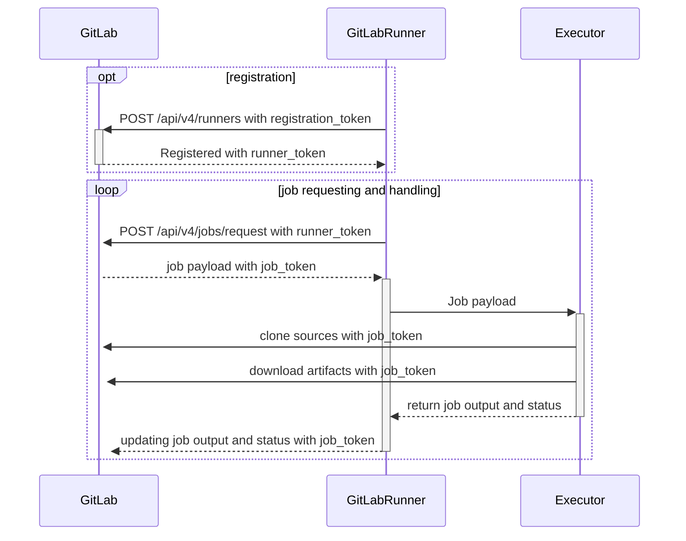



- Tier: Free, Premium, Ultimate
- Offering: GitLab.com, GitLab Self-Managed, GitLab Dedicated



GitLab Runner is an application that works with GitLab CI/CD to run jobs in a pipeline.

When developers push code to GitLab, they can define automated tasks in a `.gitlab-ci.yml` file.
These tasks might include running tests, building applications, or deploying code.
GitLab Runner is the application that executes these tasks on computing infrastructure.

As an administrator, you are responsible for providing and managing the infrastructure where these CI/CD jobs run.
This involves installing GitLab Runner applications, configuring them, and ensuring they have adequate capacity
to handle your organization's CI/CD workload.

## What GitLab Runner does

GitLab Runner connects to your GitLab instance and waits for CI/CD jobs. When a pipeline runs, GitLab sends jobs to available runners.
The runner executes the job and reports the results back to GitLab.

GitLab Runner has the following features.

- Run multiple jobs concurrently.
- Use multiple tokens with multiple servers (even per-project).
- Limit the number of concurrent jobs per-token.
- Jobs can be run:
  - Locally.
  - Using Docker containers.
  - Using Docker containers and executing job over SSH.
  - Using Docker containers with autoscaling on different clouds and virtualization hypervisors.
  - Connecting to a remote SSH server.
- Is written in Go and distributed as single binary without any other requirements.
- Supports Bash, PowerShell Core, and Windows PowerShell.
- Works on GNU/Linux, macOS, and Windows (pretty much anywhere you can run Docker).
- Allows customization of the job running environment.
- Automatic configuration reload without restart.
- Seamless setup with support for Docker, Docker-SSH, Parallels, or SSH running environments.
- Enables caching of Docker containers.
- Seamless installation as a service for GNU/Linux, macOS, and Windows.
- Embedded Prometheus metrics HTTP server.
- Referee workers to monitor and pass Prometheus metrics and other job-specific data to GitLab.

## Runner execution flow

This diagram shows how runners are registered and how jobs are requested and handled. It also shows which actions use [registration and authentication tokens](https://docs.gitlab.com/api/runners/#registration-and-authentication-tokens), and [job tokens](https://docs.gitlab.com/ci/jobs/ci_job_token/).

## Runner deployment options

### GitLab-hosted runners

[GitLab-hosted runners](https://docs.gitlab.com/ci/runners/) are managed by GitLab and available on GitLab.com.
You don't need to install or maintain these runners - GitLab provides them as a service.
However, you have limited control over the execution environment and cannot customize the infrastructure.

### Self-managed runners

Self-managed runners are GitLab Runner instances that you install, configure, and manage in your own
infrastructure. You can [install](install/_index.md) and register self-managed runners on all GitLab installations.
As an administrator, you typically work with self-managed runners.

Unlike GitLab-hosted runners, which are hosted and managed by GitLab, you have complete control over self-managed runners.

## GitLab Runner versions

For compatibility reasons, the GitLab Runner [major.minor](https://en.wikipedia.org/wiki/Software_versioning) version
should stay in sync with the GitLab major and minor version. Older runners may still work
with newer GitLab versions, and vice versa. However, features may not be available or work properly
if a version difference exists.

Backward compatibility is guaranteed between minor version updates. However, sometimes minor
version updates of GitLab can introduce new features that require GitLab Runner to be on the same minor
version.

If you host your own runners but host your repositories on GitLab.com,
keep GitLab Runner [updated](install/_index.md) to the latest version, as GitLab.com is
[updated continuously](https://gitlab.com/gitlab-org/release/tasks/-/issues).

## Troubleshooting

Learn how to [troubleshoot](faq/_index.md) common issues.

## Glossary

- **GitLab Runner**: The application that executes CI/CD jobs from GitLab pipelines on a target computing platform.
- **Runner**: A configured instance of GitLab Runner that can execute jobs. Depending on the type of executor,
  this machine could be local to the runner manager (`shell` or    `docker` executor) or a remote machine
  created by an autoscaler (`docker-autoscaler` or `kubernetes`).
- **Runner configuration**: A single `[[runner]]` entry in the `config.toml` that displays as a **runner** in the UI.
- **Runner manager**: The process that reads the `config.toml` file and runs all the runner configurations and job executions concurrently.
- **Machine**: A virtual machine (VM) or pod that the runner operates in.
  GitLab Runner automatically generates a unique, persistent machine ID so that when multiple machines are given the same runner configuration,
  jobs can be routed separately but the runner configurations are grouped in the UI.
- **Executor**: The method GitLab Runner uses to execute jobs (Docker, Shell, Kubernetes, etc.).
- **Pipeline**: A collection of jobs that run automatically when code is pushed to GitLab.
- **Job**: A single task in a pipeline, such as running tests or building an application.
- **Runner token**: A unique identifier that allows a runner to authenticate with GitLab.
- **Tags**: Labels assigned to runners that determine which jobs they can execute.
- **Concurrent jobs**: The number of jobs a runner can execute simultaneously.
- **Self-managed runner**: A runner installed and managed on your own infrastructure.
- **GitLab-hosted runner**: A runner provided and managed by GitLab.

For more information, see the official [GitLab Word List](https://docs.gitlab.com/development/documentation/styleguide/word_list/#gitlab-runner)
and the GitLab Architecture entry for [GitLab Runner](https://docs.gitlab.com/development/architecture/#gitlab-runner).

## Contributing

Contributions are welcome. See [`CONTRIBUTING.md`](https://gitlab.com/gitlab-org/gitlab-runner/blob/main/CONTRIBUTING.md)
and the [development documentation](development/_index.md) for details.

If you're a reviewer of GitLab Runner project, take a moment to read the
[Reviewing GitLab Runner](development/reviewing-gitlab-runner.md) document.

You can also review [the release process for the GitLab Runner project](https://gitlab.com/gitlab-org/gitlab-runner/blob/main/PROCESS.md).

## Changelog

See the [CHANGELOG](https://gitlab.com/gitlab-org/gitlab-runner/blob/main/CHANGELOG.md) to view recent changes.

## License

This code is distributed under the MIT license. View the [LICENSE](https://gitlab.com/gitlab-org/gitlab-runner/blob/main/LICENSE) file.
