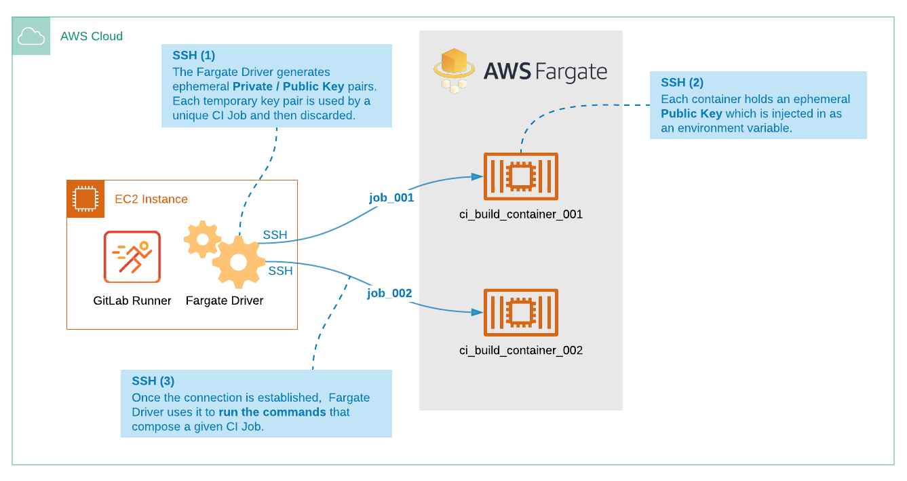

# Autoscaling GitLab CI on AWS Fargate **(FREE)**

The GitLab [custom executor](../../executors/custom.md) driver for
[AWS Fargate](https://gitlab.com/gitlab-org/ci-cd/custom-executor-drivers/fargate)
automatically launches a container on the Amazon Elastic Container Service (ECS) to
execute each GitLab CI job.

After you complete the tasks in this document, the executor can run jobs initiated from GitLab.
Each time a commit is made in GitLab, the GitLab instance notifies the runner that a new job is available.
The runner then starts a new task in the target ECS cluster, based on a task definition that you
configured in AWS ECS. You can configure an AWS ECS task definition to use any Docker image, so you have
complete flexibility in the type of builds that you can execute on AWS Fargate.



This document shows an example that's meant to give you an initial understanding of the implementation.
It is not meant for production use; additional security is required in AWS.

For example, you might want two AWS security groups:

- One used by the EC2 instance that hosts GitLab Runner and only accepts SSH connections from a restricted
  external IP range (for administrative access).
- One that applies to the Fargate Tasks and that allows SSH traffic only from the EC2 instance.

Additionally, for any non-public container registry your ECS Task will either [need IAM permissions (for AWS ECR only)](https://docs.aws.amazon.com/AmazonECS/latest/developerguide/task_execution_IAM_role.html) or will require [Private registry authentication for tasks](https://docs.aws.amazon.com/AmazonECS/latest/developerguide/private-auth.html) for non-ECR private registries.

You can use CloudFormation or Terraform to automate the provisioning and setup of your AWS infrastructure.

WARNING:
CI/CD jobs use the image defined in the ECS task, rather than the value of the `image:` keyword in your `.gitlab-ci.yml` file. This configuration can result in multiple instances of Runner Manager or in large build containers. AWS is aware of the issue and GitLab is [tracking resolution](https://gitlab.com/gitlab-com/alliances/aws/public-tracker/-/issues/22). You might consider creating an EKS cluster instead by following the official [AWS EKS Quick Start](https://aws.amazon.com/solutions/implementations/amazon-eks/).

WARNING:
Fargate abstracts container hosts, which limits configurability for container host properties. This affects runner workloads that require high IO to disk or network, since these properties have limited or no configurability with Fargate. Before you use GitLab Runner on Fargate, ensure runner workloads with high or extreme compute characteristics on CPU, memory, disk IO, or network IO are suitable for Fargate.

## Prerequisites

Before you begin, you should have:

- An AWS IAM user with permissions to create and configure EC2, ECS and ECR resources.
- AWS VPC and subnets.
- One or more AWS security groups.

## Step 1: Prepare a container image for the AWS Fargate task

Prepare a container image. You will upload this image to a registry, where it will be used
to create containers when GitLab jobs run.

1. Ensure the image has the tools required to build your CI job. For example, a Java project requires
   a `Java JDK` and build tools like Maven or Gradle. A Node.js project requires `node` and `npm`.
1. Ensure the image has GitLab Runner, which handles artifacts and caching. Refer to the [Run](../../executors/custom.md#run)
   stage section of the custom executor docs for additional information.
1. Ensure the container image can accept an SSH connection through public-key authentication.
   The runner uses this connection to send the build commands defined in the `.gitlab-ci.yml` file to the container
   on AWS Fargate. The SSH keys are automatically managed by the Fargate driver. The container must be able
   to accept keys from the `SSH_PUBLIC_KEY` environment variable.

View a [Debian example](https://gitlab.com/tmaczukin-test-projects/fargate-driver-debian) that includes GitLab Runner and the SSH configuration.
View a [Node.js example](https://gitlab.com/aws-fargate-driver-demo/docker-nodejs-gitlab-ci-fargate).

## Step 2: Push the container image to a registry

After you create your image, publish the image to a container registry for
use in the ECS task definition.

- To create a repository and push an image to ECR, follow the
  [Amazon ECR Repositories](https://docs.aws.amazon.com/AmazonECR/latest/userguide/Repositories.html) documentation.
- To use the AWS CLI to push an image to ECR, follow the
  [Getting Started with Amazon ECR using the AWS CLI](https://docs.aws.amazon.com/AmazonECR/latest/userguide/getting-started-cli.html) documentation.
- To use the [GitLab Container Registry](https://docs.gitlab.com/ee/user/packages/container_registry/), you can use the
  [Debian](https://gitlab.com/tmaczukin-test-projects/fargate-driver-debian) or [NodeJS](https://gitlab.com/aws-fargate-driver-demo/docker-nodejs-gitlab-ci-fargate)
  example. The Debian image is published to `registry.gitlab.com/tmaczukin-test-projects/fargate-driver-debian:latest`.
  The NodeJS example image is published to `registry.gitlab.com/aws-fargate-driver-demo/docker-nodejs-gitlab-ci-fargate:latest`.

## Step 3: Create an EC2 instance for GitLab Runner

Now create an AWS EC2 instance. In the next step you will install GitLab Runner on it.

1. Go to [https://console.aws.amazon.com/ec2/v2/home#LaunchInstanceWizard](https://console.aws.amazon.com/ec2/v2/home#LaunchInstanceWizard).
1. For the instance, select the Ubuntu Server 18.04 LTS AMI.
   The name may be different depending on the AWS region you selected.
1. For the instance type, choose t2.micro. Click **Next: Configure Instance Details**.
1. Leave the default for **Number of instances**.
1. For **Network**, select your VPC.
1. Set **Auto-assign Public IP** to **Enable**.
1. Under **IAM role**, click **Create new IAM role**. This role is for test purposes only and is not secure.
   1. Click **Create role**.
   1. Choose **AWS service** and under **Common use cases**, click **EC2**. Then click **Next: Permissions**.
   1. Select the check box for the **AmazonECS_FullAccess** policy. Click **Next: Tags**.
   1. Click **Next: Review**.
   1. Type a name for the IAM role, for example `fargate-test-instance`,
      and click **Create role**.
1. Go back to the browser tab where you are creating the instance.
1. To the left of **Create new IAM role**, click the refresh button.
   Choose the `fargate-test-instance` role. Click **Next: Add Storage**.
1. Click **Next: Add Tags**.
1. Click **Next: Configure Security Group**.
1. Select **Create a new security group**, name it `fargate-test`, and
   ensure that a rule for SSH is defined (`Type: SSH, Protocol: TCP, Port Range: 22`). You must
   specify the IP ranges for inbound and outbound rules.
1. Click **Review and Launch**.
1. Click **Launch**.
1. Optional. Select **Create a new key pair**, name it `fargate-runner-manager`
   and click the **Download Key Pair** button. The private key for SSH is downloaded
   on your computer (check the directory configured in your browser).
1. Click **Launch Instances**.
1. Click **View Instances**.
1. Wait for the instance to be up. Note the `IPv4 Public IP` address.

## Step 4: Install and configure GitLab Runner on the EC2 instance

Now install GitLab Runner on the Ubuntu instance.

1. Go to your GitLab project's **Settings > CI/CD** and expand the Runners section.
   Under **Set up a specific Runner manually**, note the registration token.
1. Ensure your key file has the right permissions by running `chmod 400 path/to/downloaded/key/file`.
1. SSH into the EC2 instance that you created by using:

   ```shell
   ssh ubuntu@[ip_address] -i path/to/downloaded/key/file
   ```

1. When you are connected successfully, run the following commands:

   ```shell
   sudo mkdir -p /opt/gitlab-runner/{metadata,builds,cache}
   curl -s "https://packages.gitlab.com/install/repositories/runner/gitlab-runner/script.deb.sh" | sudo bash
   sudo apt install gitlab-runner
   ```

1. Run this command with the GitLab URL and registration token you noted in step 1.

   ```shell
   sudo gitlab-runner register --url https://gitlab.com/ --registration-token TOKEN_HERE --name fargate-test-runner --run-untagged --executor custom -n
   ```

1. Run `sudo vim /etc/gitlab-runner/config.toml` and add the following content:

   ```toml
   concurrent = 1
   check_interval = 0

   [session_server]
     session_timeout = 1800

   [[runners]]
     name = "fargate-test"
     url = "https://gitlab.com/"
     token = "__REDACTED__"
     executor = "custom"
     builds_dir = "/opt/gitlab-runner/builds"
     cache_dir = "/opt/gitlab-runner/cache"
     [runners.custom]
       volumes = ["/cache", "/path/to-ca-cert-dir/ca.crt:/etc/gitlab-runner/certs/ca.crt:ro"]
       config_exec = "/opt/gitlab-runner/fargate"
       config_args = ["--config", "/etc/gitlab-runner/fargate.toml", "custom", "config"]
       prepare_exec = "/opt/gitlab-runner/fargate"
       prepare_args = ["--config", "/etc/gitlab-runner/fargate.toml", "custom", "prepare"]
       run_exec = "/opt/gitlab-runner/fargate"
       run_args = ["--config", "/etc/gitlab-runner/fargate.toml", "custom", "run"]
       cleanup_exec = "/opt/gitlab-runner/fargate"
       cleanup_args = ["--config", "/etc/gitlab-runner/fargate.toml", "custom", "cleanup"]
   ```

1. If you have a self-managed instance with a private CA, add this line:

   ```toml
          volumes = ["/cache", "/path/to-ca-cert-dir/ca.crt:/etc/gitlab-runner/certs/ca.crt:ro"]
   ```

   [Learn more about trusting the certificate](../tls-self-signed.md#trusting-the-certificate-for-the-other-cicd-stages).

   The section of the `config.toml` file shown below is created by the registration command. Do not change it.

   ```toml
   concurrent = 1
   check_interval = 0

   [session_server]
     session_timeout = 1800

   name = "fargate-test"
   url = "https://gitlab.com/"
   token = "__REDACTED__"
   executor = "custom"
   ```

1. Run `sudo vim /etc/gitlab-runner/fargate.toml` and add the following content:

   ```toml
   LogLevel = "info"
   LogFormat = "text"

   [Fargate]
     Cluster = "test-cluster"
     Region = "us-east-2"
     Subnet = "subnet-xxxxxx"
     SecurityGroup = "sg-xxxxxxxxxxxxx"
     TaskDefinition = "test-task:1"
     EnablePublicIP = true

   [TaskMetadata]
     Directory = "/opt/gitlab-runner/metadata"

   [SSH]
     Username = "root"
     Port = 22
   ```

   - Note the value of `Cluster`, as well as the name of the `TaskDefinition`. This example shows `test-task`
     with `:1` as the revision number. If a revision number is not specified, the latest **active** revision is used.
   - Choose your region. Take the `Subnet` value from the Runner Manager instance.
   - To find the security group ID:

     1. In AWS, in the list of instances, select the EC2 instance you created. The details are displayed.
     1. Under **Security groups**, click the name of the group you created.
     1. Copy the **Security group ID**.

     In a production setting,
     follow [AWS guidelines](https://docs.aws.amazon.com/vpc/latest/userguide/VPC_SecurityGroups.html)
     for setting up and using security groups.

   - If `EnablePublicIP` is set to true, the public IP of the task container is gathered to perform the SSH connection.
   - If `EnablePublicIP` is set to false:
     - The Fargate driver uses the task container's private IP. To set up a connection when set to `false`, the VPC's Security Group must
     have an inbound rule for Port 22 (SSH), where the source is the VPC CIDR.
     - To fetch external dependencies, provisioned AWS Fargate containers must have access to the public internet. To provide
     public internet access for AWS Fargate containers, you can use a NAT Gateway in the VPC.

   - The port number of the SSH server is optional. If omitted, the default SSH port (22) is used.
   - For more information about the section settings, see the [Fargate driver documentation](https://gitlab.com/gitlab-org/ci-cd/custom-executor-drivers/fargate/-/tree/master/docs#configuration).

1. Install the Fargate driver:

   ```shell
   sudo curl -Lo /opt/gitlab-runner/fargate "https://gitlab-runner-custom-fargate-downloads.s3.amazonaws.com/latest/fargate-linux-amd64"
   sudo chmod +x /opt/gitlab-runner/fargate
   ```

## Step 5: Create an ECS Fargate cluster

An Amazon ECS cluster is a grouping of ECS container instances.

1. Go to [`https://console.aws.amazon.com/ecs/home#/clusters`](https://console.aws.amazon.com/ecs/home#/clusters).
1. Click **Create Cluster**.
1. Choose **Networking only** type. Click **Next step**.
1. Name it `test-cluster` (the same as in `fargate.toml`).
1. Click **Create**.
1. Click **View cluster**. Note the region and account ID parts from the `Cluster ARN` value.
1. Click **Update Cluster** button.
1. Next to `Default capacity provider strategy`, click **Add another provider** and choose `FARGATE`. Click **Update**.

Refer to the AWS [documentation](https://docs.aws.amazon.com/AmazonECS/latest/userguide/create_cluster.html)
for detailed instructions on setting up and working with a cluster on ECS Fargate.

## Step 6: Create an ECS task definition

In this step you will create a task definition of type `Fargate` with a reference
to the container image that you are going to use for your CI builds.

1. Go to [`https://console.aws.amazon.com/ecs/home#/taskDefinitions`](https://console.aws.amazon.com/ecs/home#/taskDefinitions).
1. Click **Create new Task Definition**.
1. Choose **FARGATE** and click **Next step**.
1. Name it `test-task`. (Note: The name is the same value defined in
   the `fargate.toml` file but without `:1`).
1. Select values for **Task memory (GB)** and **Task CPU (vCPU)**.
1. Click **Add container**. Then:
   1. Name it `ci-coordinator`, so the Fargate driver
      can inject the `SSH_PUBLIC_KEY` environment variable.
   1. Define image (for example `registry.gitlab.com/tmaczukin-test-projects/fargate-driver-debian:latest`).
   1. Define port mapping for 22/TCP.
   1. Click **Add**.
1. Click **Create**.
1. Click **View task definition**.

WARNING:
A single Fargate task may launch one or more containers.
The Fargate driver injects the `SSH_PUBLIC_KEY` environment variable
in containers with the `ci-coordinator` name only. You must
have a container with this name in all task definitions used by the Fargate
driver. The container with this name should be the one that has the
SSH server and all GitLab Runner requirements installed, as described
above.

Refer to the AWS [documentation](https://docs.aws.amazon.com/AmazonECS/latest/developerguide/create-task-definition.html)
for detailed instructions on setting up and working with task definitions.

Refer to the AWS documentation [Amazon ECS task execution IAM role](https://docs.aws.amazon.com/AmazonECS/latest/developerguide/task_execution_IAM_role.html) for information on the ECS service permissions required to launch images from an AWS ECR.

Refer to the AWS documentation [Private registry authentication for tasks](https://docs.aws.amazon.com/AmazonECS/latest/developerguide/private-auth.html) for information on having ECS authenticate to private registries including any hosted on a GitLab instance.

At this point the GitLab Runner Manager and Fargate Driver are configured and ready
to start executing jobs on AWS Fargate.

## Step 7: Test the configuration

Your configuration should now be ready to use.

1. In your GitLab project, create a simple `.gitlab-ci.yml` file:

   ```yaml
   test:
     script:
       - echo "It works!"
       - for i in $(seq 1 30); do echo "."; sleep 1; done
   ```

1. Go to your project's **CI/CD > Pipelines**.
1. Click **Run Pipeline**.
1. Update the branch and any variables and click **Run Pipeline**.

NOTE:
The `image` and `service` keywords in your `.gitlab-ci.yml` file are ignored.
The runner only uses the values specified in the task definition.

## Clean up

If you want to perform a cleanup after testing the custom executor with AWS Fargate, remove the following objects:

- EC2 instance, key pair, IAM role and security group created in [step 3](#step-3-create-an-ec2-instance-for-gitlab-runner).
- ECS Fargate cluster created in [step 5](#step-5-create-an-ecs-fargate-cluster).
- ECS task definition created in [step 6](#step-6-create-an-ecs-task-definition).

## Configure a private AWS Fargate task

To ensure a high level of security, configure
[a private AWS Fargate task](https://aws.amazon.com/premiumsupport/knowledge-center/ecs-fargate-tasks-private-subnet).
In this configuration, executors use only internal AWS IP addresses, and allow
outbound traffic only from AWS so that CI jobs run on a private AWS Fargate
instance.

To configure a private AWS Fargate task, complete the following steps to configure AWS and run the AWS Fargate task in
the private subnet:

1. Ensure the existing public subnet has not reserved all IP addresses in the VPC address range. Inspect the CIRD
   address ranges of the VPC and subnet. If the subnet CIRD address range is a subset of the VPC's CIRD address range,
   skip steps 2 and 4. Otherwise your VPC has no free address range, so you must delete and
   recreate the VPC and the public subnet:
   1. Delete your existing subnet and VPC.
   1. [Create a VPC](https://docs.aws.amazon.com/vpc/latest/privatelink/create-interface-endpoint.html#create-interface-endpoint)
      with the same configuration as the VPC you deleted and update the CIRD address, for example `10.0.0.0/23`.
   1. [Create a public subnet](https://docs.aws.amazon.com/vpc/latest/privatelink/interface-endpoints.html) with the same configuration as the subnet you deleted. Use a CIRD address that is a subset
      of the VPC's address range, for example `10.0.0.0/24`.
1. [Create a private subnet](https://docs.aws.amazon.com/vpc/latest/userguide/working-with-subnets.html#create-subnets) with the same
   configuration as the public subnet. Use a CIRD address range that does not overlap the public subnet range, for
   example `10.0.1.0/24`.
1. [Create a NAT gateway](https://docs.aws.amazon.com/vpc/latest/userguide/vpc-nat-gateway.html), and place it inside
   the public subnet.
1. Modify the private subnet routing table so that the destination `0.0.0.0/0` points to the NAT gateway.
1. Update the `farget.toml` configuration:

   ```toml
   Subnet = "private-subnet-id"
   EnablePublicIP = false
   UsePublicIP = false
   ```

1. Add the following inline policy to the IAM role associated with your fargate task (the IAM role associated with
   fargate tasks is typically named `ecsTaskExecutionRole` and should already exist.)

   ```json
   {
       "Statement": [
           {
               "Sid": "VisualEditor0",
               "Effect": "Allow",
               "Action": [
                   "secretsmanager:GetSecretValue",
                   "kms:Decrypt",
                   "ssm:GetParameters"
               ],
               "Resource": [
                   "arn:aws:secretsmanager:*:<account-id>:secret:*",
                   "arn:aws:kms:*:<account-id>:key/*"
               ]
           }
       ]
   }
   ```

1. Change the "inbound rules" of your security group to reference the security-group itself. In the AWS configuration dialogue:
   - Set `Type` to `ssh`.
   - Set `Source` to `Custom`.
   - Select the security group.
   - Remove the exiting inbound rule that allows SSH access from any host.

WARNING:
When you remove the exiting inbound rule, you cannot use SSH to connect to the Amazon Elastic Compute Cloud instance.

For more information, see the following AWS documentation:

- [Amazon ECS task execution IAM role](https://docs.aws.amazon.com/AmazonECS/latest/developerguide/task_execution_IAM_role.html)
- [Amazon ECR interface VPC endpoints (AWS PrivateLink)](https://docs.aws.amazon.com/AmazonECR/latest/userguide/vpc-endpoints.html)
- [Amazon ECS interface VPC endpoints](https://docs.aws.amazon.com/AmazonECS/latest/developerguide/vpc-endpoints.html)
- [VPC with public and private subnets](https://docs.aws.amazon.com/vpc/latest/userguide/VPC_Scenario2.html)

## Troubleshooting

### `No Container Instances were found in your cluster` error when testing the configuration

`error="starting new Fargate task: running new task on Fargate: error starting AWS Fargate Task: InvalidParameterException: No Container Instances were found in your cluster."`

The AWS Fargate Driver requires the ECS Cluster to be configured with a [default capacity provider strategy](#step-5-create-an-ecs-fargate-cluster).

Further reading:

- A default [capacity provider strategy](https://docs.aws.amazon.com/AmazonECS/latest/developerguide/cluster-capacity-providers.html) is associated with each Amazon ECS cluster. If no other capacity provider strategy or launch type is specified, the cluster uses this strategy when a task runs or a service is created.
- If a [`capacityProviderStrategy`](https://docs.aws.amazon.com/AmazonECS/latest/APIReference/API_RunTask.html#ECS-RunTask-request-capacityProviderStrategy) is specified, the `launchType` parameter must be omitted. If no `capacityProviderStrategy` or `launchType` is specified, the `defaultCapacityProviderStrategy` for the cluster is used.

### Metadata `file does not exist` error when running jobs

`Application execution failed PID=xxxxx error="obtaining information about the running task: trying to access file \"/opt/gitlab-runner/metadata/<runner_token>-xxxxx.json\": file does not exist" cleanup_std=err job=xxxxx project=xx runner=<runner_token>`

Ensure that your IAM Role policy is configured correctly and can perform write operations to create the metadata JSON file in `/opt/gitlab-runner/metadata/`. To test in a non-production environment, use the AmazonECS_FullAccess policy. Review your IAM role policy according to your organization's security requirements.

### `connection timed out` when running jobs

`Application execution failed PID=xxxx error="executing the script on the remote host: executing script on container with IP \"172.x.x.x\": connecting to server: connecting to server \"172.x.x.x:22\" as user \"root\": dial tcp 172.x.x.x:22: connect: connection timed out"`

If `EnablePublicIP` is configured to false, ensure that your VPC's Security Group has an inbound rule that allows SSH connectivity. Your AWS Fargate task container must be able to accept SSH traffic from the GitLab Runner EC2 instance.

### `connection refused` when running jobs

`Application execution failed PID=xxxx error="executing the script on the remote host: executing script on container with IP \"10.x.x.x\": connecting to server: connecting to server \"10.x.x.x:22\" as user \"root\": dial tcp 10.x.x.x:22: connect: connection refused"`

Ensure that the task container has port 22 exposed and port mapping is configured based on the instructions in [Step 6: Create an ECS task definition](#step-6-create-an-ecs-task-definition). If the port is exposed and the container is configured:

1. Check to see if there are any errors for the container in **Amazon ECS > Clusters > Choose your task definition > Tasks**.
1. View tasks with a status of `Stopped` and check the latest one that failed. The **logs** tab has more details if there is a container failure.

Alternatively, ensure that you can run the Docker container locally.
