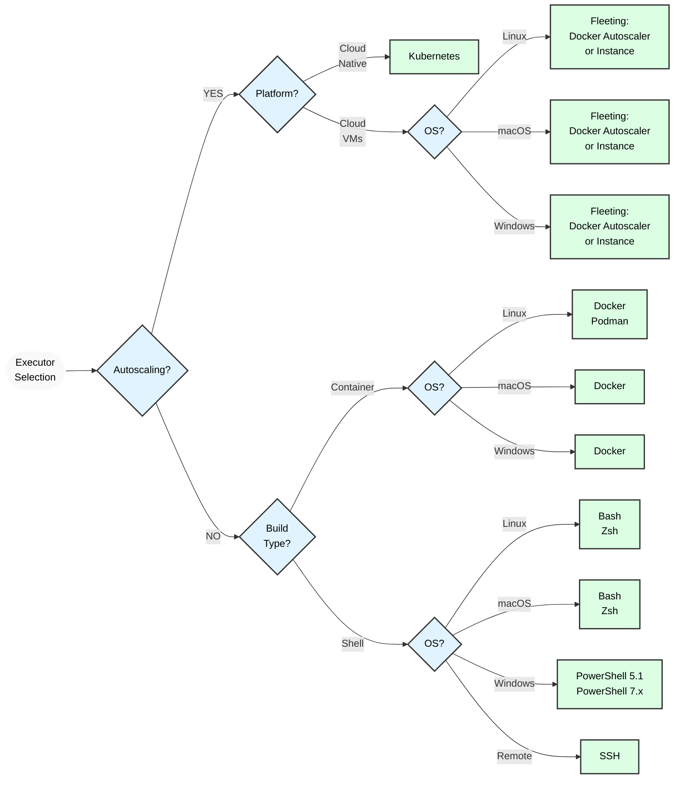



- Tier: Free, Premium, Ultimate
- Offering: GitLab.com, GitLab Self-Managed, GitLab Dedicated



GitLab Runner implements different executors that can be used to run your
builds in different environments.

If you are not sure about which executor to select, see [Selecting the executor](#selecting-the-executor).

For more information about features supported by each executor, see the [compatibility chart](#compatibility-chart).

GitLab Runner provides the following executors:

- [SSH](ssh.md)
- [Shell](shell.md)
- [Parallels](parallels.md)
- [VirtualBox](virtualbox.md)
- [Docker](docker.md)
- [Docker Autoscaler](docker_autoscaler.md)
- [Docker Machine (auto-scaling)](docker_machine.md)
- [Kubernetes](kubernetes/_index.md)
- [Instance](instance.md)
- [Custom](custom.md)

These executors are locked and we are no longer developing or accepting
new ones. For more information, see [Contributing new executors](https://gitlab.com/gitlab-org/gitlab-runner/blob/main/CONTRIBUTING.md#contributing-new-executors).

## Prerequisites for non-Docker executors

Executors that do not [rely on a helper image](../configuration/advanced-configuration.md#helper-image) require a Git
installation on the target machine and in the `PATH`. Always use the [latest available version of Git](https://git-scm.com/downloads/).

GitLab Runner uses the `git lfs` command if [Git LFS](https://git-lfs.com/) is installed
on the target machine. Ensure Git LFS is up to date on any systems where GitLab Runner uses these executors.

Be sure to initialize Git LFS for the user that executes GitLab Runner commands with `git lfs install`. You can initialize Git LFS on an entire system with `git lfs install --system`.

To authenticate Git interactions with the GitLab instance, GitLab Runner
uses [`CI_JOB_TOKEN`](https://docs.gitlab.com/ci/jobs/ci_job_token/).
Depending on the [FF_GIT_URLS_WITHOUT_TOKENS](../configuration/feature-flags.md) setting,
the last used credential might be cached in a pre-installed Git credential helper (for
example [Git credential manager](https://github.com/git-ecosystem/git-credential-manager))
if such a helper is installed and configured to cache credentials:

- When [FF_GIT_URLS_WITHOUT_TOKENS](../configuration/feature-flags.md) is
  `false`, the last used [`CI_JOB_TOKEN`](https://docs.gitlab.com/ci/jobs/ci_job_token/)
  is stored in pre-installed Git credential helpers.
- When [FF_GIT_URLS_WITHOUT_TOKENS](../configuration/feature-flags.md) is
  `true`, the [`CI_JOB_TOKEN`](https://docs.gitlab.com/ci/jobs/ci_job_token/)
  is never stored or cached in any pre-installed Git credential helper.

## Selecting the executor

The executors support different platforms and methodologies for building a
project. The table below shows the key facts for each executor which helps
you decide which executor to use.

| Executor                                         | SSH  |     Shell      |   VirtualBox   |   Parallels    | Docker | Docker Autoscaler |                 Instance |   Kubernetes   |          Custom          |
|:-------------------------------------------------|:----:|:--------------:|:--------------:|:--------------:|:------:|:-----------------:|-------------------------:|:--------------:|:------------------------:|
| Clean build environment for every build          |  ✗   |       ✗        |       ✓        |       ✓        |   ✓    |         ✓         | conditional 4 |       ✓        | conditional 4 |
| Reuse previous clone if it exists                |  ✓   |       ✓        |       ✗        |       ✗        |   ✓    |         ✓         | conditional 4 | ✓ 6 | conditional 4 |
| Runner file system access protected 5 |  ✓   |       ✗        |       ✓        |       ✓        |   ✓    |         ✓         |                        ✗ |       ✓        |       conditional        |
| Migrate runner machine                           |  ✗   |       ✗        |    partial     |    partial     |   ✓    |         ✓         |                        ✓ |       ✓        |            ✓             |
| Zero-configuration support for concurrent builds |  ✗   | ✗ 1 |       ✓        |       ✓        |   ✓    |         ✓         |                        ✓ |       ✓        | conditional 4 |
| Complicated build environments                   |  ✗   | ✗ 2 | ✓ 3 | ✓ 3 |   ✓    |         ✓         |           ✗ 2 |       ✓        |            ✓             |
| Debugging build problems                         | easy |      easy      |      hard      |      hard      | medium |      medium       |                   medium |     medium     |          medium          |

**Footnotes**:

1. If the builds use services installed on the build machine, selecting executors is possible but problematic.
1. Requires manual dependency installation.
1. For example, using [Vagrant](https://developer.hashicorp.com/vagrant/docs/providers/virtualbox "Vagrant documentation for VirtualBox").
1. Depends on the environment you are provisioning. Can be completely isolated or shared between builds.
1. When a runner's file system access is not protected, jobs can access the entire system,
   including the runner's token and other jobs' cache and code.
   Executors marked ✓ don't allow the runner to access the file system by default.
   However, security flaws or certain configurations could allow jobs
   to break out of their container and access the file system hosting the runner.
1. Requires [persistent per-concurrency build volumes](kubernetes/_index.md#persistent-per-concurrency-build-volumes) configuration.

### Shell executor

The Shell executor is simplest configuration option for GitLab Runner. It executes jobs locally on
the system where GitLab Runner is installed, requiring all dependencies to be manually installed on the same
machine.

This executor supports Bash for Linux, macOS, and FreeBSD operating systems, while offering PowerShell
support for Windows environments.

While ideal for builds with minimal dependencies, it only provides limited isolation between jobs.

### Docker executor

Docker executor provides clean build environments through containers. Dependency management is straightforward,
with all dependencies packaged in the Docker image. This executor requires Docker installation on the Runner host.

This executor supports additional [services](https://docs.gitlab.com/ci/services/) like MySQL.
It also accommodates Podman as an alternative container runtime.

This executor maintains consistent, isolated build environments.

### Docker Machine executor (deprecated)

> [!warning]
> This feature was [deprecated](https://gitlab.com/gitlab-org/gitlab/-/issues/498268) in GitLab 17.5
> and is planned for removal in 20.0. Use [GitLab Runner Autoscaler](../runner_autoscale/_index.md) instead.

The Docker Machine executor is a special version of the Docker executor with support for auto-scaling. It works like the typical
Docker executor but with build hosts created on demand by Docker Machine. This capability makes it particularly effective
in cloud environments like AWS EC2, offering excellent isolation and scalability for variable workloads.

### Docker Autoscaler executor

The Docker Autoscaler executor is an autoscale-enabled Docker executor that creates instances on demand to
accommodate the jobs that the runner manager processes. It wraps the [Docker executor](docker.md) so that all
Docker executor options and features are supported.

The Docker Autoscaler uses [fleeting plugins](https://gitlab.com/gitlab-org/fleeting/fleeting) to autoscale.
Fleeting is an abstraction for a group of autoscaled instances, which uses plugins that support cloud providers,
like Google Cloud, AWS, and Azure. This executor particularly suits environments with dynamic workload requirements.

### Instance executor

The Instance executor is an autoscale-enabled executor that creates instances on demand to accommodate
the expected volume of jobs that the runner manager processes.

This executor and the related Docker Autoscale executor are the new autoscaling executors that works in conjunction with the GitLab Runner Fleeting and Taskscaler technologies.

The Instance executor also uses [fleeting plugins](https://gitlab.com/gitlab-org/fleeting/fleeting) to autoscale.

You can use the Instance executor when jobs need full access to the host instance, operating system, and
attached devices. The Instance executor can also be configured to accommodate single-tenant and multi-tenant jobs.

### Kubernetes executor

You can use the Kubernetes executor to use an existing Kubernetes cluster for your builds. The executor calls the
Kubernetes cluster API and creates a new Pod (with a build container and services containers) for each GitLab CI/CD job.
This executor particularly suits cloud-native environments, offering superior scalability and resource utilization.

### SSH executor

The SSH executor is added for completeness, but it's among the least supported executors.
When you use the SSH executor, GitLab Runner connects to an external server and runs the builds there.
We have some success stories from organizations using this executor, but usually you should use one of the other types.

### Custom executor

You can use the Custom executor to specify your own execution environments.
When GitLab Runner does not provide an executor (for example, Linux containers),
it allows you to use custom executables to provision and clean up environments.

## Compatibility chart

Supported features by different executors:

| Executor                                     | SSH            | Shell          | VirtualBox     | Parallels      | Docker  | Docker Autoscaler | Instance       | Kubernetes | Custom                                                       |
|:---------------------------------------------|:--------------:|:--------------:|:--------------:|:--------------:|:-------:|:-----------------:|:--------------:| :---------:| :-----------------------------------------------------------:|
| Secure Variables                             | ✓              | ✓              | ✓              | ✓              | ✓       | ✓                 | ✓              | ✓          | ✓                                                           |
| `.gitlab-ci.yml`: image                      | ✗              | ✗              | ✓ (1)          | ✓ (1)          | ✓       | ✓                 | ✗              | ✓          | ✓ (by using [`$CUSTOM_ENV_CI_JOB_IMAGE`](custom.md#stages)) |
| `.gitlab-ci.yml`: services                   | ✗              | ✗              | ✗              | ✗              | ✓       | ✓                 | ✗              | ✓          | ✓      |
| `.gitlab-ci.yml`: cache                      | ✓              | ✓              | ✓              | ✓              | ✓       | ✓                 | ✓              | ✓          | ✓      |
| `.gitlab-ci.yml`: artifacts                  | ✓              | ✓              | ✓              | ✓              | ✓       | ✓                 | ✓              | ✓          | ✓      |
| Passing artifacts between stages             | ✓              | ✓              | ✓              | ✓              | ✓       | ✓                 | ✓              | ✓          | ✓      |
| Use GitLab Container Registry private images | not applicable | not applicable | not applicable | not applicable | ✓       | ✓                 | not applicable | ✓          | not applicable |
| Interactive Web terminal                     | ✗              | ✓ (UNIX)       | ✗              | ✗              | ✓       | ✗                 | ✗              | ✓          | ✗              |

1. Support [added](https://gitlab.com/gitlab-org/gitlab-runner/-/merge_requests/1257) in GitLab Runner 14.2.
   Refer to the [Overriding the base VM image](../configuration/advanced-configuration.md#overriding-the-base-vm-image) section for further details.

Supported systems by different shells:

| Shells  | Bash        | PowerShell Desktop | PowerShell Core | Windows Batch (deprecated) |
|:-------:|:-----------:|:------------------:|:---------------:|:--------------------------:|
| Windows | ✗ (4)       | ✓ (3)              | ✓               | ✓ (2)                      |
| Linux   | ✓ (1)       | ✗                  | ✓               | ✗                          |
| macOS   | ✓ (1)       | ✗                  | ✓               | ✗                          |
| FreeBSD | ✓ (1)       | ✗                  | ✗               | ✗                          |

1. Default shell.
1. Deprecated. Default shell if no
   [`shell`](../configuration/advanced-configuration.md#the-runners-section)
   is specified.
1. Default shell when a new runner is registered.
1. Bash shell on Windows is not supported.

Supported systems for interactive web terminals by different shells:

| Shells  | Bash        | PowerShell Desktop    | PowerShell Core    | Windows Batch (deprecated) |
|:-------:|:-----------:|:---------------------:|:------------------:|:--------------------------:|
| Windows | ✗           | ✗                     | ✗                  | ✗                          |
| Linux   | ✓           | ✗                     | ✗                  | ✗                          |
| macOS   | ✓           | ✗                     | ✗                  | ✗                          |
| FreeBSD | ✓           | ✗                     | ✗                  | ✗                          |

