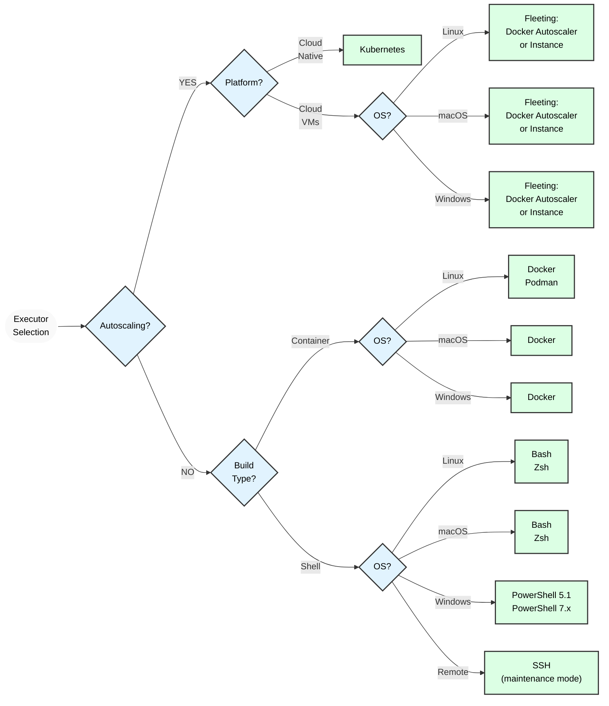



- Tier: Free, Premium, Ultimate
- Offering: GitLab.com, GitLab Self-Managed, GitLab Dedicated



GitLab Runner implements different executors that can be used to run your
builds in different environments:

- [Kubernetes](kubernetes/_index.md)
- [Docker](docker.md)
- [Docker Autoscaler](docker_autoscaler.md)
- [Instance](instance.md)

[Other executors](#executors-in-maintenance-mode) are available that are not under active feature development. They receive critical security updates but no new features.

> [!note]
> Some features require a runner that uses [fleeting](../fleet_scaling/fleeting.md). The Docker Autoscaler
> and instance executors use fleeting. You should migrate to one of these executors to take advantage
> of the full range of GitLab Runner capabilities.

If you are not sure about which executor to select, see [selecting the executor](#selecting-the-executor).

For more information about features supported by each executor, see the [compatibility chart](#compatibility-chart).

These executors are locked and we are no longer developing or accepting
new ones. For more information, see
[contributing new executors](https://gitlab.com/gitlab-org/gitlab-runner/blob/main/CONTRIBUTING.md#contributing-new-executors).

## Selecting the executor

The executors support different platforms and methodologies for building a
project. The following diagram shows which executor to choose based on your operating system and platform:

```mermaid
flowchart LR
    Start([Executor<br/>Selection]) --> Auto{Autoscaling?}

    Auto -->|YES| Platform{Platform?}
    Auto -->|NO| BuildType{Build<br/>Type?}

    Platform -->|Cloud<br/>Native| K8s[Kubernetes]
    Platform -->|Cloud<br/>VMs| OS1{OS?}

    OS1 -->|Linux| L1[Fleeting:<br/>Docker Autoscaler<br/>or Instance]
    OS1 -->|macOS| M1[Fleeting:<br/>Docker Autoscaler<br/>or Instance]
    OS1 -->|Windows| W1[Fleeting:<br/>Docker Autoscaler<br/>or Instance]

    BuildType -->|Container| OS2{OS?}
    BuildType -->|Shell| OS3{OS?}

    OS2 -->|Linux| L2[Docker<br/>Podman]
    OS2 -->|macOS| M2[Docker]
    OS2 -->|Windows| W2[Docker]

    OS3 -->|Linux| L3[Bash<br/>Zsh]
    OS3 -->|macOS| M3[Bash<br/>Zsh]
    OS3 -->|Windows| W3[PowerShell 5.1<br/>PowerShell 7.x]
    OS3 -->|Remote| R3[SSH<br/>#40;maintenance mode#41;]

    classDef question fill:#e1f3fe,stroke:#333,stroke-width:2px,color:#000
    classDef result fill:#dcffe4,stroke:#333,stroke-width:2px,color:#000
    classDef start fill:#f9f9f9,stroke:#fff,stroke-width:2px,color:#000

    class Start start;
    class Auto,Platform,BuildType,OS1,OS2,OS3 question;
    class K8s,L1,M1,W1,L2,M2,W2,L3,M3,W3,R3 result;
```

> [!warning]
> SSH executor is in maintenance mode. It receives critical security updates but no new features
> are planned. Also, it's among the least supported executors. For local shell-based builds,
> consider using the Shell executor instead.

The table below shows the key facts for each executor which helps
you decide which executor to use:

> [!note]
> SSH, Shell, VirtualBox, Parallels, and Custom executors are in maintenance mode.
> They receive critical security updates but no new features are planned.

| Executor                                         | Docker | Docker Autoscaler |                 Instance |   Kubernetes   | SSH  |     Shell      |   VirtualBox   |   Parallels    |          Custom          |
|:-------------------------------------------------|:------:|:-----------------:|-------------------------:|:--------------:|:----:|:--------------:|:--------------:|:--------------:|:------------------------:|
| Clean build environment for every build          |   ✓    |         ✓         | conditional 1 |       ✓        |  ✗   |       ✗        |       ✓        |       ✓        | conditional 1 |
| Reuse previous clone if it exists                |   ✓    |         ✓         | conditional 1 | ✓ 2 |  ✓   |       ✓        |       ✗        |       ✗        | conditional 1 |
| Runner file system access protected 3 |   ✓    |         ✓         |                        ✗ |       ✓        |  ✓   |       ✗        |       ✓        |       ✓        |       conditional        |
| Migrate runner machine                           |   ✓    |         ✓         |                        ✓ |       ✓        |  ✗   |       ✗        |    partial     |    partial     |            ✓             |
| Zero-configuration support for concurrent builds |   ✓    |         ✓         |                        ✓ |       ✓        |  ✗   | ✗ 4 |       ✓        |       ✓        | conditional 1 |
| Complicated build environments                   |   ✓    |         ✓         |           ✗ 5 |       ✓        |  ✗   | ✗ 5 | ✓ 6 | ✓ 6 |            ✓             |
| Debugging build problems                         | medium |      medium       |                   medium |     medium     | easy |      easy      |      hard      |      hard      |          medium          |

**Footnotes**:

1. Depends on the environment you are provisioning. Can be completely isolated or shared between builds.
1. Requires [persistent per-concurrency build volumes](kubernetes/_index.md#persistent-per-concurrency-build-volumes) configuration.
1. When a runner's file system access is not protected, jobs can access the entire system,
   including the runner's token and other jobs' cache and code.
   Executors marked ✓ don't allow the runner to access the file system by default.
   However, security flaws or certain configurations could allow jobs
   to break out of their container and access the file system hosting the runner.
1. If the builds use services installed on the build machine, selecting executors is possible but problematic.
1. Requires manual dependency installation.
1. For example, using [Vagrant](https://developer.hashicorp.com/vagrant/docs/providers/virtualbox "Vagrant documentation for VirtualBox").

### Docker executor

Docker executor provides clean build environments through containers. Dependency management is straightforward,
with all dependencies packaged in the Docker image. This executor requires Docker installation on the Runner host.

This executor supports additional [services](https://docs.gitlab.com/ci/services/) like MySQL.
It also accommodates Podman as an alternative container runtime.

This executor maintains consistent, isolated build environments.

### Docker Autoscaler executor

The Docker Autoscaler executor is an autoscale-enabled Docker executor that creates instances on demand to
accommodate the jobs that the runner manager processes. It wraps the [Docker executor](docker.md) so that all
Docker executor options and features are supported.

The Docker Autoscaler uses [fleeting plugins](https://gitlab.com/gitlab-org/fleeting/fleeting) to autoscale.
Fleeting is an abstraction for a group of autoscaled instances, which uses plugins that support cloud providers,
like Google Cloud, AWS, and Azure. This executor particularly suits environments with dynamic workload requirements.

### Instance executor

The Instance executor is an autoscale-enabled executor that creates instances on demand to accommodate
the expected volume of jobs that the runner manager processes.

This executor and the related Docker Autoscale executor are the new autoscaling executors that works in conjunction with the GitLab Runner Fleeting and Taskscaler technologies.

The Instance executor also uses [fleeting plugins](https://gitlab.com/gitlab-org/fleeting/fleeting) to autoscale.

You can use the Instance executor when jobs need full access to the host instance, operating system, and
attached devices. The Instance executor can also be configured to accommodate single-tenant and multi-tenant jobs.

### Kubernetes executor

You can use the Kubernetes executor to use an existing Kubernetes cluster for your builds. The executor calls the
Kubernetes cluster API and creates a new Pod (with a build container and services containers) for each GitLab CI/CD job.
This executor particularly suits cloud-native environments, offering superior scalability and resource utilization.

## Executors in maintenance mode

These executors receive critical security updates but no new features are planned:

- [SSH](ssh.md)
- [Shell](shell.md)
- [Parallels](parallels.md)
- [VirtualBox](virtualbox.md)
- [Custom](custom.md)
- [Docker Machine](docker_machine.md) (deprecated)

## Compatibility chart

Supported features by different executors.

> [!note]
> SSH, Shell, VirtualBox, Parallels, and Custom executors are in maintenance mode.
> They receive critical security updates but no new features are planned.

| Executor                                     | Docker | Docker Autoscaler |    Instance    | Kubernetes |      SSH       |     Shell      |    VirtualBox    |    Parallels     |                           Custom                            |
|:---------------------------------------------|:------:|:-----------------:|:--------------:|:----------:|:--------------:|:--------------:|:----------------:|:----------------:|:-----------------------------------------------------------:|
| Secure Variables                             |   ✓    |         ✓         |       ✓        |     ✓      |       ✓        |       ✓        |        ✓         |        ✓         |                              ✓                              |
| `.gitlab-ci.yml`: image                      |   ✓    |         ✓         |       ✗        |     ✓      |       ✗        |       ✗        | ✓ (1) | ✓ (1) | ✓ (by using [`$CUSTOM_ENV_CI_JOB_IMAGE`](custom.md#stages)) |
| `.gitlab-ci.yml`: services                   |   ✓    |         ✓         |       ✗        |     ✓      |       ✗        |       ✗        |        ✗         |        ✗         |                              ✓                              |
| `.gitlab-ci.yml`: cache                      |   ✓    |         ✓         |       ✓        |     ✓      |       ✓        |       ✓        |        ✓         |        ✓         |                              ✓                              |
| `.gitlab-ci.yml`: artifacts                  |   ✓    |         ✓         |       ✓        |     ✓      |       ✓        |       ✓        |        ✓         |        ✓         |                              ✓                              |
| Passing artifacts between stages             |   ✓    |         ✓         |       ✓        |     ✓      |       ✓        |       ✓        |        ✓         |        ✓         |                              ✓                              |
| Use GitLab Container Registry private images |   ✓    |         ✓         | not applicable |     ✓      | not applicable | not applicable |  not applicable  |  not applicable  |                       not applicable                        |
| Interactive Web terminal                     |   ✓    |         ✗         |       ✗        |     ✓      |       ✗        |       ✓        |        ✗         |        ✗         |                              ✗                              |

**Footnotes**:

1. Support [added](https://gitlab.com/gitlab-org/gitlab-runner/-/merge_requests/1257) in GitLab Runner 14.2.
   Refer to the [Overriding the base VM image](../configuration/advanced-configuration.md#overriding-the-base-vm-image) section for further details.

Supported systems by different shells:

| Shells  |      Bash      | PowerShell Desktop | PowerShell Core  | Windows Batch (deprecated) |
|:-------:|:--------------:|:------------------:|:----------------:|:--------------------------:|
| Windows | ✗ 2 |   ✓ 3   | ✓ 1,4 |             ✓              |
| Linux   | ✓ 1 |         ✗          |        ✓         |             ✗              |
| macOS   | ✓ 1 |         ✗          |        ✓         |             ✗              |
| FreeBSD | ✓ 1 |         ✗          |        ✗         |             ✗              |

**Footnotes:**

1. Default shell for runner registration and for jobs with the `shell` executor.
1. Bash shell is not supported on Windows.
1. Default shell for jobs with the `docker-windows` and `kubernetes` executors.
1. Default shell for jobs with the `shell` executor on Windows.

Supported systems for interactive web terminals by different shells:

| Shells  | Bash | PowerShell Desktop | PowerShell Core | Windows Batch (deprecated) |
| :-----: | :--: | :----------------: | :-------------: | :------------------------: |
| Windows |  ✗   |         ✓          |        ✓        |             ✗              |
| Linux   |  ✓   |         ✗          |        ✓        |             ✗              |
| macOS   |  ✓   |         ✗          |        ✓        |             ✗              |
| FreeBSD |  ✓   |         ✗          |        ✗        |             ✗              |

## Git requirements for non-Docker executors

Executors that do not [rely on a helper image](../configuration/advanced-configuration.md#helper-image) require a Git
installation on the target machine and in the `PATH`. Always use the [latest available version of Git](https://git-scm.com/downloads/).

GitLab Runner uses the `git lfs` command if [Git LFS](https://git-lfs.com/) is installed
on the target machine. Ensure Git LFS is up to date on any systems where GitLab Runner uses these executors.

Be sure to initialize Git LFS for the user that executes GitLab Runner commands with `git lfs install`. You can initialize Git LFS on an entire system with `git lfs install --system`.

To authenticate Git interactions with the GitLab instance, GitLab Runner
uses [`CI_JOB_TOKEN`](https://docs.gitlab.com/ci/jobs/ci_job_token/).
Depending on the [`FF_GIT_URLS_WITHOUT_TOKENS`](../configuration/feature-flags.md) setting,
the last used credential might be cached in a pre-installed Git credential helper (for
example [Git credential manager](https://github.com/git-ecosystem/git-credential-manager))
if such a helper is installed and configured to cache credentials:

- When [`FF_GIT_URLS_WITHOUT_TOKENS`](../configuration/feature-flags.md) is
  `false`, the last used [`CI_JOB_TOKEN`](https://docs.gitlab.com/ci/jobs/ci_job_token/)
  is stored in pre-installed Git credential helpers.
- When [`FF_GIT_URLS_WITHOUT_TOKENS`](../configuration/feature-flags.md) is
  `true`, the [`CI_JOB_TOKEN`](https://docs.gitlab.com/ci/jobs/ci_job_token/)
  is never stored or cached in any pre-installed Git credential helper.
