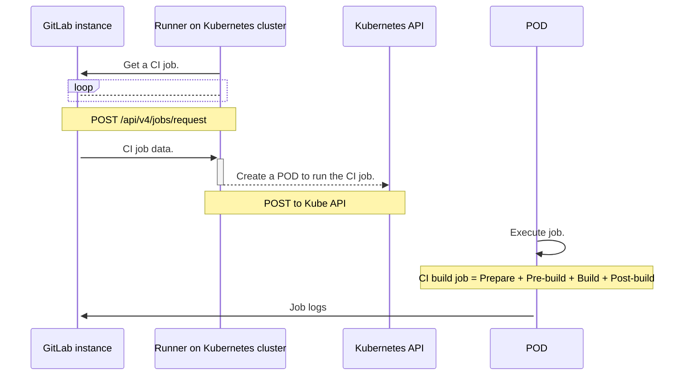
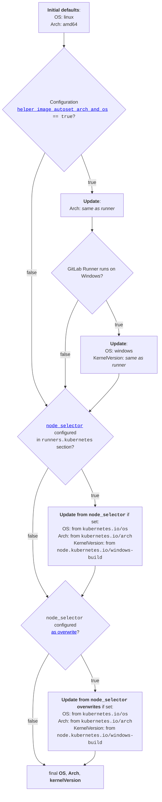



- Tier: Free, Premium, Ultimate
- Offering: GitLab.com, GitLab Self-Managed, GitLab Dedicated



Use the Kubernetes executor to use Kubernetes clusters for your builds. The executor calls the Kubernetes
cluster API and creates a pod for each GitLab CI job.

The Kubernetes executor divides the build into multiple steps:

1. **Prepare**: Create the Pod against the Kubernetes Cluster.
   This creates the containers required for the build and services to run.
1. **Pre-build**: Clone, restore cache, and download artifacts from previous
   stages. This step runs on a special container as part of the pod.
1. **Build**: User build.
1. **Post-build**: Create cache, upload artifacts to GitLab. This step also uses
   the special container as part of the pod.

## How the runner creates Kubernetes pods

The following diagram shows the interaction between a GitLab instance and a runner hosted on a Kubernetes cluster. The runner calls the Kubernetes API to create pods on the cluster.

The pod consists of the following containers for each `service` defined in the `.gitlab-ci.yml` or `config.toml` files:

- A build container defined as `build`.
- A helper container defined as `helper`.
- A services containers defined as `svc-X`, where `X` is `[0-9]+`.

Services and containers run in the same Kubernetes
pod and share the same localhost address. The following restrictions apply:

- The services are accessible through their DNS names. If you
  use an older version, you must use `localhost`.
- You cannot use several services that use the same port. For example, you cannot have two
  `mysql` services at the same time.



The interaction in the diagram is valid for any Kubernetes cluster. For example, turnkey
solutions hosted on the major public cloud providers, or self-managed Kubernetes installations.

## Connect to the Kubernetes API

Use the following options to connect to the Kubernetes API. The user account provided must have
permission to create, list, and attach to Pods in the specified namespace.

| Option      | Description |
|-------------|-------------|
| `host`      | Optional Kubernetes API server host URL (auto-discovery attempted if not specified). |
| `context`   | Optional Kubernetes context name to use from your `kubectl` configuration. Use this option when you don't specify `host`. |
| `cert_file` | Optional Kubernetes API server user auth certificate. |
| `key_file`  | Optional Kubernetes API server user auth private key. |
| `ca_file`   | Optional Kubernetes API server ca certificate. |

If you're running GitLab Runner in the Kubernetes cluster, omit
these fields so that the GitLab Runner auto-discovers the Kubernetes API.

If you're running GitLab Runner externally to the Cluster, these settings ensure that GitLab Runner
has access to the Kubernetes API on the cluster. You can either specify the `host` with authentication details,
or use `context` to reference a specific context from your `kubectl` configuration.

### Set the bearer token for Kubernetes API calls

To set the bearer token for API calls to create pods, use the `KUBERNETES_BEARER_TOKEN`
variable. This allows project owners to use project secret variables to specify a bearer token.

When specifying the bearer token, you must
set the `Host` configuration setting.

``` yaml
variables:
  KUBERNETES_BEARER_TOKEN: thebearertokenfromanothernamespace
```

### Configure runner API permissions

To configure permissions for the core API group, update the `values.yml` file for GitLab Runner Helm charts.

You can either:

- Set `rbac.create` to `true`.
- Specify a service account `serviceAccount.name: <service_account_name>` with the following
  permissions in the `values.yml` file.

<!-- k8s_api_permissions_list_start -->

| Resource | Verb (Optional Feature/Config Flags) |
|----------|-------------------------------|
| events | list (`print_pod_warning_events=true`), watch (`FF_PRINT_POD_EVENTS=true`) |
| namespaces | create (`kubernetes.NamespacePerJob=true`), delete (`kubernetes.NamespacePerJob=true`) |
| pods | create, delete, get, list ([using Informers](#informers)), watch ([using Informers](#informers), `FF_KUBERNETES_HONOR_ENTRYPOINT=true`, `FF_USE_LEGACY_KUBERNETES_EXECUTION_STRATEGY=false`) |
| pods/attach | create (`FF_USE_LEGACY_KUBERNETES_EXECUTION_STRATEGY=false`), delete (`FF_USE_LEGACY_KUBERNETES_EXECUTION_STRATEGY=false`), get (`FF_USE_LEGACY_KUBERNETES_EXECUTION_STRATEGY=false`), patch (`FF_USE_LEGACY_KUBERNETES_EXECUTION_STRATEGY=false`) |
| pods/exec | create, delete, get, patch |
| pods/log | get (`FF_KUBERNETES_HONOR_ENTRYPOINT=true`, `FF_USE_LEGACY_KUBERNETES_EXECUTION_STRATEGY=false`, `FF_WAIT_FOR_POD_TO_BE_REACHABLE=true`), list (`FF_KUBERNETES_HONOR_ENTRYPOINT=true`, `FF_USE_LEGACY_KUBERNETES_EXECUTION_STRATEGY=false`) |
| secrets | create, delete, get, update |
| serviceaccounts | get |
| services | create, get |

<!-- k8s_api_permissions_list_end -->

You can use the following YAML role definition to create a role with the required permissions.

<!-- k8s_api_permissions_role_yaml_start -->

```yaml
apiVersion: rbac.authorization.k8s.io/v1
kind: Role
metadata:
  name: gitlab-runner
  namespace: default
rules:
- apiGroups: [""]
  resources: ["events"]
  verbs:
  - "list" # Required when `print_pod_warning_events=true`
  - "watch" # Required when `FF_PRINT_POD_EVENTS=true`
- apiGroups: [""]
  resources: ["namespaces"]
  verbs:
  - "create" # Required when `kubernetes.NamespacePerJob=true`
  - "delete" # Required when `kubernetes.NamespacePerJob=true`
- apiGroups: [""]
  resources: ["pods"]
  verbs:
  - "create"
  - "delete"
  - "get"
  - "list" # Required when using Informers (https://docs.gitlab.com/runner/executors/kubernetes/#informers)
  - "watch" # Required when `FF_KUBERNETES_HONOR_ENTRYPOINT=true`, `FF_USE_LEGACY_KUBERNETES_EXECUTION_STRATEGY=false`, using Informers (https://docs.gitlab.com/runner/executors/kubernetes/#informers)
- apiGroups: [""]
  resources: ["pods/attach"]
  verbs:
  - "create" # Required when `FF_USE_LEGACY_KUBERNETES_EXECUTION_STRATEGY=false`
  - "delete" # Required when `FF_USE_LEGACY_KUBERNETES_EXECUTION_STRATEGY=false`
  - "get" # Required when `FF_USE_LEGACY_KUBERNETES_EXECUTION_STRATEGY=false`
  - "patch" # Required when `FF_USE_LEGACY_KUBERNETES_EXECUTION_STRATEGY=false`
- apiGroups: [""]
  resources: ["pods/exec"]
  verbs:
  - "create"
  - "delete"
  - "get"
  - "patch"
- apiGroups: [""]
  resources: ["pods/log"]
  verbs:
  - "get" # Required when `FF_KUBERNETES_HONOR_ENTRYPOINT=true`, `FF_USE_LEGACY_KUBERNETES_EXECUTION_STRATEGY=false`, `FF_WAIT_FOR_POD_TO_BE_REACHABLE=true`
  - "list" # Required when `FF_KUBERNETES_HONOR_ENTRYPOINT=true`, `FF_USE_LEGACY_KUBERNETES_EXECUTION_STRATEGY=false`
- apiGroups: [""]
  resources: ["secrets"]
  verbs:
  - "create"
  - "delete"
  - "get"
  - "update"
- apiGroups: [""]
  resources: ["serviceaccounts"]
  verbs:
  - "get"
- apiGroups: [""]
  resources: ["services"]
  verbs:
  - "create"
  - "get"
```

<!-- k8s_api_permissions_role_yaml_end -->

Additional details:

- The `event` permission is needed only for GitLab 16.2.1 and later.
- The `namespace` permission is needed only when enabling namespace isolation by using `namespace_per_job`.
- The `pods/log` permission is only needed when one of the following scenarios are true:
  - The [`FF_KUBERNETES_HONOR_ENTRYPOINT` feature flag](../../configuration/feature-flags.md) is enabled.
  - The [`FF_USE_LEGACY_KUBERNETES_EXECUTION_STRATEGY` feature flag](../../configuration/feature-flags.md)
    is disabled when the [`CI_DEBUG_SERVICES` variable](https://docs.gitlab.com/ci/services/#capturing-service-container-logs)
    is set to `true`.
  - The [`FF_WAIT_FOR_POD_TO_BE_REACHABLE` feature flag](../../configuration/feature-flags.md) is enabled.

#### Informers

In GitLab Runner 17.9.0 and later, a Kubernetes informer tracks build pod
changes. This helps the executor detect the changes more quickly.

The informer requires `list` and `watch` permissions for `pods`. When the executor
starts the build, it checks the Kubernetes API for the permissions.
If all permissions are granted, the executor uses an informer.
If any permission is missing, GitLab Runner logs a warning. The build continues
and uses the previous mechanism to track the build pod's status and changes.

## Configuration settings

Use the following settings in the `config.toml` file to configure the Kubernetes executor.

### CPU requests and limits

| Setting                                     | Description |
|---------------------------------------------|-------------|
| `cpu_limit`                                 | The CPU allocation given to build containers. |
| `cpu_limit_overwrite_max_allowed`           | The maximum amount that the CPU allocation can be written to for build containers. When empty, it disables the CPU limit overwrite feature. |
| `cpu_request`                               | The CPU allocation requested for build containers. |
| `cpu_request_overwrite_max_allowed`         | The maximum amount that the CPU allocation request can be written to for build containers. When empty, it disables the CPU request overwrite feature. |
| `helper_cpu_limit`                          | The CPU allocation given to build helper containers. |
| `helper_cpu_limit_overwrite_max_allowed`    | The maximum amount that the CPU allocation can be written to for helper containers. When empty, it disables the CPU limit overwrite feature. |
| `helper_cpu_request`                        | The CPU allocation requested for build helper containers. |
| `helper_cpu_request_overwrite_max_allowed`  | The maximum amount that the CPU allocation request can be written to for helper containers. When empty, it disables the CPU request overwrite feature. |
| `service_cpu_limit`                         | The CPU allocation given to build service containers. |
| `service_cpu_limit_overwrite_max_allowed`   | The maximum amount that the CPU allocation can be written to for service containers. When empty, it disables the CPU limit overwrite feature. |
| `service_cpu_request`                       | The CPU allocation requested for build service containers. |
| `service_cpu_request_overwrite_max_allowed` | The maximum amount that the CPU allocation request can be written to for service containers. When empty, it disables the CPU request overwrite feature. |

### Memory requests and limits

| Setting                                        | Description |
|------------------------------------------------|-------------|
| `memory_limit`                                 | The amount of memory allocated to build containers. |
| `memory_limit_overwrite_max_allowed`           | The maximum amount that the memory allocation can be written to for build containers. When empty, it disables the memory limit overwrite feature. |
| `memory_request`                               | The amount of memory requested from build containers. |
| `memory_request_overwrite_max_allowed`         | The maximum amount that the memory allocation request can be written to for build containers. When empty, it disables the memory request overwrite feature. |
| `helper_memory_limit`                          | The amount of memory allocated to build helper containers. |
| `helper_memory_limit_overwrite_max_allowed`    | The maximum amount that the memory allocation can be written to for helper containers. When empty, it disables the memory limit overwrite feature. |
| `helper_memory_request`                        | The amount of memory requested for build helper containers. |
| `helper_memory_request_overwrite_max_allowed`  | The maximum amount that the memory allocation request can be written to for helper containers. When empty, it disables the memory request overwrite feature. |
| `service_memory_limit`                         | The amount of memory allocated to build service containers. |
| `service_memory_limit_overwrite_max_allowed`   | The maximum amount that the memory allocation can be written to for service containers. When empty, it disables the memory limit overwrite feature. |
| `service_memory_request`                       | The amount of memory requested for build service containers. |
| `service_memory_request_overwrite_max_allowed` | The maximum amount that the memory allocation request can be written to for service containers. When empty, it disables the memory request overwrite feature. |

#### Helper container memory sizing recommendations

For optimal performance, set helper container memory limits based on your workload requirements:

- **Workloads with caching and artifact generation**: Minimum 250 MiB
- **Basic workloads without cache/artifacts**: Might work with lower limits (128-200 MiB)

**Basic configuration example:**

```toml
[[runners]]
  executor = "kubernetes"
  [runners.kubernetes]
    helper_memory_limit = "250Mi"
    helper_memory_request = "250Mi"
    helper_memory_limit_overwrite_max_allowed = "1Gi"
```

**Job-specific memory overrides:**

Use the `KUBERNETES_HELPER_MEMORY_LIMIT` variable to adjust memory for specific jobs without requiring administrator changes:

```yaml
job_with_higher_helper_memory_limit:
  variables:
    KUBERNETES_HELPER_MEMORY_LIMIT: "512Mi"
  script:
```

This approach allows developers to optimize resource usage per job while maintaining cluster-wide limits through `helper_memory_limit_overwrite_max_allowed`.

### Storage requests and limits

| Setting                                                   | Description |
|-----------------------------------------------------------|-------------|
| `ephemeral_storage_limit`                                 | The ephemeral storage limit for build containers. |
| `ephemeral_storage_limit_overwrite_max_allowed`           | The maximum amount that the ephemeral storage limit for build containers can be overwritten. When empty, it disables the ephemeral storage limit overwrite feature. |
| `ephemeral_storage_request`                               | The ephemeral storage request given to build containers. |
| `ephemeral_storage_request_overwrite_max_allowed`         | The maximum amount that the ephemeral storage request can be overwritten by for build containers. When empty, it disables the ephemeral storage request overwrite feature. |
| `helper_ephemeral_storage_limit`                          | The ephemeral storage limit given to helper containers. |
| `helper_ephemeral_storage_limit_overwrite_max_allowed`    | The maximum amount that the ephemeral storage limit can be overwritten by for helper containers. When empty, it disables the ephemeral storage request overwrite feature. |
| `helper_ephemeral_storage_request`                        | The ephemeral storage request given to helper containers. |
| `helper_ephemeral_storage_request_overwrite_max_allowed`  | The maximum amount that the ephemeral storage request can be overwritten by for helper containers. When empty, it disables the ephemeral storage request overwrite feature. |
| `service_ephemeral_storage_limit`                         | The ephemeral storage limit given to service containers. |
| `service_ephemeral_storage_limit_overwrite_max_allowed`   | The maximum amount that the ephemeral storage limit can be overwritten by for service containers. When empty, it disables the ephemeral storage request overwrite feature. |
| `service_ephemeral_storage_request`                       | The ephemeral storage request given to service containers. |
| `service_ephemeral_storage_request_overwrite_max_allowed` | The maximum amount that the ephemeral storage request can be overwritten by for service containers. When empty, it disables the ephemeral storage request overwrite feature. |

### Other `config.toml` settings

| Setting                                       | Description |
|-----------------------------------------------|-------------|
| `affinity`                                    | Specify affinity rules that determine which node runs the build. Read more about [using affinity](#define-a-list-of-node-affinities). |
| `allow_privilege_escalation`                  | Run all containers with the `allowPrivilegeEscalation` flag enabled. When empty, it does not define the `allowPrivilegeEscalation` flag in the container `SecurityContext` and allows Kubernetes to use the default [privilege escalation](https://kubernetes.io/docs/tasks/configure-pod-container/security-context/) behavior. |
| `allowed_groups`                              | Array of group IDs that can be specified for container groups. If not present, all groups are allowed. For more information, see [configure container user and group](#configure-container-user-and-group). |
| `allowed_images`                              | Wildcard list of images that can be specified in `.gitlab-ci.yml`. If not present all images are allowed (equivalent to `["*/*:*"]`). [View details](#restrict-docker-images-and-services). |
| `allowed_pull_policies`                       | List of pull policies that can be specified in the `.gitlab-ci.yml` file or the `config.toml` file. |
| `allowed_services`                            | Wildcard list of services that can be specified in `.gitlab-ci.yml`. If not present all images are allowed (equivalent to `["*/*:*"]`). [View details](#restrict-docker-images-and-services). |
| `allowed_users`                               | Array of user IDs that can be specified for container users. If not present, all users are allowed. For more information, see [configure container user and group](#configure-container-user-and-group). |
| `automount_service_account_token`             | Boolean to control whether the service account token automatically mounts in the build pod. |
| `bearer_token`                                | Default bearer token used to launch build pods. |
| `bearer_token_overwrite_allowed`              | Boolean to allow projects to specify a bearer token used to create the build pod. |
| `build_container_security_context`            | Sets a container security context for the build container. [Read more about security context](#set-a-security-policy-for-the-pod). |
| `cap_add`                                     | Specify Linux capabilities that should be added to the job pod containers. [Read more about capabilities configuration in Kubernetes executor](#specify-container-capabilities). |
| `cap_drop`                                    | Specify Linux capabilities that should be dropped from the job pod containers. [Read more about capabilities configuration in Kubernetes executor](#specify-container-capabilities). |
| `cleanup_grace_period_seconds`                | When a job completes, the duration in seconds that the pod has to terminate gracefully. After this period, the processes are forcibly halted with a kill signal. Ignored if `terminationGracePeriodSeconds` is specified. |
| `context`                                      | Kubernetes context name to use from `kubectl` configuration (when `host` is not specified). |
| `dns_policy`                                  | Specify the DNS policy that should be used when constructing the pod: `none`, `default`, `cluster-first`, `cluster-first-with-host-net`. The Kubernetes default (`cluster-first`) is used if not set. |
| `dns_config`                                  | Specify the DNS configuration that should be used when constructing the pod. [Read more about using pod's DNS config](#configure-pod-dns-settings). |
| `helper_container_security_context`           | Sets a container security context for the helper container. [Read more about security context](#set-a-security-policy-for-the-pod). |
| `helper_image`                                | (Advanced) [Override the default helper image](../../configuration/advanced-configuration.md#helper-image) used to clone repositories and upload artifacts. |
| `helper_image_flavor`                         | Sets the helper image flavor (`alpine`, `alpine3.21`, or `ubuntu`). Defaults to `alpine`. Using `alpine` is the same as `alpine3.21`. |
| `host_aliases`                                | List of additional host name aliases that are added to all containers. [Read more about using extra host aliases](#add-extra-host-aliases). |
| `image_pull_secrets`                          | An array of items containing the Kubernetes `docker-registry` secret names used to authenticate Docker image pulling from private registries. |
| `init_permissions_container_security_context` | Sets a container security context for the init-permissions container. [Read more about security context](#set-a-security-policy-for-the-pod). |
| `namespace`                                   | Namespace in which to run Kubernetes Pods. |
| `namespace_per_job`                           | Isolate jobs in separate namespaces. If enabled, `namespace` and `namespace_overwrite_allowed` are ignored. |
| `namespace_overwrite_allowed`                 | Regular expression to validate the contents of the namespace overwrite environment variable (documented below). When empty, it disables the namespace overwrite feature. |
| `node_selector`                               | A `table` of `key=value` pairs in the format of `string=string` (`string:string` in the case of environment variables). Setting this limits the creation of pods to Kubernetes nodes matching all the `key=value` pairs. [Read more about using node selectors](#specify-the-node-to-execute-builds). |
| `node_tolerations`                            | A `table` of `"key=value" = "Effect"` pairs in the format of `string=string:string`. Setting this allows pods to schedule to nodes with all or a subset of tolerated taints. Only one toleration can be supplied through environment variable configuration. The `key`, `value`, and `effect` match with the corresponding field names in Kubernetes pod toleration configuration. |
| `pod_annotations`                             | A `table` of `key=value` pairs in the format of `string=string`. The `table` contains a list of annotations to be added to each build pod created by the runner. The value of these can include environment variables for expansion. Pod annotations can be overwritten in each build. |
| `pod_annotations_overwrite_allowed`           | Regular expression to validate the contents of the pod annotations overwrite environment variable. When empty, it disables the pod annotations overwrite feature. |
| `pod_labels`                                  | A `table` of `key=value` pairs in the format of `string=string`. The `table` contains a list of labels to be added to each build pod created by the runner. The value of these can include environment variables for expansion. Pod labels can be overwritten in each build by using `pod_labels_overwrite_allowed`. |
| `pod_labels_overwrite_allowed`                | Regular expression to validate the contents of the pod labels overwrite environment variable. When empty, it disables the pod labels overwrite feature. Note that pod labels in the `runner.gitlab.com` label namespace cannot be overwritten. |
| `pod_security_context`                        | Configured through the configuration file, this sets a pod security context for the build pod. [Read more about security context](#set-a-security-policy-for-the-pod). |
| `pod_termination_grace_period_seconds`        | Pod-level setting which determines the duration in seconds which the pod has to terminate gracefully. After this, the processes are forcibly halted with a kill signal. Ignored if `terminationGracePeriodSeconds` is specified. |
| `poll_interval`                               | How frequently, in seconds, the runner polls the Kubernetes pod it has just created to check its status (default = 3). |
| `poll_timeout`                                | The amount of time, in seconds, that needs to pass before the runner times out attempting to connect to the container it has just created. Use this setting for queueing more builds than the cluster can handle at a time (default = 180). |
| `cleanup_resources_timeout`                   | The total amount of time for Kubernetes resources to be cleaned up after the job completes. Supported syntax: `1h30m`, `300s`, `10m`. Default is 5 minutes (`5m`). |
| `priority_class_name`                         | Specify the Priority Class to be set to the pod. The default one is used if not set. |
| `privileged`                                  | Run containers with the privileged flag. |
| `pull_policy`                                 | Specify the image pull policy: `never`, `if-not-present`, `always`. If not set, the cluster's image [default pull policy](https://kubernetes.io/docs/concepts/containers/images/#updating-images) is used. For more information and instructions on how to set multiple pull policies, see [using pull policies](#set-a-pull-policy). See also [`if-not-present`, `never` security considerations](../../security/_index.md#usage-of-private-docker-images-with-if-not-present-pull-policy). You can also [restrict pull policies](#restrict-docker-pull-policies). |
| `resource_availability_check_max_attempts`    | The maximum number of attempts to check if a resource (service account and/or pull secret) set is available before giving up. There is 5 seconds interval between each attempt. [Read more about resources check during prepare step](#resources-check-during-prepare-step). |
| `runtime_class_name`                          | A Runtime class to use for all created pods. If the feature is unsupported by the cluster, jobs exit or fail. |
| `service_container_security_context`          | Sets a container security context for the service containers. [Read more about security context](#set-a-security-policy-for-the-pod). |
| `scheduler_name`                              | Scheduler to use for scheduling build pods. |
| `service_account`                             | Default service account job/executor pods use to talk to Kubernetes API. |
| `service_account_overwrite_allowed`           | Regular expression to validate the contents of the service account overwrite environment variable. When empty, it disables the service account overwrite feature. |
| `services`                                    | List of [services](https://docs.gitlab.com/ci/services/) attached to the build container using the [sidecar pattern](https://learn.microsoft.com/en-us/azure/architecture/patterns/sidecar). Read more about [using services](#define-a-list-of-services). |
| `use_service_account_image_pull_secrets`      | When enabled, the pod created by the executor lacks `imagePullSecrets`. This causes the pod to be created using the [`imagePullSecrets` from the service account](https://kubernetes.io/docs/tasks/configure-pod-container/configure-service-account/#add-image-pull-secret-to-service-account), if set. |
| `terminationGracePeriodSeconds`               | Duration after the processes running in the pod are sent a termination signal and the time when the processes are forcibly halted with a kill signal. [Deprecated in favour of `cleanup_grace_period_seconds` and `pod_termination_grace_period_seconds`](https://gitlab.com/gitlab-org/gitlab-runner/-/issues/28165). |
| `volumes`                                     | Configured through the configuration file, the list of volumes that is mounted in the build container. [Read more about using volumes](#configure-volume-types). |
| `pod_spec`                                    | This setting is an experiment. Overwrites the pod specification generated by the runner manager with a list of configurations set on the pod used to run the CI Job. All the properties listed `Kubernetes Pod Specification` can be set. For more information, see [Overwrite generated pod specifications (experiment)](#overwrite-generated-pod-specifications). |
| `retry_limit`                                 | The maximum number of attempts to communicate with Kubernetes API. The retry interval between each attempt is based on a backoff algorithm starting at 500 ms. |
| `retry_backoff_max`                           | Custom maximum backoff value in milliseconds for the retry interval to reach for each attempt. The default value is 2000 ms and it can not be lower than 500 ms. The default maximum retry interval to reach for each attempt is 2 seconds and can be customized with `retry_backoff_max`. |
| `retry_limits`                                | How many times each request error is to be retried. |
| `logs_base_dir`                               | Base directory to be prepended to the generated path to store build logs. For more information, see [Change the base directory for build logs and scripts](#change-the-base-directory-for-build-logs-and-scripts). |
| `scripts_base_dir`                            | Base directory to be prepended to the generated path to store build scripts. For more information, see [Change the base directory for build logs and scripts](#change-the-base-directory-for-build-logs-and-scripts). |
| `print_pod_warning_events`                    | When enabled, this feature retrieves all warning events associated with the pod when jobs fail. This functionality is enabled by default and requires a service account with at least [`events: list` permissions](#configure-runner-api-permissions). |

### Configuration example

The following sample shows an example configuration of the `config.toml` file
for the Kubernetes executor.

```toml
concurrent = 4

[[runners]]
  name = "myRunner"
  url = "https://gitlab.com/ci"
  token = "......"
  executor = "kubernetes"
  [runners.kubernetes]
    host = "https://45.67.34.123:4892"
    cert_file = "/etc/ssl/kubernetes/api.crt"
    key_file = "/etc/ssl/kubernetes/api.key"
    ca_file = "/etc/ssl/kubernetes/ca.crt"
    namespace = "gitlab"
    namespace_overwrite_allowed = "ci-.*"
    bearer_token_overwrite_allowed = true
    privileged = true
    cpu_limit = "1"
    memory_limit = "1Gi"
    service_cpu_limit = "1"
    service_memory_limit = "1Gi"
    helper_cpu_limit = "500m"
    helper_memory_limit = "100Mi"
    poll_interval = 5
    poll_timeout = 3600
    dns_policy = "cluster-first"
    priority_class_name = "priority-1"
    logs_base_dir = "/tmp"
    scripts_base_dir = "/tmp"
    [runners.kubernetes.node_selector]
      gitlab = "true"
    [runners.kubernetes.node_tolerations]
      "node-role.kubernetes.io/master" = "NoSchedule"
      "custom.toleration=value" = "NoSchedule"
      "empty.value=" = "PreferNoSchedule"
      "onlyKey" = ""
```

## Configure the executor service account

To configure the executor service account, you can set the `KUBERNETES_SERVICE_ACCOUNT` environment variable or use the `--kubernetes-service-account` flag.

## Pods and containers

You can configure pods and containers to control how jobs are executed.

### Default labels for job pods



You cannot override these labels through runner configuration or
`.gitlab-ci.yml` files.
Any attempts to set or modify labels in the `runner.gitlab.com` namespace
are ignored and logged as debug messages.



| Key                                        | Description |
|--------------------------------------------|-------------|
| `project.runner.gitlab.com/id`             | The ID of the project, unique across projects in the GitLab instance. |
| `project.runner.gitlab.com/name`           | The name of the project. |
| `project.runner.gitlab.com/namespace-id`   | The ID of the project's namespace. |
| `project.runner.gitlab.com/namespace`      | The name of the project's namespace. |
| `project.runner.gitlab.com/root-namespace` | The ID of the project's root namespace. For example, `/gitlab-org/group-a/subgroup-a/project`, where the root namespace is `gitlab-org` |
| `manager.runner.gitlab.com/name`           | The name of the runner configuration that launched this job. |
| `manager.runner.gitlab.com/id-short`       | The ID of the runner configuration that launched the job. |
| `job.runner.gitlab.com/pod`                | Internal label used by the Kubernetes executor. |

### Default annotations for job pods

The following annotations are added by default on the Pod running the jobs:

| Key                                | Description |
|------------------------------------|-------------|
| `job.runner.gitlab.com/id`         | The ID of the job, unique across all jobs in the GitLab instance. |
| `job.runner.gitlab.com/url`        | The URL for the job details. |
| `job.runner.gitlab.com/sha`        | The commit revision the project is built for. |
| `job.runner.gitlab.com/before_sha` | The previous latest commit present on a branch or tag. |
| `job.runner.gitlab.com/ref`        | The branch or tag name for which the project is built. |
| `job.runner.gitlab.com/name`       | The name of the job. |
| `job.runner.gitlab.com/timeout`    | The job execution timeout in the time duration format. For example, `2h3m0.5s`. |
| `project.runner.gitlab.com/id`     | The project ID of the job. |

To overwrite default annotations, use the `pod_annotations` in the GitLab Runner configuration.
You can also overwrite annotations for each CI/CD job in the [`.gitlab-ci.yml` file](#overwrite-pod-annotations).

### Pod lifecycle

A [pod's lifecycle](https://kubernetes.io/docs/reference/kubernetes-api/workload-resources/pod-v1/#lifecycle)
can be affected by:

- Setting the `pod_termination_grace_period_seconds` property in the `TOML` configuration file.
  The process running on the pod can run for the given duration after the `TERM` signal is sent.
  A kill signal is sent if the Pod is not successfully terminated after this period of time.
- Enabling the [`FF_USE_POD_ACTIVE_DEADLINE_SECONDS` feature flag](../../configuration/feature-flags.md).
  When enabled and the job times out, the pod running the CI/CD job is marked as
  failed and all associated containers are killed. To have the job time out on GitLab first,
  `activeDeadlineSeconds` is set to `configured timeout + 1 second`.



If you enable the `FF_USE_POD_ACTIVE_DEADLINE_SECONDS` feature flag and set
`pod_termination_grace_period_seconds` to a non-zero value, the CI/CD job pod
is not terminated immediately. The pod `terminationGracePeriods`
ensures the pod is terminated only when it expired.



### Overwrite pod tolerations

To overwrite Kubernetes pod tolerations:

1. In the `config.toml` or Helm `values.yaml` file, to enable the overwrite of CI job pod tolerations, define a regular expression for `node_tolerations_overwrite_allowed`.
   This regular expression validates the values of CI variable names that start with `KUBERNETES_NODE_TOLERATIONS_`.

   ```toml
   runners:
    ...
    config: |
      [[runners]]
        [runners.kubernetes]
          node_tolerations_overwrite_allowed = ".*"
   ```

1. In the `.gitlab-ci.yml` file, define one or more CI variables to overwrite CI job pod tolerations.

   ```yaml
   variables:
     KUBERNETES_NODE_TOLERATIONS_1: 'node-role.kubernetes.io/master:NoSchedule'
     KUBERNETES_NODE_TOLERATIONS_2: 'custom.toleration=value:NoSchedule'
     KUBERNETES_NODE_TOLERATIONS_3: 'empty.value=:PreferNoSchedule'
     KUBERNETES_NODE_TOLERATIONS_4: 'onlyKey'
     KUBERNETES_NODE_TOLERATIONS_5: '' # tolerate all taints
   ```

### Overwrite pod labels

To overwrite Kubernetes pod labels for each CI/CD job:

1. In the `.config.yaml` file, define a regular expression for `pod_labels_overwrite_allowed`.
1. In the `.gitlab-ci.yml` file, set the `KUBERNETES_POD_LABELS_*` variables with values of
   `key=value`. The pod labels are overwritten to the `key=value`. You can apply multiple values:

    ```yaml
    variables:
      KUBERNETES_POD_LABELS_1: "Key1=Val1"
      KUBERNETES_POD_LABELS_2: "Key2=Val2"
      KUBERNETES_POD_LABELS_3: "Key3=Val3"
    ```



Labels in the `runner.gitlab.com` namespace are read-only. GitLab ignores any attempts to add, modify, or remove these GitLab-internal labels.



### Overwrite pod annotations

To overwrite Kubernetes pod annotations for each CI/CD job:

1. In the `.config.yaml` file, define a regular expression for `pod_annotations_overwrite_allowed`.
1. In the `.gitlab-ci.yml` file, set the `KUBERNETES_POD_ANNOTATIONS_*` variables and use `key=value` for the value.
   Pod annotations are overwritten to the `key=value`. You can specify multiple annotations:

   ```yaml
   variables:
     KUBERNETES_POD_ANNOTATIONS_1: "Key1=Val1"
     KUBERNETES_POD_ANNOTATIONS_2: "Key2=Val2"
     KUBERNETES_POD_ANNOTATIONS_3: "Key3=Val3"
   ```

In the example below, the `pod_annotations` and the `pod_annotations_overwrite_allowed` are set.
This configuration allows overwrite of any of the `pod_annotations` configured in the `config.toml`.

```toml
[[runners]]
  # usual configuration
  executor = "kubernetes"
  [runners.kubernetes]
    image = "alpine"
    pod_annotations_overwrite_allowed = ".*"
    [runners.kubernetes.pod_annotations]
      "Key1" = "Val1"
      "Key2" = "Val2"
      "Key3" = "Val3"
      "Key4" = "Val4"
```

### Overwrite generated pod specifications



- Status: Beta



This feature is in [beta](https://docs.gitlab.com/policy/development_stages_support/#beta). We strongly recommend that you use
this feature on a test Kubernetes cluster before you use it on a production cluster. To use this feature, you must
enable the `FF_USE_ADVANCED_POD_SPEC_CONFIGURATION` [feature flag](../../configuration/feature-flags.md).

To add feedback before the feature is made generally available, leave a comment on [issue 556286](https://gitlab.com/gitlab-org/gitlab/-/issues/556286).

To modify the `PodSpec` generated by the runner manager, use the `pod_spec` setting in the `config.toml` file.

For runner operator-specific configuration, see [patch structure](../../configuration/configuring_runner_operator.md#patch-structure).

The `pod_spec` setting:

- Overwrites and completes fields for the generated pod specification.
- Overwrites configuration values that might have been set in your `config.toml` under `[runners.kubernetes]`.

You can configure multiple `pod_spec` settings.

| Setting      | Description |
|--------------|-------------|
| `name`       | Name given to the custom `pod_spec`. |
| `patch_path` | Path to the file that defines the changes to apply to the final `PodSpec` object before it is generated. The file must be a JSON or YAML file. |
| `patch`      | A JSON or YAML format string that describes the changes which must be applied to the final `PodSpec` object before it is generated. |
| `patch_type` | The strategy the runner uses to apply the specified changes to the `PodSpec` object generated by GitLab Runner. The accepted values are `merge`, `json`, and `strategic`. |

You cannot set the `patch_path` and `patch` in the same `pod_spec` configuration, otherwise an error occurs.

Example of multiple `pod_spec` configurations in the `config.toml`:

```toml
[[runners]]
  [runners.kubernetes]
    [[runners.kubernetes.pod_spec]]
      name = "hostname"
      patch = '''
        hostname: "custom-pod-hostname"
      '''
      patch_type = "merge"
    [[runners.kubernetes.pod_spec]]
      name = "subdomain"
      patch = '''
        subdomain: "subdomain"
      '''
      patch_type = "strategic"
    [[runners.kubernetes.pod_spec]]
      name = "terminationGracePeriodSeconds"
      patch = '''
        [{"op": "replace", "path": "/terminationGracePeriodSeconds", "value": 60}]
      '''
      patch_type = "json"
```

#### Merge patch strategy

The `merge` patch strategy applies [a key-value replacement](https://datatracker.ietf.org/doc/html/rfc7386) on the existing `PodSpec`.
If you use this strategy, the `pod_spec` configuration in the `config.toml` **overwrites** the values in the final `PodSpec`
object before it is generated. Because the values are completely overwritten, you should use this patch strategy with caution.

Example of a `pod_spec` configuration with the `merge` patch strategy:

```toml
concurrent = 1
check_interval = 1
log_level = "debug"
shutdown_timeout = 0

[session_server]
  session_timeout = 1800

[[runners]]
  name = ""
  url = "https://gitlab.example.com"
  id = 0
  token = "__REDACTED__"
  token_obtained_at = 0001-01-01T00:00:00Z
  token_expires_at = 0001-01-01T00:00:00Z
  executor = "kubernetes"
  shell = "bash"
  environment = ["FF_USE_ADVANCED_POD_SPEC_CONFIGURATION=true", "CUSTOM_VAR=value"]
  [runners.kubernetes]
    image = "alpine"
    ...
    [[runners.kubernetes.pod_spec]]
      name = "build envvars"
      patch = '''
        containers:
        - env:
          - name: env1
            value: "value1"
          - name: env2
            value: "value2"
          name: build
      '''
      patch_type = "merge"
```

With this configuration, the final `PodSpec` has only one container called `build` with two environment variables `env1` and `env2`. The example above make the related CI Job failed as:

- The `helper` container specification is removed.
- The `build` container specification lost all necessary configuration set by GitLab Runner.

To prevent the job from failing, in this example, the `pod_spec` must contain the untouched properties generated by GitLab Runner.

#### JSON patch strategy

The `json` patch strategy uses the [JSON Patch specification](https://datatracker.ietf.org/doc/html/rfc6902)
to give control over the `PodSpec` objects and arrays to update. You cannot use this strategy on `array` properties.

Example of a `pod_spec` configuration with the `json` patch strategy. In this configuration,
a new `key: value pair` is added to the existing `nodeSelector`. The existing values are not overwritten.

```toml
concurrent = 1
check_interval = 1
log_level = "debug"
shutdown_timeout = 0

[session_server]
  session_timeout = 1800

[[runners]]
  name = ""
  url = "https://gitlab.example.com"
  id = 0
  token = "__REDACTED__"
  token_obtained_at = 0001-01-01T00:00:00Z
  token_expires_at = 0001-01-01T00:00:00Z
  executor = "kubernetes"
  shell = "bash"
  environment = ["FF_USE_ADVANCED_POD_SPEC_CONFIGURATION=true", "CUSTOM_VAR=value"]
  [runners.kubernetes]
    image = "alpine"
    ...
    [[runners.kubernetes.pod_spec]]
      name = "val1 node"
      patch = '''
        [{ "op": "add", "path": "/nodeSelector", "value": { key1: "val1" } }]
      '''
      patch_type = "json"
```

#### Strategic patch strategy

This `strategic` patch strategy uses the existing `patchStrategy` applied to each field of the `PodSpec` object.

Example of a `pod_spec` configuration with the `strategic` patch strategy. In this configuration,
a `resource request` is set to on the build container.

```toml
concurrent = 1
check_interval = 1
log_level = "debug"
shutdown_timeout = 0

[session_server]
  session_timeout = 1800

[[runners]]
  name = ""
  url = "https://gitlab.example.com"
  id = 0
  token = "__REDACTED__"
  token_obtained_at = 0001-01-01T00:00:00Z
  token_expires_at = 0001-01-01T00:00:00Z
  executor = "kubernetes"
  shell = "bash"
  environment = ["FF_USE_ADVANCED_POD_SPEC_CONFIGURATION=true", "CUSTOM_VAR=value"]
  [runners.kubernetes]
    image = "alpine"
    ...
    [[runners.kubernetes.pod_spec]]
      name = "cpu request 500m"
      patch = '''
        containers:
        - name: build
          resources:
            requests:
              cpu: "500m"
      '''
      patch_type = "strategic"
```

With this configuration, a `resource request` is set to on the build container.

#### Best practices

- Test the added `pod_spec` in a test environment before deployment in a production environment.
- Make sure that the `pod_spec` configuration does not negatively impact the GitLab Runner generated specification.
- Do not use the `merge` patch strategy for complex pod specification updates.
- Where possible, use the `config.toml` when the configuration is available. For example, the following configuration replaces the first environment variables set by GitLab Runner by the one set in the custom `pod_spec` instead of adding the environment variable set to the existing list.

```toml
concurrent = 1
check_interval = 1
log_level = "debug"
shutdown_timeout = 0

[session_server]
  session_timeout = 1800

[[runners]]
  name = ""
  url = "https://gitlab.example.com"
  id = 0
  token = "__REDACTED__"
  token_obtained_at = 0001-01-01T00:00:00Z
  token_expires_at = 0001-01-01T00:00:00Z
  executor = "kubernetes"
  shell = "bash"
  environment = ["FF_USE_ADVANCED_POD_SPEC_CONFIGURATION=true", "CUSTOM_VAR=value"]
  [runners.kubernetes]
    image = "alpine"
    ...
    [[runners.kubernetes.pod_spec]]
      name = "build envvars"
      patch = '''
        containers:
        - env:
          - name: env1
            value: "value1"
          name: build
      '''
      patch_type = "strategic"
```

#### Create a `PVC` for each build job by modifying the Pod Spec

To create a [PersistentVolumeClaim](https://kubernetes.io/docs/concepts/storage/persistent-volumes/) for each build job make sure to check out how to enable
the [Pod Spec functionality](#overwrite-generated-pod-specifications).

Kubernetes allows you to create an ephemeral [PersistentVolumeClaim](https://kubernetes.io/docs/concepts/storage/persistent-volumes/) attached to a pod's lifecycle.
This approach works if [dynamic provisioning](https://kubernetes.io/docs/concepts/storage/dynamic-provisioning/) is enabled on your Kubernetes cluster.
Each `PVC` can request a new [Volume](https://kubernetes.io/docs/concepts/storage/volumes/). The volume is also tied to the pod's lifecycle.

After [dynamic provisioning](https://kubernetes.io/docs/concepts/storage/dynamic-provisioning/) is enabled, the `config.toml` can be modified as follows to create an
ephemeral `PVC`:

```toml
[[runners.kubernetes.pod_spec]]
  name = "ephemeral-pvc"
  patch = '''
    containers:
    - name: build
      volumeMounts:
      - name: builds
        mountPath: /builds
    - name: helper
      volumeMounts:
      - name: builds
        mountPath: /builds
    volumes:
    - name: builds
      ephemeral:
        volumeClaimTemplate:
          spec:
            storageClassName: <The Storage Class that will dynamically provision a Volume>
            accessModes: [ ReadWriteOnce ]
            resources:
              requests:
                storage: 1Gi
  '''
```

### Set a security policy for the pod

Configure the [security context](https://kubernetes.io/docs/tasks/configure-pod-container/security-context/)
in the `config.toml` to set a security policy for the build pod.

Use the following options:

| Option                | Type       | Required | Description |
|-----------------------|------------|----------|-------------|
| `fs_group`            | `int`      | No       | A special supplemental group that applies to all containers in a pod. |
| `run_as_group`        | `int`      | No       | The GID to run the entry point of the container process. |
| `run_as_non_root`     | boolean    | No       | Indicates that the container must run as a non-root user. |
| `run_as_user`         | `int`      | No       | The UID to run the entry point of the container process. |
| `supplemental_groups` | `int` list | No       | A list of groups applied to the first process run in each container, in addition to the container's primary GID. |
| `selinux_type`        | `string`   | No       | The SELinux type label that applies to all containers in a pod. |

Example of a pod security context in the `config.toml`:

```toml
concurrent = %(concurrent)s
check_interval = 30
[[runners]]
  name = "myRunner"
  url = "gitlab.example.com"
  executor = "kubernetes"
  [runners.kubernetes]
    helper_image = "gitlab-registry.example.com/helper:latest"
    [runners.kubernetes.pod_security_context]
      run_as_non_root = true
      run_as_user = 59417
      run_as_group = 59417
      fs_group = 59417
```

### Remove old runner pods

Sometimes old runner pods are not cleared. This can happen when the runner manager is incorrectly shut down.

To handle this situation, you can use the GitLab Runner Pod Cleanup application to schedule cleanup of old pods. For more information, see:

- The GitLab Runner Pod Cleanup project [README](https://gitlab.com/gitlab-org/ci-cd/gitlab-runner-pod-cleanup/-/blob/main/readme.md).
- GitLab Runner Pod Cleanup [documentation](https://gitlab.com/gitlab-org/ci-cd/gitlab-runner-pod-cleanup/-/blob/main/docs/README.md).

### Set a security policy for the container

Configure the [container security context](https://kubernetes.io/docs/tasks/configure-pod-container/security-context/)
in the `config.toml` executor to set a container security policy for the build, helper, or service pods.

Use the following options:

| Option              | Type        | Required | Description |
|---------------------|-------------|----------|-------------|
| `run_as_group`      | int         | No       | The GID to run the entry point of the container process. |
| `run_as_non_root`   | boolean     | No       | Indicates that the container must run as a non-root user. |
| `run_as_user`       | int         | No       | The UID to run the entry point of the container process. |
| `capabilities.add`  | string list | No       | The capabilities to add when running the container. |
| `capabilities.drop` | string list | No       | The capabilities to drop when running the container. |
| `selinux_type`      | string      | No       | The SELinux type label that is associated with the container process. |

In the following example in the `config.toml`, the security context configuration:

- Sets a pod security context.
- Overrides `run_as_user` and `run_as_group` for the build and helper containers.
- Specifies that all service containers inherit `run_as_user` and `run_as_group` from the pod security context.

```toml
concurrent = 4
check_interval = 30
[[runners]]
  name = "myRunner"
  url = "gitlab.example.com"
  executor = "kubernetes"
  [runners.kubernetes]
    helper_image = "gitlab-registry.example.com/helper:latest"
    [runners.kubernetes.pod_security_context]
      run_as_non_root = true
      run_as_user = 59417
      run_as_group = 59417
      fs_group = 59417
    [runners.kubernetes.init_permissions_container_security_context]
      run_as_user = 1000
      run_as_group = 1000
    [runners.kubernetes.build_container_security_context]
      run_as_user = 65534
      run_as_group = 65534
      [runners.kubernetes.build_container_security_context.capabilities]
        add = ["NET_ADMIN"]
    [runners.kubernetes.helper_container_security_context]
      run_as_user = 1000
      run_as_group = 1000
    [runners.kubernetes.service_container_security_context]
      run_as_user = 1000
      run_as_group = 1000
```

### Set a pull policy

Use the `pull_policy` parameter in the `config.toml` file to specify a single or multiple pull policies.
The policy controls how an image is fetched and updated, and applies to the build image, helper image, and any services.

To determine which policy to use, see
[the Kubernetes documentation about pull policies](https://kubernetes.io/docs/concepts/containers/images/#image-pull-policy).

For a single pull policy:

```toml
[runners.kubernetes]
  pull_policy = "never"
```

For multiple pull policies:

```toml
[runners.kubernetes]
  # use multiple pull policies
  pull_policy = ["always", "if-not-present"]
```

When you define multiple policies, each policy is attempted until the image is obtained successfully.
For example, when you use `[ always, if-not-present ]`, the policy `if-not-present` is used if the `always` policy fails due to a temporary registry problem.

To retry a failed pull:

```toml
[runners.kubernetes]
  pull_policy = ["always", "always"]
```

The GitLab naming convention is different to the Kubernetes one.

| Runner pull policy | Kubernetes pull policy | Description |
|--------------------|------------------------|-------------|
| none               | none                   | Uses the default policy, as specified by Kubernetes. |
| `if-not-present`   | `IfNotPresent`         | The image is pulled only if it is not already present on the node that executes the job. Review the [security considerations](../../security/_index.md#usage-of-private-docker-images-with-if-not-present-pull-policy) before you use this pull policy. |
| `always`           | `Always`               | The image is pulled every time the job is executed. |
| `never`            | `Never`                | The image is never pulled and requires the node to already have it. |

### Specify container capabilities

You can specify the [Kubernetes capabilities](https://kubernetes.io/docs/tasks/configure-pod-container/security-context/#set-capabilities-for-a-container)
to use in the container.

To specify the container capabilities, use the `cap_add` and `cap_drop` options in the `config.toml`. Container runtimes can also
define a default list of capabilities, like those in [Docker](https://github.com/moby/moby/blob/19.03/oci/defaults.go#L14-L32)
or the [container](https://github.com/containerd/containerd/blob/v1.4.0/oci/spec.go#L93-L110).

There is a [list of capabilities](#default-list-of-dropped-capabilities) that the runner drops by default.
Capabilities that you list in `cap_add` option are excluded from being dropped.

Example configuration in the `config.toml` file:

```toml
concurrent = 1
check_interval = 30
[[runners]]
  name = "myRunner"
  url = "gitlab.example.com"
  executor = "kubernetes"
  [runners.kubernetes]
    # ...
    cap_add = ["SYS_TIME", "IPC_LOCK"]
    cap_drop = ["SYS_ADMIN"]
    # ...
```

When you specify the capabilities:

- User-defined `cap_drop` has priority over user-defined `cap_add`. If you define the same capability in both settings,
  only the capability from `cap_drop` is passed to the container.
- Remove the `CAP_` prefix from capability identifiers passed to the container configuration.
  For example, if you want to add or drop the `CAP_SYS_TIME` capability,
  in the configuration file, enter the string, `SYS_TIME`.
- The owner of the Kubernetes cluster
  [can define a PodSecurityPolicy](https://kubernetes.io/docs/concepts/security/pod-security-policy/#capabilities),
  where specific capabilities are allowed, restricted, or added by default. These rules take precedence over any user-defined configuration.

### Configure container user and group



- Support for security context-based user configuration [introduced](https://gitlab.com/gitlab-org/gitlab-runner/-/issues/38894) in GitLab Runner 18.4.



Configure users and groups run by containers with the Kubernetes security context configuration.
Administrators can control container security and allow jobs to specify users for specific container types.



Setting `runAsUser`, `runAsGroup` or `image:user` in job definition for Windows is not supported.
Setting [runAsUserName](https://kubernetes.io/docs/tasks/configure-pod-container/configure-runasusername/) through [FF_USE_ADVANCED_POD_SPEC_CONFIGURATION](#overwrite-generated-pod-specifications) is recommended instead.



#### Configuration precedence

Runner applies user configuration in the following order:

For build and service containers:

1. Container security context (`run_as_user`/`run_as_group`): Administrators control this configuration
1. Pod security context (`run_as_user`/`run_as_group`): Administrators control pod-level defaults
1. Job configuration (`.gitlab-ci.yml`): Users control this configuration

For helper containers:

1. Helper container security context (`run_as_user`/`run_as_group`): Administrators control this configuration
1. Pod security context (`run_as_user`/`run_as_group`): Administrators control pod-level defaults

Job configuration does not apply to helper containers for security isolation.

Administrators can override user-specified values for security compliance. Helper containers remain isolated from job specifications.

#### Requirements for Kubernetes

Kubernetes requires numeric values for user and group IDs:

- User and Group IDs must be integers
- `SecurityContext` uses `run_as_user` and `run_as_group` and accepts only numeric values
- In job configuration, use "1000" for only user, or "1000:1001" for user and group

#### Override user and group settings

Use pod and container-specific security contexts to override user and group settings:

```toml
[[runners]]
  name = "k8s-runner"
  url = "https://gitlab.example.com"
  executor = "kubernetes"
  [runners.kubernetes]
    allowed_users = ["1000", "1001", "65534"]
    allowed_groups = ["1001", "65534"]

    # Pod security context - provides defaults for all containers
    [runners.kubernetes.pod_security_context]
      run_as_user = 1500
      run_as_group = 1500

    # Build container security context - overrides pod context
    [runners.kubernetes.build_container_security_context]
      run_as_user = 2000
      run_as_group = 2001

    # Helper container security context - overrides pod context
    [runners.kubernetes.helper_container_security_context]
      run_as_user = 3000
      run_as_group = 3001

    # Service container security context - overrides pod context
    [runners.kubernetes.service_container_security_context]
      run_as_user = 4000
      run_as_group = 4001
```

In this example:

- Pod security context sets defaults (1500:1500) for containers without specific configuration
- Container security contexts override the pod defaults
- Users 1500, 2000, 3000, and 4000 are not in the `allowed_users` list, but security context can use them because these values bypass allowlist validation
- This capability gives administrators unrestricted override control at both pod and container levels

You can configure each container type independently. Security context configuration
takes precedence over any user specification in job configurations.

#### Specify users in job configuration

Jobs can specify a user in the image configuration:

```yaml
# Job with custom user
job:
  image:
    name: alpine:latest
    kubernetes:
      user: "1000"
  script:
    - whoami
    - id

# Job with user and group
job_with_group:
  image:
    name: alpine:latest
    kubernetes:
      user: "1000:1001"
  script:
    - whoami
    - id

# Job using environment variable
job_dynamic:
  image:
    name: alpine:latest
    kubernetes:
      user: "${CUSTOM_USER_ID}"
  variables:
    CUSTOM_USER_ID: "1000"
  script:
    - whoami
```

#### Security validation

The runner validates user and group IDs against allowlists for job-level configuration only:

- Root user/group (UID/GID 0): Always requires explicit allowlist permission for job configuration
- Empty `allowed_users`: Any non-root job user is allowed
- Specified `allowed_users`: Only listed job users are allowed
- Empty `allowed_groups`: Any non-root job group is allowed
- Specified `allowed_groups`: Only listed job groups are allowed
- Security context configuration: Not validated against allowlists (administrator override)

```toml
[runners.kubernetes]
  allowed_users = ["1000", "65534"]
  allowed_groups = ["1001", "65534"]
```

#### Container behavior and precedence

Security context configuration follows this precedence order (highest to lowest):

1. Container security context
1. Pod security context
1. Job configuration

```toml
[runners.kubernetes]
  # Pod-level defaults
  [runners.kubernetes.pod_security_context]
    run_as_user = 1500
    run_as_group = 1500

  # Container-specific overrides
  [runners.kubernetes.build_container_security_context]
    run_as_user = 1000
    run_as_group = 1001
  [runners.kubernetes.helper_container_security_context]
    run_as_user = 1000
    run_as_group = 1001
```

```yaml
job:
  image:
    name: alpine:latest
    kubernetes:
      user: "2000:2001"  # Ignored - container security context uses 1000:1001
```

Each container type uses its security context configuration with pod-level fallback:

- Build container: Uses `build_container_security_context` first, then `pod_security_context`, then job-level user configuration from `.gitlab-ci.yml`.
- Helper container: Uses `helper_container_security_context` first, then `pod_security_context`. Does not inherit job-level user configuration.
- Service containers: Use `service_container_security_context` first, then `pod_security_context`, then job-level user configuration.

This approach gives you granular control over each container type's security configuration while
keeping helper containers isolated from job specifications.

#### Comparison with Docker executor

| Feature                       | Docker executor                    | Kubernetes executor                          |
|-------------------------------|------------------------------------|----------------------------------------------|
| User format                   | Username or UID (`root` or `1000`) | Numeric UID only (`1000`)                    |
| Group format                  | Not supported in user field        | Numeric GID (`1000:1001`)                    |
| Administrator override method | Runner `user` field                | Container and pod security contexts          |
| Precedence                    | Runner > Job                       | Container context > Pod context > Job        |
| Security validation           | Username allowlists                | Numeric UID/GID allowlists                   |
| Administrator override        | Supported                          | Supported (pod and container levels)         |
| Helper container user         | Same as build container            | Uses own `helper_container_security_context` |
| Pod-level defaults            | Not available                      | `pod_security_context`                       |

#### Troubleshoot user and group configuration

##### Error: `failed to parse UID` or `failed to parse GID`

- Ensure the user ID is numeric: `"1000"` not `"user"`
- Check the format: `"1000:1001"` for user and group
- Negative values are not allowed

##### Error: `user "1000" is not in the allowed list`

This error occurs only for job-level user configuration (`.gitlab-ci.yml`).
Add the user to `allowed_users` in the runner configuration or remove `allowed_users` to allow any non-root job user.
Security context and pod security context users are not validated against allowlists.

##### Error: `group "1001" is not in the allowed list`

This error occurs only for job-level group configuration (`.gitlab-ci.yml`).
Add the group to `allowed_groups` in the runner configuration or remove `allowed_groups` to allow any non-root job group.
Security context and pod security context groups are not validated against allowlists.

##### Error: `user "0" is not in the allowed list` (Root user blocked)

This error occurs only when root is specified in job configuration (`.gitlab-ci.yml`).
Root user (UID 0) from job configuration requires explicit permission: add `"0"` to `allowed_users`.
Alternatively, use security context or pod security context to set root user: `run_as_user = 0` (bypasses allowlist validation).

##### Container runs as different user than expected

Check if the runner configuration overrides job configuration with security context (security context always wins).
If using job configuration only, then verify if `allowed_users` contains the desired user ID.
Security context values are not validated against allowlists and provide administrator override capability.

### Overwrite container resources

You can overwrite Kubernetes CPU and memory allocations for each CI/CD
job. You can apply settings for requests and limits for the build, helper, and service containers.

To overwrite container resources, use the following variables in the `.gitlab-ci.yml` file.

The values for the variables are restricted to the [maximum overwrite](#configuration-settings)
setting for that resource. If the maximum overwrite has not been set for a resource, the variable is not used.

``` yaml
 variables:
   KUBERNETES_CPU_REQUEST: "3"
   KUBERNETES_CPU_LIMIT: "5"
   KUBERNETES_MEMORY_REQUEST: "2Gi"
   KUBERNETES_MEMORY_LIMIT: "4Gi"
   KUBERNETES_EPHEMERAL_STORAGE_REQUEST: "512Mi"
   KUBERNETES_EPHEMERAL_STORAGE_LIMIT: "1Gi"

   KUBERNETES_HELPER_CPU_REQUEST: "3"
   KUBERNETES_HELPER_CPU_LIMIT: "5"
   KUBERNETES_HELPER_MEMORY_REQUEST: "2Gi"
   KUBERNETES_HELPER_MEMORY_LIMIT: "4Gi"
   KUBERNETES_HELPER_EPHEMERAL_STORAGE_REQUEST: "512Mi"
   KUBERNETES_HELPER_EPHEMERAL_STORAGE_LIMIT: "1Gi"

   KUBERNETES_SERVICE_CPU_REQUEST: "3"
   KUBERNETES_SERVICE_CPU_LIMIT: "5"
   KUBERNETES_SERVICE_MEMORY_REQUEST: "2Gi"
   KUBERNETES_SERVICE_MEMORY_LIMIT: "4Gi"
   KUBERNETES_SERVICE_EPHEMERAL_STORAGE_REQUEST: "512Mi"
   KUBERNETES_SERVICE_EPHEMERAL_STORAGE_LIMIT: "1Gi"
```

### Define a list of services



- [Introduced support for `HEALTCHECK_TCP_SERVICES`](https://gitlab.com/gitlab-org/gitlab-runner/-/issues/27215) in GitLab Runner 16.9.



Define a list of [services](https://docs.gitlab.com/ci/services/) in the `config.toml`.

```toml
concurrent = 1
check_interval = 30
[[runners]]
  name = "myRunner"
  url = "gitlab.example.com"
  executor = "kubernetes"
  [runners.kubernetes]
    helper_image = "gitlab-registy.example.com/helper:latest"
    [[runners.kubernetes.services]]
      name = "postgres:12-alpine"
      alias = "db1"
    [[runners.kubernetes.services]]
      name = "registry.example.com/svc1"
      alias = "svc1"
      entrypoint = ["entrypoint.sh"]
      command = ["executable","param1","param2"]
      environment = ["ENV=value1", "ENV2=value2"]
```

If the service environment includes `HEALTHCHECK_TCP_PORT`, GitLab Runner waits until the service
responds on that port before starting user CI scripts. You can also configure the `HEALTHCHECK_TCP_PORT`
environment variable in a `services` section of `.gitlab-ci.yml`.

### Overwrite service containers resources

If a job has multiple service containers, you can set explicit
resource requests and limits to each service container.
Use the variables attribute in each service
to overwrite container resources specified in `.gitlab-ci.yml`.

```yaml
  services:
    - name: redis:5
      alias: redis5
      variables:
        KUBERNETES_SERVICE_CPU_REQUEST: "3"
        KUBERNETES_SERVICE_CPU_LIMIT: "6"
        KUBERNETES_SERVICE_MEMORY_REQUEST: "3Gi"
        KUBERNETES_SERVICE_MEMORY_LIMIT: "6Gi"
        KUBERNETES_EPHEMERAL_STORAGE_REQUEST: "2Gi"
        KUBERNETES_EPHEMERAL_STORAGE_LIMIT: "3Gi"
    - name: postgres:12
      alias: MY_relational-database.12
      variables:
        KUBERNETES_CPU_REQUEST: "2"
        KUBERNETES_CPU_LIMIT: "4"
        KUBERNETES_MEMORY_REQUEST: "1Gi"
        KUBERNETES_MEMORY_LIMIT: "2Gi"
        KUBERNETES_EPHEMERAL_STORAGE_REQUEST: "1Gi"
        KUBERNETES_EPHEMERAL_STORAGE_LIMIT: "2Gi"
```

These specific settings take precedence over the general settings for the job.
The values are still restricted to the [maximum overwrite setting](#configuration-settings)
for that resource.

### Overwrite the Kubernetes default service account

To overwrite the Kubernetes service account for each CI/CD job in the `.gitlab-ci.yml` file,
set the variable `KUBERNETES_SERVICE_ACCOUNT_OVERWRITE`.

You can use this variable to specify a service account attached to the namespace, which you may need
for complex RBAC configurations.

``` yaml
variables:
  KUBERNETES_SERVICE_ACCOUNT_OVERWRITE: ci-service-account
```

To ensure only designated service accounts are used during CI runs, define a regular expression
for either:

- The `service_account_overwrite_allowed` setting.
- The `KUBERNETES_SERVICE_ACCOUNT_OVERWRITE_ALLOWED` environment variable.

If you don't set either, the overwrite is disabled.

### Set the `RuntimeClass`

Use `runtime_class_name` to set the [`RuntimeClass`](https://kubernetes.io/docs/concepts/containers/runtime-class/) for each job container.

If you specify a `RuntimeClass` name but did not configure it in the cluster, or the feature is not supported,
the executor fails to create jobs.

```toml
concurrent = 1
check_interval = 30
[[runners]]
  name = "myRunner"
  url = "gitlab.example.com"
  executor = "kubernetes"
  [runners.kubernetes]
    runtime_class_name = "myclass"
```

### Change the base directory for build logs and scripts



- [Introduced](https://gitlab.com/gitlab-org/gitlab-runner/-/issues/37760) in GitLab Runner 17.2.



You can change the directory where `emptyDir` volumes are mounted to the pod for build logs and scripts.
You can use the directory to:

- Run job pods with a modified image.
- Run as an unprivileged user.
- Customize `SecurityContext` settings.

To change the directory:

- For build logs, set `logs_base_dir`.
- For build scripts, set `scripts_base_dir`.

The expected value is a string that represents a base directory without the trailing slash
(for example, `/tmp` or `/mydir/example`). **The directory must already exist**.

This value is prepended to the generated path for build logs and scripts.
For example:

```toml
[[runners]]
  name = "myRunner"
  url = "gitlab.example.com"
  executor = "kubernetes"
  [runners.kubernetes]
    logs_base_dir = "/tmp"
    scripts_base_dir = "/tmp"
```

This configuration would result in an `emptyDir` volume mounted in:

- `/tmp/logs-${CI_PROJECT_ID}-${CI_JOB_ID}` for build logs
  instead of the default `/logs-${CI_PROJECT_ID}-${CI_JOB_ID}`.
- `/tmp/scripts-${CI_PROJECT_ID}-${CI_JOB_ID}` for build scripts.

### User namespaces

In Kubernetes 1.30 and later, you can isolate the user running in the container from the one on
the host with [user namespaces](https://kubernetes.io/docs/concepts/workloads/pods/user-namespaces/).
A process running as root in the container can run as a different unprivileged user on the host.

With user namespaces, you can have more control over which images are used to run your CI/CD jobs.
Operations that require additional settings (such as running as root) can also function
without opening up additional attack surface on the host.

To use this feature, ensure your cluster has been [properly configured](https://kubernetes.io/docs/concepts/workloads/pods/user-namespaces/#introduction).
The following example adds `pod_spec` for the `hostUsers` key
and disables both privileged pods and privilege escalation:

```toml
[[runners]]
  environment = ["FF_USE_ADVANCED_POD_SPEC_CONFIGURATION=true"]
  builds_dir = "/tmp/builds"
[runners.kubernetes]
  logs_base_dir = "/tmp"
  scripts_base_dir = "/tmp"
  privileged = false
  allowPrivilegeEscalation = false
[[runners.kubernetes.pod_spec]]
  name = "hostUsers"
  patch = '''
    [{"op": "add", "path": "/hostUsers", "value": false}]
  '''
  patch_type = "json"
```

With user namespaces, you cannot use the default path for the build directory (`builds_dir`),
build logs (`logs_base_dir`), or build scripts (`scripts_base_dir`).
Even the container's root user does not have the permission to mount volumes.
They also cannot create directories in the root of the container's file system.

Instead, you can [change the base directory for build logs and scripts](#change-the-base-directory-for-build-logs-and-scripts).
You can also change the build directory by setting `[[runners]].builds_dir`.

## Operating system, architecture, and Windows kernel version

GitLab Runner with the Kubernetes executor can run builds on different
operating systems if the configured cluster has nodes running those operating systems.

The system determines the helper image's operating system, architecture, and Windows kernel version
(if applicable). It then uses those parameters for other aspects of the build, for example
the containers or images to use.

The following diagram explains how the system detects these details:



The following are the only parameters that influence the operating system, architecture, and Windows kernel version selection of the build.

- The `helper_image_autoset_arch_and_os` configuration
- The `kubernetes.io/os`, `kubernetes.io/arch`, and `node.kubernetes.io/windows-build` label selectors from:
  - `node_selector` configuration
  - `node_selector` overwrites

Other parameters don't influence the selection process described above.
However, you can use parameters like `affinity` to further limit the nodes on which builds are scheduled.

## Nodes

### Specify the node to execute builds

Use the `node_selector` option to specify which node in a Kubernetes cluster can be used to execute the builds.
It is a [`key=value`](https://toml.io/en/v1.0.0#keyvalue-pair) pair in `string=string` format (`string:string` in the case of environment variables).

Runner uses the information provided to determine the operating system and architecture for the build. This ensures that
the correct [helper image](../../configuration/advanced-configuration.md#helper-image) is used. The default operating system and architecture is `linux/amd64`.

You can use specific labels to schedule nodes with different operating systems and architectures.

#### Example for `linux/arm64`

```toml
[[runners]]
  name = "myRunner"
  url = "gitlab.example.com"
  executor = "kubernetes"

  [runners.kubernetes.node_selector]
    "kubernetes.io/arch" = "arm64"
    "kubernetes.io/os" = "linux"
```

#### Example for `windows/amd64`

Kubernetes for Windows has certain [limitations](https://kubernetes.io/docs/concepts/windows/intro/#windows-os-version-support).
If you are using process isolation, you must also provide the specific Windows build version with the
[`node.kubernetes.io/windows-build`](https://kubernetes.io/docs/reference/labels-annotations-taints/#nodekubernetesiowindows-build) label.

```toml
[[runners]]
  name = "myRunner"
  url = "gitlab.example.com"
  executor = "kubernetes"

  # The FF_USE_POWERSHELL_PATH_RESOLVER feature flag has to be enabled for PowerShell
  # to resolve paths for Windows correctly when Runner is operating in a Linux environment
  # but targeting Windows nodes.
  environment = ["FF_USE_POWERSHELL_PATH_RESOLVER=true"]

  [runners.kubernetes.node_selector]
    "kubernetes.io/arch" = "amd64"
    "kubernetes.io/os" = "windows"
    "node.kubernetes.io/windows-build" = "10.0.20348"
```

### Overwrite the node selector

To overwrite the node selector:

1. In the `config.toml` or Helm `values.yaml` file, enable overwriting of the node selector:

   ```toml
   runners:
     ...
     config: |
       [[runners]]
         [runners.kubernetes]
           node_selector_overwrite_allowed = ".*"
   ```

1. In the `.gitlab-ci.yml` file, define the variable to overwrite the node selector:

   ```yaml
   variables:
     KUBERNETES_NODE_SELECTOR_* = ''
   ```

In the following example, to overwrite the Kubernetes node architecture,
the settings are configured in the `config.toml` and `.gitlab-ci.yml` file:





```toml
concurrent = 1
check_interval = 1
log_level = "debug"
shutdown_timeout = 0

listen_address = ':9252'

[session_server]
  session_timeout = 1800

[[runners]]
  name = ""
  url = "https://gitlab.com/"
  id = 0
  token = "__REDACTED__"
  token_obtained_at = "0001-01-01T00:00:00Z"
  token_expires_at = "0001-01-01T00:00:00Z"
  executor = "kubernetes"
  shell = "bash"
  [runners.kubernetes]
    host = ""
    bearer_token_overwrite_allowed = false
    image = "alpine"
    namespace = ""
    namespace_overwrite_allowed = ""
    pod_labels_overwrite_allowed = ""
    service_account_overwrite_allowed = ""
    pod_annotations_overwrite_allowed = ""
    node_selector_overwrite_allowed = "kubernetes.io/arch=.*" # <--- allows overwrite of the architecture
```





```yaml
job:
  image: IMAGE_NAME
  variables:
    KUBERNETES_NODE_SELECTOR_ARCH: 'kubernetes.io/arch=amd64'  # <--- select the architecture
```





### Define a list of node affinities

Define a list of [node affinities](https://kubernetes.io/docs/concepts/scheduling-eviction/assign-pod-node/#node-affinity)
to add to a pod specification at build time.



`node_affinities` does not determine which operating system a build should run with, only `node_selectors`. For more information, see [Operating system, architecture, and Windows kernel version](#operating-system-architecture-and-windows-kernel-version).
Example configuration in the `config.toml`:



```toml
concurrent = 1
[[runners]]
  name = "myRunner"
  url = "gitlab.example.com"
  executor = "kubernetes"
  [runners.kubernetes]
    [runners.kubernetes.affinity]
      [runners.kubernetes.affinity.node_affinity]
        [[runners.kubernetes.affinity.node_affinity.preferred_during_scheduling_ignored_during_execution]]
          weight = 100
          [runners.kubernetes.affinity.node_affinity.preferred_during_scheduling_ignored_during_execution.preference]
            [[runners.kubernetes.affinity.node_affinity.preferred_during_scheduling_ignored_during_execution.preference.match_expressions]]
              key = "cpu_speed"
              operator = "In"
              values = ["fast"]
            [[runners.kubernetes.affinity.node_affinity.preferred_during_scheduling_ignored_during_execution.preference.match_expressions]]
              key = "mem_speed"
              operator = "In"
              values = ["fast"]
        [[runners.kubernetes.affinity.node_affinity.preferred_during_scheduling_ignored_during_execution]]
          weight = 50
          [runners.kubernetes.affinity.node_affinity.preferred_during_scheduling_ignored_during_execution.preference]
            [[runners.kubernetes.affinity.node_affinity.preferred_during_scheduling_ignored_during_execution.preference.match_expressions]]
              key = "core_count"
              operator = "In"
              values = ["high", "32"]
            [[runners.kubernetes.affinity.node_affinity.preferred_during_scheduling_ignored_during_execution.preference.match_fields]]
              key = "cpu_type"
              operator = "In"
              values = ["arm64"]
      [runners.kubernetes.affinity.node_affinity.required_during_scheduling_ignored_during_execution]
        [[runners.kubernetes.affinity.node_affinity.required_during_scheduling_ignored_during_execution.node_selector_terms]]
          [[runners.kubernetes.affinity.node_affinity.required_during_scheduling_ignored_during_execution.node_selector_terms.match_expressions]]
            key = "kubernetes.io/e2e-az-name"
            operator = "In"
            values = [
              "e2e-az1",
              "e2e-az2"
            ]
```

### Define nodes where pods are scheduled

Use pod affinity and anti-affinity to constrain the nodes
[your pod is eligible](https://kubernetes.io/docs/concepts/scheduling-eviction/assign-pod-node/#inter-pod-affinity-and-anti-affinity)
to be scheduled on, based on labels on other pods.

Example configuration in the `config.toml`:

```toml
concurrent = 1
[[runners]]
  name = "myRunner"
  url = "gitlab.example.com"
  executor = "kubernetes"
  [runners.kubernetes]
    [runners.kubernetes.affinity]
      [runners.kubernetes.affinity.pod_affinity]
        [[runners.kubernetes.affinity.pod_affinity.required_during_scheduling_ignored_during_execution]]
          topology_key = "failure-domain.beta.kubernetes.io/zone"
          namespaces = ["namespace_1", "namespace_2"]
          [runners.kubernetes.affinity.pod_affinity.required_during_scheduling_ignored_during_execution.label_selector]
            [[runners.kubernetes.affinity.pod_affinity.required_during_scheduling_ignored_during_execution.label_selector.match_expressions]]
              key = "security"
              operator = "In"
              values = ["S1"]
        [[runners.kubernetes.affinity.pod_affinity.preferred_during_scheduling_ignored_during_execution]]
          weight = 100
          [runners.kubernetes.affinity.pod_affinity.preferred_during_scheduling_ignored_during_execution.pod_affinity_term]
            topology_key = "failure-domain.beta.kubernetes.io/zone"
            [runners.kubernetes.affinity.pod_affinity.preferred_during_scheduling_ignored_during_execution.pod_affinity_term.label_selector]
              [[runners.kubernetes.affinity.pod_affinity.preferred_during_scheduling_ignored_during_execution.pod_affinity_term.label_selector.match_expressions]]
                key = "security_2"
                operator = "In"
                values = ["S2"]
      [runners.kubernetes.affinity.pod_anti_affinity]
        [[runners.kubernetes.affinity.pod_anti_affinity.required_during_scheduling_ignored_during_execution]]
          topology_key = "failure-domain.beta.kubernetes.io/zone"
          namespaces = ["namespace_1", "namespace_2"]
          [runners.kubernetes.affinity.pod_anti_affinity.required_during_scheduling_ignored_during_execution.label_selector]
            [[runners.kubernetes.affinity.pod_anti_affinity.required_during_scheduling_ignored_during_execution.label_selector.match_expressions]]
              key = "security"
              operator = "In"
              values = ["S1"]
          [runners.kubernetes.affinity.pod_anti_affinity.required_during_scheduling_ignored_during_execution.namespace_selector]
            [[runners.kubernetes.affinity.pod_anti_affinity.required_during_scheduling_ignored_during_execution.namespace_selector.match_expressions]]
              key = "security"
              operator = "In"
              values = ["S1"]
        [[runners.kubernetes.affinity.pod_anti_affinity.preferred_during_scheduling_ignored_during_execution]]
          weight = 100
          [runners.kubernetes.affinity.pod_anti_affinity.preferred_during_scheduling_ignored_during_execution.pod_affinity_term]
            topology_key = "failure-domain.beta.kubernetes.io/zone"
            [runners.kubernetes.affinity.pod_anti_affinity.preferred_during_scheduling_ignored_during_execution.pod_affinity_term.label_selector]
              [[runners.kubernetes.affinity.pod_anti_affinity.preferred_during_scheduling_ignored_during_execution.pod_affinity_term.label_selector.match_expressions]]
                key = "security_2"
                operator = "In"
                values = ["S2"]
            [runners.kubernetes.affinity.pod_anti_affinity.preferred_during_scheduling_ignored_during_execution.pod_affinity_term.namespace_selector]
              [[runners.kubernetes.affinity.pod_anti_affinity.preferred_during_scheduling_ignored_during_execution.pod_affinity_term.namespace_selector.match_expressions]]
                key = "security_2"
                operator = "In"
                values = ["S2"]
```

## Networking

### Configure a container lifecycle hook

Use [container lifecycle hooks](https://kubernetes.io/docs/concepts/containers/container-lifecycle-hooks/) to run
code configured for a handler when the corresponding lifecycle hook is executed.

You can configure two types of hooks: `PreStop` and `PostStart`. Each of them allows only one type of handler to be set.

Example configuration in the `config.toml` file:

```toml
[[runners]]
  name = "kubernetes"
  url = "https://gitlab.example.com/"
  executor = "kubernetes"
  token = "yrnZW46BrtBFqM7xDzE7dddd"
  [runners.kubernetes]
    image = "alpine:3.11"
    privileged = true
    namespace = "default"
    [runners.kubernetes.container_lifecycle.post_start.exec]
      command = ["touch", "/builds/postStart.txt"]
    [runners.kubernetes.container_lifecycle.pre_stop.http_get]
      port = 8080
      host = "localhost"
      path = "/test"
      [[runners.kubernetes.container_lifecycle.pre_stop.http_get.http_headers]]
        name = "header_name_1"
        value = "header_value_1"
      [[runners.kubernetes.container_lifecycle.pre_stop.http_get.http_headers]]
        name = "header_name_2"
        value = "header_value_2"
```

Use the following settings to configure each lifecycle hook:

| Option       | Type                            | Required | Description |
|--------------|---------------------------------|----------|-------------|
| `exec`       | `KubernetesLifecycleExecAction` | No       | `Exec` specifies the action to take. |
| `http_get`   | `KubernetesLifecycleHTTPGet`    | No       | `HTTPGet` specifies the http request to perform. |
| `tcp_socket` | `KubernetesLifecycleTcpSocket`  | No       | `TCPsocket` specifies an action involving a TCP port. |

#### `KubernetesLifecycleExecAction`

| Option    | Type          | Required | Description |
|-----------|---------------|----------|-------------|
| `command` | `string` list | Yes      | The command line to execute inside the container. |

#### `KubernetesLifecycleHTTPGet`

| Option         | Type                                    | Required | Description |
|----------------|-----------------------------------------|----------|-------------|
| `port`         | `int`                                   | Yes      | The number of the port to access on the container. |
| `host`         | string                                  | No       | The host name to connect to, defaults to the pod IP (optional). |
| `path`         | string                                  | No       | The path to access on the HTTP server (optional). |
| `scheme`       | string                                  | No       | The scheme used for connecting to the host. Defaults to HTTP (optional). |
| `http_headers` | `KubernetesLifecycleHTTPGetHeader` list | No       | Custom headers to set in the request (optional). |

#### `KubernetesLifecycleHTTPGetHeader`

| Option  | Type   | Required | Description |
|---------|--------|----------|-------------|
| `name`  | string | Yes      | HTTP header name. |
| `value` | string | Yes      | HTTP header value. |

#### `KubernetesLifecycleTcpSocket`

| Option | Type   | Required | Description |
|--------|--------|----------|-------------|
| `port` | `int`  | Yes      | The number of the port to access on the container. |
| `host` | string | No       | The host name to connect to, defaults to the pod IP (optional). |

### Configure pod DNS settings

Use the following options to configure the [DNS settings](https://kubernetes.io/docs/concepts/services-networking/dns-pod-service/#pod-dns-config)
of the pods.

| Option        | Type                        | Required | Description |
|---------------|-----------------------------|----------|-------------|
| `nameservers` | `string` list               | No       | A list of IP addresses that are used as DNS servers for the pod. |
| `options`     | `KubernetesDNSConfigOption` | No       | A optional list of objects where each object may have a name property (required) and a value property (optional). |
| `searches`    | `string` lists              | No       | A list of DNS search domains for hostname lookup in the pod. |

Example configuration in the `config.toml` file:

```toml
concurrent = 1
check_interval = 30
[[runners]]
  name = "myRunner"
  url = "https://gitlab.example.com"
  token = "__REDACTED__"
  executor = "kubernetes"
  [runners.kubernetes]
    image = "alpine:latest"
    [runners.kubernetes.dns_config]
      nameservers = [
        "1.2.3.4",
      ]
      searches = [
        "ns1.svc.cluster-domain.example",
        "my.dns.search.suffix",
      ]

      [[runners.kubernetes.dns_config.options]]
        name = "ndots"
        value = "2"

      [[runners.kubernetes.dns_config.options]]
        name = "edns0"
```

#### `KubernetesDNSConfigOption`

| Option  | Type      | Required | Description |
|---------|-----------|----------|-------------|
| `name`  | string    | Yes      | Configuration option name. |
| `value` | `*string` | No       | Configuration option value. |

#### Default list of dropped capabilities

GitLab Runner drops the following capabilities by default.

User-defined `cap_add` has priority over the default list of dropped capabilities.
If you want to add the capability that is dropped by default, add it to `cap_add`.

<!-- kubernetes_default_cap_drop_list_start -->
- `NET_RAW`

<!-- kubernetes_default_cap_drop_list_end -->

### Add extra host aliases

This feature is available in Kubernetes 1.7 and higher.

Configure a [host aliases](https://kubernetes.io/docs/tasks/network/customize-hosts-file-for-pods/) to
instruct Kubernetes to add entries to `/etc/hosts` file in the container.

Use the following options:

| Option      | Type          | Required | Description |
|-------------|---------------|----------|-------------|
| `IP`        | string        | Yes      | The IP address you want to attach hosts to. |
| `Hostnames` | `string` list | Yes      | A list of host name aliases that are attached to the IP. |

Example configuration in the `config.toml` file:

```toml
concurrent = 4

[[runners]]
  # usual configuration
  executor = "kubernetes"
  [runners.kubernetes]
    [[runners.kubernetes.host_aliases]]
      ip = "127.0.0.1"
      hostnames = ["web1", "web2"]
    [[runners.kubernetes.host_aliases]]
      ip = "192.168.1.1"
      hostnames = ["web14", "web15"]
```

You can also configure host aliases by using the command-line parameter `--kubernetes-host_aliases` with JSON input.
For example:

```shell
gitlab-runner register --kubernetes-host_aliases '[{"ip":"192.168.1.100","hostnames":["myservice.local"]},{"ip":"192.168.1.101","hostnames":["otherservice.local"]}]'
```

## Volumes

### Using the cache with the Kubernetes executor

When the cache is used with the Kubernetes executor, a volume called `/cache` is mounted on the pod. During job
execution, if cached data is needed, the runner checks if cached data is available. Cached data is available if
a compressed file is available on the cache volume.

To set the cache volume, use the [`cache_dir`](../../configuration/advanced-configuration.md#the-runners-section) setting in the `config.toml` file.

- If available, the compressed file is extracted into the build folder and can then be used in the job.
- If not available, the cached data is downloaded from the configured storage and saved into the `cache dir` as a compressed file.
  The compressed file is then extracted into the `build` folder.

### Configure volume types

You can mount the following volume types:

- `hostPath`
- `persistentVolumeClaim`
- `configMap`
- `secret`
- `emptyDir`
- `csi`

Example of a configuration with multiple volume types:

```toml
concurrent = 4

[[runners]]
  # usual configuration
  executor = "kubernetes"
  [runners.kubernetes]
    [[runners.kubernetes.volumes.host_path]]
      name = "hostpath-1"
      mount_path = "/path/to/mount/point"
      read_only = true
      host_path = "/path/on/host"
    [[runners.kubernetes.volumes.host_path]]
      name = "hostpath-2"
      mount_path = "/path/to/mount/point_2"
      read_only = true
    [[runners.kubernetes.volumes.pvc]]
      name = "pvc-1"
      mount_path = "/path/to/mount/point1"
    [[runners.kubernetes.volumes.config_map]]
      name = "config-map-1"
      mount_path = "/path/to/directory"
      [runners.kubernetes.volumes.config_map.items]
        "key_1" = "relative/path/to/key_1_file"
        "key_2" = "key_2"
    [[runners.kubernetes.volumes.secret]]
      name = "secrets"
      mount_path = "/path/to/directory1"
      read_only = true
      [runners.kubernetes.volumes.secret.items]
        "secret_1" = "relative/path/to/secret_1_file"
    [[runners.kubernetes.volumes.empty_dir]]
      name = "empty-dir"
      mount_path = "/path/to/empty_dir"
      medium = "Memory"
    [[runners.kubernetes.volumes.csi]]
      name = "csi-volume"
      mount_path = "/path/to/csi/volume"
      driver = "my-csi-driver"
      [runners.kubernetes.volumes.csi.volume_attributes]
        size = "2Gi"
```

#### `hostPath` volume

Configure the [`hostPath` volume](https://kubernetes.io/docs/concepts/storage/volumes/#hostpath) to instruct Kubernetes to mount
a specified host path in the container.

Use the following options in the `config.toml` file:

| Option              | Type    | Required | Description |
|---------------------|---------|----------|-------------|
| `name`              | string  | Yes      | The name of the volume. |
| `mount_path`        | string  | Yes      | The path where the volume is mounted in the container. |
| `sub_path`          | string  | No       | The [sub-path](https://kubernetes.io/docs/concepts/storage/volumes/#using-subpath) inside the mounted volume instead of its root. |
| `host_path`         | string  | No       | The path on the host mounted as a volume. If you don't specify a value, it defaults to the same path as `mount_path`. |
| `read_only`         | boolean | No       | Sets the volume in read-only mode. Defaults to `false`. |
| `mount_propagation` | string  | No       | Share mounted volumes between containers. For more information, see [Mount Propagation](https://kubernetes.io/docs/concepts/storage/volumes/#mount-propagation). |

#### `persistentVolumeClaim` volume

Configure the [`persistentVolumeClaim` volume](https://kubernetes.io/docs/concepts/storage/volumes/#persistentvolumeclaim) to
instruct Kubernetes to use a `persistentVolumeClaim` defined in a Kubernetes cluster and mount it in the container.

Use the following options in the `config.toml` file:

| Option              | Type    | Required | Description |
|---------------------|---------|----------|-------------|
| `name`              | string  | Yes      | The name of the volume and at the same time the name of `PersistentVolumeClaim` that should be used. Supports variables. For more information, see [Persistent per-concurrency build volumes](#persistent-per-concurrency-build-volumes). |
| `mount_path`        | string  | Yes      | Path in the container where the volume is mounted. |
| `read_only`         | boolean | No       | Sets the volume to read-only mode (defaults to false). |
| `sub_path`          | string  | No       | Mount a [sub-path](https://kubernetes.io/docs/concepts/storage/volumes/#using-subpath) in the volume instead of the root. |
| `mount_propagation` | string  | No       | Set the mount propagation mode for the volume. For more details, see [Kubernetes mount propagation](https://kubernetes.io/docs/concepts/storage/volumes/#mount-propagation). |

#### `configMap` volume

Configure the `configMap` volume to instruct Kubernetes to use a [`configMap`](https://kubernetes.io/docs/tasks/configure-pod-container/configure-pod-configmap/)
defined in a Kubernetes cluster and mount it in the container.

Use the following options in the `config.toml`:

| Option       | Type                | Required | Description |
|--------------|---------------------|----------|-------------|
| `name`       | string              | Yes      | The name of the volume and at the same time the name of `configMap` that should be used. |
| `mount_path` | string              | Yes      | Path in the container where the volume is mounted. |
| `read_only`  | boolean             | No       | Sets the volume to read-only mode (defaults to false). |
| `sub_path`   | string              | No       | Mount a [sub-path](https://kubernetes.io/docs/concepts/storage/volumes/#using-subpath) in the volume instead of the root. |
| `items`      | `map[string]string` | no       | Key-to-path mapping for keys from the `configMap` that should be used. |

Each key from the `configMap` is changed into a file and stored in the mount path. By default:

- All keys are included.
- The `configMap` key is used as the filename.
- The value is stored in the file contents.

To change the default key and value storage, use the `items` option. If you use the `items` option, **only specified keys**
are added to the volumes and all other keys are skipped.



If you use a key that doesn't exist, the job fails on the pod creation stage.



#### `secret` volume

Configure a [`secret` volume](https://kubernetes.io/docs/concepts/storage/volumes/#secret) to instruct Kubernetes to use
a `secret` defined in a Kubernetes cluster and mount it in the container.

Use the following options in the `config.toml` file:

| Option       | Type                | Required | Description |
|--------------|---------------------|----------|-------------|
| `name`       | string              | Yes      | The name of the volume and at the same time the name of _secret_ that should be used. |
| `mount_path` | string              | Yes      | Path inside of container where the volume should be mounted. |
| `read_only`  | boolean             | No       | Sets the volume in read-only mode (defaults to false). |
| `sub_path`   | string              | No       | Mount a [sub-path](https://kubernetes.io/docs/concepts/storage/volumes/#using-subpath) in the volume instead of the root. |
| `items`      | `map[string]string` | No       | Key-to-path mapping for keys from the configMap that should be used. |

Each key from selected `secret` is changed into a file stored in the selected mount path. By default:

- All keys are included.
- The `configMap` key is used as the filename.
- The value is stored in the file contents.

To change default key and value storage, use the `items` option. If you use the `items` option, **only specified keys**
are added to the volumes and all other keys are skipped.



If you use a key that doesn't exist, the job fails on the pod creation stage.



#### `emptyDir` volume

Configure an [`emptyDir` volume](https://kubernetes.io/docs/concepts/storage/volumes/#emptydir)
to instruct Kubernetes to mount an empty directory in the container.

Use the following options in the `config.toml` file:

| Option       | Type   | Required | Description |
|--------------|--------|----------|-------------|
| `name`       | string | Yes      | The name of the volume. |
| `mount_path` | string | Yes      | Path inside of container where the volume should be mounted. |
| `sub_path`   | string | No       | Mount a [sub-path](https://kubernetes.io/docs/concepts/storage/volumes/#using-subpath) in the volume instead of the root. |
| `medium`     | string | No       | "Memory" provides a `tmpfs`, otherwise it defaults to the node disk storage (defaults to ""). |
| `size_limit` | string | No       | The total amount of local storage required for the `emptyDir` volume. |

#### `csi` volume

Configure a [Container Storage Interface (`csi`) volume](https://kubernetes.io/docs/concepts/storage/volumes/#csi) to instruct
Kubernetes to use a custom `csi` driver to mount an arbitrary storage system in the container.

Use the following options in the `config.toml`:

| Option              | Type                | Required | Description |
|---------------------|---------------------|----------|-------------|
| `name`              | string              | Yes      | The name of the volume. |
| `mount_path`        | string              | Yes      | Path inside of container where the volume should be mounted. |
| `driver`            | string              | Yes      | A string value that specifies the name of the volume driver to use. |
| `fs_type`           | string              | No       | A string value that specifies the name of the file system type (for example, `ext4`, `xfs`, `ntfs`). |
| `volume_attributes` | `map[string]string` | No       | Key-value pair mapping for attributes of the `csi` volume. |
| `sub_path`          | string              | No       | Mount a [sub-path](https://kubernetes.io/docs/concepts/storage/volumes/#using-subpath) in the volume instead of the root. |
| `read_only`         | boolean             | No       | Sets the volume in read-only mode (defaults to false). |

### Mount volumes on service containers

Volumes defined for the build container are also automatically mounted for all services containers. You can use this functionality as an alternative to [`services_tmpfs`](../../executors/docker.md#mount-a-directory-in-ram) (available only to Docker executor), to mount database storage in RAM to speed up tests.

Example configuration in the `config.toml` file:

```toml
[[runners]]
  # usual configuration
  executor = "kubernetes"
  [runners.kubernetes]
    [[runners.kubernetes.volumes.empty_dir]]
      name = "mysql-tmpfs"
      mount_path = "/var/lib/mysql"
      medium = "Memory"
```

### Custom volume mount

To store the builds directory for the job, define custom volume mounts to the
configured `builds_dir` (`/builds` by default).
If you use [`pvc` volumes](https://kubernetes.io/docs/concepts/storage/persistent-volumes/),
based on the
[access mode](https://kubernetes.io/docs/concepts/storage/persistent-volumes/#access-modes),
you might be limited to running jobs on one node.

Example configuration in the `config.toml` file:

```toml
concurrent = 4

[[runners]]
  # usual configuration
  executor = "kubernetes"
  builds_dir = "/builds"
  [runners.kubernetes]
    [[runners.kubernetes.volumes.empty_dir]]
      name = "repo"
      mount_path = "/builds"
      medium = "Memory"
```

### Persistent per-concurrency build volumes



- Support for variable injection to `pvc.name` [introduced](https://gitlab.com/gitlab-org/gitlab-runner/-/merge_requests/4256) in GitLab 16.3.



The build directories in Kubernetes CI jobs are ephemeral by default.
If you want to persist your Git clone across jobs (to make `GIT_STRATEGY=fetch` work),
you must mount a persistent volume claim for your build folder.
Because multiple jobs can run concurrently, you must either
use a `ReadWriteMany` volume, or have one volume for each potential
concurrent job on the same runner. The latter is likely to be more performant.
Here is an example of such a configuration:

```toml
concurrent = 4

[[runners]]
  executor = "kubernetes"
  builds_dir = "/mnt/builds"
  [runners.kubernetes]
    [[runners.kubernetes.volumes.pvc]]
      # CI_CONCURRENT_ID identifies parallel jobs of the same runner.
      name = "build-pvc-$CI_CONCURRENT_ID"
      mount_path = "/mnt/builds"
```

In this example, create the persistent volume claims named
`build-pvc-0` to `build-pvc-3` yourself.
Create as many as the runner's `concurrent` setting dictates.

### Use a helper image

After you set the security policy, the [helper image](../../configuration/advanced-configuration.md#helper-image) must conform to the policy.
The image does not receive privileges from the root group, so you must ensure that the user ID is part of the root group.



If you only need the `nonroot` environment, you can use the [GitLab Runner UBI](https://gitlab.com/gitlab-org/ci-cd/gitlab-runner-ubi-images/container_registry/1766421)
OpenShift Container Platform images instead of a helper image. You can also use the [GitLab Runner Helper UBI](https://gitlab.com/gitlab-org/ci-cd/gitlab-runner-ubi-images/container_registry/1766433)
OpenShift Container Platform images.



The following example creates a user and group called `nonroot` and sets the helper image to run as that user.

```Dockerfile
ARG tag
FROM registry.gitlab.com/gitlab-org/ci-cd/gitlab-runner-ubi-images/gitlab-runner-helper-ocp:${tag}
USER root
RUN groupadd -g 59417 nonroot && \
    useradd -u 59417 nonroot -g nonroot
WORKDIR /home/nonroot
USER 59417:59417
```

## Using Docker in builds

When you use Docker in your builds, there are several considerations
you should be aware of.

### Exposed `/var/run/docker.sock`

There is risk involved if you use the `runners.kubernetes.volumes.host_path` option
to expose `/var/run/docker.sock` of your host into your build container.
Be careful when you run builds in the same cluster as your production
containers. The node's containers are accessible from the build container.

### Using `docker:dind`

If you run the `docker:dind`, also called the `docker-in-docker` image,
containers must run in privileged mode. This may have potential risks
and cause additional issues.

The Docker daemon runs as a separate container in the pod because it is started as a `service`,
typically in the `.gitlab-ci.yml`. Containers in pods only share volumes assigned to them and
an IP address, that they use to communicate with each other with `localhost`. The `docker:dind`
container does not share `/var/run/docker.sock` and the `docker` binary tries to use it by default.

To configure the client use TCP to contact the Docker daemon,
in the other container, include the environment variables of
the build container:

- `DOCKER_HOST=tcp://docker:2375` for no TLS connection.
- `DOCKER_HOST=tcp://docker:2376` for TLS connection.

In Docker 19.03 and later, TLS is enabled by
default but you must map certificates to your client.
You can enable non-TLS connection for Docker-in-Docker or
mount certificates. For more information, see
[Use the Docker executor with Docker-in-Docker](https://docs.gitlab.com/ci/docker/using_docker_build/#use-the-docker-executor-with-docker-in-docker).

### Prevent host kernel exposure

If you use `docker:dind` or `/var/run/docker.sock`, the Docker daemon
has access to the underlying kernel of the host machine. This means that any
`limits` set in the pod do not work when Docker images are built.
The Docker daemon reports the full capacity of the node, regardless of
limits imposed on the Docker build containers spawned by Kubernetes.

If you run build containers in privileged mode, or if `/var/run/docker.sock` is exposed,
the host kernel may become exposed to build containers. To minimize exposure, specify a label
in the `node_selector` option. This ensures that the node matches the labels before any containers
can be deployed to the node. For example, if you specify the label `role=ci`, the build containers
only run on nodes labeled `role=ci`, and all other production services run on other nodes.

To further separate build containers, you can use node
[taints](https://kubernetes.io/docs/concepts/scheduling-eviction/taint-and-toleration/).
Taints prevent other pods from scheduling on the same nodes as the
build pods, without extra configuration for the other pods.

### Restrict Docker images and services

You can restrict the Docker images that are used to run your jobs.
To do this, you specify wildcard patterns. For example, to allow images
from your private Docker registry only:

```toml
[[runners]]
  (...)
  executor = "kubernetes"
  [runners.kubernetes]
    (...)
    allowed_images = ["my.registry.tld:5000/*:*"]
    allowed_services = ["my.registry.tld:5000/*:*"]
```

Or, to restrict to a specific list of images from this registry:

```toml
[[runners]]
  (...)
  executor = "kubernetes"
  [runners.kubernetes]
    (...)
    allowed_images = ["my.registry.tld:5000/ruby:*", "my.registry.tld:5000/node:*"]
    allowed_services = ["postgres:9.4", "postgres:latest"]
```

### Restrict Docker pull policies

In the `.gitlab-ci.yml` file, you can specify a pull policy. This policy determines how
a CI/CD job should fetch images.

To restrict which pull policies can be used from those specified in the `.gitlab-ci.yml` file, use `allowed_pull_policies`.

For example, to allow only the `always` and `if-not-present` pull policies:

```toml
[[runners]]
  (...)
  executor = "kubernetes"
  [runners.kubernetes]
    (...)
    allowed_pull_policies = ["always", "if-not-present"]
```

- If you don't specify `allowed_pull_policies`, the default is the value in the `pull_policy` keyword.
- If you don't specify `pull_policy`, the cluster's image [default pull policy](https://kubernetes.io/docs/concepts/containers/images/#updating-images) is used.
- The job uses only the pull policies that are listed in both `pull_policy` and `allowed_pull_policies`.
  The effective pull policy is determined by comparing the policies in
  [`pull_policy` keyword](../docker.md#configure-how-runners-pull-images)
  and `allowed_pull_policies`. GitLab uses the [intersection](https://en.wikipedia.org/wiki/Intersection_(set_theory))
  of these two policy lists.
  For example, if `pull_policy` is `["always", "if-not-present"]` and `allowed_pull_policies`
  is `["if-not-present"]`, then the job uses only `if-not-present` because it's the only pull policy defined in both lists.
- The existing `pull_policy` keyword must include at least one pull policy specified in `allowed_pull_policies`.
  The job fails if none of the `pull_policy` values match `allowed_pull_policies`.

## Job execution

GitLab Runner uses `kube attach` instead of `kube exec` by default. This should avoid problems like when a [job is marked successful midway](https://gitlab.com/gitlab-org/gitlab-runner/-/issues/4119)
in environments with an unstable network.

Follow [issue #27976](https://gitlab.com/gitlab-org/gitlab-runner/-/issues/27976) for progress on legacy execution strategy removal.

### Configure the number of request attempts to the Kubernetes API

By default, the Kubernetes executor retries specific requests to the Kubernetes API after five failed attempts. The delay is controlled by
a backoff algorithm with a 500 millisecond floor and a customizable ceiling with default value of two seconds.
To configure the number of retries, use the `retry_limit` option in the `config.toml` file.
Similarly, for backoff ceiling, use the `retry_backoff_max` option.
The following failures are automatically retried:

- `error dialing backend`
- `TLS handshake timeout`
- `read: connection timed out`
- `connect: connection timed out`
- `Timeout occurred`
- `http2: client connection lost`
- `connection refused`
- `tls: internal error`
- [`io.unexpected EOF`](https://pkg.go.dev/io#ErrUnexpectedEOF)
- [`syscall.ECONNRESET`](https://pkg.go.dev/syscall#pkg-constants)
- [`syscall.ECONNREFUSED`](https://pkg.go.dev/syscall#pkg-constants)
- [`syscall.ECONNABORTED`](https://pkg.go.dev/syscall#pkg-constants)
- [`syscall.EPIPE`](https://pkg.go.dev/syscall#pkg-constants)

To control the amount of retries for each error, use the `retry_limits` option.
The `rety_limits` specifies the amount of retries for each error separately,
and is a map of error messages to the amount of retries.
The error message can be a substring of the error message returned by the Kubernetes API.
The `retry_limits` option has precedence over the `retry_limit` option.

For example, configure the `retry_limits` option to retry the TLS related errors in your
environment 10 times instead of the default five times:

```toml
[[runners]]
  name = "myRunner"
  url = "https://gitlab.example.com/"
  executor = "kubernetes"
  [runners.kubernetes]
    retry_limit = 5

    [runners.kubernetes.retry_limits]
        "TLS handshake timeout" = 10
        "tls: internal error" = 10
```

To retry an entirely different error, such as `exceeded quota` 20 times:

```toml
[[runners]]
  name = "myRunner"
  url = "https://gitlab.example.com/"
  executor = "kubernetes"
  [runners.kubernetes]
    retry_limit = 5

    [runners.kubernetes.retry_limits]
        "exceeded quota" = 20
```

### Container entrypoint known issues



In GitLab 15.1 and later, the entrypoint defined in a Docker image is used with the Kubernetes executor when `FF_KUBERNETES_HONOR_ENTRYPOINT` is set.



The container entry point has the following known issues:

- If an entrypoint is defined in the Dockerfile for an image, it must open a valid shell. Otherwise, the job hangs.

  - To open a shell, the system passes the command as
    [`args`](https://kubernetes.io/docs/reference/kubernetes-api/workload-resources/pod-v1/#entrypoint)
    for the build container.
- [File type CI/CD variables](https://docs.gitlab.com/ci/variables/#use-file-type-cicd-variables)
  are not written to disk when the entrypoint is executed. The file is only accessible
  in the job during script execution.
- The following CI/CD variables are not accessible in the entrypoint. You can use
  [`before_script`](https://docs.gitlab.com/ci/yaml/#beforescript) to make
  any setup changes before running script commands:
  - [CI/CD variables defined in the settings](https://docs.gitlab.com/ci/variables/#define-a-cicd-variable-in-the-ui).
  - [Masked CI/CD variables](https://docs.gitlab.com/ci/variables/#mask-a-cicd-variable).

Before GitLab Runner 17.4:

- The entrypoint logs were not forwarded to the build's log.
- With the Kubernetes executor with `kube exec`, GitLab Runner did not wait for the entrypoint to open a shell (see earlier in this section).

Starting with GitLab Runner 17.4, the entrypoint logs are now forwarded. The system waits
for the entrypoint to run and spawn the shell. This has the following
implications:

- If `FF_KUBERNETES_HONOR_ENTRYPOINT` is set, and the image's entrypoint takes
  longer than `poll_timeout` (default: 180 s), the build fails. The
  `poll_timeout` value (and potentially `poll_interval`)
  must be adapted if the entrypoint is expected to run longer.
- When `FF_KUBERNETES_HONOR_ENTRYPOINT` and `FF_USE_LEGACY_KUBERNETES_EXECUTION_STRATEGY` are set, the system adds a
  [startup probe](https://kubernetes.io/docs/tasks/configure-pod-container/configure-liveness-readiness-startup-probes/#define-startup-probes)
  to the build container, so that it knows when the entrypoint is spawning
  the shell. If a custom entrypoint uses the provided `args`
  to spawn the expected shell, then the startup probe is resolved
  automatically. However, if the container image is spawning the shell without
  using the command passed in through `args`, the entrypoint must resolve the
  startup probe itself by creating a file named `.gitlab-startup-marker` inside
  the root of the build directory.
  The startup probe checks every `poll_interval` for the `.gitlab-startup-marker`
  file. If the file is not present in `poll_timeout`, the pod is considered
  unhealthy, and the system abort the build.

### Restrict access to job variables

When using Kubernetes executor, users with access to the Kubernetes cluster can read variables used in the job. By default, job variables are stored in:

- Pod's environment section

To restrict access to job variable data, you should use role-based access control (RBAC). When you use RBAC, only GitLab administrators have access to the namespace used by the GitLab Runner.

If you need other users to access the GitLab Runner namespace, set the following `verbs` to restrict the user access in the GitLab Runner namespace:

- For `pods` and `configmaps`:
  - `get`
  - `watch`
  - `list`
- For `pods/exec` and `pods/attach`, use `create`.

Example RBAC definition for authorized users:

```yaml
kind: Role
apiVersion: rbac.authorization.k8s.io/v1
metadata:
  name: gitlab-runner-authorized-users
rules:
- apiGroups: [""]
  resources: ["configmaps", "pods"]
  verbs: ["get", "watch", "list"]
- apiGroups: [""]
  resources: ["pods/exec", "pods/attach"]
  verbs: ["create"]
```

## Resources check during prepare step

Prerequisites:

- `image_pull_secrets` or `service_account` is set.
- `resource_availability_check_max_attempts` is set to a number greater than zero.
- Kubernetes `serviceAccount` used with the `get` and `list` permissions.

GitLab Runner checks if the new service accounts or secrets are available with a 5-second interval between each try.

- This feature is disabled by default. To enable this feature, set `resource_availability_check_max_attempts` to any value other than `0`.
  The value you set defines the amount of times the runner checks for service accounts or secrets.

### Overwrite the Kubernetes namespace

Prerequisites:

- In the `values.yml` file for GitLab Runner Helm charts, `rbac.clusterWideAccess` is set to `true`.
- The runner has [permissions](#configure-runner-api-permissions) configured in the core API group.

You can overwrite Kubernetes namespaces to designate a namespace for CI purposes, and deploy a custom
set of pods to it. The pods spawned by the runner are in the overwritten namespace to
enable access between containers during the CI stages.

To overwrite the Kubernetes namespace for each CI/CD job, set the `KUBERNETES_NAMESPACE_OVERWRITE`
variable in the `.gitlab-ci.yml` file.

``` yaml
variables:
  KUBERNETES_NAMESPACE_OVERWRITE: ci-${CI_COMMIT_REF_SLUG}
```



This variable does not create a namespace on your cluster. Ensure that the namespace exists before you run the job.



To use only designated namespaces during CI runs, in the `config.toml` file, define a regular expression for `namespace_overwrite_allowed`:

```toml
[runners.kubernetes]
    ...
    namespace_overwrite_allowed = "ci-.*"
```
