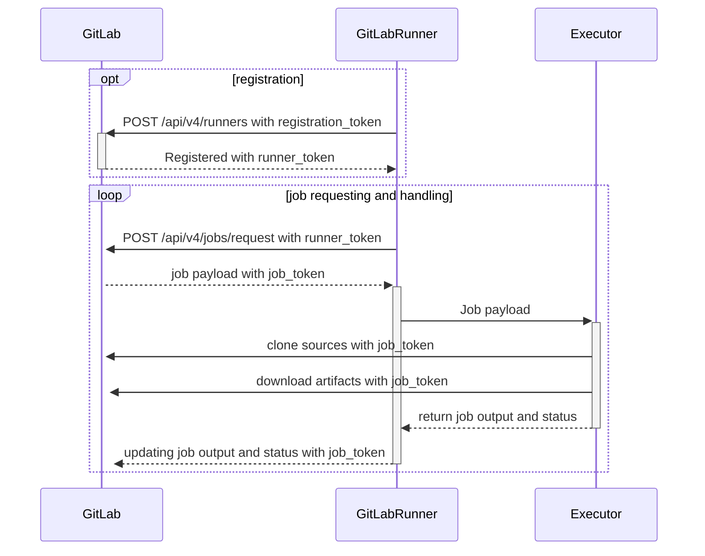

# GitLab Runner **(FREE)**

GitLab Runner is an application that works with GitLab CI/CD to run jobs in a pipeline.

You can choose to [**install**](install/index.md) the GitLab Runner application
on infrastructure that you own or manage. If you do, you should install
GitLab Runner on a machine that's separate from the one that hosts the GitLab instance
for security and performance reasons. When you use separate machines, you can have
different operating systems and tools, like Kubernetes or Docker, on each.

GitLab Runner is open-source and written in [Go](https://go.dev). It can be run
as a single binary; no language-specific requirements are needed.

You can install GitLab Runner on several different supported operating systems.
Other operating systems may also work, as long as you can compile a Go
binary on them.

GitLab Runner can also run inside a Docker container or be deployed into a Kubernetes cluster.

## Scaling a fleet of runners

When your organization scales to having a fleet of runners, you
should [plan for how you will monitor and adjust performance for these runners](fleet_scaling/index.md).

## GitLab Runner versions

For compatibility reasons, the GitLab Runner [major.minor](https://en.wikipedia.org/wiki/Software_versioning) version
should stay in sync with the GitLab major and minor version. Older runners may still work
with newer GitLab versions, and vice versa. However, features may not be available or work properly
if a version difference exists.

Backward compatibility is guaranteed between minor version updates. However, sometimes minor
version updates of GitLab can introduce new features that require GitLab Runner to be on the same minor
version.

NOTE:
GitLab Runner 15.0 [introduced](https://gitlab.com/gitlab-org/gitlab-runner/-/merge_requests/3414) a change to the
registration API request format. It prevents the GitLab Runner from communicating with GitLab versions lower than 14.8.
You must use a Runner version that is appropriate for the GitLab version, or upgrade the GitLab application.

If you host your own runners but host your repositories on GitLab.com,
keep GitLab Runner [updated](install/index.md) to the latest version, as GitLab.com is
[updated continuously](https://gitlab.com/gitlab-org/release/tasks/-/issues).

## Runner registration

After you install the application, you [**register**](register/index.md)
individual runners. Runners are the agents that run the CI/CD jobs that come from GitLab.

When you register a runner, you are setting up communication between your
GitLab instance and the machine where GitLab Runner is installed.

Runners usually process jobs on the same machine where you installed GitLab Runner.
However, you can also have a runner process jobs in a container,
in a Kubernetes cluster, or in auto-scaled instances in the cloud.

### Executors

When you register a runner, you must choose an executor.

An [**executor**](executors/index.md) determines the environment each job runs in.

For example:

- If you want your CI/CD job to run PowerShell commands, you might install GitLab
  Runner on a Windows server and then register a runner that uses the shell executor.
- If you want your CI/CD job to run commands in a custom Docker container,
  you might install GitLab Runner on a Linux server and register a runner that uses
  the Docker executor.

These are only a few of the possible configurations. You can install GitLab Runner
on a virtual machine and have it use another virtual machine as an executor.

When you install GitLab Runner in a Docker container and choose the
[Docker executor](https://docs.gitlab.com/ee/ci/docker/using_docker_images.html)
to run your jobs, it's sometimes referred to as a "Docker-in-Docker" configuration.

### Who has access to runners in the GitLab UI

Before you register a runner, you should determine if everyone in GitLab
should have access to it, or if you want to limit it to a specific GitLab group or project.

There are three types of runners, based on who you want to have access:

- [Shared runners](https://docs.gitlab.com/ee/ci/runners/runners_scope.html#shared-runners) are for use by all projects
- [Group runners](https://docs.gitlab.com/ee/ci/runners/runners_scope.html#group-runners) are for all projects and subgroups in a group
- [Specific runners](https://docs.gitlab.com/ee/ci/runners/runners_scope.html#specific-runners) are for individual projects

When you register a runner, you specify a token for the GitLab instance, group, or project.
This is how the runner knows which projects it's available for.

### Tags

When you register a runner, you can add [**tags**](https://docs.gitlab.com/ee/ci/yaml/index.html#tags) to it.

When a CI/CD job runs, it knows which runner to use by looking at the assigned tags.

For example, if a runner has the `ruby` tag, you would add this code to
your project's `.gitlab-ci.yml` file:

```yaml
job:
  tags:
    - ruby
```

When the job runs, it uses the runner with the `ruby` tag.

## Configuring runners

You can [**configure**](configuration/advanced-configuration.md)
the runner by editing the `config.toml` file. This is a file that is installed during the runner installation process.

In this file you can edit settings for a specific runner, or for all runners.

You can specify settings like logging and cache. You can set concurrency,
memory, CPU limits, and more.

## Monitoring runners

You can use Prometheus to [**monitor**](monitoring/index.md) your runners.
You can view things like the number of currently-running jobs and how
much CPU your runners are using.

## Use a runner to run your job

After a runner is configured and available for your project, your
[CI/CD](https://docs.gitlab.com/ee/ci/index.html) jobs can use the runner.

Specify the name of the runner or its tags in your
[`.gitlab-ci.yml`](https://docs.gitlab.com/ee/ci/yaml/index.html) file.
Then, when you commit to your repository, the pipeline runs, and
the runner's executor processes the commands.

## Runners on GitLab.com

If you use GitLab.com, you can run your CI/CD jobs on runners hosted by GitLab.
These runners are [managed](https://docs.gitlab.com/ee/ci/runners/index.html) by GitLab and fully integrated with GitLab.com.
These runners are enabled for all projects, though
[you can disable them](https://docs.gitlab.com/ee/ci/runners/runners_scope.html#disable-shared-runners).

If you don't want to use runners managed by GitLab, you can install GitLab Runner and
register your own runners on GitLab.com.

## Features

GitLab Runner has the following features.

- Run multiple jobs concurrently.
- Use multiple tokens with multiple servers (even per-project).
- Limit the number of concurrent jobs per-token.
- Jobs can be run:
  - Locally.
  - Using Docker containers.
  - Using Docker containers and executing job over SSH.
  - Using Docker containers with autoscaling on different clouds and virtualization hypervisors.
  - Connecting to a remote SSH server.
- Is written in Go and distributed as single binary without any other requirements.
- Supports Bash, PowerShell Core, and Windows PowerShell.
- Works on GNU/Linux, macOS, and Windows (pretty much anywhere you can run Docker).
- Allows customization of the job running environment.
- Automatic configuration reload without restart.
- Easy to use setup with support for Docker, Docker-SSH, Parallels, or SSH running environments.
- Enables caching of Docker containers.
- Easy installation as a service for GNU/Linux, macOS, and Windows.
- Embedded Prometheus metrics HTTP server.
- Referee workers to monitor and pass Prometheus metrics and other job-specific data to GitLab.

## Runner execution flow

This diagram shows how runners are registered and how jobs are requested and handled. It also shows which actions use [registration, authentication](https://docs.gitlab.com/ee/api/runners.html#registration-and-authentication-tokens), and [job tokens](https://docs.gitlab.com/ee/ci/jobs/ci_job_token.html).



## Troubleshooting

Learn how to [troubleshoot](faq/index.md) common issues.

## Contributing

Contributions are welcome. See [`CONTRIBUTING.md`](https://gitlab.com/gitlab-org/gitlab-runner/blob/main/CONTRIBUTING.md)
and the [development documentation](development/index.md) for details.

If you're a reviewer of GitLab Runner project, take a moment to read the
[Reviewing GitLab Runner](development/reviewing-gitlab-runner.md) document.

You can also review [the release process for the GitLab Runner project](https://gitlab.com/gitlab-org/gitlab-runner/blob/main/PROCESS.md).

## Changelog

See the [CHANGELOG](https://gitlab.com/gitlab-org/gitlab-runner/blob/main/CHANGELOG.md) to view recent changes.

## License

This code is distributed under the MIT license. View the [LICENSE](https://gitlab.com/gitlab-org/gitlab-runner/blob/main/LICENSE) file.
