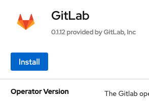

# Install GitLab Runner on Openshift

GitLab Runner can be installed on Openshift.

## Prerequisites

- Openshift 4.x cluster with admin priviledges
- GitLab runner registration token


### Openshift Operator Install

1. In the OpenShift UI, in the left pane click on "Operators" then "OperatorHub"

1. In the main pane and underneath "All Items" search for keyword "GitLab"

    

1. Click on the GitLab Operator to install.

1. On the GitLab Operator summary page, click "Install".

    

1. On the Install Operator page, select the desired namespace under "Installed Namespace" and click "Install".

    

1. On the Installed Operators page, the GitLab Operator is ready when the status appears as "Suceeded".

    

#### GitLab Runner Installation

1. Obtain the runner registration token. Go to the project's **Settings > CI/CD** and expand the **Runners** section.

1. Make note of the the token underneath "**Use the following registration token during setup:**"

    

1. Open an Openshift console, switch to the project namespace:

   ```shell
   oc project "PROJECT NAMESPACE"
   ```

1. Use the following command with your runner token (from step 2):

   ```shell
   oc create secret generic gitlab-runner-secret --from-literal runner_registration_token="INSERT YOUR RUNNER TOKEN HERE"
   ```


1. Next we will create the CRD file. Run:
   ```shell
   nano gitlab-runner.yml
   ```


1. Add the following to the CRD file and save:

   ```shell
   apiVersion: gitlab.com/v1beta1
   kind: Runner
   metadata:
     name: gitlab-runner
   spec:
     gitlab:
       url: "https://your.gitlab.address/"
     token: gitlab-runner-secret
     tags: openshift

   ```
1. Now lets apply that CRD file by running the command: 

   ```shell
   $ oc apply -f gitlab-runner.yml
   ```
