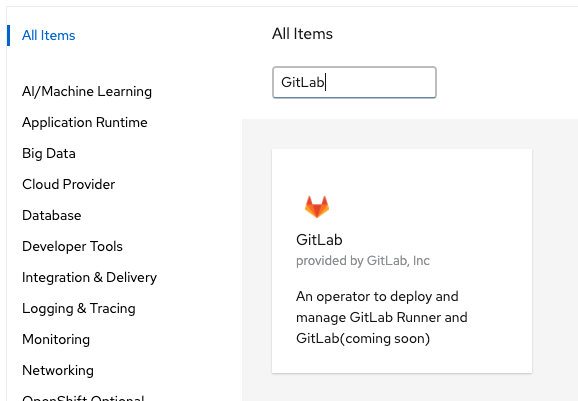
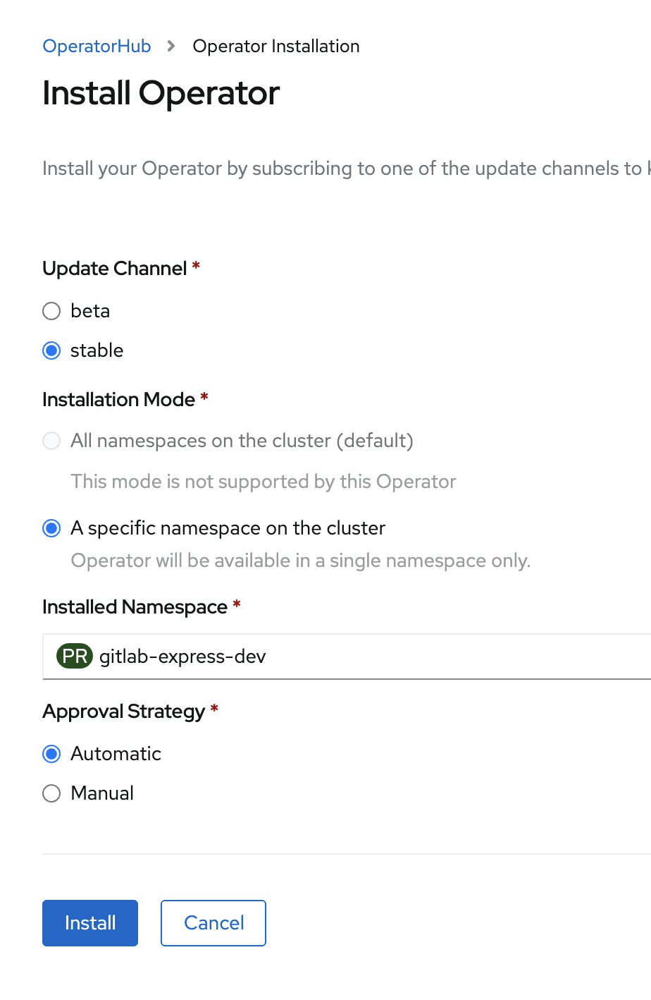
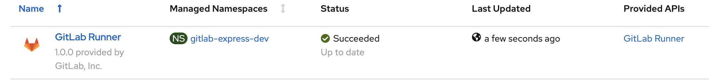

# Install GitLab Runner Operator

## Install on Red Hat OpenShift **(FREE)**

> - [Introduced](https://gitlab.com/gitlab-org/gitlab-runner/-/issues/26640) in GitLab 13.3.
> - [Updated](https://gitlab.com/gitlab-org/gitlab-runner/-/issues/27126) in GitLab 13.7.

You can install the GitLab Runner on Red Hat OpenShift v4 and later using the [GitLab Runner Operator](https://gitlab.com/gitlab-org/gl-openshift/gitlab-runner-operator) available from the stable channel of OperatorHub embedded in OpenShift's web console. Once installed, you can run your GitLab CI/CD jobs using the newly deployed GitLab Runner instance. Each CI/CD job will run in a separate pod.

### Prerequisites

- OpenShift 4.x cluster with administrator privileges
- GitLab Runner registration token

### Install the OpenShift Operator

First you must install the OpenShift Operator.

1. Open the OpenShift UI and log in as a user with administrator privileges.
1. In the left pane, click **Operators**, then **OperatorHub**.
1. In the main pane, below **All Items**, search for the keyword `GitLab Runner`.

   

1. To install, click the GitLab Runner Operator.
1. On the GitLab Runner Operator summary page, click **Install**.
1. On the Install Operator page:
    1. Under **Update Channel**, select **stable**.
    1. Under **Installed Namespace**, select the desired namespace and click **Install**.

   

On the Installed Operators page, when the GitLab Operator is ready, the status changes to **Succeeded**.



## Install on Kubernetes **(FREE)**

> [Introduced](https://gitlab.com/gitlab-org/gl-openshift/gitlab-runner-operator/-/issues/57) in GitLab 14.10.

You can install the GitLab Runner on Kubernetes v1.21 and later using the [GitLab Runner Operator](https://gitlab.com/gitlab-org/gl-openshift/gitlab-runner-operator) available from the stable channel of [OperatorHub.io](https://operatorhub.io/operator/gitlab-runner-operator). Once installed, you can run your GitLab CI/CD jobs using the newly deployed GitLab Runner instance. Each CI/CD job will run in a separate pod.

### Prerequisites

- Kubernetes v1.21 and later
- Cert manager v1.7.1

### Install the Kubernetes Operator

Follow the instructions at [OperatorHub.io](https://operatorhub.io/operator/gitlab-runner-operator).

1. Install the prerequisites.
1. On the top right, select **Install** and follow the instructions to install OLM and the Operator.

#### Install GitLab Runner

1. Obtain a token that you'll use to register the runner:
   - For a [shared runner](https://docs.gitlab.com/ee/ci/runners/#shared-runners),
     have an administrator go to the GitLab Admin Area and click **Overview > Runners**.
   - For a [group runner](https://docs.gitlab.com/ee/ci/runners/index.html#group-runners),
     go to **Settings > CI/CD** and expand the **Runners** section.
   - For a [project-specific runner](https://docs.gitlab.com/ee/ci/runners/index.html#specific-runners),
     go to **Settings > CI/CD** and expand the **Runners** section.
1. Under **Use the following registration token during setup:**, copy the token.
1. Go to the namespace where you want to create GitLab Runner.
1. Create the secret file with your GitLab project's runner token:

   ```shell
   cat > gitlab-runner-secret.yml << EOF
   apiVersion: v1
   kind: Secret
   metadata:
     name: gitlab-runner-secret
   type: Opaque
   stringData:
     runner-registration-token: REPLACE_ME # your project runner secret
   EOF
   ```

1. Create the `secret` in your cluster by running:

   ```shell
   kubectl apply -f gitlab-runner-secret.yml
   ```

1. Create the Custom Resource Definition (CRD) file and include
   the following configuration.

   ```shell
   cat > gitlab-runner.yml << EOF
   apiVersion: apps.gitlab.com/v1beta2
   kind: Runner
   metadata:
     name: gitlab-runner
   spec:
     gitlabUrl: https://gitlab.example.com
     buildImage: alpine
     token: gitlab-runner-secret
   EOF
   ```

1. Now apply the `CRD` file by running the command:

   ```shell
   kubectl apply -f gitlab-runner.yml
   ```

1. Confirm that GitLab Runner is installed by running:

   ```shell
   kubectl get runner
   NAME             AGE
   gitlab-runner    5m
   ```

1. The runner pod should also be visible:

   ```shell
   kubectl get pods
   NAME                             READY   STATUS    RESTARTS   AGE
   gitlab-runner-bf9894bdb-wplxn    1/1     Running   0          5m
   ```

#### Install other versions of GitLab Runner Operator for OpenShift

If you do not want to use the version of GitLab Runner Operator that's available in the Red Hat OperatorHub, you can install a different version.

To find out the official currently-available Operator versions, view the [tags in the `gitlab-runner-operator` repository](https://gitlab.com/gitlab-org/gl-openshift/gitlab-runner-operator/-/tags).
To find out which version of GitLab Runner the Operator is running, view the
`APP_VERSION` variable in the `Makefile` of the commit/tag you are interested in, for example, [https://gitlab.com/gitlab-org/gl-openshift/gitlab-runner-operator/-/blob/v1.0.0/Makefile](https://gitlab.com/gitlab-org/gl-openshift/gitlab-runner-operator/-/blob/v1.0.0/Makefile).

To install a specific version, create this `catalogsource.yaml` file and replace `<VERSION>` with a tag or a specific commit:

NOTE:
When using an image for a specific commit, the tag format is `v0.0.1-<COMMIT>`. For example: `registry.gitlab.com/gitlab-org/gl-openshift/gitlab-runner-operator/gitlab-runner-operator-catalog-source:v0.0.1-f5a798af`.

```yaml
apiVersion: operators.coreos.com/v1alpha1
kind: CatalogSource
metadata:
  name: gitlab-runner-catalog
  namespace: openshift-marketplace
spec:
  sourceType: grpc
  image: registry.gitlab.com/gitlab-org/gl-openshift/gitlab-runner-operator/gitlab-runner-operator-catalog-source:<VERSION>
  displayName: GitLab Runner Operators
  publisher: GitLab Community
```

Create the `CatalogSource` with:

```shell
oc apply -f catalogsource.yaml
```

In a minute the new Runner should show up in the OpenShift cluster's OperatorHub section.

## Uninstall Operator

### Uninstall on Red Hat OpenShift

1. Delete Runner `CRD`:

   ```shell
   kubectl delete -f gitlab-runner.yml
   ```

1. Delete `secret`:

   ```shell
   kubectl delete -f gitlab-runner-secret.yml
   ```

1. Follow the instructions at the Red Hat documentation for [Deleting Operators from a cluster using the web console](https://docs.openshift.com/container-platform/4.7/operators/admin/olm-deleting-operators-from-cluster.html#olm-deleting-operators-from-a-cluster-using-web-console_olm-deleting-operators-from-a-cluster).

### Uninstall on Kubernetes

1. Delete Runner `CRD`:

   ```shell
   kubectl delete -f gitlab-runner.yml
   ```

1. Delete `secret`:

   ```shell
   kubectl delete -f gitlab-runner-secret.yml
   ```

1. Delete the Operator subscription:

   ```shell
   kubectl delete subscription my-gitlab-runner-operator -n operators
   ```

1. Find out the version of the installed `CSV`:

   ```shell
   kubectl get clusterserviceversion -n operators
   NAME                            DISPLAY         VERSION   REPLACES   PHASE
   gitlab-runner-operator.v1.7.0   GitLab Runner   1.7.0                Succeeded
   ```

1. Delete the `CSV`:

   ```shell
   kubectl delete clusterserviceversion gitlab-runner-operator.v1.7.0 -n operators
   ```

#### Configuration

To configure GitLab Runner in OpenShift, see the [Configuring GitLab Runner on OpenShift](../configuration/configuring_runner_operator.md) page.
