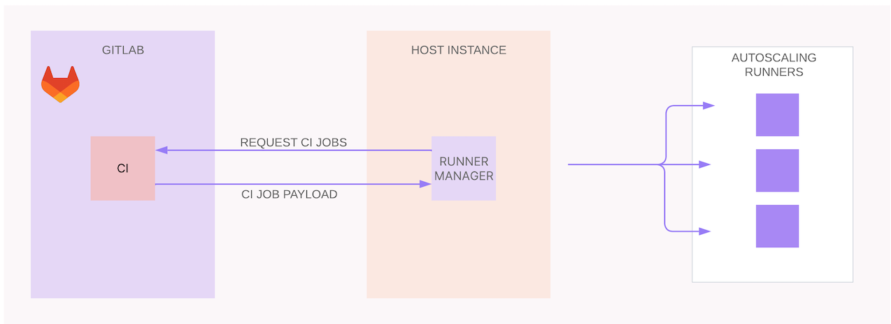



- Tier: Free, Premium, Ultimate
- Offering: GitLab.com, GitLab Self-Managed, GitLab Dedicated



GitLab Runner instance group autoscaler is the successor to the autoscaling technology based on Docker Machine. The components of the GitLab Runner instance group autoscaling solution are:

- Taskscaler: Manages the autoscaling logic, bookkeeping, and creates fleets for runner instances that use cloud provider autoscaling groups of instances.
- [Fleeting](../fleet_scaling/fleeting.md): An abstraction for cloud provider virtual machines.
- Cloud provider plugin: Handles the API calls to the target cloud platform and is implemented using a plugin development framework.

Instance group autoscaling in GitLab Runner works as follows:

1. The runner manager continuously polls GitLab jobs.
1. In response, GitLab sends job payloads to the runner manager.
1. The runner manager interacts with the public cloud infrastructure to create a new instance to execute jobs.
1. The runner manager distributes these jobs to the available runners in the autoscaling pool.



## Configure the runner manager

You must [configure the runner manager](_index.md#configure-the-runner-manager) to use the GitLab Runner instance group autoscaler.

1. Create an instance to host the runner manager. This **must not** be a spot instance (AWS), or spot virtual machine (GCP or Azure).
1. [Install GitLab Runner](../install/linux-repository.md) on the instance.
1. Add the cloud provider credentials to the runner manager host machine.

   

   You can host the runner manager in a container.
   For GitLab.com and GitLab Dedicated [hosted runners](https://docs.gitlab.com/ci/runners/), the runner manager is hosted on a virtual machine instance.

   

### Example credentials configuration for GitLab Runner instance group autoscaler

You can use an [AWS Identity and Access Management](https://docs.aws.amazon.com/IAM/latest/UserGuide/id_roles_use_switch-role-ec2_instance-profiles.html)
(IAM) instance profile for the runner manager in the AWS environment.
If you do not want to host the runner manager in AWS, you can use a credentials file.

For example:

``` toml
## credentials_file

[default]
aws_access_key_id=__REDACTED__
aws_secret_access_key=__REDACTED__
```

The credentials file is optional.

## Supported public cloud instances

The following autoscaling options are supported for public cloud compute instances:

- Amazon Web Services EC2 instances
- Google Compute Engine
- Microsoft Azure Virtual Machines

These cloud instances are supported by the GitLab Runner Docker Machine autoscaler as well.

## Supported platforms

| Executor                   | Linux                                | macOS                                | Windows                              |
|----------------------------|--------------------------------------|--------------------------------------|--------------------------------------|
| Instance executor          |  Yes |  Yes |  Yes |
| Docker Autoscaler executor |  Yes |  No |  Yes |
